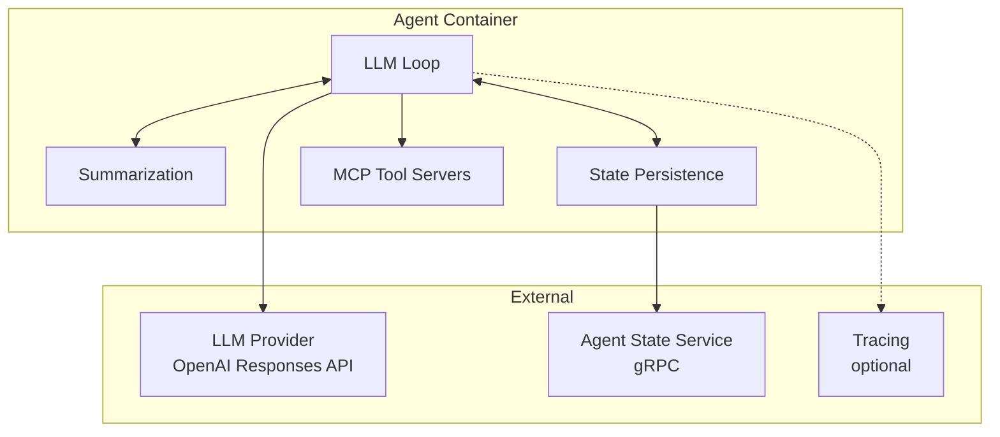
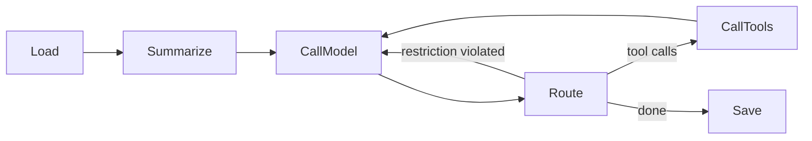

# Agent Implementation

Our agent implementation. This is the primary agent — a TypeScript-based LLM loop with rolling summarization and pluggable state persistence.

For the general agent contract, lifecycle, and tools, see [Agent](agent.md).

## Structure

| Component | Responsibility |
|-----------|---------------|
| **LLM Loop** | Orchestrates the turn: load context → summarize → call model → route → call tools → save |
| **Summarization** | Reduces context size to fit within the token budget |
| **State Persistence** | Reads and writes conversation state (messages, summaries) |
| **MCP Tool Servers** | Provides tools to the LLM via MCP protocol |

## LLM Loop

The loop is built on three primitives from the `@agyn/llm` package:

- **`Reducer<State, Context>`** — a stage that transforms agent state. Each stage (Load, Summarize, CallModel, CallTools, Save) is a Reducer.
- **`Router<State, Context>`** — inspects state after a Reducer and decides the next stage. Returns `{ state, next }` where `next` is a stage ID or `null` (end).
- **`Loop<State, Context>`** — executes a named graph of Reducers connected by Routers.

### Flow

| Stage | Description |
|-------|-------------|
| **Load** | Load conversation messages from state persistence |
| **Summarize** | If context exceeds the token budget, fold older messages into a rolling summary |
| **CallModel** | Prepend system prompt, send context to LLM provider |
| **Route** | Inspect the LLM response and decide next step |
| **CallTools** | Execute each tool call via MCP, collect outputs |
| **Save** | Persist the updated conversation state |

### Routing Decisions

The Router after CallModel inspects the LLM response:

| Condition | Next Stage | Reason |
|-----------|-----------|--------|
| Response contains tool calls | CallTools | Tools need to be executed |
| `restrictOutput` is enabled and response has no tool calls | CallModel | Agent must call a tool before finishing — re-inject instruction |
| Otherwise | Save | Turn is complete |

### LLM Provider

Uses **OpenAI Responses API** via the `openai` npm package. The `LLM` class wraps the provider and handles message serialization.

Message types sent to the provider:

| Type | Description |
|------|-------------|
| `SystemMessage` | System prompt (injected by CallModel) |
| `HumanMessage` | User message |
| `AIMessage` | Previous assistant response |
| `ToolCallMessage` | Tool call request from assistant |
| `ToolCallOutputMessage` | Tool execution result |
| `ResponseMessage` | Raw response envelope from the provider |

## Summarization

Rolling summarization keeps the LLM context within a token budget. When context exceeds the budget, older messages are folded into a compact summary.

### Algorithm

1. Count tokens in the full conversation.
2. If total ≤ `summarizationMaxTokens`, skip summarization.
3. Otherwise, keep the most recent `summarizationKeepTokens` worth of messages verbatim.
4. Send the remaining older messages to the LLM with a summarization prompt.
5. Replace the older messages with the resulting summary message.

### Packaging

Summarization is currently embedded in the agent code. How it should be packaged is an [open question](../open-questions.md#summarization-packaging):

- As part of the agent service code (current state).
- As a separate reusable package that different agent implementations can import.
- As a standalone service with its own API.

## State Persistence

The agent needs to persist conversation state (messages, summaries) across turns. Multiple strategies exist:

| Strategy | Store | Use Case |
|----------|-------|----------|
| In-memory | Process memory | Development, short-lived agents |
| File-based | Workspace filesystem | Agents with workspace access |
| Remote (APSS) | [Agent State](agent-state.md) service via gRPC | Production — durable, shared |

The remote strategy uses the Agent Persistent State Service (APSS). It provides:
- Append/list/replace/delete conversation messages.
- Context snapshots for LLM call reproducibility.
- Keyed by `conversationId` (mapping from threadId/nodeId is handled by the agent).

## Configuration

Implementation-specific configuration fields (in addition to the [base agent config](agent.md#configuration)):

| Field | Type | Description |
|-------|------|-------------|
| `summarizationKeepTokens` | integer | Number of most-recent tokens preserved verbatim |
| `summarizationMaxTokens` | integer | Total token budget for context sent to the LLM |

## Current Location

| Component | Repository | Path |
|-----------|-----------|------|
| LLM package (`Loop`, `Reducer`, `Router`, `LLM`, messages) | `agynio/platform` | `packages/llm/` |
| Agent node (stage implementations, MCP integration) | `agynio/platform` | `packages/platform-server/src/nodes/agent/` |

Both will be extracted into a standalone agent container as part of the [migration](../gaps/migration-roadmap.md#agent-extraction).
