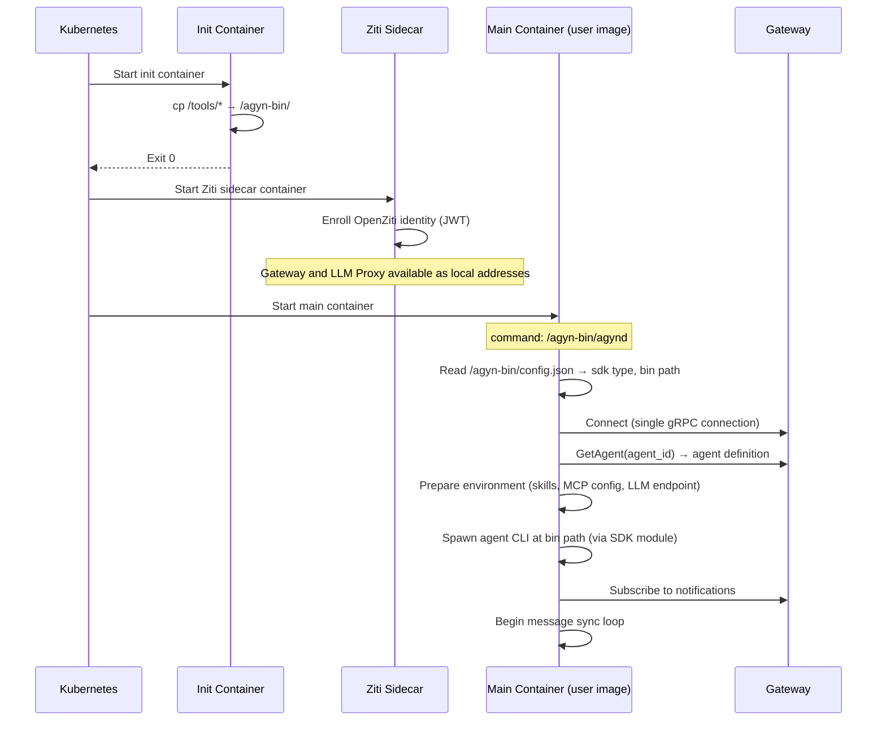

# Agent Init Container

## Overview

The agent container runs the user's **dev container image** — their tools, language runtimes, project dependencies. Platform binaries (`agynd` and the agent CLI) are not baked into this image. They are injected at Pod startup via a Kubernetes **init container**.

The user controls which init image to use through a single field on the [Agent](resource-definitions.md#agent) resource: `init_image`. The init image contains `agynd`, the agent CLI binary, and a config file that defines agynd's runtime behaviour. The [Agents Orchestrator](agents-orchestrator.md) treats the init image as an opaque string — it does not parse image names, derive agent types, or set binary paths.

## Problem

The platform supports multiple agent CLI types (Codex, Claude Code, agn). Each requires a specific binary and SDK integration inside `agynd`. The agent container image is the user's dev environment — requiring users to rebuild their images with `agynd` and a specific agent CLI baked in is not viable.

**Constraints:**

- The user's dev container image must remain untouched.
- The orchestrator must not know about agent CLI binaries, SDK types, or binary paths.
- `agynd` is always the main process in the agent container — there is no use case without it.
- The mechanism must work with any Linux base image regardless of distro, glibc version, or installed packages.
- The release cadence of `agynd` and each agent CLI are independent. Bumping one must not force a rebuild of unrelated images.

## Design

```mermaid
graph TB
    subgraph Pod
        subgraph "Init Container (runs first)"
            IC[agent-init<br/>image: agent.init_image<br/>copies binaries + config to /agyn-bin]
        end
        subgraph "Main Container (user's dev image)"
            AGYND[/agyn-bin/agynd<br/>reads /agyn-bin/config.json<br/>spawns agent CLI]
        end
        subgraph "Sidecars"
            MCP[MCP servers]
            HOOK[Hooks]
        end
        VOL[emptyDir: agyn-bin]
    end

    IC -->|writes to| VOL
    VOL -->|mounted in| AGYND
```

### Shared Volume Contract

The init container and the main container share an `emptyDir` volume mounted at `/agyn-bin`. The init container writes:

```
/agyn-bin/
├── agynd          # daemon binary
├── codex          # agent CLI binary (original name, e.g. codex, claude, agn)
└── config.json    # runtime config for agynd
```

| File | Description |
|------|-------------|
| `agynd` | The agent wrapper daemon. Static Go binary (`CGO_ENABLED=0`) |
| Agent CLI binary | The agent CLI under its original name (`codex`, `claude`, `agn`). Not renamed |
| `config.json` | Runtime configuration that tells agynd which SDK to use and where to find the agent CLI binary |

The agent CLI binary keeps its original name. This avoids an artificial rename and means that when someone execs into the container to debug, they see the real binary name.

### config.json

```json
{
  "sdk": "codex",
  "bin": "/agyn-bin/codex"
}
```

| Field | Type | Values | Description |
|-------|------|--------|-------------|
| `sdk` | string | `codex`, `claude`, `agn` | Which SDK module agynd uses to communicate with the agent CLI |
| `bin` | string | absolute path | Path to the agent CLI binary on the shared volume |

The `sdk` field determines which SDK module agynd imports for subprocess management and protocol handling. Each SDK module knows how to spawn its agent CLI — the arguments, wire protocol, and message framing are encapsulated in the SDK. See [agynd — Agent Communication Protocol](agynd-cli.md#agent-communication-protocol) for protocol details per agent type.

The `bin` field tells the SDK module where the agent CLI binary is. The SDK module uses this path when spawning the subprocess (e.g., `codex-sdk-go` spawns `<bin> app-server`, `claude-sdk-go` spawns `<bin> --output-format stream-json --input-format stream-json --verbose`).

### Init Images

One init image per supported agent type, each in its own repository:

| Image | Repository | Contents |
|-------|------------|----------|
| `ghcr.io/agynio/agent-init-codex:<version>` | `agynio/agent-init-codex` | `agynd` + `codex` (static musl binary) + `config.json` with `sdk: codex` |
| `ghcr.io/agynio/agent-init-claude:<version>` | `agynio/agent-init-claude` | `agynd` + `claude` (static musl binary) + `config.json` with `sdk: claude` |
| `ghcr.io/agynio/agent-init-agn:<version>` | `agynio/agent-init-agn` | `agynd` + `agn` (static Go binary) + `config.json` with `sdk: agn` |

#### Repository Structure

Each init image lives in its own repository. This is necessary because the release cadences of `agynd` and each agent CLI are independent — bumping Codex should not force a rebuild of the Claude or agn init images.

Each repo is minimal — a Dockerfile, a config file, a version pin file, and a CI workflow:

```
agynio/agent-init-codex/
├── Dockerfile
├── config.json          # { "sdk": "codex", "bin": "/agyn-bin/codex" }
├── versions.env         # AGYND_VERSION=1.2.3  CODEX_VERSION=0.115.0
└── .github/workflows/
    └── release.yml
```

The `versions.env` file pins both dependency versions explicitly:

```bash
AGYND_VERSION=1.2.3
CODEX_VERSION=0.115.0
```

Updating a version = edit `versions.env`, tag, release. Nothing else changes.

#### Release Triggers

| Trigger | What gets rebuilt |
|---------|-------------------|
| Codex CLI version bump | `agent-init-codex` only |
| Claude Code CLI version bump | `agent-init-claude` only |
| agn CLI version bump | `agent-init-agn` only |
| agynd version bump | All three init image repos |

The agynd bump across three repos can be automated — a workflow in `agynio/agynd-cli` that opens PRs in each init image repo when a new agynd version is released.

#### Dockerfile

All init image repos follow the same Dockerfile pattern. The agynd binary is pulled as a pre-built artifact from `agynio/agynd-cli` releases. The agent CLI binary is pulled from its upstream release.

Example for `agent-init-codex`:

```dockerfile
# syntax=docker/dockerfile:1
FROM alpine:3.21

ARG AGYND_VERSION
ARG CODEX_VERSION
ARG TARGETARCH

RUN mkdir -p /tools

# Download agynd from agynio/agynd-cli releases
RUN apk add --no-cache curl && \
    curl -fsSL "https://github.com/agynio/agynd-cli/releases/download/v${AGYND_VERSION}/agynd-linux-${TARGETARCH}" \
      -o /tools/agynd && \
    chmod +x /tools/agynd

# Download Codex CLI from upstream releases
RUN case "${TARGETARCH}" in \
      amd64) ARCH="x86_64" ;; \
      arm64) ARCH="aarch64" ;; \
      *) echo "Unsupported architecture: ${TARGETARCH}" >&2; exit 1 ;; \
    esac && \
    curl -fsSL "https://github.com/openai/codex/releases/download/rust-v${CODEX_VERSION}/codex-${ARCH}-unknown-linux-musl.tar.gz" \
      | tar -xz -C /tools/ && \
    mv "/tools/codex-${ARCH}-unknown-linux-musl" /tools/codex && \
    chmod +x /tools/codex

COPY config.json /tools/config.json

ENTRYPOINT ["cp", "-a", "/tools/.", "/agyn-bin/"]
```

The `ENTRYPOINT` copies all files from `/tools/` to `/agyn-bin/` (the shared volume mount point). This is the init container's only job.

#### Binary Compatibility

All binaries are statically linked and run on any Linux base image:

| Binary | Build | Static |
|--------|-------|--------|
| `agynd` | Go, `CGO_ENABLED=0` | Yes |
| Codex CLI | Rust, musl target (`codex-x86_64-unknown-linux-musl`) | Yes |
| Claude Code CLI | musl variant from Anthropic distribution (GCS bucket) | Yes (musl variant only) |
| agn CLI | Go, `CGO_ENABLED=0` | Yes |

#### CI

Each init image repo has its own CI workflow following the platform [CI/CD conventions](operations/ci-cd.md):

- **Trigger:** Push of a `v*.*.*` tag.
- **Platforms:** `linux/amd64`, `linux/arm64`.
- **Tags:** `sha-<short>`, `<semver>`, `latest`.
- **Build args:** `AGYND_VERSION` and agent CLI version read from `versions.env`.

#### Image Size

| Component | Size (approximate) |
|-----------|--------------------|
| `agynd` | ~15 MB |
| Codex CLI (musl) | ~30 MB |
| Claude Code CLI (musl) | ~225 MB |
| agn CLI | ~15 MB |
| Alpine base | ~5 MB |

Codex and agn init images are ~50–70 MB compressed; the Claude init image is ~225 MB compressed. Pulled once per node via the Kubernetes image cache.

## Startup Sequence



## Changes Required

### Agent Proto

Add `init_image` to the `Agent` message in `agynio/api`:

```protobuf
message Agent {
  EntityMeta meta = 1;
  string name = 2;
  string role = 3;
  string model = 4;
  string description = 5;
  string configuration = 6;
  string image = 7;
  ComputeResources resources = 8;
  string init_image = 9;  // Agent init image containing agynd + agent CLI
}
```

Add `init_image` (field 9) to `CreateAgentRequest` and `UpdateAgentRequest` (optional field 9).

| Field | Purpose | Example |
|-------|---------|---------|
| `image` | User's dev container. The main container in the Pod | `ghcr.io/my-org/my-devcontainer:latest` |
| `init_image` | Platform init image. Contains `agynd` + agent CLI. Runs as init container | `ghcr.io/agynio/agent-init-codex:v1.2.3` |

The Agents service stores `init_image` as an opaque string without validation — same treatment as `image`.

### Runner Proto

Add `init_containers` to `StartWorkloadRequest` in `agynio/api`:

```protobuf
message StartWorkloadRequest {
  ContainerSpec main = 1;
  repeated ContainerSpec sidecars = 2;
  repeated VolumeSpec volumes = 3;
  repeated ContainerSpec init_containers = 4;
  map<string, string> additional_properties = 100;
}
```

`init_containers` uses the existing `ContainerSpec` — image, name, cmd, env, mounts. The runner maps them to Kubernetes `pod.Spec.InitContainers`.

### k8s-runner

In `StartWorkload`, build init containers from `req.InitContainers` using the existing `buildContainer` function and place them in `pod.Spec.InitContainers`:

```go
pod := &corev1.Pod{
    // ...
    Spec: corev1.PodSpec{
        RestartPolicy:  corev1.RestartPolicyNever,
        InitContainers: initContainers,
        Containers:     containers,
        Volumes:        volumes,
    },
}
```

No new types or abstractions. The existing `buildContainer` function handles image, name, cmd, env, and volume mounts — it works for init containers identically.

### Agents Orchestrator

The assembler changes:

1. **Read `init_image`** from the agent definition. Fall back to `DEFAULT_INIT_IMAGE` from orchestrator config if empty.
2. **Add the `agyn-bin` ephemeral volume** to the workload spec.
3. **Build the init container** with the init image, mounting `agyn-bin` at `/agyn-bin`.
4. **Set the main container command** to `/agyn-bin/agynd`.
5. **Mount `agyn-bin`** in the main container at `/agyn-bin`.
6. **Replace environment variables:** single `GATEWAY_ADDRESS` instead of `THREADS_ADDRESS` + `NOTIFICATIONS_ADDRESS`. Remove `TEAMS_ADDRESS`.
7. **Pass `init_containers`** in the `StartWorkloadRequest`.

The orchestrator does not set any binary paths, SDK types, or agent CLI arguments. It treats `init_image` as an opaque image reference.

#### Config Change

Replace `DEFAULT_AGENT_IMAGE` (`DefaultAgentImage`) with `DEFAULT_INIT_IMAGE` (`DefaultInitImage`).

#### Environment Variable Contract

What the orchestrator passes to the main container:

| Env Var | Source | Description |
|---------|--------|-------------|
| `AGENT_ID` | Agent resource | Agent UUID |
| `AGENT_NAME` | Agent resource | Agent name |
| `AGENT_ROLE` | Agent resource | Agent role label |
| `AGENT_MODEL` | Agent resource | Model UUID reference |
| `AGENT_CONFIG` | Agent resource | Opaque configuration JSON |
| `THREAD_ID` | Reconciler | Thread UUID this workload serves |
| `GATEWAY_ADDRESS` | Orchestrator config | Single Gateway endpoint |
| `AGENT_SKILLS` | Skills sub-resource | JSON-encoded skills array |
| `INIT_SCRIPT` | InitScripts sub-resource | Concatenated init scripts |

**Removed:** `THREADS_ADDRESS`, `NOTIFICATIONS_ADDRESS` (replaced by `GATEWAY_ADDRESS`).

### agynd

1. **Read config:** On startup, read `/agyn-bin/config.json` to determine the SDK type and agent CLI binary path.
2. **Single Gateway connection:** Replace three separate gRPC connections (`ThreadsAddress`, `NotificationsAddress`, `TeamsAddress`) with a single connection to `GATEWAY_ADDRESS`. All service calls (Threads, Notifications, Agents) go through the Gateway.
3. **Rename teams → agents:** Import `agynio/api/agents/v1` (via Gateway). Call `AgentsServiceClient.GetAgent()` instead of `TeamsServiceClient.GetAgent()`.
4. **Agent CLI path:** Read from `config.json` `bin` field. The SDK module uses this path to spawn the agent CLI subprocess.
5. **SDK dispatch:** Based on `sdk` field from `config.json`, select the SDK module (`codex-sdk-go`, `claude-sdk-go`, `agn-sdk-go`) that manages the agent CLI subprocess.

### Architecture Docs

| Document | Update |
|----------|--------|
| [Resource Definitions](resource-definitions.md) | Add `init_image` field to Agent table |
| [Runner](runner.md) | Document init containers in workload model |
| [k8s-runner](k8s-runner.md) | Add init container mapping to Pod construction section |
| [agynd-cli](agynd-cli.md) | Update config, single Gateway connection, `/agyn-bin/config.json` |
| [Agents Orchestrator](agents-orchestrator.md) | Update assembler description, env var contract, `DEFAULT_INIT_IMAGE` |
| [Open Questions](../open-questions.md) | Resolve "agynd Configuration Strategies per Agent" — strategy is determined by the init image's `config.json` |

## Pod Structure

```yaml
apiVersion: v1
kind: Pod
metadata:
  name: workload-<uuid>
  labels:
    agyn.dev/managed-by: agents-orchestrator
    agyn.dev/agent-id: <agent-uuid>
    agyn.dev/thread-id: <thread-uuid>
spec:
  restartPolicy: Never

  initContainers:
    - name: agent-init
      image: ghcr.io/agynio/agent-init-codex:v1.2.3  # from agent.init_image
      volumeMounts:
        - name: agyn-bin
          mountPath: /agyn-bin

    - name: ziti-sidecar
      image: ghcr.io/agynio/ziti-sidecar:latest
      restartPolicy: Always
      env:
        - name: ZITI_ENROLLMENT_JWT
          value: "<jwt>"

  containers:
    - name: agent-<short-id>
      image: ghcr.io/my-org/my-devcontainer:latest     # from agent.image
      command: ["/agyn-bin/agynd"]
      env:
        - name: AGENT_ID
          value: "<uuid>"
        - name: GATEWAY_ADDRESS
          value: "<gateway-addr>"
        # ... remaining env vars
      volumeMounts:
        - name: agyn-bin
          mountPath: /agyn-bin
        # ... user volumes

    - name: mcp-<short-id>                              # MCP sidecars (existing pattern)
      image: ghcr.io/agynio/mcp-filesystem:latest
      # ...

  volumes:
    - name: agyn-bin
      emptyDir: {}
    # ... user volumes
```

## Summary of Changes

| Component | Repository | Change |
|-----------|------------|--------|
| **Agents proto** | `agynio/api` | Add `init_image` field to `Agent`, `CreateAgentRequest`, `UpdateAgentRequest` |
| **Runner proto** | `agynio/api` | Add `repeated ContainerSpec init_containers` to `StartWorkloadRequest` |
| **Agents service** | `agynio/agents` | Store and return `init_image` (opaque string) |
| **k8s-runner** | `agynio/k8s-runner` | Map `init_containers` to `pod.Spec.InitContainers` using existing `buildContainer` |
| **Orchestrator** | `agynio/agents-orchestrator` | Build init container from `agent.init_image`, add `agyn-bin` volume, set main container command to `/agyn-bin/agynd`, replace `THREADS_ADDRESS` + `NOTIFICATIONS_ADDRESS` with `GATEWAY_ADDRESS` |
| **Orchestrator config** | `agynio/agents-orchestrator` | Replace `DEFAULT_AGENT_IMAGE` with `DEFAULT_INIT_IMAGE` |
| **agynd** | `agynio/agynd-cli` | Read `/agyn-bin/config.json` for SDK type and binary path, single `GATEWAY_ADDRESS`, rename teams → agents. Publish agynd binary as a release artifact for init image repos to consume |
| **Init image: Codex** | `agynio/agent-init-codex` (new) | Dockerfile + `config.json` + `versions.env` pinning agynd + Codex versions |
| **Init image: Claude** | `agynio/agent-init-claude` (new) | Dockerfile + `config.json` + `versions.env` pinning agynd + Claude versions |
| **Init image: agn** | `agynio/agent-init-agn` (new) | Dockerfile + `config.json` + `versions.env` pinning agynd + agn versions |
| **Architecture docs** | `agynio/architecture` | This document + updates to resource-definitions, runner, k8s-runner, agynd-cli, agents-orchestrator, open-questions |
