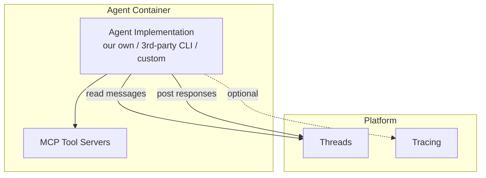
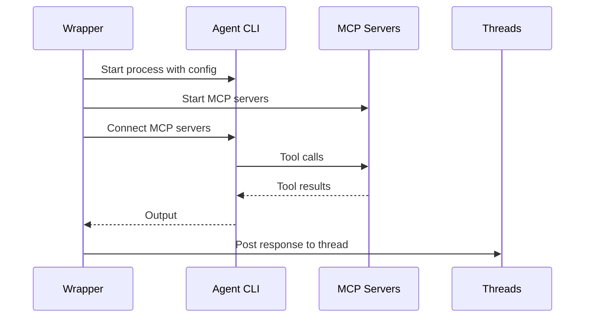
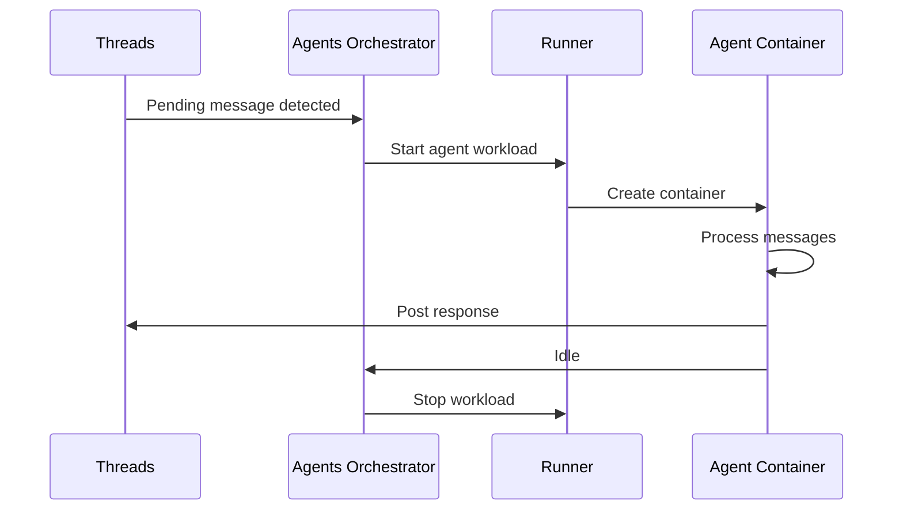

# Agent

## Overview

An agent is a workload that processes messages from a thread. The platform is **implementation-agnostic** — our own agent implementation is the primary one, but the interface must support wrapping 3rd-party agents (e.g., Claude Code, Codex CLI, custom CLIs).

This document describes the agent contract: what an agent is, how it connects to the platform, and how its lifecycle is managed. For our specific implementation details, see [Agent Implementation](agent-implementation.md).

## Agent Contract

Every agent, regardless of implementation, must satisfy the same contract:

| Responsibility | Description |
|---------------|-------------|
| **Read messages** | Consume pending messages from the assigned thread |
| **Process** | Run implementation-specific logic (LLM calls, tool use, etc.) |
| **Post responses** | Write response messages back to the thread |
| **Use tools via MCP** | Connect to MCP servers for tool access |
| **Report tracing** | Optionally emit tracing data |
| **Signal completion** | Indicate when processing is done (idle) |

## Tools

All tools are provided via **MCP protocol** (Model Context Protocol). The goal is to eliminate built-in tools entirely, making tools reusable across any agent implementation.

| Aspect | Details |
|--------|---------|
| Transport | stdio (newline-delimited JSON-RPC 2.0) |
| Server location | Inside the workspace container (sidecar) |
| Namespacing | `<namespace>:<toolName>` to prevent collisions |
| Resilience | Heartbeat + restart with configurable backoff |

MCP servers are defined as team resources (see [Teams](teams.md)) and mounted into the agent container as sidecars by the Runner.

## Wrapper Model

Most 3rd-party agents are implemented as CLIs. The platform provides a **wrapper** that adapts any CLI agent to the platform contract:

The wrapper:
1. Starts the agent CLI process.
2. Provides configuration (model, system prompt, etc.).
3. Connects MCP tool servers to the agent.
4. Collects output and routes it back to the thread.

The communication protocol between the wrapper and the agent process is [to be defined](../open-questions.md#agent-protocol).

## Lifecycle

1. Threads service has pending (unread-by-agent) messages.
2. Agents orchestrator detects this and requests Runner to start an agent workload.
3. Runner creates a container with the agent image, MCP sidecars, and configuration.
4. Agent processes messages, posts responses back to the thread.
5. Agent signals idle. Orchestrator requests Runner to stop the workload.

### Scaling

In the simple case, one container per agent invocation. For specific agents, batching may be desirable — a single agent instance processing multiple threads. See [open question](../open-questions.md#agent-batching-protocol).

## Configuration

Agent configuration is defined in the Teams service as agent resources:

| Field | Type | Description |
|-------|------|-------------|
| `name` | string | Agent display name |
| `role` | string | Agent role label |
| `model` | string | LLM model identifier (e.g., `gpt-5`) |
| `systemPrompt` | string | System prompt injected at start of each turn |
| `debounceMs` | integer | Debounce window for message buffer (ms) |
| `whenBusy` | enum | `wait` or `injectAfterTools` |
| `processBuffer` | enum | `allTogether` or `oneByOne` |
| `sendFinalResponseToThread` | boolean | Auto-send final response to thread |
| `restrictOutput` | boolean | Enforce tool call before finishing |

Implementation-specific configuration (e.g., summarization parameters) is documented in [Agent Implementation](agent-implementation.md#configuration).
