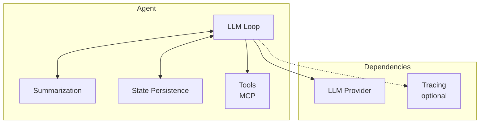
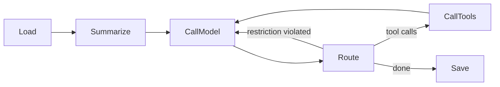
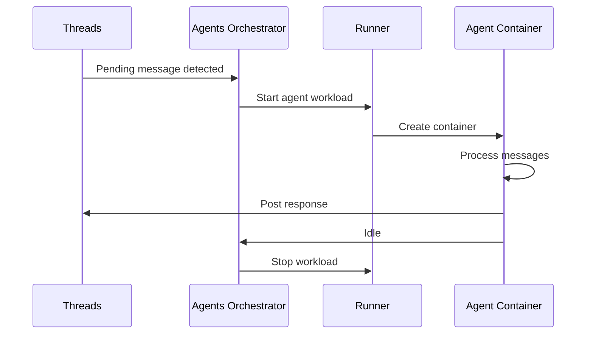

# Agent Architecture

## Overview

An AI agent is a workload that processes messages from a thread using an LLM. The agent is currently embedded in the platform-server monolith and will be extracted into a standalone container.

## Core Structure

An agent consists of 4 core components:
1. **LLM Loop** — handles LLM responses, manages tool calls, sends tool outputs back, manages context.
2. **Summarization** — algorithm to reduce context size.
3. **State Persistence** — can be in memory, file-based, or remote service.
4. **Tools** — connected via MCP protocol. The goal is to eliminate built-in tools and provide all tools through MCP, making them reusable with any agent implementation.

And 2 external dependencies:
- **LLM Provider** — endpoint for LLM calls.
- **Tracing** — optional tracing server.

## LLM Loop

The LLM loop is implemented as a `Loop` of `Reducer` stages connected by `Router` decisions:

| Stage | Responsibility |
|-------|---------------|
| **Load** | Load conversation context from state persistence |
| **Summarize** | If token budget exceeded, fold older messages into rolling summary |
| **Call Model** | Send context to LLM provider with system prompt prepended |
| **Route** | Inspect response: tool calls → Call Tools; restriction violated → re-inject and Call Model; otherwise → Save |
| **Call Tools** | Execute each tool call, collect outputs, return to Call Model |
| **Save** | Persist updated conversation state |

Each stage is a `Reducer<State, Context>` that transforms agent state. Routing is handled by `Router<State, Context>` instances.

## Summarization

Rolling summarization keeps LLM context within a token budget:

- `summarizationKeepTokens` — number of most-recent tokens preserved verbatim.
- `summarizationMaxTokens` — total token budget for the context sent to the LLM.

When context exceeds the budget, messages beyond the verbatim tail are folded into a rolling summary by a dedicated LLM call.

## State Persistence

| Strategy | Description |
|----------|-------------|
| In-memory | Ephemeral, lost on container restart |
| File-based | Persisted to workspace filesystem |
| Remote (APSS) | Agent State service via gRPC (see [Agent State](agent-state.md)) |

## Tools

The goal is to **provide all tools via MCP protocol**, eliminating built-in tools and making tools reusable across any agent implementation.

Current MCP integration:
- MCP server runs inside a workspace container.
- Communication over stdio using newline-delimited JSON-RPC 2.0.
- Tools are namespace-prefixed (`<namespace>:<toolName>`) to prevent collisions.
- Heartbeat and restart with configurable backoff for resilience.

## Agent Interface

The agent is designed to be implementation-agnostic. Our own agent is the primary implementation, but the interface must support wrapping 3rd-party agents.

### Wrapper Model

Most 3rd-party agents are implemented as CLIs. The platform provides a wrapper that:
1. Starts the agent CLI process.
2. Provides configuration (model, system prompt, etc.).
3. Connects MCP tool servers to the agent.
4. Collects output and routes it back to the thread.

The communication protocol between wrapper and agent is [to be defined](../open-questions.md#agent-protocol).

## Agent Lifecycle

1. Detect threads with pending messages.
2. Request Runner to start an agent container with appropriate configuration.
3. Agent processes messages and posts responses back to the thread.
4. On idle, agent is stopped and removed.

### Scaling

In the simple case, one container per agent invocation. For specific agents, batching may be desirable — a single agent instance processing multiple threads. See [open question](../open-questions.md#agent-batching-protocol).

## Configuration

Defined in the Teams service as agent resources:

| Field | Type | Description |
|-------|------|-------------|
| `model` | string | LLM model identifier (e.g., `gpt-5`) |
| `systemPrompt` | string | System prompt injected at start of each turn |
| `debounceMs` | integer | Debounce window for message buffer (ms) |
| `whenBusy` | enum | `wait` or `injectAfterTools` |
| `processBuffer` | enum | `allTogether` or `oneByOne` |
| `sendFinalResponseToThread` | boolean | Auto-send final response to thread |
| `summarizationKeepTokens` | integer | Verbatim token tail size |
| `summarizationMaxTokens` | integer | Summary token budget |
| `restrictOutput` | boolean | Enforce tool call before finishing |
| `name` | string | Agent display name |
| `role` | string | Agent role label |
