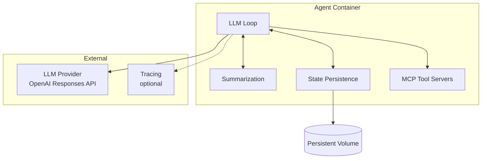
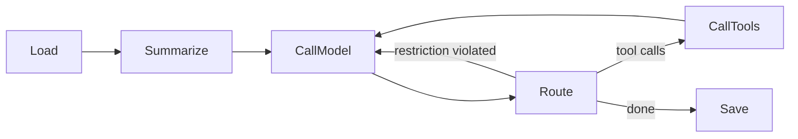

# Agent Implementation

Our agent implementation ([`agn`](../agn-cli.md)). This is the primary agent — a Go-based LLM loop with rolling summarization and disk-based state persistence.

For the general agent contract, lifecycle, and tools, see [Agent](overview.md).

## Structure

| Component | Responsibility |
|-----------|---------------|
| **LLM Loop** | Orchestrates the turn: load context → summarize → call model → route → call tools → save |
| **Summarization** | Reduces context size to fit within the token budget |
| **State Persistence** | Reads and writes conversation state (messages, summaries) to the local filesystem |
| **MCP Tool Servers** | Provides tools to the LLM via MCP protocol |

## LLM Loop

The loop is built on three primitives:

- **`Reducer`** — a stage that transforms agent state. Each stage (Load, Summarize, CallModel, CallTools, Save) is a Reducer.
- **`Router`** — inspects state after a Reducer and decides the next stage. Returns the next stage ID or signals completion.
- **`Loop`** — executes a named graph of Reducers connected by Routers.

### Flow

| Stage | Description |
|-------|-------------|
| **Load** | Load conversation messages from state persistence |
| **Summarize** | If context exceeds the token budget, fold older messages into a rolling summary |
| **CallModel** | Prepend system prompt, send context to LLM provider |
| **Route** | Inspect the LLM response and decide next step |
| **CallTools** | Execute each tool call via MCP, collect outputs |
| **Save** | Persist the updated conversation state |

### Routing Decisions

The Router after CallModel inspects the LLM response:

| Condition | Next Stage | Reason |
|-----------|-----------|--------|
| Response contains tool calls | CallTools | Tools need to be executed |
| `restrictOutput` is enabled and response has no tool calls | CallModel | Agent must call a tool before finishing — re-inject instruction |
| Otherwise | Save | Turn is complete |

### LLM Provider

Uses **OpenAI Responses API**. The LLM client wraps any OpenAI-compatible endpoint and handles message serialization. When running on the platform, [`agynd`](../agynd-cli.md) configures the endpoint to point to the [LLM Proxy](../llm-proxy.md).

Message types sent to the provider:

| Type | Description |
|------|-------------|
| `SystemMessage` | System prompt (injected by CallModel) |
| `HumanMessage` | User message |
| `AIMessage` | Previous assistant response |
| `ToolCallMessage` | Tool call request from assistant |
| `ToolCallOutputMessage` | Tool execution result |
| `ResponseMessage` | Raw response envelope from the provider |

## Summarization

Rolling summarization keeps the LLM context within a token budget. When context exceeds the budget, older messages are folded into a compact summary.

### Algorithm

1. Count tokens in the full conversation.
2. If total ≤ `summarizationMaxTokens`, skip summarization.
3. Otherwise, keep the most recent `summarizationKeepTokens` worth of messages verbatim.
4. Send the remaining older messages to the LLM with a summarization prompt.
5. Replace the older messages with the resulting summary message.

### Packaging

Summarization is embedded in the agent code. Extraction into a shared package or standalone service will be evaluated when a second agent loop implementation is introduced.

## State Persistence

The agent persists conversation state (messages, summaries) on the local filesystem. State is written to a path backed by a persistent volume. See [Agent State](state.md) for the persistence model.

The state format and storage layout are owned by the agent implementation. The platform provides the volume — the agent decides what to store and how to organize it.

## Configuration

Implementation-specific configuration fields (in addition to the [base agent config](overview.md#configuration)):

| Field | Type | Description |
|-------|------|-------------|
| `summarizationKeepTokens` | integer | Number of most-recent tokens preserved verbatim |
| `summarizationMaxTokens` | integer | Total token budget for context sent to the LLM |
