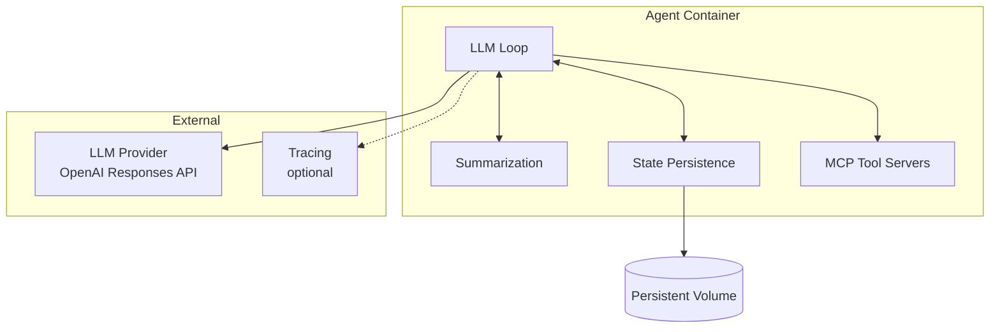
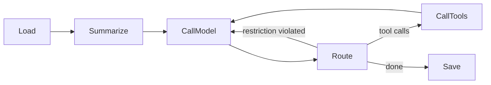

# Agent Implementation

Our agent implementation ([`agn`](../agn-cli.md)). This is the primary agent — a Go-based LLM loop with rolling summarization and disk-based state persistence.

For the general agent contract, lifecycle, and tools, see [Agent](overview.md).

## Structure



| Component | Responsibility |
|-----------|---------------|
| **LLM Loop** | Orchestrates the turn: load context → summarize → call model → route → call tools → save |
| **Summarization** | Reduces context size to fit within the token budget |
| **State Persistence** | Reads and writes conversation state (messages, summaries) to the local filesystem |
| **MCP Tool Servers** | Provides tools to the LLM via MCP protocol |

## LLM Loop

The loop is built on three primitives:

- **`Reducer`** — a stage that transforms agent state. Each stage (Load, Summarize, CallModel, CallTools, Save) is a Reducer.
- **`Router`** — inspects state after a Reducer and decides the next stage. Returns the next stage ID or signals completion.
- **`Loop`** — executes a named graph of Reducers connected by Routers.

### Flow



| Stage | Description |
|-------|-------------|
| **Load** | Load conversation messages from state persistence |
| **Summarize** | If context exceeds the token budget, fold older messages into a rolling summary |
| **CallModel** | Prepend system prompt, send context to LLM provider |
| **Route** | Inspect the LLM response and decide next step |
| **CallTools** | Execute each tool call via MCP, collect outputs |
| **Save** | Persist the updated conversation state |

### Routing Decisions

The Router after CallModel inspects the LLM response:

| Condition | Next Stage | Reason |
|-----------|-----------|--------|
| Response contains tool calls | CallTools | Tools need to be executed |
| `restrictOutput` is enabled and response has no tool calls | CallModel | Agent must call a tool before finishing — re-inject instruction |
| Otherwise | Save | Turn is complete |

### LLM Provider

Uses **OpenAI Responses API**. The LLM client wraps any OpenAI-compatible endpoint and handles message serialization. When running on the platform, [`agynd`](../agynd-cli.md) configures the endpoint to point to the [LLM Proxy](../llm-proxy.md).

Message types sent to the provider:

| Type | Description |
|------|-------------|
| `SystemMessage` | System prompt (injected by CallModel) |
| `HumanMessage` | User message |
| `AIMessage` | Previous assistant response |
| `ToolCallMessage` | Tool call request from assistant |
| `ToolCallOutputMessage` | Tool execution result |
| `ResponseMessage` | Raw response envelope from the provider |

## MCP-to-LLM Translation

The **CallTools** stage executes MCP tool calls and converts the results into OpenAI Responses API format before feeding them back to the LLM. MCP and OpenAI use different content type systems — `agn` translates between them.

### MCP Content Types → OpenAI Responses API

MCP tool results contain a `content` array with typed items. Each MCP content item is translated to the corresponding OpenAI Responses API `function_call_output` content item:

| MCP content type | MCP format | OpenAI output type | OpenAI format |
|-----------------|------------|-------------------|---------------|
| `text` | `{ "type": "text", "text": "..." }` | `input_text` | `{ "type": "input_text", "text": "..." }` |
| `image` | `{ "type": "image", "data": "<base64>", "mimeType": "image/png" }` | `input_image` | `{ "type": "input_image", "image_url": "data:<mimeType>;base64,<data>" }` |
| `resource` (text) | `{ "type": "resource", "resource": { "uri": "...", "mimeType": "text/*", "text": "..." } }` | `input_text` | `{ "type": "input_text", "text": "..." }` |
| `resource` (binary) | `{ "type": "resource", "resource": { "uri": "...", "mimeType": "...", "blob": "<base64>" } }` | `input_file` | `{ "type": "input_file", "file_data": "<base64>", "filename": "<extracted from uri>" }` |
| `audio` | `{ "type": "audio", "data": "<base64>", "mimeType": "audio/*" }` | `input_file` | `{ "type": "input_file", "file_data": "<base64>" }` |

### Translation Rules

1. **`text`** → `input_text`: Direct mapping. The `text` field is copied as-is.

2. **`image`** → `input_image`: The base64 data and MIME type are combined into a [data URL](https://developer.mozilla.org/en-US/docs/Web/URI/Schemes/data): `data:<mimeType>;base64,<data>`. This is the format OpenAI expects for inline images.

3. **`resource` with `text`** → `input_text`: Text resources are unwrapped — the `text` field from the resource is sent as `input_text`.

4. **`resource` with `blob`** → `input_file`: Binary resources are sent as `input_file` with the base64 data in `file_data`. The `filename` is extracted from the resource `uri` if available.

5. **`audio`** → `input_file`: Audio content is sent as `input_file` since the OpenAI Responses API does not have a dedicated audio input type for tool outputs.

### Example: File Read Tool Result Translation

When the LLM calls `read_file` on an image file, the [files-mcp](../files-mcp.md) server returns:

**MCP tool result:**
```json
{
  "content": [
    {
      "type": "image",
      "data": "iVBORw0KGgo...",
      "mimeType": "image/png"
    }
  ]
}
```

**`agn` translates to OpenAI `function_call_output`:**
```json
{
  "type": "function_call_output",
  "call_id": "call_abc123",
  "output": [
    {
      "type": "input_image",
      "image_url": "data:image/png;base64,iVBORw0KGgo..."
    }
  ]
}
```

For a text file:

**MCP tool result:**
```json
{
  "content": [
    {
      "type": "text",
      "text": "def hello():\n    print('world')"
    }
  ]
}
```

**`agn` translates to OpenAI `function_call_output`:**
```json
{
  "type": "function_call_output",
  "call_id": "call_def456",
  "output": [
    {
      "type": "input_text",
      "text": "def hello():\n    print('world')"
    }
  ]
}
```

### Scope

This translation applies to **all** MCP tool results, not just `read_file`. Any MCP server that returns `image`, `text`, `resource`, or `audio` content types is translated the same way. The translation is a generic layer in the CallTools stage, not specific to any particular MCP server.

## Summarization

Rolling summarization keeps the LLM context within a token budget. When context exceeds the budget, older messages are folded into a compact summary.

### Algorithm

1. Count tokens in the full conversation.
2. If total ≤ `summarization.max_tokens`, skip summarization.
3. Otherwise, keep the most recent `summarization.keep_tokens` worth of messages verbatim.
4. Send the remaining older messages to the LLM with a summarization prompt.
5. Replace the older messages with the resulting summary message.

### Packaging

Summarization is embedded in the agent code. Extraction into a shared package or standalone service will be evaluated when a second agent loop implementation is introduced.

## State Persistence

The agent persists conversation state (messages, summaries) on the local filesystem. State is written to a path backed by a persistent volume. See [Agent State](state.md) for the persistence model.

The state format and storage layout are owned by the agent implementation. The platform provides the volume — the agent decides what to store and how to organize it.

## Configuration

Implementation-specific configuration fields (in addition to the [base agent config](overview.md#configuration)):

| Field | Type | Description |
|-------|------|-------------|
| `summarization.llm.endpoint` | string | OpenAI-compatible API base URL for summarization LLM |
| `summarization.llm.auth.api_key` | string | API key, provided directly |
| `summarization.llm.auth.api_key_env` | string | Environment variable name containing the API key |
| `summarization.llm.model` | string | Model identifier for summarization |
| `summarization.keep_tokens` | integer | Tokens preserved verbatim from recent messages (default: 2048) |
| `summarization.max_tokens` | integer | Total token budget that triggers summarization (default: 4096) |

Summarization configuration fallback behavior:

- If `summarization` is omitted entirely, the agent uses the main LLM with default thresholds.
- If `summarization` is present but `summarization.llm` is omitted, the agent uses the main LLM with the specified thresholds.
- If `summarization.llm` is provided, all sub-fields follow the same rules as the top-level `llm` block.
