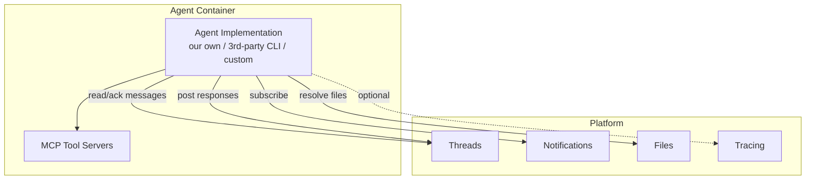
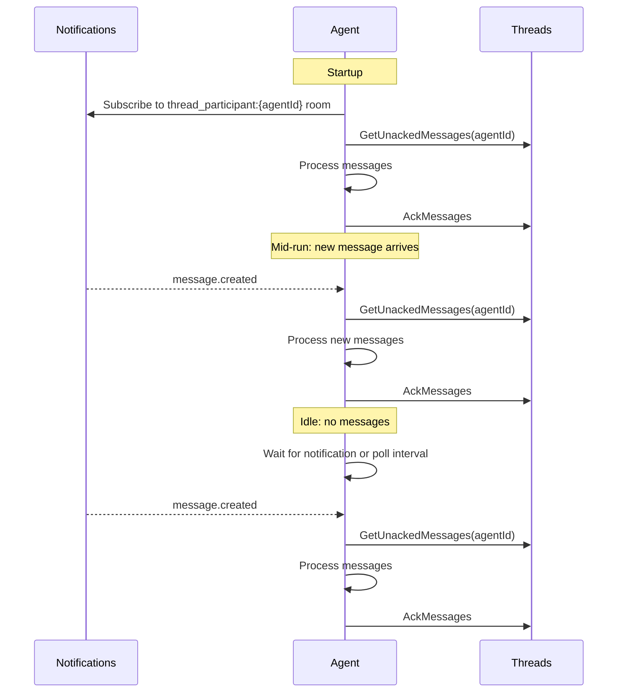
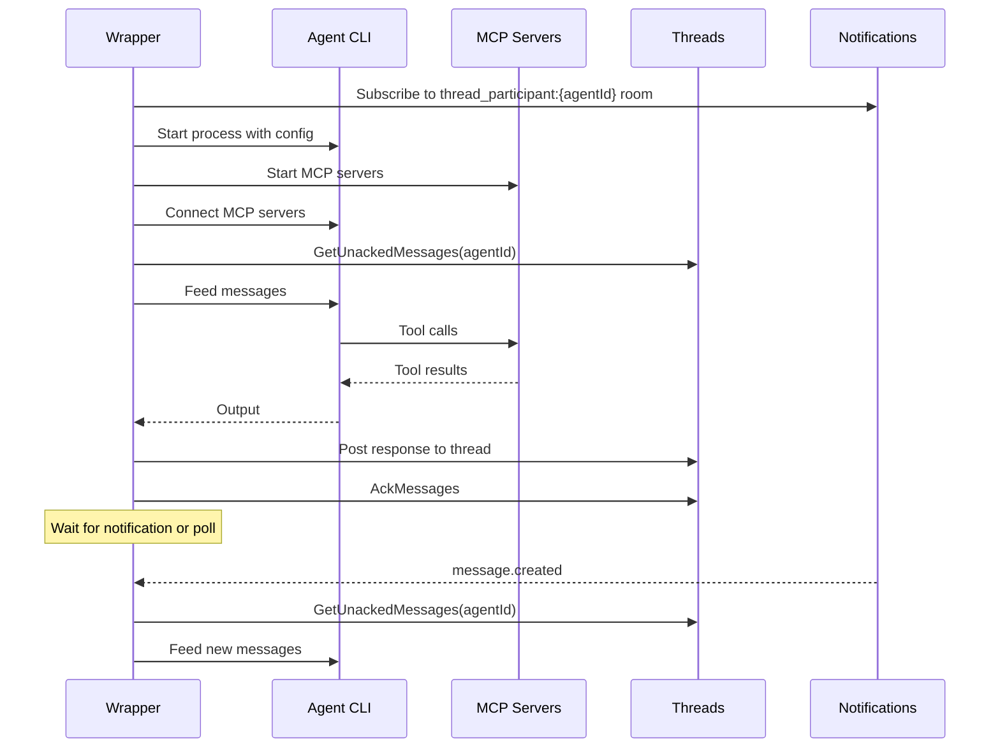
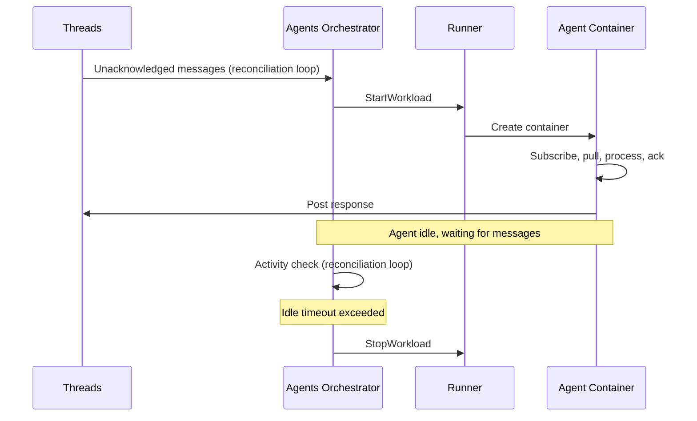

# Agent

## Overview

An agent is a workload that processes messages from a thread. The platform is **implementation-agnostic** — our own agent implementation is the primary one, but the interface must support wrapping 3rd-party agents (e.g., Claude Code, Codex CLI, custom CLIs).

This document describes the agent contract: what an agent is, how it connects to the platform, and how its lifecycle is managed. For our specific implementation details, see [Agent Implementation](implementation.md).

## Agent Contract

Every agent, regardless of implementation, must satisfy the same contract:

| Responsibility | Description |
|---------------|-------------|
| **Read messages** | Pull unacknowledged messages via `GetUnackedMessages` |
| **Acknowledge messages** | Call `AckMessages` after successful processing |
| **Resolve file URLs** | Request pre-signed download URLs for file references via Files API |
| **Process** | Run implementation-specific logic (LLM calls, tool use, etc.) |
| **Post responses** | Write response messages back to the thread via Threads API |
| **Subscribe to notifications** | Listen for `message.created` events on `thread_participant:{agentId}` room |
| **Use tools via MCP** | Connect to MCP servers for tool access |
| **Report tracing** | Optionally emit tracing data |

The agent is a **pure client** — it makes outbound connections to platform services. It does not expose any server or accept inbound connections.

## Communication Protocol

The agent uses a **pull strategy combined with notifications** to receive messages.

### How It Works

1. On startup, the agent subscribes to its `thread_participant:{agentId}` notification room and pulls unacknowledged messages from Threads via `GetUnackedMessages`. See [Consumer Sync Protocol](../notifications.md#consumer-sync-protocol) for the subscribe/fetch/dedup sequence.
2. During processing, new messages may arrive. The Notifications service delivers a `message.created` event, waking the agent to check for new messages at the appropriate point in its processing loop.
3. After processing, the agent calls `AckMessages` to confirm the messages were handled.
4. When idle (current turn complete, no unacknowledged messages), the agent waits for either a notification or the poll interval to expire, then checks again.
5. The polling loop is a **fallback**. The poll interval can be long (10s, 30s) since notifications handle the latency-sensitive path.

### Design Principles

- **Pull at defined loop stages.** The `whenBusy` configuration controls when mid-run messages are picked up: between turns (`wait`) or between tool calls (`injectAfterTools`). The notification wakes the agent, but the actual message read happens at the next check point in the LLM loop.
- **No inbound connections.** The agent connects outbound to Notifications (gRPC subscribe stream), Threads (gRPC calls), and Files (gRPC calls). No server, no open port, no service discovery per agent.

## Tools

All tools are provided via **MCP protocol** (Model Context Protocol). The goal is to eliminate built-in tools entirely, making tools reusable across any agent implementation.

| Aspect | Details |
|--------|---------|
| Transport | stdio (newline-delimited JSON-RPC 2.0) |
| Server location | Inside the workspace container (sidecar) |
| Namespacing | `<namespace>:<toolName>` to prevent collisions |
| Resilience | Heartbeat + restart with configurable backoff |

MCP servers are defined as team resources (see [Teams](../teams.md)) and mounted into the agent container as sidecars by the Runner.

## Wrapper Model

Most 3rd-party agents are implemented as CLIs. The platform provides a **wrapper** that adapts any CLI agent to the platform contract:

The wrapper:
1. Subscribes to notifications for the agent's participant room.
2. Starts the agent CLI process with configuration.
3. Connects MCP tool servers to the agent.
4. Pulls unacknowledged messages from Threads and feeds them to the CLI.
5. Collects CLI output and posts responses to the thread.
6. Acknowledges processed messages via `AckMessages`.
7. Waits for notifications or poll fallback for new messages.

## Lifecycle

The [Agents Orchestrator](../orchestrator.md) manages the full agent workload lifecycle — starting containers when demand exists, stopping them when idle. This section summarizes the lifecycle from the agent's perspective.

1. The orchestrator's reconciliation loop detects threads with unacknowledged messages for agent participants.
2. Orchestrator requests Runner to start an agent workload with thread ID and agent config.
3. Runner creates a container with the agent image, MCP sidecars, and configuration.
4. Agent subscribes to notifications, pulls unacknowledged messages, processes, posts responses, acknowledges.
5. Agent waits for new messages (notification or poll fallback).
6. The orchestrator monitors agent activity. When idle timeout is exceeded, it stops the workload via Runner.

### Idle Timeout

The **orchestrator** owns idle timeout enforcement. During each reconciliation pass, it checks running agent workloads against their last activity (last message on the thread). Agents that have been idle beyond the configured timeout are stopped via `Runner.StopWorkload`.

The agent container does not implement idle detection. It may exit naturally (process completion, crash), but the orchestrator is the authority for lifecycle management.

### Scaling

In the simple case, one container per agent invocation. For specific agents, batching may be desirable — a single agent instance processing multiple threads. See [open question](../../open-questions.md#agent-batching-protocol).

## Configuration

Agent configuration is defined in the Teams service as agent resources:

| Field | Type | Description |
|-------|------|-------------|
| `name` | string | Agent display name |
| `role` | string | Agent role label |
| `model` | string | LLM model identifier (e.g., `gpt-5`) |
| `systemPrompt` | string | System prompt injected at start of each turn |
| `debounceMs` | integer | Debounce window for message buffer (ms) |
| `whenBusy` | enum | `wait` or `injectAfterTools` |
| `processBuffer` | enum | `allTogether` or `oneByOne` |
| `sendFinalResponseToThread` | boolean | Auto-send final response to thread |
| `restrictOutput` | boolean | Enforce tool call before finishing |

Implementation-specific configuration (e.g., summarization parameters) is documented in [Agent Implementation](implementation.md#configuration).
