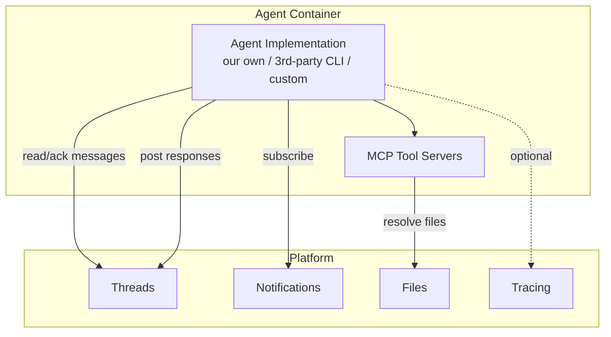
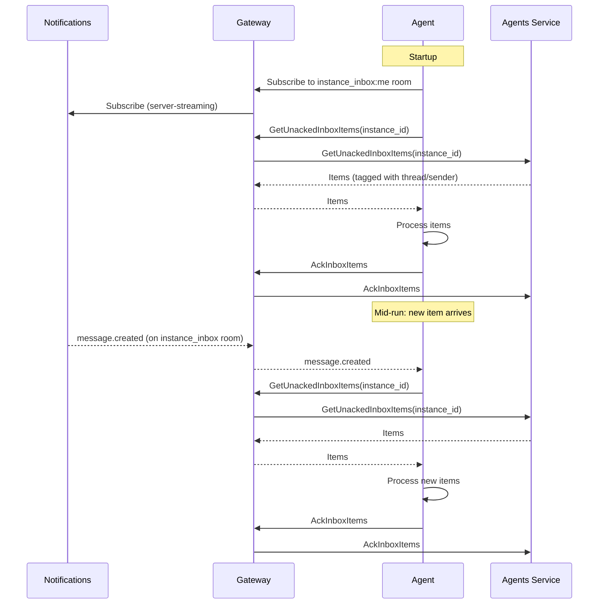
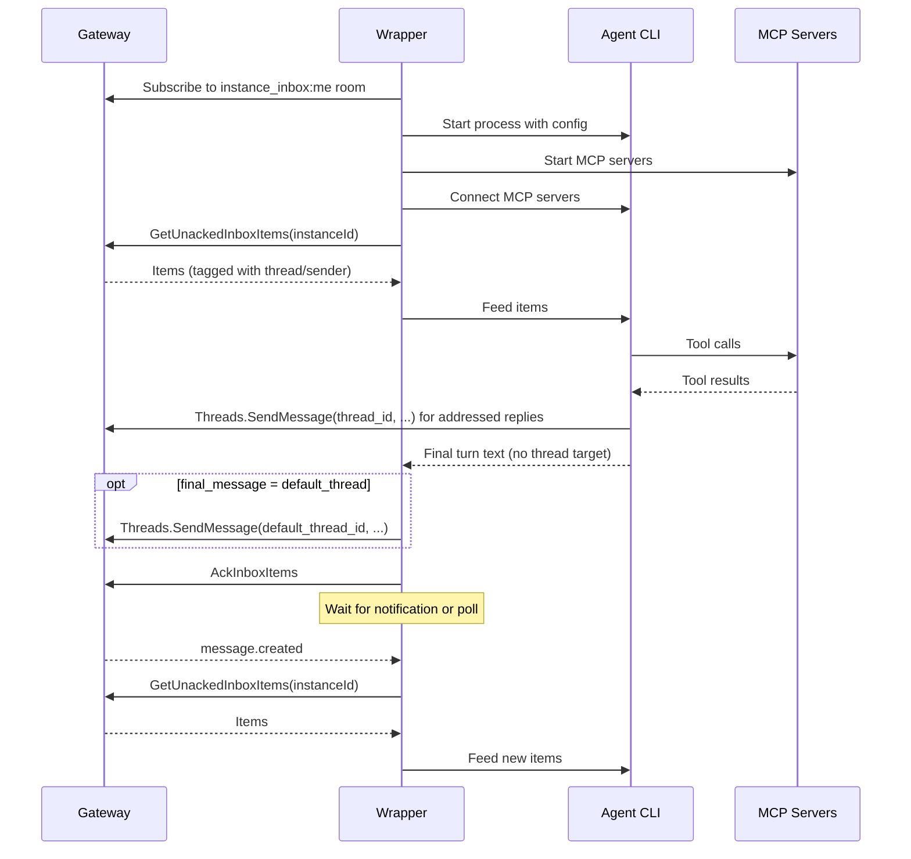
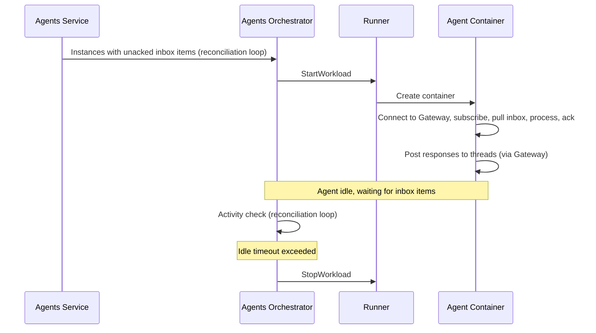

# Agent

## Overview

An agent is a workload that processes [inbox items](../agent-instances.md#inbox) for a specific [agent instance](../agent-instances.md). The platform is **implementation-agnostic** — our own agent implementation is the primary one, but the interface must support wrapping 3rd-party agents (e.g., Claude Code, Codex CLI, custom CLIs).

This document describes the agent contract: what an agent is, how it connects to the platform, and how its lifecycle is managed. Every workload processes one instance; the instance is durable across workload restarts. For our specific implementation details, see [Agent Implementation](implementation.md).

## Agent Contract

Every agent, regardless of implementation, must satisfy the same contract:

```mermaid
graph TB
    subgraph "Agent Container"
        Impl[Agent Implementation<br/>our own / 3rd-party CLI / custom]
        MCP[MCP Tool Servers]
        Impl --> MCP
    end

    subgraph Platform
        Threads
        Notifications
        Files
        Tracing
    end

    Impl -->|read/ack messages| Threads
    Impl -->|post responses| Threads
    MCP -->|resolve files| Files
    Impl -->|subscribe| Notifications
    Impl -.->|optional| Tracing
```

| Responsibility | Description |
|---------------|-------------|
| **Read inbox items** | Pull unacknowledged items for the instance via `GetUnackedInboxItems(instance_id)` on the [Agents Service](../agents-service.md) |
| **Acknowledge items** | Call `AckInboxItems` after successful processing |
| **Access files via MCP** | File content is accessed on demand by the LLM through the [files-mcp](../files-mcp.md) MCP server, which reads from the Files service |
| **Process** | Run implementation-specific logic (LLM calls, tool use, etc.) |
| **Post responses** | Write response messages back via [`Threads.SendMessage`](../threads.md), specifying a `thread_id` per send. An omitted `thread_id` resolves server-side to the instance's [default thread](../agent-instances.md#default-thread); the turn's inbox items never determine the target. See [Outbound](../agent-instances.md#outbound) |
| **Subscribe to notifications** | Listen for `message.created` events on the [`instance_inbox:me`](../notifications.md#self-subscription-sentinel) room (resolved server-side to the caller's `identity_id`, which is the instance id) |
| **Use tools via MCP** | Connect to MCP servers for tool access |
| **Report tracing** | Optionally emit tracing data |

The agent is primarily a **client** — it connects to the [Gateway](../gateway.md) and the [LLM Proxy](../llm-proxy.md) using OpenZiti service hostnames transparently intercepted by the pod's [Ziti sidecar](../openziti.md#agent-access-scope) and accesses all platform services through them. It does not expose any server or accept inbound connections by default. When the agent exposes a port via the platform API, the Ziti sidecar binds a new OpenZiti service and forwards inbound traffic to `localhost:<port>` inside the pod. See [Expose Service](../expose-service.md).

## Communication Protocol

The agent uses a **pull strategy combined with notifications** to receive inbox items.

### How It Works

```mermaid
sequenceDiagram
    participant N as Notifications
    participant GW as Gateway
    participant A as Agent
    participant AS as Agents Service

    Note over A: Startup
    A->>GW: Subscribe to instance_inbox:me room
    GW->>N: Subscribe (server-streaming)
    A->>GW: GetUnackedInboxItems(instance_id)
    GW->>AS: GetUnackedInboxItems(instance_id)
    AS-->>GW: Items (tagged with thread/sender)
    GW-->>A: Items
    A->>A: Process items
    A->>GW: AckInboxItems
    GW->>AS: AckInboxItems

    Note over A: Mid-run: new item arrives
    N-->>GW: message.created (on instance_inbox room)
    GW-->>A: message.created
    A->>GW: GetUnackedInboxItems(instance_id)
    GW->>AS: GetUnackedInboxItems(instance_id)
    AS-->>GW: Items
    GW-->>A: Items
    A->>A: Process new items
    A->>GW: AckInboxItems
    GW->>AS: AckInboxItems
```

1. On startup, the agent connects to the [Gateway](../gateway.md) (via the `gateway.ziti` OpenZiti hostname, transparently intercepted by the pod's Ziti sidecar), subscribes to its [`instance_inbox:me`](../notifications.md#self-subscription-sentinel) notification room and pulls unacknowledged inbox items via `GetUnackedInboxItems`. See [Consumer Sync Protocol](../notifications.md#consumer-sync-protocol) for the subscribe/fetch/dedup sequence.
2. During processing, new items may arrive. The Gateway delivers a `message.created` event (from Notifications), waking the agent to check for new items at the appropriate point in its processing loop.
3. After processing, the agent calls `AckInboxItems` to confirm the items were handled.
4. When idle (current turn complete, no unacknowledged items), the agent waits for either a notification or the poll interval to expire, then checks again.
5. The polling loop is a **fallback**. The poll interval can be long (10s, 30s) since notifications handle the latency-sensitive path.

### Design Principles

- **Pull at defined loop stages.** The `whenBusy` configuration controls when mid-run messages are picked up: between turns (`wait`) or between tool calls (`injectAfterTools`). The notification wakes the agent, but the actual message read happens at the next check point in the LLM loop.
- **No inbound connections.** The agent connects outbound to the [Gateway](../gateway.md) only (via the `gateway.ziti` OpenZiti hostname, transparently intercepted by the pod's Ziti sidecar). The Gateway routes requests to internal services (Threads, Notifications, Files, etc.). No server, no open port, no service discovery per agent.

## Tools

All tools are provided via **MCP protocol** (Model Context Protocol). The goal is to eliminate built-in tools entirely, making tools reusable across any agent implementation. See [MCP](../mcp.md) for the full MCP architecture.

| Aspect | Details |
|--------|---------|
| Transport | Streamable HTTP (agent CLI → MCP sidecar). stdio MCP servers are wrapped by a sidecar proxy |
| Server location | Sidecar containers in the agent pod (shared network namespace) |
| Connection | Agent CLI connects directly to each MCP server on `localhost:<port>` |
| Namespacing | Owned by each agent CLI implementation |
| Resilience | Health checks + restart with configurable backoff (managed by the sidecar) |

MCP servers are defined as agent resources (see [Agents](../agents-service.md)) and mounted into the agent pod as sidecars by the Runner.

## Capabilities

Agents declare **capabilities** rather than configuring sidecars manually. The runner resolves each capability name to the appropriate sidecar injection and environment variables — the agent only declares intent. Capability names are open strings; any runner can implement any capability it chooses without platform changes.

For example, `docker` gives the agent a full Docker daemon on `localhost:2375`, injected as a DinD sidecar by the runner. See [Resource Definitions — Capabilities](../resource-definitions.md#capabilities) and [k8s-runner — Capability Implementations](../k8s-runner.md#capability-implementations).

## Wrapper Model

Most 3rd-party agents are implemented as CLIs. The platform provides a **wrapper** that adapts any CLI agent to the platform contract:

```mermaid
sequenceDiagram
    participant GW as Gateway
    participant W as Wrapper
    participant CLI as Agent CLI
    participant MCP as MCP Servers

    W->>GW: Subscribe to instance_inbox:me room
    W->>CLI: Start process with config
    W->>MCP: Start MCP servers
    W->>CLI: Connect MCP servers
    W->>GW: GetUnackedInboxItems(instanceId)
    GW-->>W: Items (tagged with thread/sender)
    W->>CLI: Feed items
    CLI->>MCP: Tool calls
    MCP-->>CLI: Tool results
    CLI->>GW: Threads.SendMessage(thread_id, ...) for addressed replies
    CLI-->>W: Final turn text (no thread target)
    opt final_message = default_thread
        W->>GW: Threads.SendMessage(default_thread_id, ...)
    end
    W->>GW: AckInboxItems
    Note over W: Wait for notification or poll
    GW-->>W: message.created
    W->>GW: GetUnackedInboxItems(instanceId)
    GW-->>W: Items
    W->>CLI: Feed new items
```

The wrapper:
1. Subscribes to notifications for the instance's inbox room.
2. Starts the agent CLI process with configuration.
3. Connects MCP tool servers to the agent.
4. Pulls unacknowledged inbox items (via Gateway → Agents Service) and feeds them to the CLI, tagged with their source thread.
5. Posts the CLI's final turn text to the instance's [default thread](../agent-instances.md#default-thread) when the class sets [`final_message = default_thread`](../resource-definitions.md#agent). Messages the agent addresses to a specific thread are sent by the agent itself during the turn.
6. Acknowledges processed items via `AckInboxItems`.
7. Waits for notifications or poll fallback for new items.

## Lifecycle

```mermaid
sequenceDiagram
    participant AS as Agents Service
    participant O as Agents Orchestrator
    participant R as Runner
    participant A as Agent Container

    AS->>O: Instances with unacked inbox items (reconciliation loop)
    O->>R: StartWorkload
    R->>A: Create container
    A->>A: Connect to Gateway, subscribe, pull inbox, process, ack
    A->>A: Post responses to threads (via Gateway)

    Note over A,O: Agent idle, waiting for inbox items
    O->>O: Activity check (reconciliation loop)
    Note over O: Idle timeout exceeded
    O->>R: StopWorkload
```

1. The orchestrator's reconciliation loop detects instances with unacknowledged inbox items.
2. Orchestrator requests Runner to start an agent workload with `AGENT_INSTANCE_ID`, `AGENT_ID` (class), and class config.
3. Runner creates a container with the agent image, MCP sidecars, and configuration.
4. Agent connects to the Gateway (via the `gateway.ziti` OpenZiti hostname, transparently intercepted by the pod's Ziti sidecar), subscribes to notifications, pulls unacknowledged inbox items, processes, posts responses to threads, acknowledges.
5. Agent waits for new items (notification or poll fallback).
6. The orchestrator monitors workload activity. When idle timeout is exceeded, it stops the workload via Runner. The instance persists — a new workload starts on the next inbox item.

### Idle Timeout

The [Agents Orchestrator](../agents-orchestrator.md) owns idle timeout enforcement. The agent's [`idle_timeout`](../resource-definitions.md#agent) (default `"5m"`) controls how long a workload can remain idle before being stopped. [`agynd`](../agynd-cli.md) reports activity while the agent is processing; the orchestrator stops workloads that exceed the timeout. The agent container does not implement idle detection or self-termination.

See [Agents Orchestrator — Idle Timeout](../agents-orchestrator.md#idle-timeout) for the full mechanism.

### Scaling

One container per agent instance while there is work to do. A single instance can already receive items from many threads via its inbox — no separate batching mechanism is needed for that. Batching workloads across *different* instances (multi-tenant containers) remains an [open question](../../open-questions.md#agent-batching-protocol).

## Configuration

The agent resource definition (identity, model, environment reference, configuration) is documented in [Resource Definitions](../resource-definitions.md#agent). Sub-resources (MCP servers, volumes, skills, environment variables, init scripts) that compose the agent's runtime environment are documented alongside the agent in [Resource Definitions](../resource-definitions.md).

Agent implementation-specific behavioral configuration (system prompt, summarization, message buffering) is documented in [Agent Implementation](implementation.md#configuration).
