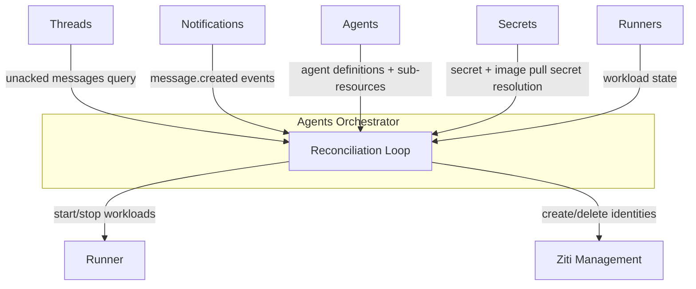
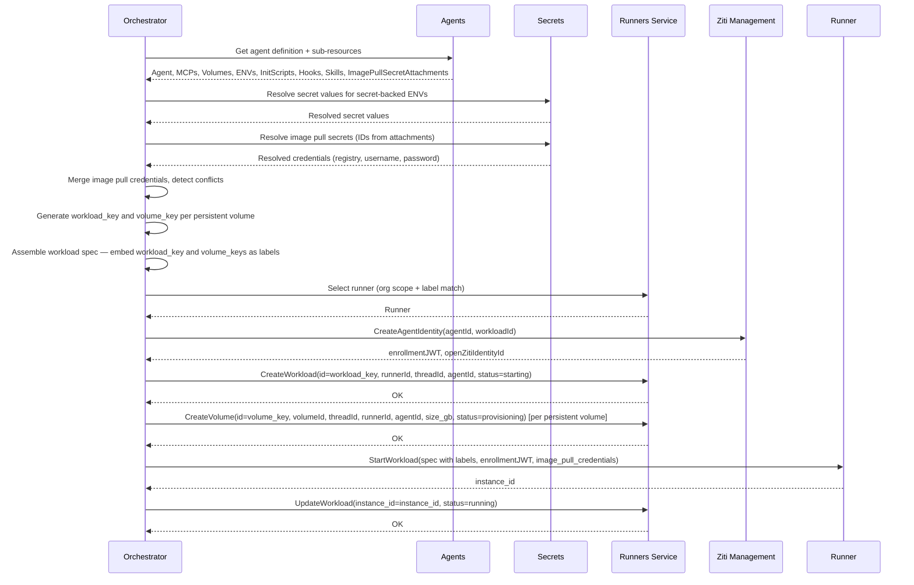
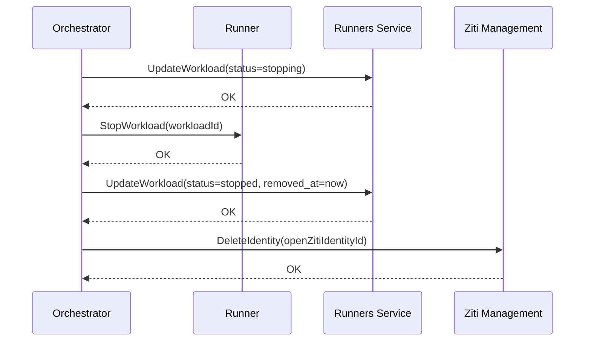

# Agents Orchestrator

## Overview

The Agents Orchestrator is a **control plane** service that ensures every thread with unacknowledged agent messages has a running agent workload processing it. It is a background reconciler — it observes desired state (threads needing agents) and actual state (running workloads via the [Runners](runners.md) service), and converges them.

The orchestrator does not decide which agent should be on a thread. It does not manage thread participants. By the time the orchestrator acts, the agent is already a participant on the thread. The orchestrator's job is: **if a thread has unacked messages for an agent participant, ensure a workload is running for that agent on that thread.**

## Dependencies

| Dependency | Usage |
|-----------|-------|
| **Threads** | Query for unacknowledged messages by agent participants |
| **Notifications** | Subscribe to `message.created` events for fast reactivity |
| **Agents** | Fetch agent definitions and sub-resources (MCPs, volumes, ENVs, init scripts, hooks, skills, image pull secret attachments) |
| **Secrets** | Resolve secret values for ENVs that reference secrets. Resolve image pull secret credentials for private registry access |
| **[Runners](runners.md)** | Read and write workload runtime state (which workloads are running, on which runner). Query registered runners for [runner selection](runners.md#runner-selection) |
| **Runner** | Start and stop agent workloads. List provisioned volumes for volume sync (via OpenZiti SDK — see [Authentication](authn.md#sdk-embedding)) |
| **Ziti Management** | Create and delete OpenZiti identities for agent containers |

## Reconciliation

The orchestrator runs a reconciliation loop that continuously converges actual state toward desired state. It uses the standard platform pattern: **pull + notifications**.

### Desired State

Threads with unacknowledged messages for agent participants. The orchestrator queries Threads to discover which agents need to be running.

### Actual State

Running agent workloads. The orchestrator queries the [Runners](runners.md) service to discover what is currently running.

### Loop

1. On startup, the orchestrator subscribes to Notifications for `message.created` events and fetches the current state from Threads and the [Runners](runners.md) service.
2. **Compare:** For each **non-passive** agent participant with unacked messages — check if a workload is running. Passive participants are skipped — they consume messages via the API directly. For each running workload — check if it still has unacked messages or recent activity.
3. **Act:**
   - **Start:** If an agent has unacked messages and no running workload → assemble workload spec → create OpenZiti identity → start workload via Runner → record workload in [Runners](runners.md) service.
   - **Stop:** If a running workload has been idle beyond the configured timeout → mark workload removed in [Runners](runners.md) service → stop workload via Runner → delete OpenZiti identity.
4. **Wait:** Block until a notification arrives or the poll interval expires, then repeat from step 2.

The polling loop is a consistency fallback. Notifications handle the latency-sensitive path — when a new message arrives on a thread, the `message.created` event wakes the orchestrator to re-evaluate immediately.

Follows the [Consumer Sync Protocol](notifications.md#consumer-sync-protocol) for subscribe/fetch/dedup.

### Idle Timeout

The orchestrator owns idle timeout enforcement. During each reconciliation pass, it queries the [Runners](runners.md) service for running workloads (where `removed_at IS NULL`) and checks each workload's `last_activity_at` timestamp against the agent's `idle_timeout` (from the [Agent resource definition](resource-definitions.md#agent), default `"5m"`). Workloads where `now - last_activity_at > idle_timeout` are stopped — see [Agent Stop Flow](#agent-stop-flow).

The `last_activity_at` timestamp is maintained by [`agynd`](agynd-cli.md), which calls `TouchWorkload` on the [Runners](runners.md) service (via [Gateway](gateway.md)) every 10 seconds while the agent is actively processing. When the agent is idle (waiting for new messages), `agynd` stops sending keepalives, and the idle clock begins. This ensures long-running tasks (which may take hours) are never prematurely terminated.

The agent container does not implement idle detection or self-termination. It may exit naturally (process completion, crash), but the orchestrator is the authority for lifecycle management.

### OpenZiti Identity Reconciliation

In addition to agent workloads, the orchestrator reconciles OpenZiti identities:

1. Each reconciliation pass: call `ZitiManagement.ListManagedIdentities()`.
2. Compare against active workloads from the [Runners](runners.md) service.
3. Delete OpenZiti identities that have no matching running workload via `ZitiManagement.DeleteIdentity()`.

Orphaned identities arise from Runner crashes, container crashes, or orchestrator restarts. An orphaned identity with no running container is inert (the enrollment JWT has expired or the enrolled certificate is inside a stopped container), but cleanup is important for hygiene and OpenZiti Controller resource limits.

See [OpenZiti Integration — Orphan Reconciliation](openziti.md#orphan-reconciliation) for the full flow.

## Agent Start Flow

When the orchestrator decides an agent workload needs to start:

Records are created in the Runners service before `StartWorkload` is called — this prevents the reconciliation loop from treating the workload or PVCs as orphans during the start sequence. The `workload_key` and `volume_key`s are Orchestrator-generated UUIDs embedded as labels in the spec. The runner assigns its own `instance_id` (Pod name for the workload, PVC name for volumes) and returns it. The workload `instance_id` is updated immediately; volume `instance_id`s are set by the reconciliation loop when it finds the PVCs by their `volume_key` labels.

### Runner Selection

Before starting a workload, the orchestrator selects a runner. See [Runners — Runner Selection](runners.md#runner-selection) for the full algorithm. In summary: filter enrolled runners by organization scope, then by label match against the agent's `runner_labels`, then pick one at random. If no runner matches, the workload fails to schedule and the orchestrator retries on the next reconciliation pass.

### Workload Spec Assembly

The orchestrator assembles the full workload specification from multiple sources:

1. **Agent definition** (from Agents): image, compute resources, configuration.
2. **MCP servers** (from Agents): sidecar images, commands, compute resources — started as sidecars sharing the agent's network namespace. The orchestrator assigns each MCP sidecar a unique port (see [MCP — Port Allocation](mcp.md#port-allocation)).
3. **Volumes** (from Agents): persistent and ephemeral volumes, mount paths.
4. **Volume attachments** (from Agents): which volumes mount into which containers (agent, MCPs, hooks).
5. **Environment variables** (from Agents + Secrets): plain-text values from Agents, secret-backed values resolved via Secrets service at start time.
6. **Init scripts** (from Agents): shell scripts for container initialization.
7. **Hooks** (from Agents): event-driven sidecar containers.
8. **Skills** (from Agents): prompt fragments — passed as part of agent configuration, not as separate containers.
9. **OpenZiti enrollment JWT** (from Ziti Management): passed to the agent pod's Ziti sidecar container for network identity bootstrap.
10. **Image pull credentials** (from Agents + Secrets): image pull secret attachments from Agents, credential values resolved via Secrets service. Merged with conflict detection. See [Resource Definitions — Image Pull Secret Attachment](resource-definitions.md#image-pull-secret-attachment).

In addition to user-defined environment variables, the orchestrator injects **platform-managed environment variables** into containers:

| Variable | Injected into | Description |
|----------|---------------|-------------|
| `GATEWAY_ADDRESS` | Agent container, MCP sidecars | Gateway URL for platform API access |
| `THREAD_ID` | Agent container | Thread ID this workload is processing. `agynd` scopes all message reads to this thread |
| `MCP_PORT` | Each MCP sidecar | Assigned localhost port (see [MCP — Port Allocation](mcp.md#port-allocation)) |
| `AGENT_MCP_SERVERS` | Agent container | MCP name-to-port mapping (see [MCP — Port Allocation](mcp.md#port-allocation)) |

The orchestrator also wires the init container flow:

- Read `init_image` from the agent definition (fall back to `DEFAULT_INIT_IMAGE`).
- Add `agyn-bin` ephemeral volume.
- Build init container with the init image.
- Set main container command to `/agyn-bin/agynd`.
- Mount `agyn-bin` in the main container.

The orchestrator is the only service that performs this assembly. The Runner receives an opaque workload spec — it does not know about agents, agent resources, or secrets.

## Agent Stop Flow

When the orchestrator decides an agent workload should stop (idle timeout exceeded):

`status=stopping` is set before the runner call so the console can show the workload as being stopped. `removed_at` is set after `StopWorkload` succeeds — it reflects the actual removal time. The metering sampling loop picks up the workload on its next tick (since `removed_at > last_metering_sampled_at`) and emits the tail sample. The workload record is retained for audit history.

## Leader Election

The orchestrator is deployed with 2+ replicas. Only one replica runs the reconciliation loop at a time.

| Aspect | Detail |
|--------|--------|
| Mechanism | Kubernetes Lease |
| Behavior | Leader runs the loop; followers are standby |
| Failover | On leader loss, a follower acquires the lease and resumes |

See [Control Plane & Data Plane — Reconciliation](control-data-plane.md#reconciliation) for the general pattern.

## Classification

| Aspect | Detail |
|--------|--------|
| **Plane** | Control |
| **API** | None — pure background reconciler |
| **State** | Stateless — reads/writes workload state via [Runners](runners.md) service |
| **Scaling** | Leader-elected; scales with number of agent definitions, not traffic |
| **Failure impact** | Temporary loss delays new agent starts and idle stops; already-running agents continue |

## Metering

The Orchestrator emits usage samples to the [Metering Service](metering.md) on a fixed interval (default 60 seconds). The sampling loop runs independently of the reconciliation loop and covers two resource types: compute for running workloads and storage for persistent volumes.

### Sampling State

Metering state is stored in the [Runners](runners.md) service alongside the workload and volume records — the Orchestrator is stateless and delegates all persistence there.

| Field | Description |
|-------|-------------|
| `last_sampled_at` | Timestamp through which usage has been recorded. NULL if the resource has never been sampled |
| `removed_at` | When the resource was stopped or deleted. NULL if still active |

### Sampling Algorithm

On each tick:

1. Fix `tick_time = now()` once at the start of the iteration. All interval calculations in this tick use this value.
2. Call `ListWorkloads(pending_sample: true)` and `ListVolumes(pending_sample: true)` on the [Runners](runners.md) service. Returns only resources where `removed_at IS NULL OR removed_at > last_metering_sampled_at` — active resources and stopped resources with a pending tail sample. The filter is applied in the DB.
3. For each resource, compute the usage record:
   - `interval_start = last_metering_sampled_at ?? created_at`
   - `interval_end = removed_at ?? tick_time`
   - `duration_s = interval_end − interval_start`
   - `value = allocated × duration_s`
   - `timestamp = interval_start` — used as the Metering record timestamp and partition key
4. Publish all records to the [Metering Service](metering.md) in a single batch call.
5. On success: call `BatchUpdateWorkloadSampledAt` and `BatchUpdateVolumeSampledAt` with `{id → interval_end}` for all successfully published resources.

The publish-then-batch-update ordering ensures a failed publish leaves all state unchanged. On retry, `interval_start` is unchanged (same `last_sampled_at`) but `interval_end` advances to the new `tick_time`, producing a longer interval and a larger value. The idempotency key (derived from `resource_id + interval_start`) is the same, so the Metering Service upserts the existing event with the revised value. This means retries count usage precisely — no time is lost between a failed attempt and its retry. See [Metering — Deduplication](metering.md#deduplication).

If the Orchestrator crashes, gaps in usage data equal the downtime duration. Missed intervals are not backfilled.

### Records

**Compute** — one batch per running workload each interval:

| unit | value | labels | idempotency_key |
|------|-------|--------|-----------------|
| `CORE_SECONDS` | allocated_cpu × interval_s | resource_id=workload_id, resource=workload, identity_id, identity_type=agent | deterministic(workload_id+interval_start) |
| `GB_SECONDS` | allocated_ram_gb × interval_s | resource_id=workload_id, resource=workload, identity_id, identity_type=agent, kind=ram | deterministic(workload_id+interval_start+"ram") |

**Storage** — one record per persistent volume each interval:

| unit | value | labels | idempotency_key |
|------|-------|--------|-----------------|
| `GB_SECONDS` | size_gb × interval_s | resource_id=volume_id, resource=volume, identity_id, identity_type=agent, kind=storage | deterministic(volume_id+interval_start) |

`size_gb` comes from the actual volume record in the [Runners](runners.md) service, not the volume definition in the Agents service. Idempotency keys are derived deterministically — if the Metering Service call fails and the Orchestrator retries, duplicate records are dropped by the Metering Service without error. See [Metering — Deduplication](metering.md#deduplication).

## Workload Reconciliation

The Orchestrator reconciles workload state on a fixed interval (default 60 seconds), independently of the main reconciliation loop. The [Runners](runners.md) service is the source of truth — workload records are created there by the Orchestrator when a workload starts. The reconciliation loop syncs actual workload state on each runner against those records.

On each tick, for each enrolled runner:

1. Call `Runners.ListWorkloads(runner_id, status_in: [starting, running, stopping])` — only non-terminal records. Historical stopped/failed workloads are excluded; they need no reconciliation.
2. Call `Runner.ListWorkloads()` to get workloads actually running on the runner.
3. Match by `workload_key` (the label set on the Pod at creation time, equal to the Runners service record `id`) and reconcile:

| Runners service status | Present on runner | Action |
|------------------------|-------------------|--------|
| `starting` | yes | `UpdateWorkload(status=running)` |
| `starting` | no | `UpdateWorkload(status=failed, removed_at=now)` — `StartWorkload` failed or runner lost it |
| `running` | yes | no-op |
| `running` | no | `UpdateWorkload(status=failed, removed_at=now)` — workload crashed or was lost |
| `stopping` | yes | retry `Runner.StopWorkload` |
| `stopping` | no | `UpdateWorkload(status=stopped, removed_at=now)` |
| not in Runners service | yes | orphan — `Runner.StopWorkload` |

## Volume Reconciliation

The Orchestrator reconciles volume state on a fixed interval (default 60 seconds). The [Runners](runners.md) service is the source of truth — volume records are created there by the Orchestrator when a workload starts. The reconciliation loop syncs actual PVC state on each runner against those records and enforces TTL.

On each tick, for each enrolled runner:

1. Call `Runners.ListVolumes(runner_id, status_in: [provisioning, active, deprovisioning])` — only non-terminal records. Historical deleted/failed volumes are excluded; they need no reconciliation.
2. Call `Runner.ListVolumes()` to get PVCs actually present on the runner. Each entry includes `instance_id` (PVC name) and `volume_key` label (set at PVC creation time). Match against Runners service records by `volume_key`.
3. Reconcile:

| Runners service status | Present on runner | Action |
|------------------------|-------------------|--------|
| `provisioning` | yes | `UpdateVolume(status=active)` — PVC was created by `StartWorkload` |
| `provisioning` | no | no-op — `StartWorkload` may still be in progress; `failed` after workload reaches `failed` |
| `active` | yes | check TTL — if `volume.ttl` is set and no workload for this `(thread_id)` has been running or stopping since at least `ttl` ago (derived from `removed_at` of the most recent workload for this thread): `UpdateVolume(status=deprovisioning)` → `Runner.RemoveVolume`; otherwise no-op |
| `active` | no | `UpdateVolume(status=failed)` — PVC was lost or deleted externally |
| `deprovisioning` | yes | retry `Runner.RemoveVolume` |
| `deprovisioning` | no | `UpdateVolume(status=deleted, removed_at=now)` |
| not in Runners service | yes | orphan — `Runner.RemoveVolume` |

TTL is checked for `active` volumes where the thread has no running workload. TTL is read from the Agents service Volume definition. The clock starts from `removed_at` of the most recent workload on that thread, available from `Runners.ListWorkloadsByThread`. Volumes with `ttl: null` are never expired automatically.

### Relationship to Metering

The metering sampling loop reads volumes from the Runners service and uses `last_metering_sampled_at` and `removed_at` to compute intervals. It samples `active` and `deprovisioning` volumes; `deleted` and `failed` volumes with a pending tail sample are also included until fully sampled.

## Runner Communication

The Orchestrator communicates with runners over OpenZiti using the embedded [OpenZiti Go SDK](https://github.com/openziti/sdk-golang). It dials a specific runner by its per-runner OpenZiti service name via `zitiContext.Dial("runner-{runnerId}")`  and issues gRPC calls over the resulting connection.

This is the same protocol regardless of whether the runner is internal (in-cluster) or external (operator-managed, remote). The Orchestrator does not know or care about runner location — OpenZiti handles routing. See [OpenZiti Integration — Runner Provisioning](openziti.md#runner-provisioning).

The Orchestrator obtains its OpenZiti identity at runtime via self-enrollment — on startup, it calls Ziti Management to request an identity, writes it to ephemeral disk, and extends a lease on a timer. See [OpenZiti Integration — Service Identity Self-Enrollment](openziti.md#service-identity-self-enrollment). All other Orchestrator dependencies (Threads, Agents, Secrets, Notifications, Ziti Management) are called over Istio — standard internal service-to-service communication. See [Authentication — SDK Embedding](authn.md#sdk-embedding).
