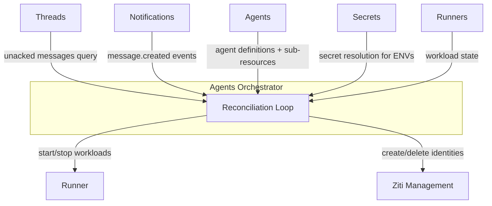
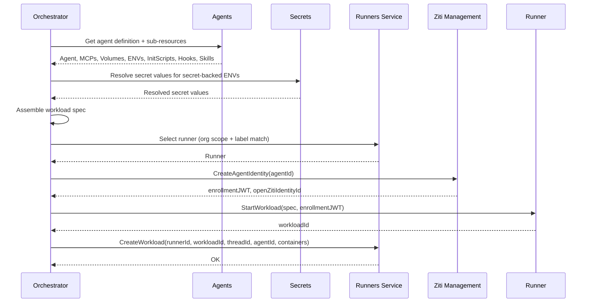
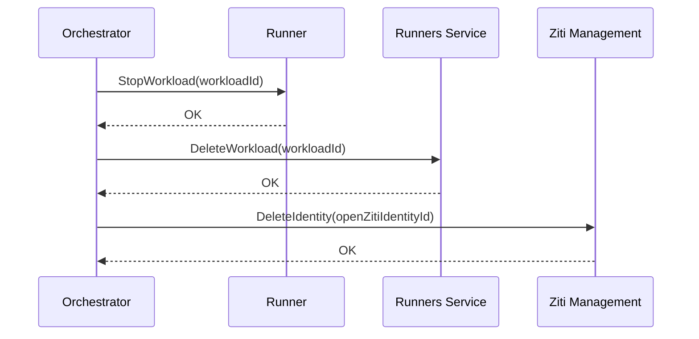

# Agents Orchestrator

## Overview

The Agents Orchestrator is a **control plane** service that ensures every thread with unacknowledged agent messages has a running agent workload processing it. It is a background reconciler — it observes desired state (threads needing agents) and actual state (running workloads via the [Runners](runners.md) service), and converges them.

The orchestrator does not decide which agent should be on a thread. It does not manage thread participants. By the time the orchestrator acts, the agent is already a participant on the thread. The orchestrator's job is: **if a thread has unacked messages for an agent participant, ensure a workload is running for that agent on that thread.**

## Dependencies

| Dependency | Usage |
|-----------|-------|
| **Threads** | Query for unacknowledged messages by agent participants |
| **Notifications** | Subscribe to `message.created` events for fast reactivity |
| **Agents** | Fetch agent definitions and sub-resources (MCPs, volumes, ENVs, init scripts, hooks, skills) |
| **Secrets** | Resolve secret values for ENVs that reference secrets |
| **[Runners](runners.md)** | Read and write workload runtime state (which workloads are running, on which runner). Query registered runners for [runner selection](runners.md#runner-selection) |
| **Runner** | Start and stop agent workloads (via OpenZiti SDK — see [Authentication](authn.md#sdk-embedding)) |
| **Ziti Management** | Create and delete OpenZiti identities for agent containers |

## Reconciliation

The orchestrator runs a reconciliation loop that continuously converges actual state toward desired state. It uses the standard platform pattern: **pull + notifications**.

### Desired State

Threads with unacknowledged messages for agent participants. The orchestrator queries Threads to discover which agents need to be running.

### Actual State

Running agent workloads. The orchestrator queries the [Runners](runners.md) service to discover what is currently running.

### Loop

1. On startup, the orchestrator subscribes to Notifications for `message.created` events and fetches the current state from Threads and the [Runners](runners.md) service.
2. **Compare:** For each agent participant with unacked messages — check if a workload is running. For each running workload — check if it still has unacked messages or recent activity.
3. **Act:**
   - **Start:** If an agent has unacked messages and no running workload → assemble workload spec → create OpenZiti identity → start workload via Runner → record workload in [Runners](runners.md) service.
   - **Stop:** If a running workload has been idle beyond the configured timeout → stop workload via Runner → remove workload from [Runners](runners.md) service → delete OpenZiti identity.
4. **Wait:** Block until a notification arrives or the poll interval expires, then repeat from step 2.

The polling loop is a consistency fallback. Notifications handle the latency-sensitive path — when a new message arrives on a thread, the `message.created` event wakes the orchestrator to re-evaluate immediately.

Follows the [Consumer Sync Protocol](notifications.md#consumer-sync-protocol) for subscribe/fetch/dedup.

### Idle Timeout

The orchestrator owns idle timeout enforcement. During each reconciliation pass, it checks running agent workloads against their last activity (last message on the thread). Agents that have been idle beyond the configured timeout are stopped via `Runner.StopWorkload` and removed from the [Runners](runners.md) service.

The agent container does not implement idle detection. It may exit naturally (process completion, crash), but the orchestrator is the authority for lifecycle management.

### OpenZiti Identity Reconciliation

In addition to agent workloads, the orchestrator reconciles OpenZiti identities:

1. Each reconciliation pass: call `ZitiManagement.ListManagedIdentities()`.
2. Compare against active workloads from the [Runners](runners.md) service.
3. Delete OpenZiti identities that have no matching running workload via `ZitiManagement.DeleteIdentity()`.

Orphaned identities arise from Runner crashes, container crashes, or orchestrator restarts. An orphaned identity with no running container is inert (the enrollment JWT has expired or the enrolled certificate is inside a stopped container), but cleanup is important for hygiene and OpenZiti Controller resource limits.

See [OpenZiti Integration — Orphan Reconciliation](openziti.md#orphan-reconciliation) for the full flow.

## Agent Start Flow

When the orchestrator decides an agent workload needs to start:

### Runner Selection

Before starting a workload, the orchestrator selects a runner. See [Runners — Runner Selection](runners.md#runner-selection) for the full algorithm. In summary: filter enrolled runners by organization scope, then by label match against the agent's `runner_labels`, then pick one at random. If no runner matches, the workload fails to schedule and the orchestrator retries on the next reconciliation pass.

### Workload Spec Assembly

The orchestrator assembles the full workload specification from multiple sources:

1. **Agent definition** (from Agents): image, compute resources, configuration.
2. **MCP servers** (from Agents): sidecar images, commands, compute resources — started as sidecars sharing the agent's network namespace. The orchestrator assigns each MCP sidecar a unique port (see [MCP — Port Allocation](mcp.md#port-allocation)).
3. **Volumes** (from Agents): persistent and ephemeral volumes, mount paths.
4. **Volume attachments** (from Agents): which volumes mount into which containers (agent, MCPs, hooks).
5. **Environment variables** (from Agents + Secrets): plain-text values from Agents, secret-backed values resolved via Secrets service at start time.
6. **Init scripts** (from Agents): shell scripts for container initialization.
7. **Hooks** (from Agents): event-driven sidecar containers.
8. **Skills** (from Agents): prompt fragments — passed as part of agent configuration, not as separate containers.
9. **OpenZiti enrollment JWT** (from Ziti Management): passed to the agent pod's Ziti sidecar container for network identity bootstrap.

The orchestrator also wires the init container flow:

- Read `init_image` from the agent definition (fall back to `DEFAULT_INIT_IMAGE`).
- Add `agyn-bin` ephemeral volume.
- Build init container with the init image.
- Set main container command to `/agyn-bin/agynd`.
- Mount `agyn-bin` in the main container.

The orchestrator is the only service that performs this assembly. The Runner receives an opaque workload spec — it does not know about agents, agent resources, or secrets.

## Agent Stop Flow

When the orchestrator decides an agent workload should stop (idle timeout exceeded):

## Leader Election

The orchestrator is deployed with 2+ replicas. Only one replica runs the reconciliation loop at a time.

| Aspect | Detail |
|--------|--------|
| Mechanism | Kubernetes Lease |
| Behavior | Leader runs the loop; followers are standby |
| Failover | On leader loss, a follower acquires the lease and resumes |

See [Control Plane & Data Plane — Reconciliation](control-data-plane.md#reconciliation) for the general pattern.

## Classification

| Aspect | Detail |
|--------|--------|
| **Plane** | Control |
| **API** | None — pure background reconciler |
| **State** | Stateless — reads/writes workload state via [Runners](runners.md) service |
| **Scaling** | Leader-elected; scales with number of agent definitions, not traffic |
| **Failure impact** | Temporary loss delays new agent starts and idle stops; already-running agents continue |

## Runner Communication

The Orchestrator communicates with runners over OpenZiti using the embedded [OpenZiti Go SDK](https://github.com/openziti/sdk-golang). It dials a specific runner by its per-runner OpenZiti service name via `zitiContext.Dial("runner-{runnerId}")`  and issues gRPC calls over the resulting connection.

This is the same protocol regardless of whether the runner is internal (in-cluster) or external (operator-managed, remote). The Orchestrator does not know or care about runner location — OpenZiti handles routing. See [OpenZiti Integration — Runner Provisioning](openziti.md#runner-provisioning).

The Orchestrator obtains its OpenZiti identity at runtime via self-enrollment — on startup, it calls Ziti Management to request an identity, writes it to ephemeral disk, and extends a lease on a timer. See [OpenZiti Integration — Service Identity Self-Enrollment](openziti.md#service-identity-self-enrollment). All other Orchestrator dependencies (Threads, Agents, Secrets, Notifications, Ziti Management) are called over Istio — standard internal service-to-service communication. See [Authentication — SDK Embedding](authn.md#sdk-embedding).
