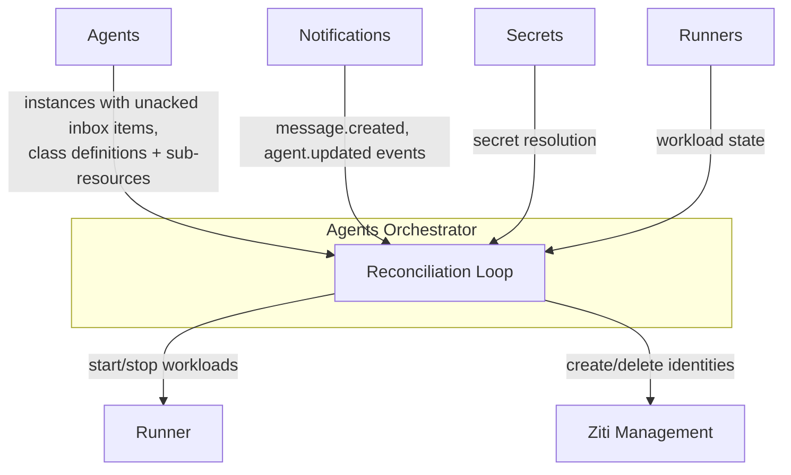
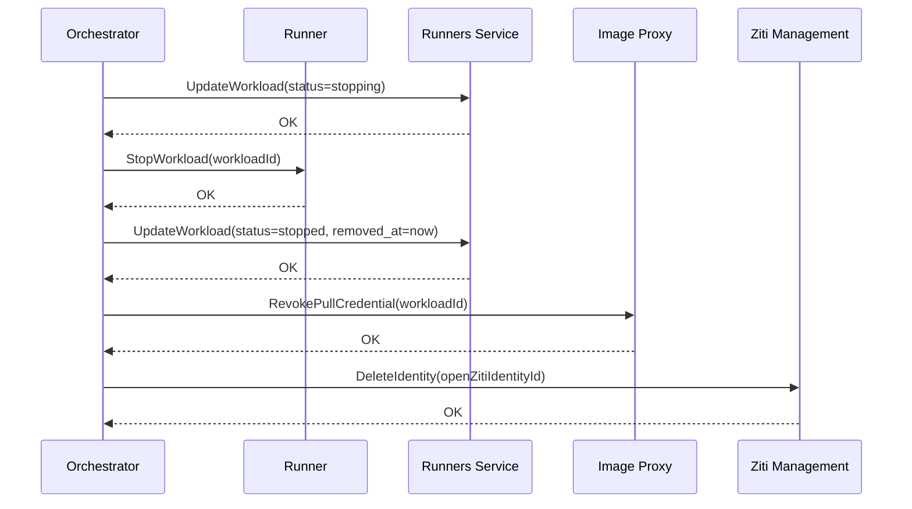

# Agents Orchestrator

## Overview

The Agents Orchestrator is a **control plane** service that ensures every [agent instance](agent-instances.md) with unacknowledged inbox items has a running workload processing it. It is a background reconciler — it observes desired state (instances needing workloads) and actual state (running workloads via the [Runners](runners.md) service), and converges them.

The orchestrator does not decide which agent participates in which thread. It does not manage thread participants or create instances. By the time the orchestrator acts, an agent instance already exists — with its own [inbox](agent-instances.md#inbox) — and something has written to it. The orchestrator's job is: **if an instance has unacked inbox items, ensure a workload is running for that instance.**

## Dependencies


```mermaid
graph TB
    subgraph "Agents Orchestrator"
        Reconciler[Reconciliation Loop]
    end

    Agents -->|instances with unacked inbox items,<br/>class definitions + sub-resources| Reconciler
    Notifications -->|message.created, agent.updated events| Reconciler
    Secrets -->|secret resolution| Reconciler
    Runners[Runners] -->|workload state| Reconciler
    Reconciler -->|start/stop workloads| Runner
    Reconciler -->|create/delete identities| ZitiMgmt[Ziti Management]
```

| Dependency | Usage |
|-----------|-------|
| **Agents Service** | List instances with unacked inbox items (the primary desired-state source). Fetch agent (class) and environment definitions with their sub-resources (volumes, MCPs, ENVs, init scripts, skills). Call `PauseInstance` when an instance cannot be recovered (start failures exhausted, volume lost, runner deprovisioned). Subscribe to `agent.updated` and `environment.updated` via Notifications to trigger [configuration-driven retry](#start-decision) |
| **Notifications** | Hold the three [cluster-wide rooms](notifications.md#cluster-wide-rooms) — `agent_instances`, `sandboxes`, `workloads` — as the [platform](#subscribing-as-the-platform). Never an inbox: what an instance was sent is the instance's business, and the wake saying one has work reaches `agent_instances` |
| **Secrets** | Resolve secret values for ENVs that reference secrets |
| **[Runners](runners.md)** | Read and write workload runtime state (which workloads are running, on which runner). Query registered runners for [runner selection](runners.md#runner-selection) |
| **Runner** | Start and stop agent workloads. List provisioned volumes for volume sync (via OpenZiti SDK — see [Authentication](authn.md#sdk-embedding)) |
| **Ziti Management** | Create and delete OpenZiti identities for agent containers |

## Reconciliation

The orchestrator runs a reconciliation loop that continuously converges actual state toward desired state. It uses the standard platform pattern: **pull + notifications**.

### Desired State

Agent instances with unacknowledged [inbox items](agent-instances.md#inbox). The orchestrator queries the [Agents Service](agents-service.md) to list instances with `unacked_count > 0` and `state = active`.

### Actual State

Running agent workloads. The orchestrator queries the [Runners](runners.md) service to discover what is currently running. Each workload record carries the `agent_instance_id` it serves.

### Loop


```mermaid
graph LR
    Subscribe[Subscribe to Notifications] --> Fetch[List instances with unacked inbox items]
    Fetch --> Compare[Compare desired vs actual]
    Compare --> Act[Start missing / Stop idle]
    Act --> Wait[Wait for notification or poll interval]
    Wait --> Fetch
```

1. On startup, the orchestrator subscribes to the three cluster-wide Notifications rooms and fetches the current state from the Agents Service and the [Runners](runners.md) service. The room set is a **constant** — see [Why the rooms are named, not derived](#why-the-rooms-are-named-not-derived).
2. **Compare:** For each `active` instance with unacked inbox items — check if a workload is running. For each running workload — check if it still has unacked items or recent activity. Instances in states `paused` or `terminated` are skipped entirely.
3. **Act:**
   - **Start:** If an instance has unacked inbox items, apply the [Start Decision](#start-decision) policy. When the policy clears a start → assemble workload spec → create OpenZiti identity → start workload via Runner → record workload in [Runners](runners.md) service.
   - **Stop:** If a running workload has been idle beyond the configured timeout → mark workload removed in [Runners](runners.md) service → stop workload via Runner → delete OpenZiti identity. The instance persists across stops (see [Agent Instances — Lifecycle](agent-instances.md#lifecycle)).
4. **Wait:** Block until a notification arrives or the poll interval expires, then repeat from step 2.

The polling loop is a consistency fallback. Notifications handle the latency-sensitive path: `message.created` and `instance.updated` on `agent_instances` wake the main loop, `sandbox.updated` on `sandboxes` wakes the sandbox loop, and `workload.status_changed` on `workloads` wakes whichever loop owns the workload that moved.

Every loop selects on both its wake channel and its ticker, so the interval remains the backstop with no extra machinery: a lost event costs latency until the next tick, never correctness.

### Why the rooms are named, not derived

The room set is three literals, fixed for the life of the process. It is deliberately **not** derived from the instances, sandboxes or organizations that exist.

A derived set cannot be made correct here. The orchestrator reconciles every instance and sandbox in the cluster, and the event announcing one in an organization it has not enumerated yet goes to a room it does not hold — Notifications is Redis pub/sub with no replay, so that event is simply dropped, and the resource waits for the reconcile tick. **The room that would have told it about the organization is the room it could not know to subscribe to.** Naming the rooms outright removes the listing, the periodic re-derivation, the resubscribe on every change, and the gap.

Follows the [Consumer Sync Protocol](notifications.md#consumer-sync-protocol) for subscribe/fetch/dedup.

### Start Decision

The orchestrator does not start a new workload on every tick that sees unacked items. It applies a retry policy derived from workload history, so a broken class configuration does not produce an infinite restart storm and a fixed configuration unblocks the instance promptly. The policy is computed entirely from the workload records in the [Runners](runners.md) service and the class's `updated_at` in [Agents Service](agents-service.md) — no retry state is persisted on the workload itself.

For each `instance_id` identified in step 2 of the loop:

```
active = Runners.ListWorkloadsByAgentInstance(
    instance_id,
    status_in: [starting, running, stopping])
if active is not empty:
    continue                                     # already starting/running — reconciliation owns it

latest = Runners.ListWorkloadsByAgentInstance(
    instance_id,
    status_in: [stopped, failed]).first()        # ordered by created_at DESC
instance = Agents.GetInstance(instance_id)
class = Agents.GetAgent(instance.agent_id)

if latest is null or latest.status == stopped:
    StartWorkload(...)                           # first attempt, or clean restart after idle stop
    continue

if class.updated_at > latest.removed_at:
    StartWorkload(...)                           # class config changed after failure → fast retry
    continue

last_stopped_at = Runners.ListWorkloadsByAgentInstance(
    instance_id,
    status_in: [stopped],
    limit: 1).first()?.created_at ?? epoch
reset_floor = max(last_stopped_at, class.updated_at, environment.updated_at)

recent_failures = Runners.ListWorkloadsByAgentInstance(
    instance_id,
    status_in: [failed],
    limit: MAX_ATTEMPTS + 1)                     # ordered by created_at DESC
consecutive_failures = count(w for w in recent_failures if w.created_at > reset_floor)

if consecutive_failures >= MAX_ATTEMPTS:
    Agents.PauseInstance(instance_id, reason="start_failures_exhausted")
    # Threads that only had this instance as an agent participant see no automatic degradation;
    # the pause blocks further workload spawns, and the class owner can inspect and resume.
    continue

backoff = BACKOFF_SCHEDULE[min(consecutive_failures - 1, len(BACKOFF_SCHEDULE) - 1)]
if now - latest.removed_at < backoff:
    continue                                     # still within backoff

StartWorkload(...)
```

**Defaults:**

| Parameter | Default | Purpose |
|-----------|---------|---------|
| `BACKOFF_SCHEDULE` | `[10s, 30s, 1m, 5m, 15m]` | Delay after the N-th consecutive failure. The final entry is repeated for subsequent failures |
| `MAX_ATTEMPTS` | `10` | Consecutive failures after which the instance is paused (`pause_reason=start_failures_exhausted`) rather than retried |

With the defaults, an unrecoverable configuration pauses the instance after roughly two hours — long enough for most human-in-the-loop fixes, short enough that a single-instance connector (e.g., [Telegram](apps/telegram-connector.md)) is not silently blocked indefinitely. Changing the schedule or the attempt cap at the orchestrator takes effect immediately for all failed workloads — no migration is needed because retry state is derived, not stored.

**Configuration-driven fast retry.** When the class or any of its sub-resources changes, Agents Service emits `agent.updated` on the `agent:{class_id}` notification room; when an environment or any of its sub-resources changes, it emits `environment.updated` on `environment:{environment_id}` (see [Agents Service — Notifications](agents-service.md#notifications)). The orchestrator wakes the main loop on each event. Because the start decision compares both `class.updated_at` and `environment.updated_at` against `latest.removed_at`, the next tick retries with `consecutive_failures = 1` for every affected instance — including every instance of every class running a repaired environment, which is why the environment event is published once rather than fanned out per agent. No backoff-reset API and no mutation of terminal records is required.

**Terminal escape.** When `consecutive_failures >= MAX_ATTEMPTS`, the orchestrator calls `Agents.PauseInstance` with a reason and stops retrying. `paused` instances are skipped by step 2 on subsequent ticks; their inboxes continue to accept writes so no data is lost. A class owner (or the app that owns the instance) can inspect the failure, fix the config, and `ResumeInstance` — the fast-retry path picks up automatically on the next tick.

### Idle Timeout

The orchestrator owns workload idle timeout enforcement. During each reconciliation pass, it queries the [Runners](runners.md) service for running workloads (where `removed_at IS NULL`) and checks each workload's `last_activity_at` timestamp against the class's `idle_timeout` (from the [Agent resource definition](resource-definitions.md#agent), default `"5m"`). Workloads where `now - last_activity_at > idle_timeout` are stopped — see [Agent Stop Flow](#agent-stop-flow). The underlying instance is not affected; it stays `active` and a new workload will start on the next inbox item.

Instance-level idle timeout (`instance_idle_ttl`, default `30d`) is enforced by the [Agents Service](agent-instances.md#lifecycle) — not the Orchestrator — and transitions the instance to `paused`.

The `last_activity_at` timestamp is maintained by [`agynd`](agynd-cli.md), which calls `TouchWorkload` on the [Runners](runners.md) service (via [Gateway](gateway.md)) every 10 seconds while the agent is actively processing. When the agent is idle (waiting for new messages), `agynd` stops sending keepalives, and the idle clock begins. This ensures long-running tasks (which may take hours) are never prematurely terminated.

The agent container does not implement idle detection or self-termination. It may exit naturally (process completion, crash), but the orchestrator is the authority for lifecycle management.

### OpenZiti Identity Reconciliation

In addition to agent workloads, the orchestrator reconciles OpenZiti identities:

1. Each reconciliation pass: call `ZitiManagement.ListManagedIdentities()`.
2. Compare against active workloads from the [Runners](runners.md) service.
3. Delete OpenZiti identities that have no matching running workload via `ZitiManagement.DeleteIdentity()`.

Orphaned identities arise from Runner crashes, container crashes, or orchestrator restarts. An orphaned identity with no running container is inert (the enrollment JWT has expired or the enrolled certificate is inside a stopped container), but cleanup is important for hygiene and OpenZiti Controller resource limits.

See [OpenZiti Integration — Orphan Reconciliation](openziti.md#orphan-reconciliation) for the full flow.

## Agent Start Flow

When the orchestrator decides an agent workload needs to start:

```mermaid
sequenceDiagram
    participant O as Orchestrator
    participant T as Agents
    participant S as Secrets
    participant IM as Images
    participant IP as Image Proxy
    participant RS as Runners Service
    participant ZM as Ziti Management
    participant R as Runner

    O->>T: Get instance + class definition + environment, with sub-resources of both
    T-->>O: Instance, Agent (class), Environment, MCPs, Volumes, ENVs, InitScripts, Skills
    O->>S: Resolve secret values for secret-backed ENVs
    S-->>O: Resolved secret values
    O->>IM: Resolve image references (environment + MCPs)
    IM-->>O: Proxy references
    O->>IP: MintPullCredential(workload, images)
    IP-->>O: Username + password
    O->>O: Generate workload_key and volume_key per persistent volume
    O->>O: Assemble workload spec — embed workload_key and volume_keys as labels
    O->>RS: Resolve runner + catalog names (environment's runner; flavor and storage classes by name)
    RS-->>O: Runner, resolved flavor, resolved storage classes
    O->>ZM: CreateAgentIdentity(instanceId, workloadId)
    ZM-->>O: enrollmentJWT, openZitiIdentityId
    O->>RS: CreateWorkload(id=workload_key, runnerId, instanceId, agentId, status=starting)
    RS-->>O: OK
    O->>RS: CreateVolume(id=volume_key, volumeId, instanceId, runnerId, agentId, size_gb, storage_class, status=provisioning) [per persistent volume]
    RS-->>O: OK
    O->>R: StartWorkload(spec with labels, enrollmentJWT, image_pull_credentials)
    R-->>O: instance_id
    O->>RS: UpdateWorkload(instance_id=instance_id)
    RS-->>O: OK
```

Records are created in the Runners service before `StartWorkload` is called — this prevents the reconciliation loop from treating the workload or PVCs as orphans during the start sequence. The `workload_key` and `volume_key`s are Orchestrator-generated UUIDs embedded as labels in the spec. The runner assigns its own `instance_id` (Pod name for the workload, PVC name for volumes) and returns it. The workload `instance_id` is updated immediately; volume `instance_id`s are set by the reconciliation loop when it finds the PVCs by their `volume_key` labels.

The workload stays in `status=starting` after `StartWorkload` returns. The transition to `running` is owned by [Workload Reconciliation](#workload-reconciliation), which observes container health and promotes `starting → running` only once all init containers have completed and main containers are in `running` state. The same loop detects start-time failures (image pull errors, config errors, init retries) and promotes `starting → failed` — see the full transition table below.

### Runner Selection

Before starting a workload, the orchestrator selects a runner:

1. **Check for existing volumes** — call `Runners.ListVolumesByAgentInstance(agent_instance_id)` to find any active volumes already provisioned for this instance. If any exist, the runner is predetermined: all volumes for an owner reside on the same runner (recorded as `runner_id` on each volume record). A sandbox workload runs the same check through `Runners.ListVolumes(owner_kind=sandbox, owner_id=<sandbox_id>)` — pinning follows the owner, not the owner's kind.
2. **Validate the predetermined runner** — call `Runners.GetRunner(runner_id)` and verify its status is `enrolled`. If the runner is no longer registered or not enrolled, the instance cannot be recovered: call `Agents.PauseInstance(instance_id, reason="runner_deprovisioned")` and abort the start sequence.
3. **No existing volumes** — the runner is the one referenced by the [Environment](resource-definitions.md#environment) (`runner_id`). Validate that the runner is `enrolled`, then resolve catalog names against the runner's [reported catalog](runners.md#runner-catalog): the environment's flavor name (or the runner's `default` flavor when the environment names none), the storage class name of every persistent volume (or the runner's `default` class when a volume names none), and every capability the class requires (see [Runner Selection](runners.md#runner-selection)). If any name does not resolve, the workload fails to schedule and the orchestrator retries on the next reconciliation pass — the unresolved reference is surfaced on the environment as unschedulable in Console and CLI.
4. **Volume/runner conflict** — if existing volumes pin the instance to a runner different from the environment's runner (the environment or its runner reference changed after volumes were provisioned), the instance cannot be recovered on the new runner: call `Agents.PauseInstance(instance_id, reason="runner_conflict")` and abort the start sequence.

### Workload Spec Assembly

The orchestrator assembles the full workload specification from multiple sources:

1. **Agent definition** (from Agents): configuration, plus the referenced [Environment](resource-definitions.md#environment). The environment supplies the workspace image, the agent runtime image, and the runner; its flavor name, resolved against the runner's [reported catalog](runners.md#runner-catalog) during [runner selection](#runner-selection), supplies the compute resources. Environment-targeted volumes, MCPs, init scripts, ENVs, and egress rule attachments are collected alongside the agent's own. A [sandbox](resource-definitions.md#sandbox) workload has no agent: the environment's contributions are the whole of its configuration.
2. **Capabilities** (from Agents): named platform capabilities (e.g., `docker`). The orchestrator includes the capability list in the workload spec. The runner resolves each capability to its configured implementation — injecting the appropriate sidecars and environment variables. See [Resource Definitions — Capabilities](resource-definitions.md#capabilities) and [k8s-runner — Capability Implementations](k8s-runner.md#capability-implementations).
3. **MCP servers** (from Agents): sidecar images, commands, compute resources — started as sidecars sharing the workload's network namespace. Environment-level and agent-level MCPs are merged by name, the agent-level definition winning; the merged set runs in agent workloads, and the environment-level set alone runs in sandboxes. The orchestrator assigns each MCP sidecar a unique port (see [MCP — Port Allocation](mcp.md#port-allocation)).
4. **Volumes** (from Agents): the environment's volumes and each MCP's own, with their mount paths. Each persistent volume carries its resolved [storage class](resource-definitions.md#storage-class) name — the definition's requested class, or the runner's `default` when none is set. The runner maps the class name to its backing storage. An environment declaring no volumes produces a workload with no mounts beyond the platform's own — there is no implicit workspace volume for either agents or sandboxes.
5. **Volume mounts** (derived): the environment's volumes mount into the main container at their declared paths. Each MCP sidecar mounts its own volumes, plus every environment volume named in its [`shared_volumes`](resource-definitions.md#mcp) — at the same path the main container sees it, resolved by name against the environment being assembled. A name that does not resolve, or a mount path colliding with one of the sidecar's own volumes, fails scheduling with a descriptive error. Pod-level volume names are generated by the orchestrator, so an MCP volume and an environment volume may share a name without conflict.
6. **Environment variables** (from Agents + Secrets): plain-text values passed as-is; secret-backed values resolved via Secrets service at assembly time. Each resolved value is injected into only the container it belongs to — agent and environment ENVs into the main container, MCP ENVs into the respective MCP sidecar. No container receives another container's resolved values. ENVs are never exposed via the Agents Service API to running workloads — injection at assembly time is the only delivery path.
7. **Init scripts** (from Agents): shell scripts for main container initialization — the environment's, then the agent's. Fetched by `agynd` at startup via the Gateway. MCP init scripts are not currently supported — their containers are responsible for their own initialization logic via their entrypoint.
9. **Skills** (from Agents): prompt fragments. Fetched by `agynd` at startup via the Gateway and written to the filesystem in the layout expected by the agent CLI.
10. **OpenZiti enrollment JWT** (from Ziti Management): injected as `ZITI_ENROLLMENT_JWT` into the **Ziti sidecar container**. The sidecar exchanges the JWT for an x509 certificate at startup, enrolls the OpenZiti identity, and enables TPROXY for the pod's network namespace. MCP sidecars share the pod network and can reach `.agyn` services via the sidecar, but receive no agent secrets or configuration — their env vars are injected separately and contain only what they need.
11. **Image references and pull credential** (from Images + Image Proxy): every image in the spec — the environment's workspace and agent runtime images, and each MCP's — is resolved through the [Images](images-service.md) service and rewritten to an [image proxy](image-proxy.md) reference. The orchestrator then mints one short-lived pull credential scoped to this workload and the images it may pull, and revokes it when the workload stops. No registry address or upstream credential appears in the workload spec.
12. **Egress CA public certificate** (from cert-manager `egress-ca` Secret in the platform namespace): bytes inlined into the workload spec at the path `/etc/agyn/egress-ca/ca.crt`, mounted into every workload container (agent, MCP sidecars). See [Egress CA Distribution](#egress-ca-distribution).
12b. **Persistent shells** (from the environment): the environment's [`persistent_shells`](resource-definitions.md#environment) is recorded on the [workload record](runners.md#workload-resource) at `CreateWorkload`. Nothing in the container spec changes — [`tmux` ships into every workload](agent-init.md#tmux) regardless, because an image cannot be re-provisioned to acquire a multiplexer later. What the value decides is the command the [Terminal Proxy](terminal-proxy.md#persistent-shells) binds, and it reads it from the workload rather than from the environment so that an edit applies at the next start.

13. **LLM mode** (from the environment + LLM service): when the environment's [`llm_mode`](resource-definitions.md#environment) is `native`, the orchestrator asks the [LLM service](llm.md#subscription-management) which vendors have a [Subscription](providers.md#subscription) attached at the agent or environment scope, and for each one adds an `llm-native-<vendor>` role attribute to the workload's OpenZiti identity and injects that vendor's [placeholder credential](providers.md#vendors) into the main container. The role attributes are the only thing that opts a workload into [vendor interception](llm-proxy.md#vendor-intercept-services); no OpenZiti service or policy is created per workload, per environment, or per attachment. In `platform` mode neither is added and vendor traffic is not intercepted.

    Only **environment-variable** placeholders are the orchestrator's to inject; those must sit on the container spec, because an interactive sandbox session inherits it and nothing else. A vendor whose CLI reads its credential from a **file** is [`agynd`](agynd-cli.md#native-mode-configuration)'s to prime — the path is CLI-specific and resolves against `HOME`, neither of which the orchestrator knows. Which kind a vendor uses arrives on the [attachment listing](llm.md#subscription-management); the orchestrator holds no vendor table of its own. See [Placeholder Delivery](providers.md#placeholder-delivery).

    A `native` environment with **no** subscription attached for any vendor fails assembly with a descriptive error rather than starting a workload whose agent CLI would fail on its first model call. The condition is visible before traffic exists, so it is reported then.

In addition to user-defined environment variables, the orchestrator injects **platform-managed environment variables** into containers:

| Variable | Injected into | Description |
|----------|---------------|-------------|
| `ZITI_ENROLLMENT_JWT` | Ziti sidecar container | OpenZiti enrollment token. The sidecar exchanges this for an x509 certificate at startup and enables TPROXY for the pod |
| `GATEWAY_ADDRESS` | Agent container | Gateway endpoint (e.g., `gateway.agyn`). `agynd` connects here for all platform API calls |
| `AGENT_INSTANCE_ID` | Agent container | [Agent instance](agent-instances.md) ID this workload is processing. `agynd` uses this to fetch inbox items, ack them, and identify itself in platform calls. Also carries the workload's OpenZiti identity (created per-workload but scoped to the instance). Distinct from the runner-local `instance_id` (Pod name) on [Runners](runners.md) records |
| `AGENT_ID` | Agent container | The class this instance was spawned from. Used by `agynd` when fetching class configuration (`GetAgent`, `ListSkills`, etc.) |
| `WORKLOAD_ID` | Agent container | Workload UUID (`workload_key`) for this execution. Used by `agynd` for activity keepalives and span attribution |
| `AGENT_MCP_SERVERS` | Agent container | MCP name-to-port mapping (see [MCP — Port Allocation](mcp.md#port-allocation)) |
| `LLM_MODE` | Agent container | `platform` or `native`, from the environment's [`llm_mode`](resource-definitions.md#environment). Tells [`agynd`](agynd-cli.md#llm-endpoint-configuration) whether to write endpoint configuration at all. Delivered as an environment variable rather than fetched, so it is knowable in a sandbox's holder mode where nothing is being prepared |
| `LLM_MODEL_NAME` | Agent container | The agent's [`model_name`](resource-definitions.md#agent) in `native` mode; absent otherwise, and absent for sandboxes, which pin nothing |
| Vendor placeholder credential | Agent container | One per vendor whose subscription resolved *and* whose placeholder is an environment variable — `CLAUDE_CODE_OAUTH_TOKEN` for `anthropic`. A correctly-shaped dummy that lets the agent CLI start; the [LLM Proxy](llm-proxy.md#the-container-still-holds-a-placeholder) discards it and injects the real token. **Container-level, not `agynd`-level** — a [sandbox](../product/sandboxes/sandboxes.md) shell is started by the runner's `Exec` against the pod and inherits the container spec's environment, never one `agynd` assembled. File-kind placeholders go the other way; see [Placeholder Delivery](providers.md#placeholder-delivery) |
| `MCP_PORT` | Each MCP sidecar | Assigned localhost port (see [MCP — Port Allocation](mcp.md#port-allocation)) |
| `SSL_CERT_FILE` | Agent + MCP containers | Path to the Egress CA bundle (`/etc/agyn/egress-ca/ca.crt`). Recognized by `curl`, Python `requests`/`httpx`/`urllib3` |
| `REQUESTS_CA_BUNDLE` | Agent + MCP containers | Same path. Recognized by Python `requests` |
| `NODE_EXTRA_CA_CERTS` | Agent + MCP containers | Same path. Recognized by Node.js |
| `CURL_CA_BUNDLE` | Agent + MCP containers | Same path. Recognized by `curl` |
| `SSL_CERT_DIR` | Agent + MCP containers | Directory `/etc/agyn/egress-ca`. Recognized by Go's `crypto/x509` |

`HOME` and `WORKSPACE_DIR` are not platform-managed and are not reserved. The agent container uses whatever the image defines, or what the user sets via an [ENV](resource-definitions.md#env) resource. Agent-specific fallbacks (for example, Codex needing a writable `HOME`) are handled by [`agynd`](agynd-cli.md), not the orchestrator.

The orchestrator also wires the init container flow:

- Add the `agyn` ephemeral volume.
- Build the two **platform init containers** from the orchestrator's configured `agynd-cli-init` and `agyn-cli-init` references. They are injected into every workload, including sandboxes.
- Build the **agent runtime init container** from the environment's agent runtime image, when it names one. Its `config.json` tells `agynd` which agent CLI to spawn — the orchestrator reads neither.
- Set main container command to `/agyn/bin/agynd`.
- Mount `agyn` in the main container.

See [Agent Init Container](agent-init.md).

The orchestrator is the only service that performs this assembly. The Runner receives an opaque workload spec — it does not know about agents, agent resources, or secrets.

## Agent Stop Flow

When the orchestrator decides an agent workload should stop (idle timeout exceeded):


```mermaid
sequenceDiagram
    participant O as Orchestrator
    participant R as Runner
    participant RS as Runners Service
    participant IP as Image Proxy
    participant ZM as Ziti Management

    O->>RS: UpdateWorkload(status=stopping)
    RS-->>O: OK
    O->>R: StopWorkload(workloadId)
    R-->>O: OK
    O->>RS: UpdateWorkload(status=stopped, removed_at=now)
    RS-->>O: OK
    O->>IP: RevokePullCredential(workloadId)
    IP-->>O: OK
    O->>ZM: DeleteIdentity(openZitiIdentityId)
    ZM-->>O: OK
```

The pull credential is revoked alongside the OpenZiti identity — both are per-workload grants that outlive nothing. A missed revocation is bounded by the credential's TTL rather than left open indefinitely. See [Image Proxy — Pull Credentials](image-proxy.md#pull-credentials).

`status=stopping` is set before the runner call so the console can show the workload as being stopped. `removed_at` is set after `StopWorkload` succeeds — it reflects the actual removal time. The metering sampling loop picks up the workload on its next tick (since `removed_at > last_metering_sampled_at`) and emits the tail sample. The workload record is retained for audit history.

## Layout Snapshot Before Stop

Stopping a **sandbox** workload has one extra step, taken before `StopWorkload` and after `status=stopping`: the orchestrator reads the working directory of every [shell](terminal-proxy.md#persistent-shells) in the container and writes them onto the sandbox's [layouts](resource-definitions.md#sandbox-layout) through `SetSandboxLayoutDirectories`.

**Here, because nowhere else can be.** The value is only ever needed once the container is gone, and the last moment it can be read is the moment before it goes. A client cannot take it: a browser tab detaches by being closed, reloaded, or losing its network, and none of those give it a turn to act. And no client is necessarily present at all — an idle stop happens precisely because nothing has been attached for some time.

The snapshot is **best-effort and never blocks the stop.** It is bounded by a short timeout, and a failure — an unreachable runner, a container already gone, a workload with no shells — is logged and the stop proceeds. A sandbox that lost its layout directories reopens its tabs where they were last recorded, or at the image's default; a sandbox that failed to stop because a bookkeeping read timed out would be a worse trade.

Stops the platform did not initiate get no snapshot: an evicted pod, a node failure, or a crash leaves the previously recorded value. This is the reason the field is described as last *known* rather than last used.

Agent workloads are skipped — they have no layout and no shells worth recording.

## Leader Election

The orchestrator is deployed with 2+ replicas. Only one replica runs the reconciliation loop at a time.

| Aspect | Detail |
|--------|--------|
| Mechanism | Kubernetes Lease |
| Behavior | Leader runs the loop; followers are standby |
| Failover | On leader loss, a follower acquires the lease and resumes |

See [Control Plane & Data Plane — Reconciliation](control-data-plane.md#reconciliation) for the general pattern.

## Classification

| Aspect | Detail |
|--------|--------|
| **Plane** | Control |
| **API** | None — pure background reconciler |
| **State** | Stateless — reads/writes workload state via [Runners](runners.md) service |
| **Scaling** | Leader-elected; scales with number of agent definitions, not traffic |
| **Failure impact** | Temporary loss delays new agent starts and idle stops; already-running agents continue |

## Metering

The Orchestrator emits usage samples to the [Metering Service](metering.md) on a fixed interval (default 60 seconds). The sampling loop runs independently of the reconciliation loop and covers two resource types: compute for running workloads and storage for persistent volumes.

### Sampling State

Metering state is stored in the [Runners](runners.md) service alongside the workload and volume records — the Orchestrator is stateless and delegates all persistence there.

| Field | Description |
|-------|-------------|
| `last_sampled_at` | Timestamp through which usage has been recorded. NULL if the resource has never been sampled |
| `removed_at` | When the resource was stopped or deleted. NULL if still active |

### Sampling Algorithm

On each tick:

1. Fix `tick_time = now()` once at the start of the iteration. All interval calculations in this tick use this value.
2. Call `ListWorkloads(pending_sample: true)` and `ListVolumes(pending_sample: true)` on the [Runners](runners.md) service. Returns only resources where `removed_at IS NULL OR removed_at > last_metering_sampled_at` — active resources and stopped resources with a pending tail sample. The filter is applied in the DB.
3. For each resource, compute the usage record:
   - `interval_start = last_metering_sampled_at ?? created_at`
   - `interval_end = removed_at ?? tick_time`
   - `duration_s = interval_end − interval_start`
   - `value = allocated × duration_s`
   - `timestamp = interval_start` — used as the Metering record timestamp and partition key
4. Publish all records to the [Metering Service](metering.md) in a single batch call.
5. On success: call `BatchUpdateWorkloadSampledAt` and `BatchUpdateVolumeSampledAt` with `{id → interval_end}` for all successfully published resources.

The publish-then-batch-update ordering ensures a failed publish leaves all state unchanged. On retry, `interval_start` is unchanged (same `last_sampled_at`) but `interval_end` advances to the new `tick_time`, producing a longer interval and a larger value. The idempotency key (derived from `resource_id + interval_start`) is the same, so the Metering Service upserts the existing event with the revised value. This means retries count usage precisely — no time is lost between a failed attempt and its retry. See [Metering — Deduplication](metering.md#deduplication).

If the Orchestrator crashes, gaps in usage data equal the downtime duration. Missed intervals are not backfilled.

### Records

**Compute** — one batch per running workload each interval:

| unit | value | labels | idempotency_key |
|------|-------|--------|-----------------|
| `FLAVOR_SECONDS` | interval_s | resource_id=workload_id, resource=workload, identity_id, identity_type=agent, flavor, runner_id | deterministic(workload_id+interval_start) |

The flavor is the one recorded on the workload at start time, resolved from the environment against the runner's [reported catalog](runners.md#runner-catalog). It is read from the workload record rather than re-resolved, so a workload keeps billing the flavor it actually started on even after the environment is repointed or the catalog entry changes.

`runner_id` accompanies it because a flavor name is only meaningful against the runner that reported it — two runners may both declare `ram-2gb` with different resources.

Every started workload carries a flavor. An agent workload takes it from the agent's [environment](resource-definitions.md#environment), which is required; a [sandbox](../product/sandboxes/sandboxes.md) takes it from the environment it runs; and a flavor name that does not resolve against the runner's catalog fails scheduling rather than starting without one. There is no unmetered compute — a workload that emitted no record would be one that never ran.

**Storage** — one record per persistent volume each interval:

| unit | value | labels | idempotency_key |
|------|-------|--------|-----------------|
| `GB_SECONDS` | size_gb × interval_s | resource_id=**provisioned volume id**, resource=volume, identity_id, identity_type, kind=storage | deterministic(provisioned volume id+interval_start) |

`resource_id` and the idempotency key are the [Runners](runners.md#volume-resource) record's `id`, not the Agents service `volume_id`. One definition backs one disk per owner, so keying on the definition would merge every owner's storage into a single series and collide their idempotency keys interval by interval. `identity_id` and `identity_type` name the owner — the agent instance, or the sandbox for `owner_kind=sandbox`.

`size_gb` comes from the actual volume record in the [Runners](runners.md) service, not the volume definition in the Agents service. Idempotency keys are derived deterministically — if the Metering Service call fails and the Orchestrator retries, duplicate records are dropped by the Metering Service without error. See [Metering — Deduplication](metering.md#deduplication).

## Workload Reconciliation

The Orchestrator reconciles workload state on a fixed interval (default 60 seconds), independently of the main reconciliation loop. The [Runners](runners.md) service is the source of truth — workload records are created there by the Orchestrator when a workload starts. The reconciliation loop syncs actual workload state on each runner against those records.

On each tick, for each enrolled runner:

1. Call `Runners.ListWorkloads(runner_id, status_in: [starting, running, stopping])` — only non-terminal records. Historical stopped/failed workloads are excluded; they need no reconciliation.
2. Call `Runner.ListWorkloads()` to get workloads actually running on the runner.
3. For each workload still present on the runner, call `Runner.InspectWorkload(instance_id)` to refresh container state (`status`, `reason`, `message`, `exit_code`, `restart_count`, `started_at`, `finished_at`). This is the input to the health classification below.
4. Match by `workload_key` (the label set on the Pod at creation time, equal to the Runners service record `id`) and reconcile. Every `Runners.UpdateWorkload` call in this step also persists the refreshed container list so the Console sees runtime state (`ImagePullBackOff`, `CrashLoopBackOff`, `OOMKilled`, exit codes) within one interval:

| Runners service status | On runner | Container health | Action |
|------------------------|-----------|------------------|--------|
| `starting` | yes | all init containers completed and all main containers in `running` | `UpdateWorkload(status=running, containers=...)` |
| `starting` | yes | init or main container `waiting` with `reason ∈ {ImagePullBackOff, ErrImagePull}` for ≥ `START_GRACE_S` | mark failed (`failure_reason=image_pull_failed`); `Runner.StopWorkload` |
| `starting` | yes | main container `waiting` with `reason ∈ {CreateContainerConfigError, CreateContainerError, InvalidImageName}` for ≥ `START_GRACE_S` | mark failed (`failure_reason=config_invalid`); `Runner.StopWorkload` |
| `starting` | yes | init container `terminated` with `exit_code ≠ 0` and `restart_count ≥ INIT_RETRY_THRESHOLD` | mark failed (`failure_reason=start_failed`); `Runner.StopWorkload` |
| `starting` | yes | still progressing within grace (`ContainerCreating`, `PodInitializing`, etc.) | `UpdateWorkload(containers=...)` (no status change) |
| `starting` | no | — | mark failed (`failure_reason=start_failed`) — `StartWorkload` failed or runner lost the pod |
| `running` | yes | main container `reason=CrashLoopBackOff` and `restart_count ≥ CRASHLOOP_THRESHOLD` | mark failed (`failure_reason=crashloop`); `Runner.StopWorkload` |
| `running` | yes | healthy | `UpdateWorkload(containers=...)` (no status change) |
| `running` | no | — | mark failed (`failure_reason=runtime_lost`) — workload crashed or was lost |
| `stopping` | yes | — | retry `Runner.StopWorkload` |
| `stopping` | no | — | `UpdateWorkload(status=stopped, removed_at=now)` |
| not in Runners service | yes | — | orphan — `Runner.StopWorkload` |

"Mark failed" is shorthand for:

```
Runners.UpdateWorkload(
    status=failed,
    removed_at=now,
    failure_reason=<enum>,
    failure_message=<copied from the offending container's reason/message>,
    containers=<refreshed list>)
```

After `Runner.StopWorkload` completes, the Orchestrator calls `ZitiManagement.DeleteIdentity(openZitiIdentityId)` to release the agent's OpenZiti identity, matching the cleanup path of [Agent Stop Flow](#agent-stop-flow).

**Health detection thresholds:**

| Threshold | Default | Purpose |
|-----------|---------|---------|
| `START_GRACE_S` | 60 | Time allowed for image pull and container creation before a waiting container is considered unrecoverable. Measured as `now - workload.created_at`, since `container.started_at` is NULL until the container first enters `running` |
| `INIT_RETRY_THRESHOLD` | 3 | Init container retry count above which the workload is considered unable to initialize |
| `CRASHLOOP_THRESHOLD` | 3 | Main container `restart_count` at which a `CrashLoopBackOff` is considered unrecoverable. The K8s `CrashLoopBackOff` reason is the primary signal; the count threshold guards against single-flake restarts |

Failing the workload here is the *only* source of the `failed` status — once written, the record is terminal. Retry of the instance is the responsibility of the main loop's [Start Decision](#start-decision), which reads these records to compute backoff and decide when (or whether) to start a new workload.

## Volume Reconciliation

The Orchestrator reconciles volume state on a fixed interval (default 60 seconds). The [Runners](runners.md) service is the source of truth — volume records are created there by the Orchestrator when a workload starts. The reconciliation loop syncs actual PVC state on each runner against those records and enforces TTL.

On each tick, for each enrolled runner:

1. Call `Runners.ListVolumes(runner_id, status_in: [provisioning, active, deprovisioning])` — only non-terminal records. Historical deleted/failed volumes are excluded; they need no reconciliation.
2. Call `Runner.ListVolumes()` to get PVCs actually present on the runner. Each entry includes `instance_id` (PVC name) and `volume_key` label (set at PVC creation time). Match against Runners service records by `volume_key`.
3. Reconcile:

| Runners service status | Present on runner | Action |
|------------------------|-------------------|--------|
| `provisioning` | yes | `UpdateVolume(status=active)` — PVC was created by `StartWorkload` |
| `provisioning` | no | no-op — `StartWorkload` may still be in progress; `failed` after workload reaches `failed` |
| `active` | yes | check TTL — if `volume.ttl` is set and no workload for this owner has been running or stopping since at least `ttl` ago (derived from `removed_at` of the owner's most recent workload): `UpdateVolume(status=deprovisioning)` → `Runner.RemoveVolume`; otherwise no-op |
| `active` | no | `UpdateVolume(status=failed)` → for an agent-instance owner, `Agents.PauseInstance(agent_instance_id, reason="volume_lost")` — PVC was lost or deleted externally (e.g., runner deprovisioned). The instance's inbox keeps accepting writes; the owner can inspect and resume (state starts fresh) or terminate. A sandbox owner has no inbox to protect: the loss is surfaced on the sandbox and the next `EnsureSandboxRunning` provisions a fresh volume |
| `deprovisioning` | yes | retry `Runner.RemoveVolume` |
| `deprovisioning` | no | `UpdateVolume(status=deleted, removed_at=now)` |
| not in Runners service | yes | orphan — `Runner.RemoveVolume` |

TTL is checked for `active` volumes whose owner has no running workload. TTL is read from the Agents service [Volume](resource-definitions.md#volume) definition — the environment's or the MCP's. The clock starts from `removed_at` of the owner's most recent workload, available from `Runners.ListWorkloadsByAgentInstance` (or the sandbox-owner equivalent). Volumes with `ttl: null` are never expired automatically.

Terminating a sandbox deletes every volume owned by it regardless of `ttl` — the sandbox record is the lifetime bound for its storage, and its own [TTL](resource-definitions.md#sandbox) is what governs. Deleting a volume *definition* likewise marks every disk provisioned from it for deprovisioning, across all owners.

### Relationship to Metering

The metering sampling loop reads volumes from the Runners service and uses `last_metering_sampled_at` and `removed_at` to compute intervals. It samples `active` and `deprovisioning` volumes; `deleted` and `failed` volumes with a pending tail sample are also included until fully sampled.

## Runner Communication

The Orchestrator communicates with runners over OpenZiti using the embedded [OpenZiti Go SDK](https://github.com/openziti/sdk-golang). It dials a specific runner by its per-runner OpenZiti service name via `zitiContext.Dial("runner-{runnerId}")`  and issues gRPC calls over the resulting connection.

This is the same protocol regardless of whether the runner is internal (in-cluster) or external (operator-managed, remote). The Orchestrator does not know or care about runner location — OpenZiti handles routing. See [OpenZiti Integration — Runner Provisioning](openziti.md#runner-provisioning).

The Orchestrator obtains its OpenZiti identity at runtime via self-enrollment — on startup, it calls Ziti Management to request an identity, writes it to ephemeral disk, and extends a lease on a timer. See [OpenZiti Integration — Service Identity Self-Enrollment](openziti.md#service-identity-self-enrollment). All other Orchestrator dependencies (Threads, Agents, Secrets, Notifications, Ziti Management) are called over Istio — standard internal service-to-service communication. See [Authentication — SDK Embedding](authn.md#sdk-embedding).

## Authorization

Most of what the Orchestrator calls is an internal-only RPC carrying no caller identity at all, gated by [Istio `AuthorizationPolicy`](authz.md#internal-rpc-authorization) restricted to the Orchestrator's Kubernetes ServiceAccount. Runners and Agents read an absent `x-identity-id` as exactly that — a platform call, served without the per-organization filtering a principal's call receives.

This applies to workload and volume reconciliation reads on Runners, the metering sampling loop, [start decision](#start-decision) reads, [runner selection](#runner-selection), [workload spec assembly](#workload-spec-assembly), `ListInstances` / `PauseInstance` on the Agents Service, secret resolution on Secrets, and identity lifecycle on Ziti Management. The user-facing variants of these RPCs (Gateway-exposed, OpenFGA-checked) are unrelated — the Orchestrator never traverses the Gateway.

### Subscribing as the platform

[Notifications](notifications.md) is the exception, and it cannot be served the same way: it authorizes every room against a caller, so it has no reading of an absent identity to fall back on. The Orchestrator therefore identifies itself there — `x-identity-id` set to the [platform identity](identity-service.md), `x-identity-type: platform` — and Notifications settles that claim against `admin` on `cluster:global` rather than believing the header. It is the same identity [Identity](identity-service.md) registers from `PLATFORM_IDENTITY_ID` and grants cluster admin at startup; the Orchestrator reads the id from the same configuration value.

That grant is what admits it to the three [cluster-wide rooms](notifications.md#cluster-wide-rooms), which carry every organization's lifecycle and are the platform's alone. It is deliberately **not** admitted to the identity-keyed rooms: `instance_inbox:`, `thread_participant:` and `sandbox_owner:` stay closed to it. The wake saying an instance has work waiting reaches `agent_instances`, which [Agents](agents-service.md) publishes `message.created` to alongside the instance's own inbox — carrying ids and a source kind, never the message — so the Orchestrator learns an inbox is non-empty without ever being able to read one.

**This replaced borrowing a principal's identity.** The Orchestrator had no way to say what it was, so it named one of the agent instances it reconciles — electing one per organization and setting that instance's id as its own — to pass checks written for that instance. It worked for the instance's own rooms and could never work for the organization-scoped sandbox room, since an instance is a `member` of its organization and that room wants `can_list_sandboxes`; the denial retried every thirty seconds for the life of the process, and the sandbox loop fell back to its poll interval.

## Egress CA Distribution

The orchestrator distributes the [Egress CA](egress-gateway.md#egress-ca) public certificate to every agent workload so the agent's HTTP clients trust the leaf certificates the [Egress Gateway](egress-gateway.md) presents during TLS interception.

| Step | Detail |
|---|---|
| Source | Kubernetes Secret `egress-ca` in the platform namespace, populated by cert-manager (see [Egress Gateway — Egress CA](egress-gateway.md#egress-ca)). The orchestrator reads the `tls.crt` key |
| Transport | Included in `StartWorkloadRequest.inline_files` as `"/etc/agyn/egress-ca/ca.crt": <bytes>`. See [Runner — Inline Files](runner.md#inline-files) |
| Mount | The runner materializes the entry as a per-pod Kubernetes Secret + projected volume; mounted read-only at `/etc/agyn/egress-ca/` in every agent-pod container (agent, MCP sidecars) |
| Trust hookup | The orchestrator sets `SSL_CERT_FILE`, `REQUESTS_CA_BUNDLE`, `NODE_EXTRA_CA_CERTS`, `CURL_CA_BUNDLE`, and `SSL_CERT_DIR` env vars in every agent-pod container pointing at the mounted path |

This mechanism runs uniformly for in-cluster and external runners — neither cert-manager nor any other trust-distribution machinery is required in the runner's cluster.

When cert-manager rotates the CA (the `egress-ca` Secret is updated with new key + cert), newly-started workloads pick up the new bytes on their next start; in-flight workloads continue to trust only the CA they were started with until they are restarted. Operational rotation procedure: drain workloads, swap the Secret (or wait for cert-manager rotation), restart.

The orchestrator does not install or compute the workload-namespace NetworkPolicy that restricts agent pod egress to platform-managed channels — that policy is installed alongside the [k8s-runner](k8s-runner.md#workload-egress-networkpolicy) deployment, parameterized at install time. The orchestrator has no NetworkPolicy responsibility.
