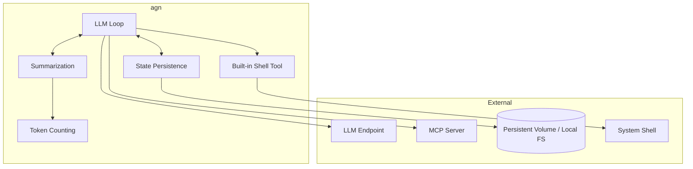
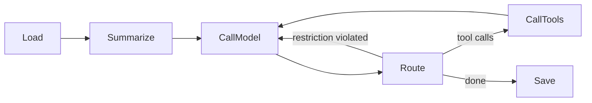

# agn-cli

## Overview

`agn` is our agent loop implementation. It runs the LLM loop (call model → route → call tools → save state) and exposes two modes: a **non-interactive one-shot** mode for developers and scripts, and a **subprocess server** mode that speaks JSON-RPC v2 over stdin/stdout for programmatic integration.

| Aspect | Details |
|--------|---------|
| Binary name | `agn` |
| Repository | `agynio/agn-cli` |
| Language | Go |
| Role | Agent loop — LLM reasoning with tool use |

## Scope

`agn` is a pure agent loop. It does not know about Threads, Notifications, or the platform messaging protocol. It receives messages, thinks (LLM calls + tool use), and produces responses.

When running inside the platform, [`agynd`](agynd-cli.md) prepares the environment and communicates with `agn` through the `agn-sdk-go` module (which spawns `agn serve`). When running locally, a developer invokes `agn exec` directly.

## Modes

`agn` is a single binary with two runtime modes. Both modes execute the same core agent loop — they differ only in how input is provided and output is presented.

| Command | Mode | Interface | Audience |
|---------|------|-----------|----------|
| `agn exec "prompt"` | Non-interactive one-shot | Plain text to stdout | Developers, scripts, CI |
| `agn serve` | Subprocess server | JSON-RPC v2 over stdin/stdout | `agn-sdk-go` / `agynd` |

### `agn exec` — non-interactive one-shot

Runs a single prompt to completion and exits. Designed for direct developer use and scripting.

```bash
agn exec "refactor the auth module to use middleware"
```

- Accepts a prompt as a CLI argument.
- Prints the agent's final text response to stdout.
- Exits with 0 on success, non-zero on failure.
- No JSON framing — output is plain text, suitable for piping and reading in a terminal.

Analogous to `codex exec` and `claude -p`.

### `agn serve` — subprocess server

Runs as a long-lived subprocess, accepting requests and emitting events over JSON-RPC v2 on stdin/stdout. Designed for programmatic integration — this is the mode that `agn-sdk-go` spawns.

```bash
agn serve
```

- Reads JSON-RPC v2 requests from stdin.
- Writes JSON-RPC v2 responses and notifications to stdout.
- Stays alive across multiple turns until the parent process terminates the subprocess.
- Supports the full protocol: multi-turn conversations, streaming events, interruption.

Analogous to `codex app-server`.

## SDK

The `agn` repository exports a Go SDK module (`agn-sdk-go`) that handles:

- Spawning `agn` as a subprocess.
- JSON-RPC v2 message encoding/decoding over stdin/stdout.
- Exposing a typed Go API for sending prompts and receiving events.

[`agynd`](agynd-cli.md) imports this SDK module — it does not import `agn`'s internal logic. The SDK is the only supported programmatic interface to `agn`.

The SDK spawns `agn serve` under the hood. The protocol follows the same JSON-RPC v2 pattern as [Codex `app-server`](https://developers.openai.com/codex/app-server/): requests have `method`/`params`/`id`, responses echo `id` with `result` or `error`, notifications omit `id`. agn defines its own schema for methods and types.

## Architecture



## LLM Loop

The loop follows the design described in [Agent Implementation](agent/implementation.md#llm-loop):



| Stage | Description |
|-------|-------------|
| **Load** | Load conversation messages from state persistence |
| **Summarize** | If context exceeds the token budget, fold older messages into a rolling summary |
| **CallModel** | Prepend system prompt, send context to LLM endpoint |
| **Route** | Inspect the LLM response and decide next step |
| **CallTools** | Execute tool calls via MCP, collect results |
| **Save** | Persist the updated conversation state |

See [Agent Implementation](agent/implementation.md) for detailed stage descriptions, routing decisions, and summarization algorithm.

## Authentication

`agn` supports two authentication methods, with the same priority order used by all CLI tools in the platform (see [CLI Authentication](authn.md#cli-authentication)):

| Method | Mechanism | Use Case |
|--------|-----------|----------|
| **Network identity (Ziti sidecar)** | Pod-level [OpenZiti](authn.md#network-identity-openziti) mTLS via the Ziti sidecar — automatic when the sidecar is present | Inside agent pods where a Ziti sidecar has enrolled an OpenZiti identity |
| **Auth token** | Token stored in `~/.agyn/credentials` and sent to the [Gateway](gateway.md) | Local development — running `agn` on a developer machine |

Authentication is required when `agn` connects to platform services. When running fully locally (local LLM endpoint, local MCP servers, filesystem state), no authentication is needed.

## Configuration

All `agn` configuration and credentials live under `~/.agyn/` — the shared home directory for all platform CLI tools.

```
~/.agyn/
├── credentials          # Auth token (shared with agyn, agynd)
└── agn/
    └── config.yaml      # agn configuration
```

### Minimal configuration

The initial configuration covers the required LLM endpoint and system prompt, plus optional summarization overrides.

```yaml
# ~/.agyn/agn/config.yaml

llm:
  # LLM endpoint URL (OpenAI-compatible API)
  endpoint: https://api.openai.com/v1
  # Authentication method for the LLM endpoint
  auth:
    # API key authentication
    api_key: sk-...
    # Or: environment variable reference (resolved at runtime)
    # api_key_env: OPENAI_API_KEY
  # Model to use
  model: gpt-4.1

summarization:
  # Tokens preserved verbatim from recent messages
  keep_tokens: 2048
  # Total token budget that triggers summarization
  max_tokens: 4096
  # Optional dedicated LLM for summarization
  llm:
    # LLM endpoint URL (OpenAI-compatible API)
    endpoint: https://api.openai.com/v1
    # Authentication method for the LLM endpoint
    auth:
      # API key authentication
      api_key: sk-...
      # Or: environment variable reference (resolved at runtime)
      # api_key_env: OPENAI_SUMMARIZATION_API_KEY
    # Model to use
    model: gpt-4.1-mini

# System prompt — prepended to every LLM call
system_prompt: |
  You are a software engineering agent.
```

| Field | Type | Required | Description |
|-------|------|----------|-------------|
| `llm.endpoint` | string | yes | OpenAI-compatible API base URL |
| `llm.auth.api_key` | string | one of | API key, provided directly |
| `llm.auth.api_key_env` | string | one of | Environment variable name containing the API key |
| `llm.model` | string | yes | Model identifier |
| `summarization.keep_tokens` | integer | no | Tokens preserved verbatim from recent messages (default: 2048) |
| `summarization.max_tokens` | integer | no | Total token budget that triggers summarization (default: 4096) |
| `summarization.llm.endpoint` | string | no | OpenAI-compatible API base URL for summarization LLM (required when `summarization.llm` is set) |
| `summarization.llm.auth.api_key` | string | one of | API key for the summarization LLM (required when `summarization.llm` is set) |
| `summarization.llm.auth.api_key_env` | string | one of | Environment variable name containing the summarization API key (required when `summarization.llm` is set) |
| `summarization.llm.model` | string | no | Model identifier for summarization (required when `summarization.llm` is set) |
| `system_prompt` | string | no | System prompt prepended to every LLM call |

### MCP configuration

`agn` connects to MCP servers listed under `mcp.servers`. Each entry is an independent server — `agn` discovers tools from each server separately and routes tool calls to the originating server.

Two transports are supported:

| Transport | Config key | Description |
|-----------|-----------|-------------|
| **stdio** | `command` | `agn` spawns the server as a subprocess and communicates over stdin/stdout |
| **Streamable HTTP** | `url` | `agn` connects to a remote server over HTTP (Streamable HTTP transport) |

Each server entry must use exactly one transport — either `command` or `url`.

```yaml
# ~/.agyn/agn/config.yaml

mcp:
  servers:
    # stdio transport — spawned as a subprocess
    filesystem:
      command: mcp-filesystem
      args:
        - --root
        - /workspace
      env:
        MCP_LOG_LEVEL: debug

    # stdio transport
    github:
      command: mcp-github
      env:
        GITHUB_TOKEN_ENV: GITHUB_TOKEN

    # Streamable HTTP transport — remote server
    remote_tools:
      url: http://mcp-tools.internal:8080/mcp
```

| Field | Type | Required | Description |
|-------|------|----------|-------------|
| `mcp` | object | no | MCP configuration section. Absent = no tools |
| `mcp.servers` | map[string]MCPServer | no | Named MCP server definitions |
| `mcp.servers.<name>.command` | string | one of | Executable path or name (stdio transport) |
| `mcp.servers.<name>.args` | []string | no | Command-line arguments (stdio only) |
| `mcp.servers.<name>.env` | map[string]string | no | Additional environment variables (stdio only) |
| `mcp.servers.<name>.url` | string | one of | Server endpoint URL (Streamable HTTP transport) |

Server names must match `^[a-z][a-z0-9_]{0,62}$`.

### Tools configuration

The built-in shell tool is enabled by default and can be disabled or constrained:

```yaml
# ~/.agyn/agn/config.yaml

tools:
  shell:
    enabled: false       # default: true
    timeout: 30          # default: 0 (no limit)
    idle_timeout: 10     # default: 0 (no limit)
    max_timeout: 120     # default: 0 (no limit)
    max_idle_timeout: 60 # default: 0 (no limit)
    max_output: 65536    # default: 0 (no limit)
```

| Field | Type | Required | Description |
|-------|------|----------|-------------|
| `tools.shell.enabled` | bool | no | Enable the built-in shell tool (default: `true`) |
| `tools.shell.timeout` | integer | no | Default `timeout` applied to every shell call when the LLM does not specify one. `0` = no limit (default: `0`) |
| `tools.shell.idle_timeout` | integer | no | Default `idle_timeout` applied to every shell call when the LLM does not specify one. `0` = no limit (default: `0`) |
| `tools.shell.max_timeout` | integer | no | Upper bound on `timeout` the LLM may request. A call with a higher value is capped silently. `0` = no limit (default: `0`) |
| `tools.shell.max_idle_timeout` | integer | no | Upper bound on `idle_timeout` the LLM may request. A call with a higher value is capped silently. `0` = no limit (default: `0`) |
| `tools.shell.max_output` | integer | no | Maximum combined stdout+stderr bytes returned inline. When exceeded, output is written to a temp file and the result contains the file path and total byte count instead. `0` = no limit (default: `0`) |

### Platform vs local

When running inside the platform, [`agynd`](agynd-cli.md) writes this configuration before spawning `agn`. The LLM endpoint, credentials, and system prompt (assembled from [skills](resource-definitions.md#skill)) are provided by the platform. It also writes MCP server entries under `mcp.servers`.

When running locally, the developer writes `~/.agyn/agn/config.yaml` manually and lists MCP servers directly under `mcp.servers`. `agn exec` reads it on startup.

## Built-in Tools

`agn` includes a built-in shell tool that the LLM can call without any MCP server configuration. It is part of the `agn` binary — no external process or network connection is required.

### Shell tool

Executes a shell command and returns its output.

| Aspect | Detail |
|--------|--------|
| Tool name | `shell` |
| Shell | `$SHELL` environment variable, falling back to `/bin/sh` |
| Output | stdout, stderr, and exit code as text |

The command string is passed directly to the shell as-is, equivalent to `$SHELL -c "<command>"`. The LLM receives stdout, stderr, and the exit code in the tool result.

#### Input

| Parameter | Type | Required | Description |
|-----------|------|----------|-------------|
| `command` | string | yes | Command string passed to the shell |
| `cwd` | string | no | Working directory for the command. Defaults to the process working directory |
| `timeout` | integer | no | Maximum seconds to wait for the command to complete. `0` means no limit. Capped by `tools.shell.max_timeout` when set |
| `idle_timeout` | integer | no | Maximum seconds to wait without any output before terminating. `0` means no limit. Capped by `tools.shell.max_idle_timeout` when set |

#### Tool result format

```
exit_code: 0
stdout:
total 12
drwxr-xr-x  3 user group  96 Apr 12 10:00 .
drwxr-xr-x 12 user group 384 Apr 12 09:00 ..
-rw-r--r--  1 user group 128 Apr 12 10:00 main.go
stderr:
```

If the command produces no stdout or no stderr, the respective field is present but empty.

When the combined stdout+stderr byte count exceeds `tools.shell.max_output`, the full output is written to a file under the system temp directory and the inline result contains the path and byte count instead:

```
exit_code: 0
output_truncated: true
output_bytes: 524288
output_file: /tmp/agn-shell-output-3f2a1b.txt
```

The LLM can read the file via a subsequent tool call if it needs the full content.

### Tool dispatch

Built-in tools are dispatched in the same **CallTools** stage as MCP tool calls. The LLM sees them as regular tools in the tool list alongside any MCP-provided tools. When the LLM emits a tool call, `agn` checks whether the tool name matches a built-in before routing to MCP.

Built-in tool names are reserved — an MCP server cannot override them.

## State Persistence

`agn` persists conversation state (messages, summaries) on the local filesystem. State is written to a path backed by a persistent volume when running on the platform, or to a local directory when running standalone. See [Agent State](agent/state.md) for the persistence model.

## Relationship to Other Components

| Component | Relationship |
|-----------|-------------|
| [`agynd`](agynd-cli.md) | Spawns `agn` via `agn-sdk-go`, prepares its environment, feeds messages, collects output |
| [Agent State](agent/state.md) | Disk-based persistence model |
| [Agent Implementation](agent/implementation.md) | Detailed LLM loop design, summarization algorithm, routing decisions |
| [Token Counting](token-counting.md) | Embedded Go package used by Summarization to count tokens per message (BPE for text, tile geometry for images, text + per-page image cost for PDFs) |
| LLM Endpoint | Configured by `agynd` or manually; `agn` calls it for model completions |
| MCP Server | Configured by `agynd` (endpoint list) or manually; `agn` connects to each server over streamable HTTP for tool execution. See [MCP](mcp.md) |
| System Shell | Invoked by the built-in shell tool via `$SHELL -c`. No configuration required |
