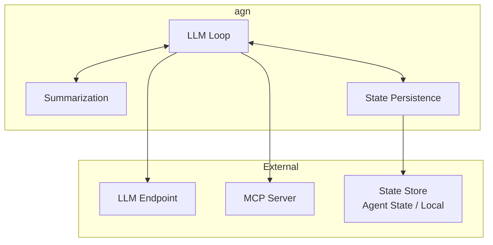
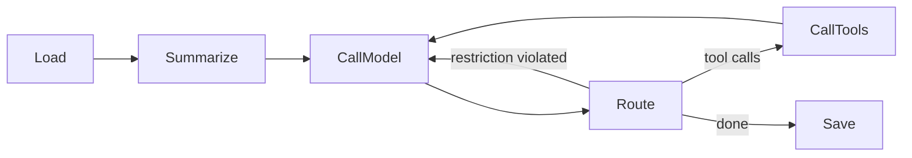

# agn-cli

## Overview

`agn` is our agent loop implementation. It is a standalone CLI that reads messages from stdin, runs the LLM loop (call model → route → call tools → save state), and writes responses to stdout.

| Aspect | Details |
|--------|---------|
| Binary name | `agn` |
| Repository | `agynio/agn-cli` |
| Language | Go |
| Role | Agent loop — LLM reasoning with tool use |

## Scope

`agn` is a pure agent loop. It does not know about Threads, Notifications, or the platform messaging protocol. It receives messages, thinks (LLM calls + tool use), and produces responses.

When running inside the platform, [`agynd`](agynd-cli.md) prepares the environment and bridges `agn` with platform services. When running locally, a developer configures the environment manually.

## Usage

```bash
# Run locally with a prompt
agn "do something"

# Inside a container, spawned by agynd with prepared environment
agn
```

## Architecture



## LLM Loop

The loop follows the design described in [Agent Implementation](agent/implementation.md#llm-loop):



| Stage | Description |
|-------|-------------|
| **Load** | Load conversation messages from state persistence |
| **Summarize** | If context exceeds the token budget, fold older messages into a rolling summary |
| **CallModel** | Prepend system prompt, send context to LLM endpoint |
| **Route** | Inspect the LLM response and decide next step |
| **CallTools** | Execute tool calls via MCP, collect results |
| **Save** | Persist the updated conversation state |

See [Agent Implementation](agent/implementation.md) for detailed stage descriptions, routing decisions, and summarization algorithm.

## Authentication

`agn` supports two authentication methods, with the same priority order used by all CLI tools in the platform (see [CLI Authentication](authn.md#cli-authentication)):

| Method | Mechanism | Use Case |
|--------|-----------|----------|
| **Network identity** | [OpenZiti](authn.md#network-identity-openziti) mTLS — automatic when the environment provides it | Inside agent containers where `agynd` has enrolled an OpenZiti identity |
| **Auth token** | Token stored in `~/.agyn/credentials` and sent to the [Gateway](gateway.md) | Local development — running `agn` on a developer machine |

Authentication is only required when `agn` connects to platform services (Agent State). When running fully locally with filesystem persistence, no authentication is needed.

## Configuration

`agn` reads its configuration from the environment prepared by [`agynd`](agynd-cli.md) or set up manually:

| Input | Source | Description |
|-------|--------|-------------|
| **Skills** | Filesystem | Skill files placed in a conventional directory structure |
| **LLM endpoint** | Environment | Endpoint URL and credentials for model calls |
| **MCP server** | Environment | MCP server connection for tool access |
| **State store** | Environment | State persistence backend selection |

## State Persistence

`agn` persists conversation state (messages, summaries) across turns. Two backends:

| Backend | Store | Use Case |
|---------|-------|----------|
| **Remote** | [Agent State (APSS)](agent/state.md) service via gRPC | Platform usage — durable, shared |
| **Local** | Filesystem | Local development — no external dependencies |

The local backend enables running `agn` fully offline without any platform dependencies.

## Relationship to Other Components

| Component | Relationship |
|-----------|-------------|
| [`agynd`](agynd-cli.md) | Spawns `agn`, prepares its environment, feeds messages, collects output |
| [Agent State](agent/state.md) | Optional remote persistence backend |
| [Agent Implementation](agent/implementation.md) | Detailed LLM loop design, summarization algorithm, routing decisions |
| LLM Endpoint | Configured by `agynd` or manually; `agn` calls it for model completions |
| MCP Server | Configured by `agynd` (aggregated proxy) or manually; `agn` calls it for tool execution |
