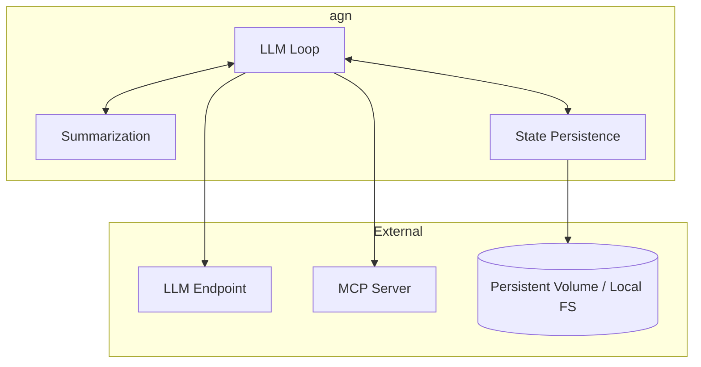
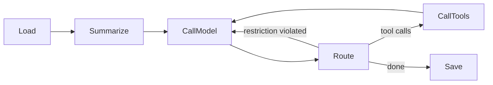

# agn-cli

## Overview

`agn` is our agent loop implementation. It runs the LLM loop (call model → route → call tools → save state) and exposes two modes: a **non-interactive one-shot** mode for developers and scripts, and a **subprocess server** mode that speaks JSON-RPC v2 over stdin/stdout for programmatic integration.

| Aspect | Details |
|--------|---------|
| Binary name | `agn` |
| Repository | `agynio/agn-cli` |
| Language | Go |
| Role | Agent loop — LLM reasoning with tool use |

## Scope

`agn` is a pure agent loop. It does not know about Threads, Notifications, or the platform messaging protocol. It receives messages, thinks (LLM calls + tool use), and produces responses.

When running inside the platform, [`agynd`](agynd-cli.md) prepares the environment and communicates with `agn` through the `agn-sdk-go` module (which spawns `agn serve`). When running locally, a developer invokes `agn exec` directly.

## Modes

`agn` is a single binary with two runtime modes. Both modes execute the same core agent loop — they differ only in how input is provided and output is presented.

| Command | Mode | Interface | Audience |
|---------|------|-----------|----------|
| `agn exec "prompt"` | Non-interactive one-shot | Plain text to stdout | Developers, scripts, CI |
| `agn serve` | Subprocess server | JSON-RPC v2 over stdin/stdout | `agn-sdk-go` / `agynd` |

### `agn exec` — non-interactive one-shot

Runs a single prompt to completion and exits. Designed for direct developer use and scripting.

```bash
agn exec "refactor the auth module to use middleware"
```

- Accepts a prompt as a CLI argument.
- Prints the agent's final text response to stdout.
- Exits with 0 on success, non-zero on failure.
- No JSON framing — output is plain text, suitable for piping and reading in a terminal.

Analogous to `codex exec` and `claude -p`.

### `agn serve` — subprocess server

Runs as a long-lived subprocess, accepting requests and emitting events over JSON-RPC v2 on stdin/stdout. Designed for programmatic integration — this is the mode that `agn-sdk-go` spawns.

```bash
agn serve
```

- Reads JSON-RPC v2 requests from stdin.
- Writes JSON-RPC v2 responses and notifications to stdout.
- Stays alive across multiple turns until the parent process terminates the subprocess.
- Supports the full protocol: multi-turn conversations, streaming events, interruption.

Analogous to `codex app-server`.

## SDK

The `agn` repository exports a Go SDK module (`agn-sdk-go`) that handles:

- Spawning `agn` as a subprocess.
- JSON-RPC v2 message encoding/decoding over stdin/stdout.
- Exposing a typed Go API for sending prompts and receiving events.

[`agynd`](agynd-cli.md) imports this SDK module — it does not import `agn`'s internal logic. The SDK is the only supported programmatic interface to `agn`.

The SDK spawns `agn serve` under the hood. The protocol follows the same JSON-RPC v2 pattern as [Codex `app-server`](https://developers.openai.com/codex/app-server/): requests have `method`/`params`/`id`, responses echo `id` with `result` or `error`, notifications omit `id`. agn defines its own schema for methods and types.

## Architecture



## LLM Loop

The loop follows the design described in [Agent Implementation](agent/implementation.md#llm-loop):



| Stage | Description |
|-------|-------------|
| **Load** | Load conversation messages from state persistence |
| **Summarize** | If context exceeds the token budget, fold older messages into a rolling summary |
| **CallModel** | Prepend system prompt, send context to LLM endpoint |
| **Route** | Inspect the LLM response and decide next step |
| **CallTools** | Execute tool calls via MCP, collect results |
| **Save** | Persist the updated conversation state |

See [Agent Implementation](agent/implementation.md) for detailed stage descriptions, routing decisions, and summarization algorithm.

## Authentication

`agn` supports two authentication methods, with the same priority order used by all CLI tools in the platform (see [CLI Authentication](authn.md#cli-authentication)):

| Method | Mechanism | Use Case |
|--------|-----------|----------|
| **Network identity** | [OpenZiti](authn.md#network-identity-openziti) mTLS — automatic when the environment provides it | Inside agent containers where `agynd` has enrolled an OpenZiti identity |
| **Auth token** | Token stored in `~/.agyn/credentials` and sent to the [Gateway](gateway.md) | Local development — running `agn` on a developer machine |

Authentication is required when `agn` connects to platform services. When running fully locally (local LLM endpoint, local MCP servers, filesystem state), no authentication is needed.

## Configuration

All `agn` configuration and credentials live under `~/.agyn/` — the shared home directory for all platform CLI tools.

```
~/.agyn/
├── credentials          # Auth token (shared with agyn, agynd)
└── agn/
    └── config.yaml      # agn configuration
```

### Minimal configuration

The initial configuration covers the two things `agn` needs to run: an LLM endpoint and a system prompt.

```yaml
# ~/.agyn/agn/config.yaml

llm:
  # LLM endpoint URL (OpenAI-compatible API)
  endpoint: https://api.openai.com/v1
  # Authentication method for the LLM endpoint
  auth:
    # API key authentication
    api_key: sk-...
    # Or: environment variable reference (resolved at runtime)
    # api_key_env: OPENAI_API_KEY
  # Model to use
  model: gpt-4.1

# System prompt — prepended to every LLM call
system_prompt: |
  You are a software engineering agent.
```

| Field | Type | Required | Description |
|-------|------|----------|-------------|
| `llm.endpoint` | string | yes | OpenAI-compatible API base URL |
| `llm.auth.api_key` | string | one of | API key, provided directly |
| `llm.auth.api_key_env` | string | one of | Environment variable name containing the API key |
| `llm.model` | string | yes | Model identifier |
| `system_prompt` | string | no | System prompt prepended to every LLM call |

### Platform vs local

When running inside the platform, [`agynd`](agynd-cli.md) writes this configuration before spawning `agn`. The LLM endpoint, credentials, and system prompt (assembled from [skills](resource-definitions.md#skill)) are provided by the platform.

When running locally, the developer writes `~/.agyn/agn/config.yaml` manually. `agn exec` reads it on startup.

### Future configuration

Additional configuration (MCP servers, skills directory, summarization parameters) will be added to this file as those features are implemented.

## State Persistence

`agn` persists conversation state (messages, summaries) on the local filesystem. State is written to a path backed by a persistent volume when running on the platform, or to a local directory when running standalone. See [Agent State](agent/state.md) for the persistence model.

## Relationship to Other Components

| Component | Relationship |
|-----------|-------------|
| [`agynd`](agynd-cli.md) | Spawns `agn` via `agn-sdk-go`, prepares its environment, feeds messages, collects output |
| [Agent State](agent/state.md) | Disk-based persistence model |
| [Agent Implementation](agent/implementation.md) | Detailed LLM loop design, summarization algorithm, routing decisions |
| LLM Endpoint | Configured by `agynd` or manually; `agn` calls it for model completions |
| MCP Server | Configured by `agynd` (aggregated proxy) or manually; `agn` calls it for tool execution |
