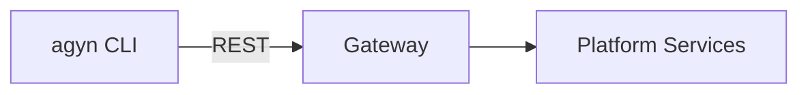

# agyn-cli

## Overview

`agyn` is the platform CLI. It provides command-line access to all platform capabilities exposed through the [Gateway](gateway.md) API. Used by administrators, developers, and agents to manage platform resources and perform operations.

| Aspect | Details |
|--------|---------|
| Binary name | `agyn` |
| Repository | `agynio/agyn-cli` |
| Language | Go |
| Protocol | REST via [Gateway](gateway.md) (OpenAPI) |

## Scope

`agyn` is a thin client over the Gateway API. It authenticates, serializes commands into API calls, and presents results. It contains no business logic — all operations are performed server-side.

## Usage Examples

```bash
# Resource management
agyn teams list
agyn agents create --name "my-agent" --model <model-id>
agyn agents list

# Messaging
agyn messages send --thread <thread-id> "Hello"

# Any Gateway API operation
agyn <resource> <verb> [flags]
```

## Users

| User | Context | Example |
|------|---------|---------|
| **Administrators** | Manage platform resources from a terminal | `agyn agents create`, `agyn teams list` |
| **Developers** | Interact with the platform during development | `agyn messages send`, `agyn threads list` |
| **Agents** | Invoke platform operations from within an agent runtime (e.g., update memory, add agents) | `agyn agents create`, `agyn messages send` |

All users interact with the same Gateway API. [Authorization](authz.md) determines what each identity is permitted to do.

## Authentication

`agyn` authenticates against the Gateway using the platform's [authentication](authn.md) mechanisms. The specific authentication flow (OIDC, service token, etc.) depends on the caller identity type.

## Relationship to Other Components



`agyn` is a pure API client. It does not interact with platform services directly — all operations go through the [Gateway](gateway.md).
