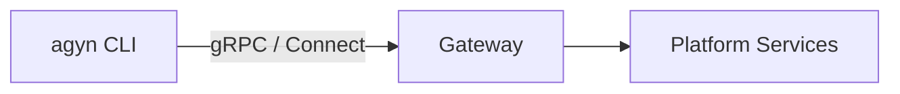

# agyn-cli

## Overview

`agyn` is the platform CLI. It provides command-line access to all platform capabilities exposed through the [Gateway](gateway.md) API. Used by administrators, developers, and agents to manage platform resources and perform operations.

| Aspect | Details |
|--------|---------|
| Binary name | `agyn` |
| Repository | `agynio/agyn-cli` |
| Language | Go |
| Protocol | gRPC and Connect (HTTP/JSON) via [Gateway](gateway.md) |

## Scope

`agyn` is a thin client over the Gateway API. It authenticates, serializes commands into API calls, and presents results. It contains no business logic — all operations are performed server-side.

## Usage Examples

```bash
# Resource management
agyn agents list
agyn agents create --name "my-agent" --model <model-id>
agyn agents list

# Messaging
agyn messages send --thread <thread-id> "Hello"

# Port exposure (inside agent containers)
agyn expose add 3000
agyn expose remove 3000
agyn expose list

# Any Gateway API operation
agyn <resource> <verb> [flags]
```

## Users

| User | Context | Example |
|------|---------|---------|
| **Administrators** | Manage platform resources from a terminal | `agyn agents create`, `agyn agents list` |
| **Developers** | Interact with the platform during development | `agyn messages send`, `agyn threads list` |
| **Agents** | Invoke platform operations from within an agent runtime (e.g., update memory, add agents, expose ports) | `agyn agents create`, `agyn messages send`, `agyn expose add 3000` |

All users interact with the same Gateway API. [Authorization](authz.md) determines what each identity is permitted to do.

## Port Exposure Commands

Agents use the `expose` command group to make ports inside their container accessible to users over the OpenZiti network. See [Expose Service](expose-service.md) for the architecture.

| Command | Description |
|---------|-------------|
| `agyn expose add <port>` | Expose a port. Returns the access URL (`http://exposed-<id>.ziti:<port>`) |
| `agyn expose remove <port>` | Un-expose a port |
| `agyn expose list` | List active exposures for the current workload |

These commands call the [Gateway](gateway.md) → [Expose Service](expose-service.md). The agent's workload context is resolved from the authenticated identity.

## Authentication

`agyn` supports two authentication methods, with the same priority order used by all CLI tools in the platform (see [CLI Authentication](authn.md#cli-authentication)):

| Method | Mechanism | Use Case |
|--------|-----------|----------|
| **Network identity (Ziti sidecar)** | Pod-level [OpenZiti](authn.md#network-identity-openziti) mTLS via the Ziti sidecar — automatic when the sidecar is present | Inside agent pods where a Ziti sidecar has enrolled an OpenZiti identity |
| **Auth token** | Token stored in `~/.agyn/credentials` and sent to the [Gateway](gateway.md) | Developer machines, CI, any environment without OpenZiti |

Network identity takes precedence when available. Otherwise, `agyn` reads the stored token from `~/.agyn/credentials`.

## Relationship to Other Components



`agyn` is a pure API client. It does not interact with platform services directly — all operations go through the [Gateway](gateway.md).
