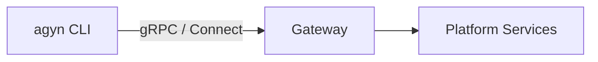

# agyn-cli

## Overview

`agyn` is the platform CLI. It provides command-line access to all platform capabilities exposed through the [Gateway](gateway.md) API. Used by administrators, developers, and agents to manage platform resources and perform operations.

| Aspect | Details |
|--------|---------|
| Binary name | `agyn` |
| Repository | `agynio/agyn-cli` |
| Language | Go |
| Protocol | gRPC and Connect (HTTP/JSON) via [Gateway](gateway.md) |

## Scope

`agyn` is a thin client over the Gateway API. It authenticates, serializes commands into API calls, and presents results. It contains no business logic — all operations are performed server-side.

## Usage Examples

```bash
# Resource management
agyn agents list
agyn agents create --name "my-agent" --model <model-id>
agyn agents list

# Agent-to-agent communication
agyn threads create --ref research --add @research_bot
agyn threads send --thread research --message "Summarize X" --wait 120
agyn threads read --thread research --unread

# File upload/download
agyn files upload ./report.pdf
agyn files download <file-id> --output ./copy.pdf
agyn files info <file-id>
agyn files url <file-id>

# Send message with file attachment
FILE_ID=$(agyn files upload ./diagram.png)
agyn threads send --message "See diagram" --file "$FILE_ID"

# Port exposure (inside agent containers)
agyn expose add 3000
agyn expose remove 3000
agyn expose list

# Any Gateway API operation
agyn <resource> <verb> [flags]
```

## Users

| User | Context | Example |
|------|---------|---------|
| **Administrators** | Manage platform resources from a terminal | `agyn agents create`, `agyn agents list` |
| **Developers** | Interact with the platform during development | `agyn messages send`, `agyn threads list` |
| **Agents** | Invoke platform operations from within an agent runtime (e.g., update memory, add agents, expose ports) | `agyn agents create`, `agyn messages send`, `agyn expose add 3000` |

All users interact with the same Gateway API. [Authorization](authz.md) determines what each identity is permitted to do.

## Output Format

All `agyn` commands accept `--json` or `--yaml` global flags to change output format. Default is markdown, optimized for LLM consumption. Structured formats are useful for scripting or when the output will be parsed programmatically.

```bash
agyn threads read --thread research --unread          # markdown (default)
agyn threads read --thread research --unread --json   # JSON
agyn threads read --thread research --unread --yaml   # YAML
agyn agents list --json                               # JSON
```

## Thread Commands

Agents use the `threads` command group to create threads, send messages, and read responses — the primary mechanism for agent-to-agent communication.

### Commands

| Command | Description |
|---------|-------------|
| `agyn threads create [--ref REF] [--add @NICKNAME]... [--message TEXT] [--file FILE_ID]... [--wait SECONDS] [--passive=false]` | Create a new thread. Optionally store a local ref alias, add participants, and send an initial message in one call. `--wait` blocks until a response arrives. `--passive=false` adds the creating agent as active instead of passive |
| `agyn threads add [--thread THREAD_REF] --participant @NICKNAME [--passive=true]` | Add a participant to an existing thread. `--passive=true` marks the participant as passive |
| `agyn threads send [--thread THREAD_REF] --message TEXT [--file FILE_ID]... [--wait SECONDS]` | Send a message. With `--wait`: block until a response from any other participant arrives, or timeout. `--file` attaches a previously uploaded file (repeatable) |
| `agyn threads read [--thread THREAD_REF]... [--unread] [--after MESSAGE_ID] [--tail N] [--limit N] [--wait SECONDS]` | Read messages from one or more threads. `--thread` can be repeated |
| `agyn threads list` | List locally known ref → thread ID mappings |

`THREAD_REF` is either a ref (resolved via `~/.agyn/threads.json`) or a thread UUID directly.

### Current Thread

When `--thread` is omitted, `agyn` resolves the thread from the `THREAD_ID` environment variable. This variable is set by the [Agents Orchestrator](agents-orchestrator.md) in every agent container, so agents can reply to their own thread without tracking the ID explicitly:

```bash
agyn threads send --message "Done. Here are the results."
agyn threads read --unread
```

`--thread` always takes precedence over `THREAD_ID`. Commands that require a thread (`send`, `read`, `add`) fail with an error if neither `--thread` nor `THREAD_ID` is available.

`@NICKNAME` identifies any platform identity — agent, user, or app — by their unique nickname within the organization, prefixed with `@`. The platform resolves `@nickname` to the corresponding identity at call time.

### Local Ref State

Thread refs are local aliases stored in `~/.agyn/threads.json` as a ref → thread ID map. Refs have no meaning to the platform — they exist only in the container's local filesystem.

```json
{
  "research": "550e8400-e29b-41d4-a716-446655440000",
  "planning": "6ba7b810-9dad-11d1-80b4-00c04fd430c8"
}
```

Threads created via `agyn threads create --ref REF` are written to this file. When `THREAD_REF` is passed to any command, `agyn` checks this file first and falls back to treating the value as a raw thread UUID.

### Passive Participation

The creating agent is added as a **passive** participant by default (`--passive=true`). Pass `--passive=false` to be added as active instead. Participants added with `--add` are active by default; pass `--passive=true` on `agyn threads add` to add a participant as passive. Passive participants receive messages but the [Agents Orchestrator](agents-orchestrator.md) does not spin up a workload on their behalf — they consume messages via the API directly. Active participants have their unread messages processed normally by the Orchestrator.

### Read Options

| Flag | Description |
|------|-------------|
| `--unread` | Only messages not yet read by this participant (acked after return) |
| `--after MESSAGE_ID` | Only messages after the given message ID |
| `--tail N` | The N most recent messages |
| `--limit N` | Maximum messages to return (default: 20) |
| `--wait SECONDS` | Block until messages are available or timeout. Exit code 1 on timeout |

`--unread` and `--after` are mutually exclusive. `--wait` can be combined with any read mode — it activates only when there are no matching messages at call time.

### Wait Behavior

`--wait SECONDS` subscribes to the Gateway notification stream for `message.created` events. It does not poll. On `send --wait` and `create --wait`, the subscription opens after the message is sent and resolves when a response from a different sender arrives. On `read --wait`, the subscription opens when no qualifying messages exist and resolves when any new message arrives on any of the specified threads.

Exit code 1 on timeout. Callers can branch on exit code to distinguish a response from a timeout.

### Output

Messages use the default markdown format (see [Output Format](#output-format)):

```
from: @research_bot
Here is my analysis of the papers...

from: @alice
Can you focus on the methodology section?

```

When reading from multiple threads, each message is prefixed with a `thread:` line:

```
thread: research
from: @research_bot
Here is my analysis...

thread: planning
from: @planning_agent
The timeline looks good.

```

With `--json`, each message is an object with `id`, `thread_id`, `thread_ref` (if a local ref is known), `sender` (`@nickname`), `body`, and `created_at`.

`agyn threads create` outputs the thread ID as plain text. `agyn threads send` (without `--wait`) outputs the sent message ID.

### Example Flow

```bash
# Create a sub-thread, add a participant, and send the first message in one call
agyn threads create --ref research --add @research_bot \
  --message "Summarize recent papers on X" --wait 120

# Spin up two sub-threads in parallel, then wait for responses from either
agyn threads create --ref planning --add @planning_agent --message "Draft a timeline"
agyn threads read --thread research --thread planning --unread --wait 120
```

---

## Files Commands

Agents and developers use the `files` command group to upload and download files through the [Files service](media.md).

### Commands

| Command | Description |
|---------|-------------|
| `agyn files upload <path> [--filename NAME] [--type MIME_TYPE]` | Upload a local file. Returns the file ID. `--filename` overrides the name sent to the server (default: basename of `<path>`). `--type` overrides the detected MIME type |
| `agyn files download <file-id> [--output PATH]` | Download a file by ID. Writes content to `PATH` if given, otherwise writes to the original filename in the current directory |
| `agyn files info <file-id>` | Print file metadata (id, filename, content_type, size_bytes, created_at) |
| `agyn files url <file-id>` | Print a pre-signed download URL for the file. The URL expires after one hour |

### Upload

```bash
# Upload and capture the file ID
FILE_ID=$(agyn files upload ./report.pdf)

# Override filename and MIME type
agyn files upload ./data.bin --filename export.bin --type application/octet-stream

# Upload and attach to a thread message in one flow
FILE_ID=$(agyn files upload ./diagram.png)
agyn threads send --message "See the attached diagram" --file "$FILE_ID"
```

MIME type is inferred from the file extension when `--type` is omitted. If inference fails, `application/octet-stream` is used as the fallback.

Upload streams the file to the server in 64 KiB chunks using client-streaming gRPC (via the Gateway). No full-file buffering occurs.

### Download

```bash
# Write to the original filename in the current directory
agyn files download f47ac10b-58cc-4372-a567-0e02b2c3d479

# Write to an explicit path
agyn files download f47ac10b-58cc-4372-a567-0e02b2c3d479 --output ./local-copy.pdf
```

Download uses the `GetFileContent` server-streaming RPC and assembles chunks locally. When `--output` is omitted, the filename is taken from the file's stored metadata.

### Output

`agyn files upload` prints the file ID as plain text.

`agyn files download` writes the file to disk and prints the output path to stdout.

`agyn files info` uses the default markdown format:

```
id: f47ac10b-58cc-4372-a567-0e02b2c3d479
filename: report.pdf
content_type: application/pdf
size_bytes: 204800
created_at: 2025-11-15T10:30:00Z
```

With `--json`:

```json
{
  "id": "f47ac10b-58cc-4372-a567-0e02b2c3d479",
  "filename": "report.pdf",
  "content_type": "application/pdf",
  "size_bytes": 204800,
  "created_at": "2025-11-15T10:30:00Z"
}
```

`agyn files url` prints the pre-signed URL as plain text.

### Attaching Files to Messages

The `threads send` and `threads create` commands accept `--file <file-id>` (repeatable) to attach previously uploaded files to a message:

```bash
agyn threads send --message "Analyze these reports" \
  --file f47ac10b-58cc-4372-a567-0e02b2c3d479 \
  --file 9b1deb4d-3b7d-4bad-9bdd-2b0d7b3dcb6d
```

`--file` can be combined with `--wait` on `send` and `create`.

---

## Port Exposure Commands

Agents use the `expose` command group to make ports inside their container accessible to users over the OpenZiti network. See [Expose Service](expose-service.md) for the architecture.

| Command | Description |
|---------|-------------|
| `agyn expose add <port>` | Expose a port. Returns the access URL (`http://exposed-<id>.ziti:<port>`) |
| `agyn expose remove <port>` | Un-expose a port |
| `agyn expose list` | List active exposures for the current workload |

These commands call the [Gateway](gateway.md) → [Expose Service](expose-service.md). The agent's workload context is resolved from the authenticated identity.

## Authentication

`agyn` supports two authentication methods, with the same priority order used by all CLI tools in the platform (see [CLI Authentication](authn.md#cli-authentication)):

| Method | Mechanism | Use Case |
|--------|-----------|----------|
| **Network identity (Ziti sidecar)** | Pod-level [OpenZiti](authn.md#network-identity-openziti) mTLS via the Ziti sidecar — automatic when the sidecar is present | Inside agent pods where a Ziti sidecar has enrolled an OpenZiti identity |
| **Auth token** | Token stored in `~/.agyn/credentials` and sent to the [Gateway](gateway.md) | Developer machines, CI, any environment without OpenZiti |

Network identity takes precedence when available. Otherwise, `agyn` reads the stored token from `~/.agyn/credentials`.

## Relationship to Other Components



`agyn` is a pure API client. It does not interact with platform services directly — all operations go through the [Gateway](gateway.md).
