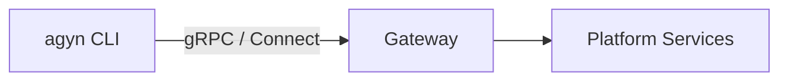

# agyn-cli

## Overview

`agyn` is the platform CLI. It provides command-line access to all platform capabilities exposed through the [Gateway](gateway.md) API. Used by administrators, developers, and agents to manage platform resources and perform operations.

| Aspect | Details |
|--------|---------|
| Binary name | `agyn` |
| Repository | `agynio/agyn-cli` |
| Language | Go |
| Protocol | gRPC and Connect (HTTP/JSON) via [Gateway](gateway.md) |

## Scope

`agyn` is a thin client over the Gateway API. It authenticates, serializes commands into API calls, and presents results. It contains no business logic — all operations are performed server-side.

The one exception is the [`agyn local`](#local-platform-commands-agyn-local) command group, which manages a local platform VM on the user's machine: it talks to the artifact CDN and Lima, not to a Gateway.

## Usage Examples

```bash
# Sign in — opens a browser, no token to copy by hand
agyn auth login --host agyn.cloud

# Resource management
agyn agents list
agyn agents create --name "my-agent" --model <model-id>
agyn agents list

# Agent-to-agent communication
agyn threads create --ref research --add @research_bot
agyn threads send --thread research --message "Summarize X" --wait 120
agyn threads read --thread research --unread
agyn threads reply --to-message <msg-id> --message "Focus on methodology"

# File upload/download
agyn files upload ./report.pdf
agyn files download <file-id> --output ./copy.pdf
agyn files info <file-id>
agyn files url <file-id>

# Send message with file attachment
FILE_ID=$(agyn files upload ./diagram.png)
agyn threads send --thread research --message "See diagram" --file "$FILE_ID"

# Explicit agent instance creation (usually not needed — threads create/add does it lazily)
agyn agents instantiate @research_bot --label planning-run-1 --default-thread research

# Port exposure (inside agent containers)
agyn expose add 3000
agyn expose remove 3000
agyn expose list

# Environments — what a workload runs, and what it carries
agyn environments create python-tools --runner shared --workspace-image devcontainer-py:3.12 --availability internal
agyn environments volumes add python-tools workspace --path /workspace --size 10Gi
agyn environments roles grant python-tools @maria --role user
agyn environments show python-tools

# Sandboxes (engineer-launched workloads with shell access)
agyn sandbox start --env python-tools
agyn sandbox connect brave-otter
agyn sandbox list

# Copy files in and out, or keep a directory in step with the sandbox workspace
agyn sandbox cp ./report.pdf brave-otter:/workspace/
agyn sandbox sync
agyn sandbox sync status

# Run the full platform locally from a prebuilt VM image
agyn local start
agyn local status

# Any Gateway API operation
agyn <resource> <verb> [flags]
```

## Users

| User | Context | Example |
|------|---------|---------|
| **Administrators** | Manage platform resources from a terminal | `agyn agents create`, `agyn agents list` |
| **Developers** | Interact with the platform during development | `agyn messages send`, `agyn threads list` |
| **Agents** | Invoke platform operations from within an agent runtime (e.g., update memory, add agents, expose ports) | `agyn agents create`, `agyn messages send`, `agyn expose add 3000` |

All users interact with the same Gateway API. [Authorization](authz.md) determines what each identity is permitted to do.

## Output Format

All `agyn` commands accept a global `-o` / `--output` flag (`table`, `json`, or `yaml`) to change output format. Thread and message output defaults to markdown, optimized for LLM consumption. Structured formats are useful for scripting or when the output will be parsed programmatically.

```bash
agyn threads read --thread research --unread          # markdown (default)
agyn threads read --thread research --unread -o json   # JSON
agyn threads read --thread research --unread -o yaml   # YAML
agyn threads list -o json                              # JSON
```

## Thread Commands

Agents use the `threads` command group to create threads, send messages, and read responses — the primary mechanism for agent-to-agent communication.

### Commands

| Command | Description |
|---------|-------------|
| `agyn threads create --ref REF [--add @HANDLE]... [--send TEXT] [--file FILE_ID]... [--wait SECONDS]` | Create a new thread. Stores a local ref alias, optionally adds participants, optionally sends an initial message. `--wait` blocks until a response arrives. The caller is added as a participant automatically, using its own [instance](agent-instances.md) identity (see [Handles](#agent-and-instance-handles)) |
| `agyn threads add --thread REF --participant @HANDLE` | Add a participant to an existing thread. `@HANDLE` may reference an agent class (`@bob`) or an agent instance (`@bob#7a2f`) — see [Class vs. Instance](#class-vs-instance-in-thread-commands) |
| `agyn threads send [--thread REF] --message TEXT [--file FILE_ID]... [--wait SECONDS]` | Send a message. `--thread` may be omitted only inside an agent workload whose instance has a [default thread](agent-instances.md#default-thread) — see [Omitting `--thread`](#omitting---thread). With `--wait`: block until any new message arrives on the thread from a different sender, or timeout |
| `agyn threads reply --to-message MSG_ID --message TEXT [--file FILE_ID]... [--wait SECONDS]` | Reply to a specific message. The thread is derived from the message; the sender is set on the reply for audit. Useful for agents so the LLM does not need to track thread IDs by hand |
| `agyn threads read --thread REF... [--unread] [--after MESSAGE_ID] [--tail N] [--limit N] [--wait SECONDS]` | Read messages from one or more threads. `--thread` can be repeated |
| `agyn threads list` | List locally known ref → thread ID mappings |

`REF` is either a local ref (resolved via `~/.agyn/threads.json`) or a thread UUID directly.

### Omitting `--thread`

`--thread` is required on `send` for every caller except one: an agent workload whose [instance](agent-instances.md) has a non-NULL `default_thread_id`. There, omitting it sends to that default thread.

The resolution happens **server-side**, in `Threads.SendMessage`, from the caller's platform identity — the CLI omits the field rather than filling it in. No environment variable participates, and there is no local notion of a "current thread": a stale env var in a long-lived container is exactly the misrouting this avoids. Users, apps, and instances without a default get an error, unchanged.

Omitting `--thread` is right for an agent that lives on one thread. An agent that delegates participates in several and is answering a different thread than the one that just spoke to it — see [Agent Instances — Outbound](agent-instances.md#outbound) for why the trigger thread is not a safe default. Those agents pass `--thread` explicitly, or use `threads reply --to-message`.

### Agent and Instance Handles

`@HANDLE` identifies a platform identity within the organization:

| Handle form | Refers to |
|-------------|-----------|
| `@alice` | A user, an agent class, or an app installation — resolved by nickname |
| `@bob#7a2f` | A specific [agent instance](agent-instances.md) — the class nickname plus an instance suffix (either the instance's `label` or a system-generated stem) |

The `#suffix` split is a first-class part of nickname resolution. Handles without `#` never resolve to an instance.

### Class vs. Instance in Thread Commands

When adding an agent participant, the caller chooses between class and instance:

- **Class handle (`@bob`)** — Threads creates a fresh [agent instance](agent-instances.md#class-on-add-rewrite) of the class and stores that instance's id as the participant. This is "spawn a fresh assistant for this conversation."
- **Instance handle (`@bob#7a2f`)** — Threads stores the existing instance id directly. This is "use this specific running assistant." Follow-up messages on the thread route to the same instance's inbox — the way to preserve context across sub-threads.

The response of `agyn threads create` and `agyn threads add` includes the resolved participant handle so the caller can address the specific instance in later calls.

The agent that owns the current process is added to threads it creates as its own instance (not its class) — the shell writing `agyn threads create` is inside an agent workload whose `AGENT_INSTANCE_ID` is known, and that instance is what joins.

### Local Ref State

Thread refs are local aliases stored in `~/.agyn/threads.json` as a ref → thread ID map. Refs have no meaning to the platform — they exist only in the container's local filesystem.

```json
{
  "research": "550e8400-e29b-41d4-a716-446655440000",
  "planning": "6ba7b810-9dad-11d1-80b4-00c04fd430c8"
}
```

Threads created via `agyn threads create --ref REF` are written to this file. When `REF` is passed to any command, `agyn` checks this file first and falls back to treating the value as a raw thread UUID.

### Read Options

| Flag | Description |
|------|-------------|
| `--unread` | Only messages not yet read by this participant (acked after return) |
| `--after MESSAGE_ID` | Only messages after the given message ID |
| `--tail N` | The N most recent messages |
| `--limit N` | Maximum messages to return (default: 20) |
| `--wait SECONDS` | Block until messages are available or timeout. Exit code 1 on timeout |

`--unread` and `--after` are mutually exclusive. `--wait` can be combined with any read mode — it activates only when there are no matching messages at call time.

### Wait Behavior

`--wait SECONDS` subscribes to the Gateway notification stream for `message.created` events on the caller's own room — `thread_participant:me` for users and apps, `instance_inbox:me` for agent instances (Notifications rewrites `:me` to the caller's `identity_id`). It does not poll. On `send --wait` and `create --wait`, the subscription opens after the message is sent and resolves when a response from a different sender arrives. On `read --wait`, the subscription opens when no qualifying messages exist and resolves when any new message arrives on any of the specified threads.

Exit code 1 on timeout. Callers can branch on exit code to distinguish a response from a timeout.

For agents, `--wait` is optional ergonomics only — an agent that returns control to `agynd` between calls will be re-invoked automatically when new inbox items arrive, with no need to block. `--wait` is primarily useful for shell scripts and interactive developer use, where a synchronous reply is easier to consume.

### Output

Messages use the default markdown format (see [Output Format](#output-format)):

```
from: @research_bot
Here is my analysis of the papers...

from: @alice
Can you focus on the methodology section?

```

When reading from multiple threads, each message is prefixed with a `thread:` line:

```
thread: research
from: @research_bot
Here is my analysis...

thread: planning
from: @planning_agent
The timeline looks good.

```

With `-o json`, each message is an object with `id`, `thread_id`, `thread_ref` (if a local ref is known), `sender` (`@nickname`), `body`, and `created_at`.

`agyn threads create` outputs the thread ID as plain text. `agyn threads send` (without `--wait`) outputs the sent message ID.

### Example Flow

```bash
# Create a sub-thread with a fresh instance of @research_bot and send the first message.
# The caller is added as its own agent instance so replies land in its inbox.
agyn threads create --ref research --add @research_bot \
  --send "Summarize recent papers on X"

# Spin up two sub-threads in parallel; both instances reply asynchronously into the caller's inbox.
agyn threads create --ref planning --add @planning_agent --send "Draft a timeline"

# The agent's next invocation (triggered by the incoming inbox item) reads the messages:
agyn threads read --thread research --thread planning --unread
```

A shell script (not an agent) can use `--wait` to block synchronously:

```bash
agyn threads send --thread research --message "Focus on methodology" --wait 120
```

---

## Files Commands

Agents and developers use the `files` command group to upload and download files through the [Files service](media.md).

### Commands

| Command | Description |
|---------|-------------|
| `agyn files upload <path> [--filename NAME] [--type MIME_TYPE]` | Upload a local file. Returns the file ID. `--filename` overrides the name sent to the server (default: basename of `<path>`). `--type` overrides the detected MIME type |
| `agyn files download <file-id> [--output PATH]` | Download a file by ID. Writes content to `PATH` if given, otherwise writes to the original filename in the current directory |
| `agyn files info <file-id>` | Print file metadata (id, filename, content_type, size_bytes, created_at) |
| `agyn files url <file-id>` | Print a pre-signed download URL for the file. The URL expires after one hour |

### Upload

```bash
# Upload and capture the file ID
FILE_ID=$(agyn files upload ./report.pdf)

# Override filename and MIME type
agyn files upload ./data.bin --filename export.bin --type application/octet-stream

# Upload and attach to a thread message in one flow
FILE_ID=$(agyn files upload ./diagram.png)
agyn threads send --thread research --message "See the attached diagram" --file "$FILE_ID"
```

MIME type is inferred from the file extension when `--type` is omitted. If inference fails, `application/octet-stream` is used as the fallback.

Upload streams the file to the server in 64 KiB chunks using client-streaming gRPC (via the Gateway). No full-file buffering occurs.

### Download

```bash
# Write to the original filename in the current directory
agyn files download f47ac10b-58cc-4372-a567-0e02b2c3d479

# Write to an explicit path
agyn files download f47ac10b-58cc-4372-a567-0e02b2c3d479 --output ./local-copy.pdf
```

Download uses the `GetFileContent` server-streaming RPC and assembles chunks locally. When `--output` is omitted, the filename is taken from the file's stored metadata.

### Output

`agyn files upload` prints the file ID as plain text.

`agyn files download` writes the file to disk and prints the output path to stdout.

`agyn files info` uses the default markdown format:

```
id: f47ac10b-58cc-4372-a567-0e02b2c3d479
filename: report.pdf
content_type: application/pdf
size_bytes: 204800
created_at: 2025-11-15T10:30:00Z
```

With `-o json`:

```json
{
  "id": "f47ac10b-58cc-4372-a567-0e02b2c3d479",
  "filename": "report.pdf",
  "content_type": "application/pdf",
  "size_bytes": 204800,
  "created_at": "2025-11-15T10:30:00Z"
}
```

`agyn files url` prints the pre-signed URL as plain text.

### Attaching Files to Messages

The `threads send` and `threads create` commands accept `--file <file-id>` (repeatable) to attach previously uploaded files to a message:

```bash
agyn threads send --thread research --message "Analyze these reports" \
  --file f47ac10b-58cc-4372-a567-0e02b2c3d479 \
  --file 9b1deb4d-3b7d-4bad-9bdd-2b0d7b3dcb6d
```

`--file` can be combined with `--wait` on `send` and `create`.

---

## Port Exposure Commands

The `expose` command group makes ports inside a container accessible to users over the OpenZiti network — run by an agent during a turn, or by a person at a [sandbox](../product/sandboxes/sandboxes.md) shell. See [Expose Service](expose-service.md) for the architecture.

| Command | Description |
|---------|-------------|
| `agyn expose add <port>` | Expose a port. Returns the access URL (`http://<entity>.<org-slug>.agyn:<port>`) |
| `agyn expose remove <port>` | Un-expose a port |
| `agyn expose list` | List active exposures for the current workload |

These commands call the [Gateway](gateway.md) → [Expose Service](expose-service.md). The workload context is resolved from the authenticated identity.

The address names the entity the workload runs for — `http://super-sandbox.acme.agyn:3000` for a sandbox, `http://research.bob.acme.agyn:3000` for agent instance `@bob#research` — so a link is self-describing wherever it is pasted. `add` prints whatever address it was given, including the opaque `exposed-<id>.agyn` [fallback](expose-service.md#derivability-and-fallback) when no readable one can be derived. Re-running `add` on a port already exposed prints the same URL rather than creating a second exposure.

---

## Environment Commands

The `environments` command group manages [environments](resource-definitions.md#environment) and everything they contain. See [Flavors and Environments](../product/environments/environments.md) for the product behavior.

An environment is a composite: a runner, a flavor, images, and the volumes, MCP servers, init scripts, and ENVs a workload in it carries. The group is shaped accordingly — one set of commands for the environment record, one subcommand per kind of content, and roles alongside them. Every organization member can create one; what a caller may read and change on someone else's follows the [environment role](agents-service.md#environment-roles) they hold.

| Command | Description |
|---------|-------------|
| `agyn environments list [--mine]` | Environments in the organization: name, runner, flavor, images, availability, and an **unschedulable** marker naming the unresolved reference when one exists. `--mine` filters to those the caller holds a role on |
| `agyn environments show NAME` | Full configuration plus contents — volumes, MCPs, init scripts, ENVs, attached egress rules, and roles. Callers without `can_read_config` get the metadata header and a line stating the rest is not visible to them, rather than an empty listing that reads as "nothing configured" |
| `agyn environments create NAME --runner RUNNER --workspace-image IMG:TAG [--agent-runtime-image IMG:TAG] [--flavor FLAVOR] [--llm-mode platform\|native] [--allowed-model NAME]... --availability internal\|private` | Create an environment. The caller becomes its `owner`. An unreported flavor name warns and proceeds — it is [late-bound](../product/environments/environments.md#placement), and rejecting it would forbid applying platform resources before runner config |
| `agyn environments update NAME [...same flags]` | Change any field. Flags not given are left as they are. `--llm-mode` is refused while any agent references the environment, naming them — see [LLM Access](../product/environments/environments.md#llm-access). `--allowed-model` replaces the allowlist and is sent only when passed, so an unrelated change does not clear it |
| `agyn environments delete NAME` | Delete. Refused while any agent or sandbox references it; the error names them |

### Contents

| Command | Description |
|---------|-------------|
| `agyn environments volumes list ENV` | The environment's [volumes](resource-definitions.md#volume): name, path, persistence, size, storage class, TTL |
| `agyn environments volumes add ENV NAME --path PATH [--size SIZE] [--storage-class CLASS] [--ttl DURATION]` | Add a volume. **`--size` is what makes it persistent** — given, the volume is a disk that survives workload stops; omitted, it is ephemeral scratch discarded with the workload. The two are biconditional in the resource itself, so the CLI does not carry a separate `--persistent` flag to contradict |
| `agyn environments volumes remove ENV NAME` | Remove a volume. Warns that every disk provisioned from it — one per agent instance and sandbox — will be deprovisioned, and names how many exist |
| `agyn environments mcps list \| add \| update \| remove ENV [NAME]` | MCP servers that run in every workload of the environment. `add` takes `--image IMG:TAG`, `--command CMD`, optional `--requests-cpu` / `--requests-memory` / `--limits-cpu` / `--limits-memory`, and `--share VOLUME` (repeatable) naming environment volumes to mount at the paths the main container uses |
| `agyn environments init-scripts list \| add \| remove ENV [NAME]` | Scripts run in the main container before the agent CLI, or before a sandbox shell becomes available. `add` reads the body from `--file PATH` or stdin. Listed in execution order |
| `agyn environments vars list \| set \| unset ENV [NAME]` | Environment variables injected into the main container. `set` takes `--value TEXT` or `--secret SECRET`, never both. `list` prints secret-backed entries as a reference, never a resolved value |
| `agyn environments subscriptions list \| attach \| detach ENV [NAME]` | [Subscriptions](../product/environments/environments.md#subscriptions) supplying vendor credentials in `native` mode. `attach` refuses a second subscription for a vendor already attached, naming the existing one. Listed by vendor, so the gap in a `native` environment reads as a gap |

`vars` rather than `env` — `agyn environments env` would read as a tautology, and the `--env` flag on [`sandbox start`](#sandbox-commands) already means the environment itself.

`agyn environments show` reports the LLM mode in its metadata header, and — for a `native` environment — which vendors have a subscription attached. An environment in `native` mode with none is flagged the same way an unresolvable flavor is: it will not start workloads, and saying so at read time beats discovering it at start.

### Roles

| Command | Description |
|---------|-------------|
| `agyn environments roles list ENV` | Identities holding a role, with the role |
| `agyn environments roles grant ENV @HANDLE --role owner\|maintainer\|user` | Assign or change a role. Rejects identities outside the environment's organization |
| `agyn environments roles revoke ENV @HANDLE` | Remove a role |

`user` is the role that governs *running* in an environment — starting a sandbox in it, or pointing an agent at it. Because a shell in that sandbox reaches the environment's secret-backed ENVs, its egress credentials, and its volumes, `grant --role user` states what it opens up before confirming. See [Who Can Use an Environment](../product/environments/environments.md#who-can-use-an-environment).

### Declarative management

This group is for inspecting and adjusting environments from a terminal. Defining them as version-controlled configuration is the [Terraform provider](operations/terraform-provider.md)'s job, and the two are not alternatives: `agyn environments show` is how an operator sees what is actually in place, including the provisioned state Terraform does not track.

---

## Subscription Commands

The `subscriptions` command group manages [Subscriptions](../product/environments/environments.md#subscriptions) — vendor credentials used by environments in `native` LLM mode. They are organization resources rather than environment sub-resources because one subscription is normally attached to several environments; attaching is done from [`agyn environments subscriptions`](#contents).

| Command | Description |
|---------|-------------|
| `agyn subscriptions list` | Subscriptions in the organization: name, vendor, and referenced secret |
| `agyn subscriptions show NAME` | One subscription |
| `agyn subscriptions attachments [--subscription NAME] [--agent ID] [--environment ID]` | Where subscriptions are attached, across both scopes. Each filter narrows independently |
| `agyn subscriptions create NAME --vendor anthropic\|openai --secret SECRET [--account-id ID]` | Create a subscription from an existing [secret](resource-definitions.md#secret). The secret must exist; the value is never read by the CLI |
| `agyn subscriptions update NAME [--secret SECRET] [--account-id ID]` | Repoint at a different secret — how a rotated token is adopted. `--vendor` is not settable: changing it would silently redirect every workload the subscription serves |
| `agyn subscriptions delete NAME` | Delete. Refused while attached to any environment or agent; the error names them |
| `agyn subscriptions attach\|detach NAME --agent AGENT_ID` | Agent scope, which shadows the environment's for the same vendor. Environment scope is [`agyn environments subscriptions`](#contents), where the environment is named rather than typed as a UUID |

A subscription is addressed by name, as every other resource is; a UUID resolves too, so an id copied out of `attachments` works without a lookup. No command prints a token, and none accepts one — a credential enters the platform as a [Secret](resource-definitions.md#secret), and a subscription only ever references it. Rotating a token is `agyn secrets set`, not a subscription operation, and takes effect on the next connection each workload opens.

---

## Sandbox Commands

Engineers use the `sandbox` command group to start on-demand workloads and attach interactive shells to them. See [Sandboxes](../product/sandboxes/sandboxes.md) for the product behavior and [Resource Definitions — Sandbox](resource-definitions.md#sandbox) for the resource.

| Command | Description |
|---------|-------------|
| `agyn sandbox start [--env NAME] [--name NAME] [--agent @HANDLE] [--sync PATH] [--idle-timeout DURATION]` | Create a sandbox running an [environment](resource-definitions.md#environment), wait for the workload, attach a shell. `--env` defaults to the organization's sole environment when exactly one exists. `--agent` resolves the agent's environment instead. `--name` is auto-generated when omitted. `--idle-timeout` sets how long the sandbox survives with nothing attached — see [Idle Timeout](#sandbox-idle-timeout). Prints a notice before attaching when the environment declares no persistent [volume](resource-definitions.md#volume) — nothing written in the shell will survive the workload stopping |
| `agyn sandbox connect [NAME]` | Attach a shell to an existing sandbox. Calls `EnsureSandboxRunning` before requesting a terminal ticket: no-op when `running`, restart when `stopped`, fresh start attempt when `failed`. With no argument: connects when the caller owns exactly one non-terminated sandbox, otherwise lists candidates |
| `agyn sandbox list [--all] [--terminated]` | List the caller's sandboxes. Terminated sandboxes are hidden unless `--terminated` is passed. `--all` lists every sandbox in the organization (org owners) |
| `agyn sandbox stop [NAME]` | Stop the workload; keep the sandbox record and its persistent volumes. Warns first when the environment declares none |
| `agyn sandbox delete [NAME]` | Terminate the sandbox and delete the volumes provisioned for it |
| `agyn sandbox cp [-r] SRC DST` | Copy files between the local machine and a sandbox. Exactly one of `SRC`/`DST` carries a `NAME:path` prefix, naming the sandbox side — the `docker cp` and `kubectl cp` convention. `-r` copies directories |

`cp` is a one-shot transfer, not a relationship: it scans the source, transfers what differs, applies through the same staged atomic write [sync](#sandbox-sync-commands) uses, and exits. No daemon, no watching, no reconciliation base, and no conflict handling — there are no two sides to keep in agreement over time.

```bash
agyn sandbox cp ./report.pdf brave-otter:/workspace/
agyn sandbox cp brave-otter:/workspace/out.csv ./
agyn sandbox cp -r ./src brave-otter:/workspace/src
```

The shell session is a WebSocket to the Terminal Proxy, which routes to the hosting runner's `Exec` API (see [Runners — Terminal Proxy Integration](runners.md#terminal-proxy-integration)). A dropped connection ends the session, not the sandbox — `agyn sandbox connect` reattaches. `start` and `connect` require a TTY; the only non-interactive session the CLI opens is [workspace sync](#sandbox-sync-commands).

`agyn sandbox start --sync PATH` composes start, shell attach, and sync in one invocation.

### Sandbox Idle Timeout

A sandbox is idle when **nothing is attached to it** — every attached terminal session keeps it alive, and the clock starts at the last detach. A [sync session](#sandbox-sync-commands) is deliberately not an attachment for this purpose: a laptop left syncing would keep a sandbox running indefinitely. See [Terminal Proxy — Sandbox Activity Reporting](terminal-proxy.md#sandbox-activity-reporting).

Thirty minutes suits an engineer stepping away from a shell and suits nothing else. A long build, a call, a run left going overnight all want a different number, and it is known at `start`:

```bash
agyn sandbox start --env gpu --idle-timeout 4h
agyn profile set cloud --sandbox-idle-timeout 2h    # my default, this profile
```

The value resolves flag → profile → organization default, and the server is the authority: [`CreateSandbox`](agents-service.md#resources) rejects anything above the organization's `sandbox_max_idle_timeout`, naming the ceiling, rather than clamping silently to a number the caller never sees. It is recorded on the sandbox at creation and does not change afterwards — as with TTL, a running sandbox is not re-read against settings that have since moved.

The profile default lives on the [profile](#profiles) rather than in one global config because it belongs to a Gateway and an organization: a local VM and a production tenant deserve different answers, and switching profiles should switch the answer with them.

`agyn sandbox list` shows each sandbox's idle timeout alongside its remaining TTL, so the two bounds on a sandbox's life are visible in the same place.

---

## Sandbox Sync Commands

The `sandbox sync` subgroup keeps a local directory and a sandbox directory continuously reconciled. See [Sandbox Workspace Sync](sandbox-sync.md) for the architecture and [Sandboxes — Workspace Sync](../product/sandboxes/sandboxes.md#workspace-sync) for the product behavior.

| Command | Description |
|---------|-------------|
| `agyn sandbox sync [NAME] [--local PATH] [--remote PATH] [--foreground]` | Create and start a session between a local directory (`--local`, default the working directory) and a sandbox directory (`--remote`, default `/workspace`). Returns as soon as the session is established. `NAME` resolves as it does for `connect`, and additionally from the working directory when it already belongs to a session |
| `agyn sandbox sync list` | Sessions with their local root, sandbox, state, and last successful sync. Sessions whose daemon is not running are listed as such |
| `agyn sandbox sync status [SESSION]` | Detailed state, including quarantined conflicts and the reason for any halt. Exit code distinguishes the conditions a prompt would style differently: healthy, halted, running with conflicts quarantined, and daemon not running |
| `agyn sandbox sync pause \| resume \| stop [SESSION]` | Suspend, restart, or remove a session. `stop` removes the session; neither side's files are touched. `resume` is also the recovery for a halt whose cause was environmental — a drive that is now mounted, a checkout that has finished — since the condition simply no longer holds |
| `agyn sandbox sync resolve <path> --keep-local \| --keep-remote` | Resolve a quarantined conflict. `--all` applies one side to every conflict in the session |
| `agyn sandbox sync accept-deletions [SESSION] [--expect-deletions N]` | Acknowledge a pending bulk deletion that halted the session, naming the count before proceeding. Clears that one change and leaves the session's base intact — it cannot recover a replaced root |
| `agyn sandbox sync reset --from-local \| --from-remote [--expect-deletions N]` | Re-establish a halted session by declaring one side authoritative, for use when a root has been replaced or wiped. **Propagates**: the other side is made to match, deletions included. Names how many entries it will delete on the far side and requires confirmation, so reaching for it after a failed mount is stopped rather than obeyed |
| `agyn sandbox sync undelete [--since DURATION]` | Restore files sync removed locally, from the session's trash |
| `agyn sandbox sync daemon start \| stop \| status` | Manage the local sync daemon directly |
| `agyn sandbox sync daemon install \| uninstall` | Register or remove a user-level service so sessions resume at login. Opt-in; nothing is installed otherwise |
| `agyn sandbox sync serve --root PATH` | Hidden. The in-sandbox endpoint, launched by the platform inside the container — never run by hand |

Both recovery commands follow the same non-interactive rule the [`local`](#interactive-and-non-interactive-modes) group uses: on a TTY they prompt with the count; without one they do not prompt and do not proceed, failing with a message that names the actual count and the flag that would authorize it.

`--expect-deletions N` carries the assertion in place of the prompt, and carries it as a **number rather than a bare yes**. The count must match what is pending; a mismatch fails and reports both. A blanket `-y` in a pipeline written when three files were deleted would still be sitting there the day thirty thousand are, silently authorizing a wipe — which is the outcome the count exists to prevent. Naming the number scopes the authorization to the change the author actually saw.

Recovery commands act on session state the daemon holds, so — like `pause`, `resume`, and `stop` — they require a running daemon and say which command starts one when there is not. They never start it themselves.

The positional is the sandbox, as everywhere else in the group — local and remote directories are flags, mirroring [`files download`](#download), where the remote object is positional and the local path is `--output`. A session's identity is the `(local root, sandbox, remote root)` triple. Its *name* is only a label, derived from the local directory and the sandbox (`api-brave-otter`) and given a short discriminator when that would collide with an existing session. `SESSION` may be omitted whenever only one session is a candidate.

There is no selected-sandbox setting. `profile` and `local` have `select`/`use` because a profile and a VM are long-lived machine-level choices; a sandbox is org-scoped and expires, so a stored selection would routinely point at something terminated. Sandboxes resolve the way `connect` resolves them — the sole owned sandbox, otherwise named. Sync adds one further step first: a working directory that already belongs to a session resolves to that session's sandbox, which is a per-directory answer rather than a machine-wide mode.

### Daemon

Sync outlives the command that starts it, so sessions survive closing the terminal.

| Concern | Behavior |
|---------|----------|
| **Start** | Only `agyn sandbox sync` and `sync daemon start` launch it. No other command in the CLI does — an unrelated invocation never spawns a sync daemon |
| **Detachment** | A new session with no controlling terminal, output to a rotating log under `~/.agyn/sync/`. Unaffected by the invoking shell exiting |
| **Address** | Connect over an owner-only unix socket under `~/.agyn/sync/` — the CLI's existing RPC stack, not gRPC. A lock file guards against concurrent daemons |
| **Stop** | Explicitly, or automatically once the last session is removed |
| **Reboot** | Nothing resumes on its own; sessions persist and are reported as not running. `sync daemon install` is the opt-in for resume-at-login |
| **Upgrade** | A daemon running an incompatible version is detected on the socket handshake and restarted; sessions persist across it |

`--foreground` runs a single session in the invoking process with no daemon, logging to the terminal and ending on interrupt — for debugging and non-interactive environments.

### Local State

Everything lives under `~/.agyn/sync/`: the socket, the daemon log, and one directory per session holding its configuration, its reconciliation base, its status, and its trash of locally deleted files.

---

## Local Platform Commands (`agyn local`)

The `local` command group runs the full Agyn platform on the user's machine from a prebuilt VM image — see [Local Bundle](operations/local-bundle.md) for the image architecture. Unlike every other command group, `agyn local` does not call the Gateway API: it downloads published images from the CDN and manages a [Lima](https://lima-vm.io/) VM locally.

### Commands

| Command | Description |
|---------|-------------|
| `agyn local start` | [Preflight](#preflight) → download the image if needed → create/boot the VM → wait for [readiness](#readiness) → install the CA → provision the profile. Ends with one link to the console. Flags: `--version`, `--port`, `--cpus`, `--memory`, `--install-ca` \| `--no-ca`, `--install-deps` \| `--no-install-deps`, `--download-only`, `-y` |
| `agyn local list` | The configured VMs with status, ports and profile; the selected one is marked |
| `agyn local select` \| `use NAME` | Choose the VM other commands act on — interactively, or by name for scripts |
| `agyn local stop` \| `restart` | Stop / restart the VM |
| `agyn local status` | State, version, port, endpoint health, CA trust. `--output table\|json\|yaml` |
| `agyn local delete` | Remove the VM. `--purge` also removes downloaded images and certs |
| `agyn local upgrade` | Upgrade the `agyn-platform` and `agyn-apps` releases in the running VM to the newest charts, keeping the VM and its data — see [Upgrade](#upgrade). Everything from the image (k3s, Istio, cert-manager, OpenZiti) moves only by recreating the VM — see [Upgrade Model](operations/local-bundle.md#upgrade-model) |
| `agyn local doctor [--fix]` | The [preflight](#preflight) checks on their own: host tools and their versions, disk space, ports. `--fix` installs what is missing. `--output table\|json\|yaml` |
| `agyn local config` | `list` \| `get <key>` \| `set <key> <value>` |
| `agyn local ca` | `show` \| `export` \| `install` \| `uninstall` |

### Design

| Concern | Behavior |
|---------|----------|
| **One VM by default, more on request** | A single VM needs no naming: no flag, no selection, and everything derived from it keeps the plain names (`agyn`, profile `local`, context `agyn-local`). `--instance NAME` addresses another, and `agyn local select` fixes the choice. Resolution is `--instance`, then the selection, then the default. A second VM exists for what one cannot do: moving data between versions an [upgrade](operations/local-bundle.md#upgrade-model) cannot bridge, or holding separate clusters side by side |
| **Per-VM naming** | Two VMs share nothing that identifies them: the Lima instance, the [profile](#profiles) (`local`, then `local-<name>`), the kubeconfig context (`agyn-local-<name>`) and the CA file are all named for the VM |
| **Port allocation** | The default VM takes the well-known `2496`/`6445`. Further VMs are given the next free pair, skipping ports already listening or claimed by another configured VM — running a second cluster should not require arithmetic |
| **State containment** | Everything lives under `~/.agyn/local/` — `images/<version>/<arch>/` (verified downloads, shared between VMs on the same version), `certs/`, `lima/` (dedicated `LIMA_HOME`) — so `delete --purge` is a clean sweep. Settings live in `~/.agyn/config.yaml` under `local.instances.<name>` (`port`, `apiPort`, `version`, `cpus`, `memory`); a pre-existing flat `local:` block is migrated on load |
| **Version resolution** | `version: latest` resolves via `bundle-vm/latest.json` on the CDN; pinned versions bypass it. Downloads are sha256-verified against the published checksums, resumable, and atomic |
| **Networking** | The host port (default `2496`) is a Lima forward onto the VM's ingress NodePort; port collision detection suggests alternatives. `*.agyn.dev` resolves to `127.0.0.1`, so endpoints are `https://console.agyn.dev:<port>` etc. — see [Local Bundle — Networking](operations/local-bundle.md#networking) |
| **Certificates** | `agyn local ca` extracts the CA baked into the image and installs it into the system trust store (macOS keychain / Linux ca-certificates; requires sudo) |
| **Dependencies** | Checked by `doctor` and by every `start`, and offered for installation rather than only described — see [Preflight](#preflight) |

### Preflight

Every `start` begins with the checks `doctor` reports. A missing or too-old host tool is the most common reason a first run fails, and left to `limactl` the failure arrives as a tool error rather than a sentence naming what to install.

| Check | Blocking | Detail |
|-------|----------|--------|
| `limactl`, `xz`, `qemu` present, and at or above the minimum version the image's `lima.yaml` needs | Yes | Present-but-too-old is its own state with its own fix, not "ok" — an old `limactl` fails later, on the template, where the message names neither |
| Free space under `~/.agyn/local/` for the compressed download, the decompressed disk, and room for the VM to grow | Yes | Reported as required against available. Space is otherwise the failure that arrives halfway through decompression, after the download |
| The ingress and API ports are free | Yes, on a VM being created | Interactive runs offer the next free pair — see [Design](#design) |
| Host virtualization is usable by the current user | Yes | |
| VM state, configured version, CA trust | No | Reported by `doctor`, acted on by nothing |

Missing tools are **offered for installation**, with the exact command shown before it runs — Homebrew on macOS, the distribution's package manager on Linux. Declining prints the commands and stops. A package manager is never installed by the CLI: a machine without one is told what to install, and by whom.

`--install-deps` accepts the offer without prompting and `--no-install-deps` refuses it. `-y` on its own installs nothing, matching `--install-ca`: both actions reach outside `~/.agyn`, both ask for sudo, and neither is what "accept the defaults" should be read to authorize. `agyn local doctor --fix` is the same offer standalone, for a machine being prepared ahead of a first start.

### Progress

Download, boot, readiness and upgrade report as **steps** — one line each, saying what is happening now and what it cost.

| Concern | Behavior |
|---------|----------|
| **Step in progress** | Animated on a TTY, so a step that takes a minute is visibly working rather than possibly hung. What it is waiting on is named and updates as it changes: bytes and rate while downloading, the workloads not yet ready while waiting |
| **Step finished** | One line — what it did and how long it took. It stays; nothing that mattered scrolls past |
| **Tool output** | `limactl`, `helm` and `kubectl` output never reaches the terminal. It goes to a log under `~/.agyn/local/`, and a failing step prints its tail along with the path. `--debug` streams it to the terminal in place of the step display |
| **Not a terminal** | No animation, no redraw: each step prints once, on completion, with the same content. A CI log reads as a list rather than as a smear of control characters |
| **Failure** | The step is marked failed, the command exits non-zero, and nothing after it runs. No step prints an error and lets the command carry on to a summary that reads like success |
| **Skipped** | Only the optional steps — CA trust when declined, the profile under `--no-profile` — report as skipped, each naming the command that completes it later |

The last line of a successful `start` is its only call to action: **the console URL, printed once**. Chat and tracing are not listed beside it — three links are a menu rather than a next step, and `agyn local status` prints every endpoint for whoever wants one. A `start` against an already-running VM prints the same single line, and prints it in the same place.

### Readiness

`start` returns when the platform can be used, not when the guest has booted. Two signals, both required:

| Signal | Why |
|--------|-----|
| Every platform endpoint answers through the host's forwarded port | The ingress begins serving tens of seconds after the VM reports itself started |
| The system organization declaration carries an assigned id | It is what the profile records and what every org-scoped command runs against. Provisioning completes after the endpoints answer, so an endpoint check alone is not evidence it has |

Credential provisioning runs only once both hold, so `start` never reports a provisioning failure against a platform that had not finished starting. A wait that runs out names the signal still missing and the command that resumes from there — never a bare timeout followed by the rest of the run.

### Upgrade

`agyn local upgrade` puts the same step display over the Helm work, so what reaches the terminal is the answer the user asked for rather than the tooling's account of itself:

| Step | Reports |
|------|---------|
| Resolve | The installed chart version and the one being moved to, before anything changes |
| Upgrade | Each release in turn, animated while rollouts settle, naming the workloads still restarting |
| Re-apply the ingress port | Only when the host's port differs from the chart default, because a Helm upgrade reverts the browser-facing URLs to it |
| Result | `agyn-platform 0.51.0 → 0.52.0`, one line |

A release already at the newest chart is reported as such and left alone, rather than upgraded to itself and reported as a new revision. Helm's `AuthorizationPolicy` warnings, `kubectl` klog lines and the closing release listing go to the log with every other tool's output. The one thing an upgrade says that is not a step is the warning that a service running from source will be reset to its chart image (see [Upgrade Model](operations/local-bundle.md#upgrade-model)) — a consequence for the user, not noise from a tool.

### Interactive and Non-Interactive Modes

On a TTY without `-y`, `agyn local start` runs a first-run wizard: [preflight](#preflight) with an install offer for anything missing → port selection → download → boot → readiness → "trust CA?" prompt.

With `-y` or without a TTY, no prompts occur. Configuration resolves as flags > environment > config file > defaults, and commands fail with actionable messages when a human is required (e.g., sudo for trust-store installation, or a dependency neither `--install-deps` nor `doctor --fix` was asked to install). `status` and `doctor` emit JSON/YAML for scripting.

---

## Profiles

A profile is the CLI's context: which Gateway to talk to, which organization to act in, and which CA to trust. One machine routinely addresses more than one platform — a cloud account and one or more [local VMs](#local-platform-commands-agyn-local) — and a profile is what makes switching between them free of re-authentication.

| Command | Description |
|---------|-------------|
| `agyn profile list` | The configured profiles; the current one is marked |
| `agyn profile show [NAME]` | One profile's settings |
| `agyn profile select` \| `use NAME` | Choose the profile subsequent commands run under — interactively, or by name for scripts |
| `agyn profile set NAME [--gateway-url URL] [--organization ID] [--ca-file PATH] [--sandbox-idle-timeout DURATION]` | Create or update a profile. Fields not given are left as they are |
| `agyn profile remove NAME` | Delete a profile and its stored token |

| Field | Description |
|-------|-------------|
| `gatewayUrl` | Gateway base URL |
| `organization` | Organization ID for org-scoped commands |
| `caFile` | PEM bundle trusted in addition to the system trust store. Written by `agyn local credentials` for a VM's own CA |
| `sandboxIdleTimeout` | Idle timeout sent on `agyn sandbox start` when `--idle-timeout` is not given. A local preference, not a policy — the server validates it against the organization's ceiling like any other request value. See [Sandbox Idle Timeout](#sandbox-idle-timeout) |

Settings live in `~/.agyn/config.yaml` under `profiles.<name>`. Tokens live in `~/.agyn/credentials`, keyed by profile name, mode `0600`.

| Concern | Behavior |
|---------|----------|
| **Resolution** | `--profile`, then `AGYN_PROFILE`, then the recorded choice, then `default`. `--gateway-url` and `AGYN_TOKEN` address a platform directly without touching any profile — the form CI uses |
| **Naming** | `default` until something names one. `agyn local` owns `local` and `local-<name>` (see [Design](#design)); `agyn auth login --host HOST` names one after the host it signed in to, unless `--profile` says otherwise |
| **Host to gateway** | `--host example.com` resolves to `gatewayUrl: https://gateway.example.com`, carrying a port when the host has one (`agyn.dev:2496` → `https://gateway.agyn.dev:2496`). `--host` is sugar over that one field — there is no separate host setting — and `--gateway-url` sets it outright for deployments that do not follow the subdomain convention |
| **Current organization** | Stored per profile. Set on sign-in when the user belongs to exactly one |
| **Interaction with `agyn local`** | `agyn local start` provisions its profile and makes it current only when no profile is selected yet. Otherwise it prints how to switch, rather than silently repointing a CLI aimed at a cloud platform |

## Authentication

`agyn` supports two authentication methods, with the same priority order used by all CLI tools in the platform (see [CLI Authentication](authn.md#cli-authentication)):

| Method | Mechanism | Use Case |
|--------|-----------|----------|
| **Network identity (Ziti sidecar)** | Pod-level [OpenZiti](authn.md#network-identity-openziti) mTLS via the Ziti sidecar — automatic when the sidecar is present | Inside agent pods where a Ziti sidecar has enrolled an OpenZiti identity |
| **Auth token** | Token stored in `~/.agyn/credentials` for the current [profile](#profiles) and sent to the [Gateway](gateway.md) | Developer machines, CI, any environment without OpenZiti |

Network identity takes precedence when available. Otherwise, `agyn` reads the stored token for the current profile.

### Commands

| Command | Description |
|---------|-------------|
| `agyn auth login [--host HOST] [--gateway-url URL] [--profile NAME] [--no-browser]` | Sign in through the browser (see [Browser Sign-In](#browser-sign-in)). Writes the issued token to the profile and makes it current. `agyn auth` with no subcommand is an alias |
| `agyn auth set-token` | Store a token for the active profile without the browser flow — for CI and scripts. Read from stdin, or prompted for on a terminal; never taken as an argument, so it stays out of shell history |
| `agyn auth whoami` | The active profile, the identity its token authenticates as, the organization in effect, and the token's expiry |
| `agyn auth logout [--revoke]` | Delete the stored token for the profile. `--revoke` also revokes it through the Gateway |
| `agyn auth create-token --name NAME [--expires-at TIME]` | Create an [API token](api-tokens.md). Prints it once |
| `agyn auth list-tokens` | List the caller's API tokens (metadata only) |
| `agyn auth revoke-token ID` | Revoke a token by ID |

### Browser Sign-In

`agyn auth login` obtains a credential without the user handling one. The CLI asks the Gateway to open a login request, prints the confirmation code it receives, and opens the verification URL the Gateway returns — the CLI does not derive that URL, so the flow works on any deployment regardless of how its browser surface is addressed. It then polls until the request is approved, denied, or expires, and writes the issued token to the profile.

| Concern | Behavior |
|---------|----------|
| **Code display** | The confirmation code is printed before the browser opens and stays on screen. The user compares it with the browser — the comparison is what makes an unsolicited approval request detectable |
| **No browser** | When no browser can be opened (no display, SSH session) the CLI prints the URL and code instead of failing. `--no-browser` forces this |
| **Polling** | At the interval the Gateway returns, backing off when told to, and stopping at the request's expiry with an instruction to run the command again |
| **Result** | The signed-in identity, the current organization, and the token expiry are printed. The CLI warns on later commands when the token is within seven days of expiring |
| **Flow disabled** | A deployment may disable browser sign-in. The CLI then reports that and points at `agyn auth set-token` |

See [CLI Login](cli-login.md) for the request model, the endpoints, and the security properties, and [Product — CLI Login](../product/cli-login/cli-login.md) for the user-facing behavior.

## Relationship to Other Components


```mermaid
graph LR
    agyn[agyn CLI] -->|gRPC / Connect| Gateway
    Gateway --> Services[Platform Services]
```

`agyn` is a pure API client. It does not interact with platform services directly — all operations go through the [Gateway](gateway.md). The [`agyn local`](#local-platform-commands-agyn-local) command group is the exception: it manages a local VM and fetches images from the CDN, touching no Gateway at all.
