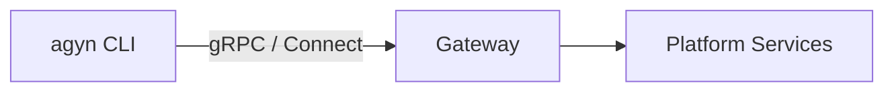

# agyn-cli

## Overview

`agyn` is the platform CLI. It provides command-line access to all platform capabilities exposed through the [Gateway](gateway.md) API. Used by administrators, developers, and agents to manage platform resources and perform operations.

| Aspect | Details |
|--------|---------|
| Binary name | `agyn` |
| Repository | `agynio/agyn-cli` |
| Language | Go |
| Protocol | gRPC and Connect (HTTP/JSON) via [Gateway](gateway.md) |

## Scope

`agyn` is a thin client over the Gateway API. It authenticates, serializes commands into API calls, and presents results. It contains no business logic — all operations are performed server-side.

The one exception is the [`agyn local`](#local-platform-commands-agyn-local) command group, which manages a local platform VM on the user's machine: it talks to the artifact CDN and Lima, not to a Gateway.

## Usage Examples

```bash
# Resource management
agyn agents list
agyn agents create --name "my-agent" --model <model-id>
agyn agents list

# Agent-to-agent communication
agyn threads create --ref research --add @research_bot
agyn threads send --thread research --message "Summarize X" --wait 120
agyn threads read --thread research --unread
agyn threads reply --to-message <msg-id> --message "Focus on methodology"

# File upload/download
agyn files upload ./report.pdf
agyn files download <file-id> --output ./copy.pdf
agyn files info <file-id>
agyn files url <file-id>

# Send message with file attachment
FILE_ID=$(agyn files upload ./diagram.png)
agyn threads send --thread research --message "See diagram" --file "$FILE_ID"

# Explicit agent instance creation (usually not needed — threads create/add does it lazily)
agyn agents instantiate @research_bot --label planning-run-1

# Port exposure (inside agent containers)
agyn expose add 3000
agyn expose remove 3000
agyn expose list

# Sandboxes (engineer-launched workloads with shell access)
agyn sandbox start --env python-tools
agyn sandbox connect brave-otter
agyn sandbox list

# Run the full platform locally from a prebuilt VM image
agyn local start
agyn local status

# Any Gateway API operation
agyn <resource> <verb> [flags]
```

## Users

| User | Context | Example |
|------|---------|---------|
| **Administrators** | Manage platform resources from a terminal | `agyn agents create`, `agyn agents list` |
| **Developers** | Interact with the platform during development | `agyn messages send`, `agyn threads list` |
| **Agents** | Invoke platform operations from within an agent runtime (e.g., update memory, add agents, expose ports) | `agyn agents create`, `agyn messages send`, `agyn expose add 3000` |

All users interact with the same Gateway API. [Authorization](authz.md) determines what each identity is permitted to do.

## Output Format

All `agyn` commands accept `--json` or `--yaml` global flags to change output format. Default is markdown, optimized for LLM consumption. Structured formats are useful for scripting or when the output will be parsed programmatically.

```bash
agyn threads read --thread research --unread          # markdown (default)
agyn threads read --thread research --unread --json   # JSON
agyn threads read --thread research --unread --yaml   # YAML
agyn agents list --json                               # JSON
```

## Thread Commands

Agents use the `threads` command group to create threads, send messages, and read responses — the primary mechanism for agent-to-agent communication.

### Commands

| Command | Description |
|---------|-------------|
| `agyn threads create --thread REF [--add @HANDLE]... [--message TEXT] [--file FILE_ID]... [--wait SECONDS]` | Create a new thread. Stores a local ref alias, optionally adds participants, optionally sends an initial message. `--wait` blocks until a response arrives. The caller is added as a participant automatically, using its own [instance](agent-instances.md) identity (see [Handles](#agent-and-instance-handles)) |
| `agyn threads add --thread REF --participant @HANDLE` | Add a participant to an existing thread. `@HANDLE` may reference an agent class (`@bob`) or an agent instance (`@bob#7a2f`) — see [Class vs. Instance](#class-vs-instance-in-thread-commands) |
| `agyn threads send --thread REF --message TEXT [--file FILE_ID]... [--wait SECONDS]` | Send a message. `--thread` is required. With `--wait`: block until any new message arrives on the thread from a different sender, or timeout |
| `agyn threads reply --to-message MSG_ID --message TEXT [--file FILE_ID]... [--wait SECONDS]` | Reply to a specific message. The thread is derived from the message; the sender is set on the reply for audit. Useful for agents so the LLM does not need to track thread IDs by hand |
| `agyn threads read --thread REF... [--unread] [--after MESSAGE_ID] [--tail N] [--limit N] [--wait SECONDS]` | Read messages from one or more threads. `--thread` can be repeated |
| `agyn threads list` | List locally known ref → thread ID mappings |

`REF` is either a local ref (resolved via `~/.agyn/threads.json`) or a thread UUID directly. Unlike earlier versions of this CLI, `--thread` is **mandatory** on `send` — the CLI does not resolve a current thread from any environment variable. See [Agent Instances — Outbound](agent-instances.md) for the rationale.

### Agent and Instance Handles

`@HANDLE` identifies a platform identity within the organization:

| Handle form | Refers to |
|-------------|-----------|
| `@alice` | A user, an agent class, or an app installation — resolved by nickname |
| `@bob#7a2f` | A specific [agent instance](agent-instances.md) — the class nickname plus an instance suffix (either the instance's `label` or a system-generated stem) |

The `#suffix` split is a first-class part of nickname resolution. Handles without `#` never resolve to an instance.

### Class vs. Instance in Thread Commands

When adding an agent participant, the caller chooses between class and instance:

- **Class handle (`@bob`)** — Threads creates a fresh [agent instance](agent-instances.md#class-on-add-rewrite) of the class and stores that instance's id as the participant. This is "spawn a fresh assistant for this conversation."
- **Instance handle (`@bob#7a2f`)** — Threads stores the existing instance id directly. This is "use this specific running assistant." Follow-up messages on the thread route to the same instance's inbox — the way to preserve context across sub-threads.

The response of `agyn threads create` and `agyn threads add` includes the resolved participant handle so the caller can address the specific instance in later calls.

The agent that owns the current process is added to threads it creates as its own instance (not its class) — the shell writing `agyn threads create` is inside an agent workload whose `AGENT_INSTANCE_ID` is known, and that instance is what joins.

### Local Ref State

Thread refs are local aliases stored in `~/.agyn/threads.json` as a ref → thread ID map. Refs have no meaning to the platform — they exist only in the container's local filesystem.

```json
{
  "research": "550e8400-e29b-41d4-a716-446655440000",
  "planning": "6ba7b810-9dad-11d1-80b4-00c04fd430c8"
}
```

Threads created via `agyn threads create --thread REF` are written to this file. When `REF` is passed to any command, `agyn` checks this file first and falls back to treating the value as a raw thread UUID.

### Read Options

| Flag | Description |
|------|-------------|
| `--unread` | Only messages not yet read by this participant (acked after return) |
| `--after MESSAGE_ID` | Only messages after the given message ID |
| `--tail N` | The N most recent messages |
| `--limit N` | Maximum messages to return (default: 20) |
| `--wait SECONDS` | Block until messages are available or timeout. Exit code 1 on timeout |

`--unread` and `--after` are mutually exclusive. `--wait` can be combined with any read mode — it activates only when there are no matching messages at call time.

### Wait Behavior

`--wait SECONDS` subscribes to the Gateway notification stream for `message.created` events on the caller's own room — `thread_participant:me` for users and apps, `instance_inbox:me` for agent instances (Notifications rewrites `:me` to the caller's `identity_id`). It does not poll. On `send --wait` and `create --wait`, the subscription opens after the message is sent and resolves when a response from a different sender arrives. On `read --wait`, the subscription opens when no qualifying messages exist and resolves when any new message arrives on any of the specified threads.

Exit code 1 on timeout. Callers can branch on exit code to distinguish a response from a timeout.

For agents, `--wait` is optional ergonomics only — an agent that returns control to `agynd` between calls will be re-invoked automatically when new inbox items arrive, with no need to block. `--wait` is primarily useful for shell scripts and interactive developer use, where a synchronous reply is easier to consume.

### Output

Messages use the default markdown format (see [Output Format](#output-format)):

```
from: @research_bot
Here is my analysis of the papers...

from: @alice
Can you focus on the methodology section?

```

When reading from multiple threads, each message is prefixed with a `thread:` line:

```
thread: research
from: @research_bot
Here is my analysis...

thread: planning
from: @planning_agent
The timeline looks good.

```

With `--json`, each message is an object with `id`, `thread_id`, `thread_ref` (if a local ref is known), `sender` (`@nickname`), `body`, and `created_at`.

`agyn threads create` outputs the thread ID as plain text. `agyn threads send` (without `--wait`) outputs the sent message ID.

### Example Flow

```bash
# Create a sub-thread with a fresh instance of @research_bot and send the first message.
# The caller is added as its own agent instance so replies land in its inbox.
agyn threads create --thread research --add @research_bot \
  --message "Summarize recent papers on X"

# Spin up two sub-threads in parallel; both instances reply asynchronously into the caller's inbox.
agyn threads create --thread planning --add @planning_agent --message "Draft a timeline"

# The agent's next invocation (triggered by the incoming inbox item) reads the messages:
agyn threads read --thread research --thread planning --unread
```

A shell script (not an agent) can use `--wait` to block synchronously:

```bash
agyn threads send --thread research --message "Focus on methodology" --wait 120
```

---

## Files Commands

Agents and developers use the `files` command group to upload and download files through the [Files service](media.md).

### Commands

| Command | Description |
|---------|-------------|
| `agyn files upload <path> [--filename NAME] [--type MIME_TYPE]` | Upload a local file. Returns the file ID. `--filename` overrides the name sent to the server (default: basename of `<path>`). `--type` overrides the detected MIME type |
| `agyn files download <file-id> [--output PATH]` | Download a file by ID. Writes content to `PATH` if given, otherwise writes to the original filename in the current directory |
| `agyn files info <file-id>` | Print file metadata (id, filename, content_type, size_bytes, created_at) |
| `agyn files url <file-id>` | Print a pre-signed download URL for the file. The URL expires after one hour |

### Upload

```bash
# Upload and capture the file ID
FILE_ID=$(agyn files upload ./report.pdf)

# Override filename and MIME type
agyn files upload ./data.bin --filename export.bin --type application/octet-stream

# Upload and attach to a thread message in one flow
FILE_ID=$(agyn files upload ./diagram.png)
agyn threads send --thread research --message "See the attached diagram" --file "$FILE_ID"
```

MIME type is inferred from the file extension when `--type` is omitted. If inference fails, `application/octet-stream` is used as the fallback.

Upload streams the file to the server in 64 KiB chunks using client-streaming gRPC (via the Gateway). No full-file buffering occurs.

### Download

```bash
# Write to the original filename in the current directory
agyn files download f47ac10b-58cc-4372-a567-0e02b2c3d479

# Write to an explicit path
agyn files download f47ac10b-58cc-4372-a567-0e02b2c3d479 --output ./local-copy.pdf
```

Download uses the `GetFileContent` server-streaming RPC and assembles chunks locally. When `--output` is omitted, the filename is taken from the file's stored metadata.

### Output

`agyn files upload` prints the file ID as plain text.

`agyn files download` writes the file to disk and prints the output path to stdout.

`agyn files info` uses the default markdown format:

```
id: f47ac10b-58cc-4372-a567-0e02b2c3d479
filename: report.pdf
content_type: application/pdf
size_bytes: 204800
created_at: 2025-11-15T10:30:00Z
```

With `--json`:

```json
{
  "id": "f47ac10b-58cc-4372-a567-0e02b2c3d479",
  "filename": "report.pdf",
  "content_type": "application/pdf",
  "size_bytes": 204800,
  "created_at": "2025-11-15T10:30:00Z"
}
```

`agyn files url` prints the pre-signed URL as plain text.

### Attaching Files to Messages

The `threads send` and `threads create` commands accept `--file <file-id>` (repeatable) to attach previously uploaded files to a message:

```bash
agyn threads send --thread research --message "Analyze these reports" \
  --file f47ac10b-58cc-4372-a567-0e02b2c3d479 \
  --file 9b1deb4d-3b7d-4bad-9bdd-2b0d7b3dcb6d
```

`--file` can be combined with `--wait` on `send` and `create`.

---

## Port Exposure Commands

Agents use the `expose` command group to make ports inside their container accessible to users over the OpenZiti network. See [Expose Service](expose-service.md) for the architecture.

| Command | Description |
|---------|-------------|
| `agyn expose add <port>` | Expose a port. Returns the access URL (`http://exposed-<id>.ziti:<port>`) |
| `agyn expose remove <port>` | Un-expose a port |
| `agyn expose list` | List active exposures for the current workload |

These commands call the [Gateway](gateway.md) → [Expose Service](expose-service.md). The agent's workload context is resolved from the authenticated identity.

---

## Sandbox Commands

Engineers use the `sandbox` command group to start on-demand workloads and attach interactive shells to them. See [Sandboxes](../product/sandboxes/sandboxes.md) for the product behavior and [Resource Definitions — Sandbox](resource-definitions.md#sandbox) for the resource.

| Command | Description |
|---------|-------------|
| `agyn sandbox start [--env NAME] [--name NAME] [--agent @HANDLE]` | Create a sandbox running an [environment](resource-definitions.md#environment), wait for the workload, attach a shell. `--env` defaults to the organization's sole environment when exactly one exists. `--agent` resolves the agent's environment instead. `--name` is auto-generated when omitted |
| `agyn sandbox connect [NAME]` | Attach a shell to an existing sandbox. Calls `EnsureSandboxRunning` before requesting a terminal ticket: no-op when `running`, restart when `stopped`, fresh start attempt when `failed`. With no argument: connects when the caller owns exactly one non-terminated sandbox, otherwise lists candidates |
| `agyn sandbox list [--all] [--terminated]` | List the caller's sandboxes. Terminated sandboxes are hidden unless `--terminated` is passed. `--all` lists every sandbox in the organization (org owners) |
| `agyn sandbox stop [NAME]` | Stop the workload; keep the sandbox record and workspace volume |
| `agyn sandbox delete [NAME]` | Terminate the sandbox and delete its workspace volume |

The shell session is a WebSocket to the Terminal Proxy, which routes to the hosting runner's `Exec` API (see [Runners — Terminal Proxy Integration](runners.md#terminal-proxy-integration)). A dropped connection ends the session, not the sandbox — `agyn sandbox connect` reattaches. `start` and `connect` require a TTY; there is no non-interactive exec mode in v1.

---

## Local Platform Commands (`agyn local`)

The `local` command group runs the full Agyn platform on the user's machine from a prebuilt VM image — see [Local Bundle](operations/local-bundle.md) for the image architecture. Unlike every other command group, `agyn local` does not call the Gateway API: it downloads published images from the CDN and manages a [Lima](https://lima-vm.io/) VM locally.

### Commands

| Command | Description |
|---------|-------------|
| `agyn local start` | Download the image if needed → create/boot the VM → optionally install the CA. Flags: `--version`, `--port`, `--cpus`, `--memory`, `--install-ca` \| `--no-ca`, `--download-only`, `-y` |
| `agyn local stop` \| `restart` | Stop / restart the VM |
| `agyn local status` | State, version, port, endpoint health, CA trust. `--output table\|json\|yaml` |
| `agyn local delete` | Remove the VM. `--purge` also removes downloaded images and certs |
| `agyn local upgrade` | Upgrade the `agyn-platform` and `agyn-apps` releases in the running VM to the newest charts, keeping the VM and its data. Everything from the image (k3s, Istio, cert-manager, OpenZiti) moves only by recreating the VM — see [Upgrade Model](operations/local-bundle.md#upgrade-model) |
| `agyn local doctor` | Dependency and environment checks with fix hints |
| `agyn local config` | `list` \| `get <key>` \| `set <key> <value>` |
| `agyn local ca` | `show` \| `export` \| `install` \| `uninstall` |

### Design

| Concern | Behavior |
|---------|----------|
| **Single instance** | One Lima VM named `agyn` per machine; no multi-instance |
| **State containment** | Everything lives under `~/.agyn/local/` — `images/<version>/<arch>/` (verified downloads), `certs/`, `lima/` (dedicated `LIMA_HOME`) — so `delete --purge` is a clean sweep. Settings live in `~/.agyn/config.yaml` under a `local:` key (`port`, `version`, `cpus`, `memory`) |
| **Version resolution** | `version: latest` resolves via `bundle-vm/latest.json` on the CDN; pinned versions bypass it. Downloads are sha256-verified against the published checksums, resumable, and atomic |
| **Networking** | The host port (default `2496`) is a Lima forward onto the VM's ingress NodePort; port collision detection suggests alternatives. `*.agyn.dev` resolves to `127.0.0.1`, so endpoints are `https://console.agyn.dev:<port>` etc. — see [Local Bundle — Networking](operations/local-bundle.md#networking) |
| **Certificates** | `agyn local ca` extracts the CA baked into the image and installs it into the system trust store (macOS keychain / Linux ca-certificates; requires sudo) |
| **Dependencies** | `limactl`, `xz`, `qemu` are checked by `doctor` and by `start` preflight. Not auto-installed — fix hints are printed |

### Interactive and Non-Interactive Modes

On a TTY without `-y`, `agyn local start` runs a first-run wizard: dependency check → port selection → download progress → boot → "trust CA?" prompt.

With `-y` or without a TTY, no prompts occur. Configuration resolves as flags > environment > config file > defaults, and commands fail with actionable messages when a human is required (e.g., sudo for trust-store installation). `status` and `doctor` emit JSON/YAML for scripting.

---

## Authentication

`agyn` supports two authentication methods, with the same priority order used by all CLI tools in the platform (see [CLI Authentication](authn.md#cli-authentication)):

| Method | Mechanism | Use Case |
|--------|-----------|----------|
| **Network identity (Ziti sidecar)** | Pod-level [OpenZiti](authn.md#network-identity-openziti) mTLS via the Ziti sidecar — automatic when the sidecar is present | Inside agent pods where a Ziti sidecar has enrolled an OpenZiti identity |
| **Auth token** | Token stored in `~/.agyn/credentials` and sent to the [Gateway](gateway.md) | Developer machines, CI, any environment without OpenZiti |

Network identity takes precedence when available. Otherwise, `agyn` reads the stored token from `~/.agyn/credentials`.

## Relationship to Other Components


```mermaid
graph LR
    agyn[agyn CLI] -->|gRPC / Connect| Gateway
    Gateway --> Services[Platform Services]
```

`agyn` is a pure API client. It does not interact with platform services directly — all operations go through the [Gateway](gateway.md). The [`agyn local`](#local-platform-commands-agyn-local) command group is the exception: it manages a local VM and fetches images from the CDN, touching no Gateway at all.
