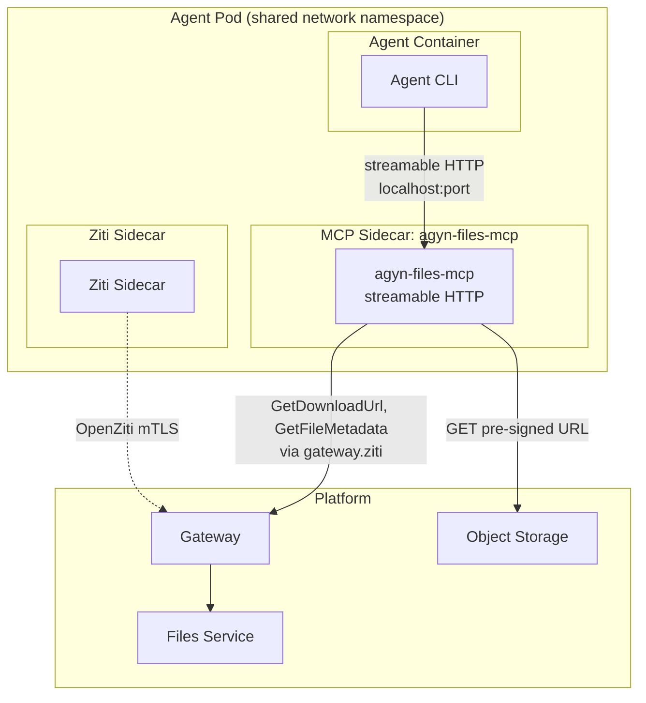
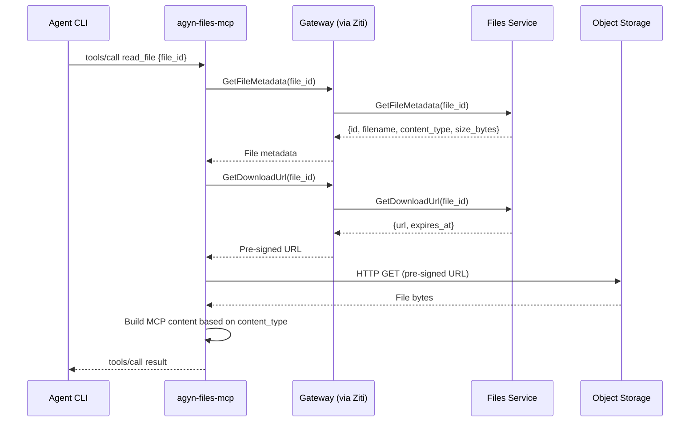

# agyn-files-mcp

## Overview

`agyn-files-mcp` is a platform-provided MCP server that gives agents access to files uploaded to the platform. It exposes a single `read_file` tool that fetches file content from the [Files](media.md) service and returns it in the appropriate MCP content type. The LLM calls this tool when it encounters `agynfile://<id>` references in the conversation context.

| Aspect | Details |
|--------|---------|
| Repository | `agynio/agyn-files-mcp` |
| Language | Go |
| Transport | Streamable HTTP |
| Role | MCP server — file access for agents |

## Architecture



`agyn-files-mcp` runs as a sidecar container in the agent pod. It connects to the [Gateway](gateway.md) via the `gateway.ziti` OpenZiti hostname (transparently intercepted by the pod's Ziti sidecar) to access the Files service API. It downloads file content directly from object storage using pre-signed URLs obtained from the Files service.

## Tool

### `read_file`

Reads a file from the platform's Files service and returns its content.

**Tool definition:**

```json
{
  "name": "read_file",
  "description": "Read a file from the platform. Use this tool to access file content when you see agynfile:// references in the conversation.",
  "inputSchema": {
    "type": "object",
    "properties": {
      "file_id": {
        "type": "string",
        "description": "The file ID from an agynfile:// URI (the part after agynfile://)"
      }
    },
    "required": ["file_id"]
  }
}
```

### Flow



1. Agent CLI sends `tools/call` with `read_file` and a `file_id`.
2. MCP server fetches file metadata from the Files service (via Gateway) to determine `content_type` and `filename`.
3. MCP server obtains a pre-signed download URL from the Files service (via Gateway).
4. MCP server downloads the file content from object storage using the pre-signed URL.
5. MCP server builds the appropriate MCP tool result content based on the file's MIME type.
6. MCP server returns the tool result to the agent CLI.

### Response Content Types

The MCP server selects the response content type based on the file's MIME type:

| File MIME type | MCP content type | Format |
|----------------|-----------------|--------|
| `image/*` | `image` | `{ "type": "image", "data": "<base64>", "mimeType": "<content_type>" }` |
| `text/*`, `application/json`, `application/xml`, `application/yaml` | `text` | `{ "type": "text", "text": "<decoded file content>" }` |
| All other types | `resource` (binary) | `{ "type": "resource", "resource": { "uri": "agynfile://<file_id>", "mimeType": "<content_type>", "blob": "<base64>" } }` |

**Examples:**

Image file (`image/png`):
```json
{
  "content": [
    {
      "type": "image",
      "data": "iVBORw0KGgo...",
      "mimeType": "image/png"
    }
  ]
}
```

Text file (`text/plain`):
```json
{
  "content": [
    {
      "type": "text",
      "text": "file content here..."
    }
  ]
}
```

Binary file (`application/pdf`):
```json
{
  "content": [
    {
      "type": "resource",
      "resource": {
        "uri": "agynfile://file-uuid",
        "mimeType": "application/pdf",
        "blob": "JVBERi0xLjQ..."
      }
    }
  ]
}
```

### Error Handling

Errors are reported as MCP tool execution errors (`isError: true`), not protocol-level errors:

| Condition | Error behavior |
|-----------|---------------|
| File not found | `isError: true`, text: "file not found: `<file_id>`" |
| File exceeds max size | `isError: true`, text: "file too large: `<size_bytes>` bytes exceeds limit of `<max_bytes>` bytes" |
| Download failure | `isError: true`, text: "failed to download file: `<details>`" |
| Gateway/Files service unavailable | `isError: true`, text: "platform service unavailable" |

## Authentication

`agyn-files-mcp` authenticates to the Gateway using the same mechanisms available to all components in the agent pod:

| Method | Mechanism | Use Case |
|--------|-----------|----------|
| **Network identity (Ziti sidecar)** | Pod-level [OpenZiti](authn.md#network-identity-openziti) mTLS via the Ziti sidecar — automatic when the sidecar is present | Primary. Inside agent pods on the platform |
| **API token** | `AGYN_API_TOKEN` environment variable, sent as `Authorization: Bearer` to the Gateway | Local development, testing, CI |

The API token fallback allows running `agyn-files-mcp` outside the platform for testing. When `AGYN_API_TOKEN` is set, the MCP server uses it for Gateway authentication instead of relying on the Ziti sidecar.

## Configuration

| Variable | Required | Description |
|----------|----------|-------------|
| `MCP_PORT` | yes | Port to listen on (assigned by the [Agents Orchestrator](agents-orchestrator.md)) |
| `GATEWAY_ADDRESS` | yes | Gateway address. Inside the platform: `gateway.ziti` (intercepted by Ziti sidecar). Outside: `https://gateway.agyn.dev` |
| `AGYN_API_TOKEN` | no | API token for Gateway authentication. Used when Ziti sidecar is not present (local dev, testing) |
| `MAX_FILE_SIZE` | no | Maximum file size in bytes the tool will read. Default: configurable per deployment |

## Deployment

`agyn-files-mcp` is deployed as an MCP sidecar container in the agent pod, following the standard [MCP sidecar pattern](mcp.md). It is a streamable HTTP server — no sidecar proxy is needed.

The [Agents Orchestrator](agents-orchestrator.md) automatically includes `agyn-files-mcp` as a sidecar for agents that have file access enabled. It is configured as a standard [MCP resource](resource-definitions.md#mcp) on the agent.

| Aspect | Detail |
|--------|--------|
| Image | `ghcr.io/agynio/agyn-files-mcp:latest` |
| Transport | Streamable HTTP (native) |
| Port | Assigned by Orchestrator via `MCP_PORT` |
| Proxy | Not needed — native streamable HTTP |

## MCP Capabilities

```json
{
  "capabilities": {
    "tools": {}
  }
}
```

The server declares only the `tools` capability. It does not support `listChanged` (the tool list is static), resources, or prompts.
