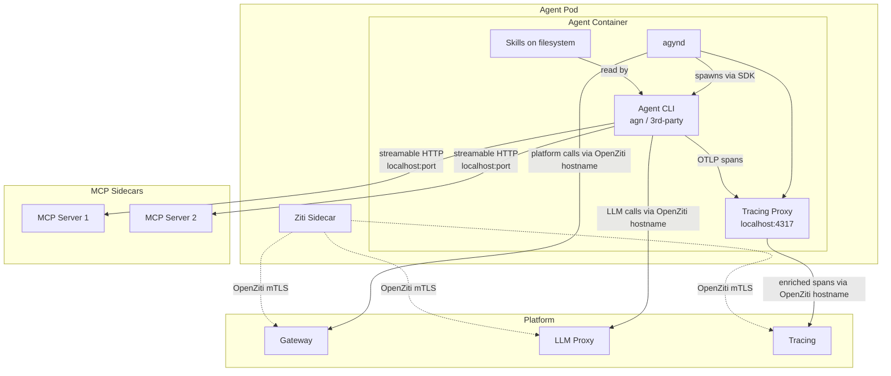
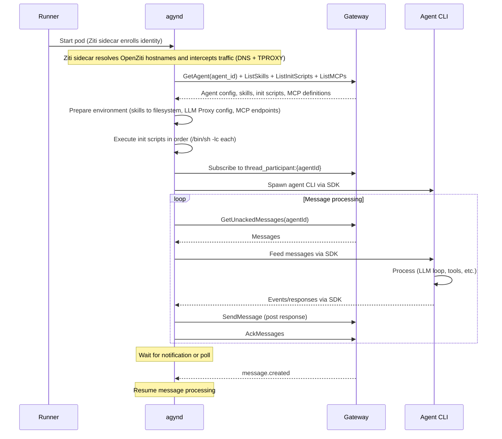

# agynd-cli

## Overview

`agynd` is the agent wrapper daemon. It bridges any agent CLI with the platform by connecting to the [Gateway](gateway.md) and the [LLM Proxy](llm-proxy.md) via OpenZiti service hostnames (for example, `gateway.ziti`, `llm-proxy.ziti`) that are transparently intercepted by the pod's [Ziti sidecar](openziti.md#agent-access-scope), preparing the agent runtime environment, and managing the agent process lifecycle. The [Runner](runner.md) starts `agynd` as the main process in an agent container.

| Aspect | Details |
|--------|---------|
| Binary name | `agynd` |
| Repository | `agynio/agynd-cli` |
| Language | Go |
| Role | Agent container entrypoint — bridges agent CLI with platform services |

## Responsibilities

### 1. Platform Connection

`agynd` implements the [agent contract](agent/overview.md):

- Subscribes to `thread_participant:{agentId}` room via [Gateway](gateway.md) → [Notifications](notifications.md) (server-streaming).
- Pulls unacknowledged messages via `GetUnackedMessages(thread_id: THREAD_ID)` (Gateway → [Threads](threads.md)), scoped to the thread the Orchestrator assigned this workload to process.
- Posts agent responses back to the thread via `SendMessage`.
- Acknowledges processed messages via `AckMessages`.
- Follows the [Consumer Sync Protocol](notifications.md#consumer-sync-protocol) for reliable message delivery.
- Sends keepalive signals to the [Runners](runners.md) service (via [Gateway](gateway.md)) while the agent is actively processing. See [Activity Keepalive](#5-activity-keepalive).

### 2. Message Formatting

`agynd` translates thread messages into the format expected by the agent CLI before feeding them via the SDK. Thread messages contain structured data (`body`, `files[]`), but agent CLIs receive plain text.

When a thread message has file attachments, `agynd` appends `agyn://file/` URIs after the message body. See [Media — Message Formatting for LLM](media.md#message-formatting-for-llm).

```
What's in this image?
agyn://file/file-uuid-1
```

Messages without file attachments are sent as the `body` field only. The `agyn://file/` scheme is only appended when the `files` array is non-empty.

The agent CLI has no knowledge of thread messages, file IDs, or the `files` array — it receives pre-formatted plain text.

### 3. Environment Preparation

Before spawning the agent CLI, `agynd` fetches agent configuration from the platform via the Gateway (`gateway.ziti`) using its own agent OpenZiti identity. Authentication is handled at the network level by the pod's Ziti sidecar. `agynd` reads its `agent_id` from the `AGENT_ID` environment variable and passes it explicitly in each API call. The preparation is agent-specific — different agent CLIs expect different configuration conventions:

| Preparation | Description |
|-------------|-------------|
| **Skills** | Fetches skills via `ListSkills(agent_id)` and writes content to the filesystem in the directory structure expected by the agent CLI |
| **LLM endpoint** | Writes [LLM Proxy](llm-proxy.md) endpoint configuration into the agent CLI's config file so the agent CLI knows where to make model calls. See [LLM Endpoint Configuration](#llm-endpoint-configuration) |
| **MCP tools** | Configures the agent CLI with [MCP](mcp.md) server endpoints (`localhost:<port>` per server) from the `AGENT_MCP_SERVERS` env var so the agent CLI connects to each MCP sidecar directly over streamable HTTP |
| **Tracing endpoint** | Runs a local [OTLP tracing proxy](tracing.md#agynd-tracing-proxy) on `localhost:4317` that injects `agyn.thread.id`, `agyn.thread.message.id`, and `agyn.workload.id` and forwards spans to the [Tracing](tracing.md) service via `tracing.ziti` |
| **Init scripts** | Fetches [init scripts](resource-definitions.md#initscript) via `ListInitScripts(agent_id)` and executes each in creation order using the container's default shell. Each script runs with its working directory set to `WORKSPACE_DIR` when that variable is defined in the subprocess environment, and to `/tmp` otherwise. Runs after environment setup and before spawning the agent CLI. If a script exits with a non-zero code, the script name and stderr output are printed to the container's stderr and execution continues with the next script. |
| **PATH** | Prepends `/agyn-bin/cli` to `PATH` in the subprocess environment so the `agyn` platform CLI is available by name to the agent and any shell commands it runs. Only `/agyn-bin/cli` is added — `agynd` itself and the agent CLI binary are not placed on `PATH` |

All user-defined environment variables — both plain-text values and resolved secret values — are injected directly into the container by the [Agents Orchestrator](agents-orchestrator.md) at workload assembly time. `agynd` reads them from the process environment and does not call `ListENVs`.

This approach mirrors how tools like Claude Code and Codex CLI receive their configuration — through filesystem conventions and environment rather than a custom protocol.

The configuration strategy per agent CLI (where skills are placed, how MCP servers are connected, what environment variables are set) is determined by the [Agent Init Container](agent-init.md) — the init image's `config.json` specifies which SDK module `agynd` uses.

#### LLM Endpoint Configuration

`agynd` configures each agent CLI to use the [LLM Proxy](llm-proxy.md) as its LLM endpoint. The configuration method is agent-specific:

**Codex CLI** — `agynd` writes `~/.codex/config.toml` with a custom model provider pointing at the LLM Proxy, and sets `CODEX_HOME=~/.codex` and `OPENAI_API_KEY` in the subprocess environment:

```toml
model_provider = "platform"

[model_providers.platform]
name = "Agyn LLM"
base_url = "http://llm-proxy.ziti/v1"
env_key = "OPENAI_API_KEY"
wire_api = "responses"
```

The custom provider is used instead of overriding the built-in OpenAI provider via `OPENAI_BASE_URL` because the built-in provider triggers behaviors the LLM Proxy does not implement (remote compaction via `POST /responses/compact`, realtime WebSocket) and has `env_key: None` which prevents `OPENAI_API_KEY` from being used for Bearer authentication in the subprocess auth pipeline.

If `HOME` is empty in the Codex subprocess environment, `agynd` sets `HOME=/tmp` before spawning — Codex resolves `~/.codex` against `HOME` and needs a writable path. The platform does not inject `HOME` at the orchestrator level; image defaults and user-set [ENVs](resource-definitions.md#env) apply. This fallback is Codex-specific and does not apply to other SDKs.

**[`agn`](agn-cli.md)** — `agynd` writes `~/.agyn/agn/config.yaml` with the LLM Proxy endpoint:

```yaml
llm:
  endpoint: http://llm-proxy.ziti/v1
```

**Claude Code** — `agynd` writes `~/.claude/settings.json` with LLM Proxy configuration and full tool permissions:

```json
{
  "env": {
    "ANTHROPIC_BASE_URL": "http://llm-proxy.ziti/v1",
    "ANTHROPIC_AUTH_TOKEN": "unused-ziti-mTLS",
    "DISABLE_AUTOUPDATER": "1",
    "CLAUDE_CODE_DISABLE_NONESSENTIAL_TRAFFIC": "1"
  },
  "permissions": {
    "allow": [
      "Bash",
      "Read",
      "Write",
      "Edit",
      "Glob",
      "Grep",
      "WebFetch",
      "WebSearch",
      "Task",
      "TodoWrite",
      "NotebookEdit"
    ],
    "deny": []
  }
}
```

`ANTHROPIC_BASE_URL` overrides the API endpoint. `ANTHROPIC_AUTH_TOKEN` sets a custom `Authorization: Bearer` header value — when running with the Ziti sidecar, authentication is handled at the network level, so the value is unused but must be non-empty to suppress Claude Code's authentication prompt. `DISABLE_AUTOUPDATER` prevents background update checks. `CLAUDE_CODE_DISABLE_NONESSENTIAL_TRAFFIC` disables telemetry and other non-essential outbound requests.

The `permissions` block grants all built-in tools without interactive confirmation. The platform provides isolation and security at the container level — the agent should be able to perform any filesystem, shell, and network action within its container.

Inside the platform, agents connect to the LLM Proxy using the `llm-proxy.ziti` OpenZiti hostname. The Ziti sidecar resolves the hostname and transparently intercepts connections via DNS + TPROXY, so agent CLI subprocesses connect with standard HTTP clients — no OpenZiti SDK required. When running with the Ziti sidecar, authentication is handled at the network level by the sidecar's mTLS — the `OPENAI_API_KEY` value is unused. Over the public endpoint (development, CI), the token must be a valid platform API token (`agyn_...`).

### 4. Agent Process Management

`agynd` spawns the configured agent CLI as a child process and communicates with it through an SDK specific to each agent type.

The agent CLI can be:
- [`agn`](agn-cli.md) — our own agent loop implementation.
- Any 3rd-party CLI (Claude Code, Codex CLI, custom implementations).

### 5. Activity Keepalive

`agynd` reports agent activity to the [Runners](runners.md) service for [idle timeout](runners.md#idle-timeout) enforcement. While the agent CLI is actively processing (executing LLM calls, running tools, producing output), `agynd` calls `TouchWorkload` on the [Runners](runners.md) service (via [Gateway](gateway.md)) every 10 seconds. This updates the `last_activity_at` timestamp on the workload record.

When the agent is idle (turn complete, waiting for new messages), `agynd` stops sending keepalives. The [Agents Orchestrator](agents-orchestrator.md) compares `last_activity_at` against the agent's [`idle_timeout`](resource-definitions.md#agent) and stops workloads that have been idle too long.

`agynd` determines activity state from the agent CLI SDK — it knows when the agent is processing a request vs. waiting for input. The keepalive is SDK-agnostic: regardless of which agent CLI is running (Codex, Claude Code, `agn`), `agynd` uses the same `TouchWorkload` mechanism.

## Agent Communication Protocol

`agynd` does not implement agent protocols directly. It imports a separate **Go SDK module** for each supported agent CLI. Each SDK handles subprocess spawning, protocol encoding/decoding, and message framing.

```
agynd
├── imports codex-sdk-go     → spawns `codex app-server`  → JSON-RPC v2 over stdio
├── imports claude-sdk-go    → spawns `claude`             → custom JSONL over stdio
└── imports agn-sdk-go       → spawns `agn serve`          → JSON-RPC v2 over stdio
```

### Protocol per agent

| Agent CLI | SDK Module | Protocol | Subprocess Command |
|-----------|-----------|----------|-------------------|
| **Codex** | `codex-sdk-go` | JSON-RPC v2 | `codex app-server` |
| **Claude Code** | `claude-sdk-go` | Custom JSONL | `claude --output-format stream-json --input-format stream-json --verbose` |
| **agn** | `agn-sdk-go` | JSON-RPC v2 | `agn serve` |

Only `codex-sdk-go` is integrated in the initial implementation; `claude-sdk-go` does not exist as a repo and `agn-sdk-go` lives in `agn-cli/sdk/` but is not wired into `agynd`, so Claude and agn return `unsupported` at runtime.

### SDK responsibilities

Each SDK module is responsible for:

- Spawning and managing the agent CLI subprocess.
- Encoding outbound messages (prompts, control requests) in the agent's wire format.
- Decoding inbound messages (responses, events, errors) from the agent's wire format.
- Exposing a Go API that `agynd` calls — `agynd` never touches raw protocol bytes.

### Protocol details

**Codex** uses a documented JSON-RPC v2 protocol via `codex app-server`. The protocol has a [machine-readable JSON Schema](https://github.com/openai/codex/blob/main/codex-rs/app-server-protocol/schema/json/codex_app_server_protocol.v2.schemas.json) (~530 types, ~50 notification types, ~10 request methods). Types for `codex-sdk-go` are auto-generated from this schema. Documentation: [developers.openai.com/codex/app-server](https://developers.openai.com/codex/app-server/).

**Claude Code** uses a custom JSONL protocol with no formal specification. The protocol is defined implicitly by the [Python SDK source](https://github.com/anthropics/claude-agent-sdk-python) and [TypeScript SDK reference](https://platform.claude.com/docs/en/agent-sdk/typescript). Types for `claude-sdk-go` are reverse-engineered from these sources. Inbound messages are discriminated by a `type` field (`assistant`, `user`, `system`, `result`, `stream_event`, `rate_limit_event`). Outbound messages include initialize requests, user messages, and control requests.

**agn** uses JSON-RPC v2, same protocol pattern as Codex. agn defines its own schema. The `agn-sdk-go` module is exported from the agn repository.

### Why separate SDK modules

- Each SDK is independently versioned and reusable outside `agynd`.
- `agynd` has zero protocol logic — all wire format details are encapsulated in the SDK.
- Codex and agn share JSON-RPC v2, enabling a shared transport library underneath both SDKs.
- Protocol changes in Codex are caught by re-generating from its JSON Schema. Protocol changes in Claude Code require monitoring SDK source.

## Authentication

`agynd` supports two authentication methods, with the same priority order used by all CLI tools in the platform (see [CLI Authentication](authn.md#cli-authentication)):

| Method | Mechanism | Use Case |
|--------|-----------|----------|
| **Network identity (Ziti sidecar)** | Pod-level [OpenZiti](authn.md#network-identity-openziti) mTLS via the Ziti sidecar — automatic when the sidecar is present | Primary. The Orchestrator creates an OpenZiti identity and passes the enrollment JWT via Runner. The Ziti sidecar enrolls on startup and transparently intercepts OpenZiti service hostnames via DNS + TPROXY |
| **Auth token** | Token stored in `~/.agyn/credentials` and sent to the [Gateway](gateway.md) | Development, testing, or environments without OpenZiti |

In production, the pod's Ziti sidecar handles OpenZiti enrollment and mTLS. `agynd` connects to Gateway and LLM Proxy using OpenZiti service hostnames (for example, `gateway.ziti`, `llm-proxy.ziti`); the sidecar resolves these names and transparently intercepts traffic via DNS + TPROXY, so `agynd` does not embed the OpenZiti SDK. The [agent identity lifecycle](authn.md#agent-identity-lifecycle) is managed by the Orchestrator. The enrollment JWT is consumed by the sidecar, not by `agynd`.

## Architecture



## Lifecycle


