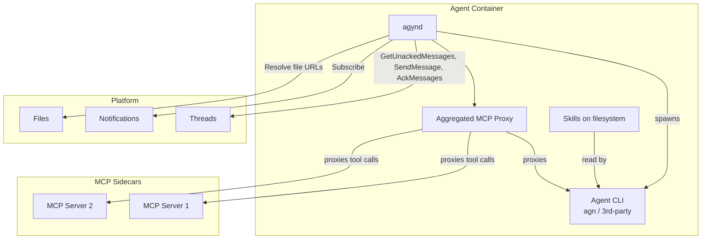
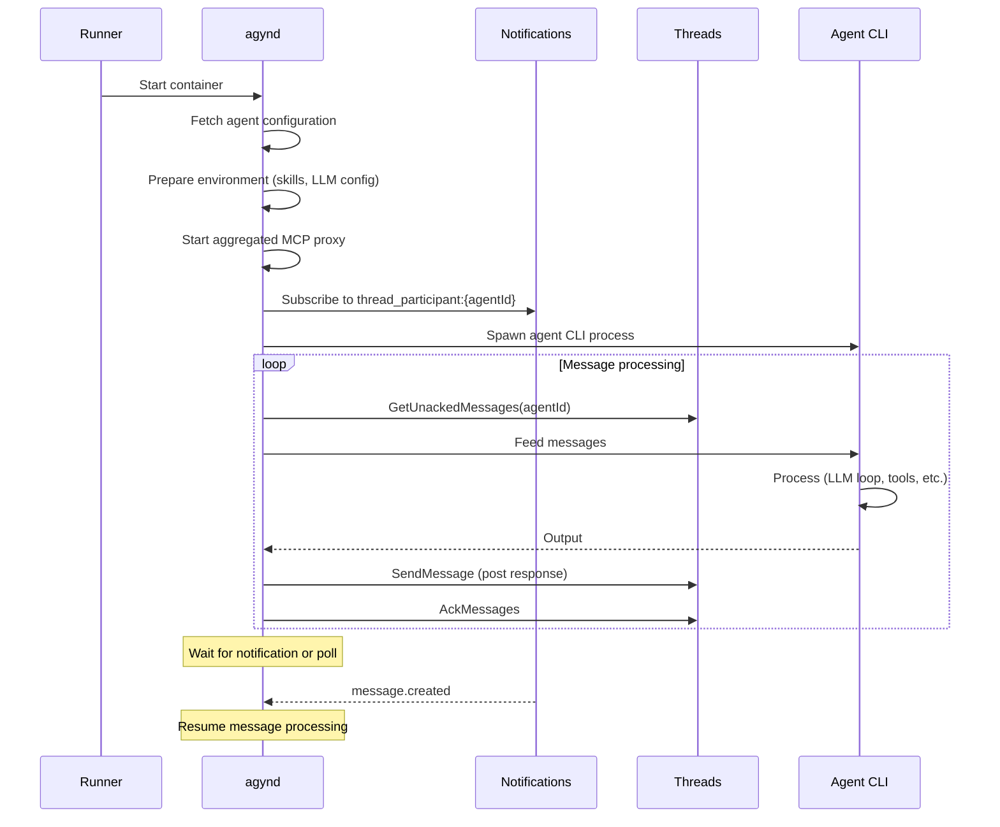

# agynd-cli

## Overview

`agynd` is the agent wrapper daemon. It bridges any agent CLI with the platform by connecting to [Threads](threads.md) and [Notifications](notifications.md), preparing the agent runtime environment, and managing the agent process lifecycle. The [Runner](runner.md) starts `agynd` as the main process in an agent container.

| Aspect | Details |
|--------|---------|
| Binary name | `agynd` |
| Repository | `agynio/agynd-cli` |
| Language | Go |
| Role | Agent container entrypoint — bridges agent CLI with platform services |

## Responsibilities

### 1. Platform Connection

`agynd` implements the [agent contract](agent/overview.md):

- Subscribes to `thread_participant:{agentId}` room via [Notifications](notifications.md) (gRPC streaming).
- Pulls unacknowledged messages via `GetUnackedMessages` from [Threads](threads.md).
- Posts agent responses back to the thread via `SendMessage`.
- Acknowledges processed messages via `AckMessages`.
- Follows the [Consumer Sync Protocol](notifications.md#consumer-sync-protocol) for reliable message delivery.

### 2. Environment Preparation

Before spawning the agent CLI, `agynd` fetches the agent configuration from the platform and prepares the runtime environment:

| Preparation | Description |
|-------------|-------------|
| **Skills** | Loads [skill](resource-definitions.md#skill) content and places it into the filesystem in the directory structure expected by the agent CLI |
| **LLM endpoint** | Provides LLM endpoint configuration so the agent CLI knows where to make model calls |
| **MCP tools** | Exposes all configured [MCP](resource-definitions.md#mcp) tool servers as a single aggregated MCP server that proxies tool calls through `agynd` |

This approach mirrors how tools like Claude Code and Codex CLI receive their configuration — through filesystem conventions and environment rather than a custom protocol.

### 3. Agent Process Management

`agynd` spawns the configured agent CLI as a child process, feeds it messages, and collects its output.

The agent CLI can be:
- [`agn`](agn-cli.md) — our own agent loop implementation.
- Any 3rd-party CLI (Claude Code, Codex CLI, custom implementations).

## Authentication

`agynd` supports two authentication methods, with the same priority order used by all CLI tools in the platform (see [CLI Authentication](authn.md#cli-authentication)):

| Method | Mechanism | Use Case |
|--------|-----------|----------|
| **Network identity** | [OpenZiti](authn.md#network-identity-openziti) mTLS — automatic when the environment provides it | Primary. The Orchestrator creates an OpenZiti identity and passes the enrollment JWT via Runner. `agynd` enrolls on startup |
| **Auth token** | Token stored in `~/.agyn/credentials` and sent to the [Gateway](gateway.md) | Development, testing, or environments without OpenZiti |

In production, `agynd` uses network identity. The [agent identity lifecycle](authn.md#agent-identity-lifecycle) is managed by the Orchestrator — `agynd` receives the enrollment JWT as container configuration and enrolls transparently.

## Architecture

## Lifecycle

## Open Questions

- **Agent CLI protocol.** The interface between `agynd` and agent CLIs (stdin/stdout format, shell commands, SDK, etc.) is not yet defined. See [Open Questions](../open-questions.md#agynd-agent-cli-protocol).
