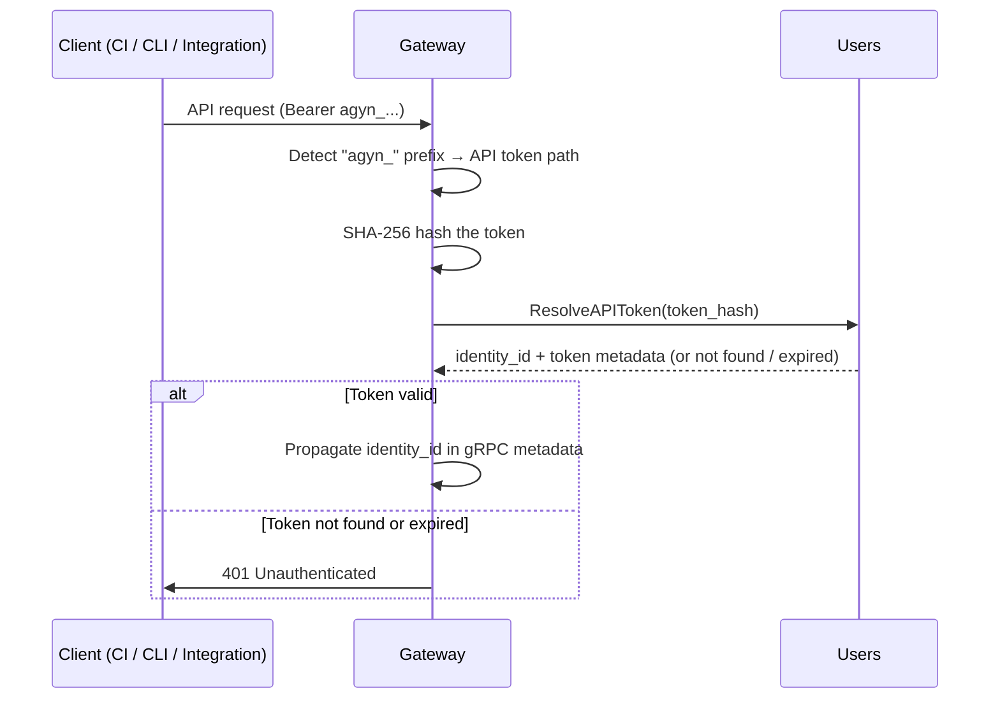

# API Tokens

## Overview

API tokens are long-lived, platform-issued credentials for programmatic access to the Gateway API. They are used by CI pipelines, API integrations, and developer tooling to authenticate without an interactive OIDC flow.

An API token resolves to the same `identity_id` as the user who created it. Downstream services see no difference between a request authenticated via OIDC and one authenticated via API token — both produce the same identity context in gRPC metadata.

## Token Format

Opaque string with server-side lookup: `agyn_<random_44_chars>` — 256 bits of entropy, base62-encoded. The `agyn_` prefix identifies the token type and enables secret scanning (e.g., GitHub secret scanning).

The token value is **hashed** (SHA-256) before storage. The plaintext is returned to the user exactly once at creation time. Lookup is by hash.

## Token Model

| Field | Type | Description |
|-------|------|-------------|
| `id` | string (UUID) | Token identifier (for management — list, revoke) |
| `identity_id` | string (UUID) | Owning user's identity ID |
| `name` | string | Human-readable label (e.g., "CI pipeline", "local dev") |
| `token_hash` | string | SHA-256 hash of the token value. Lookup key |
| `token_prefix` | string | First 8 characters of the token (for identification in UI without exposing the full value) |
| `expires_at` | timestamp (nullable) | Expiration time. Null = no expiration |
| `created_at` | timestamp | Creation time |
| `last_used_at` | timestamp (nullable) | Last successful authentication time |

## Issuing Service

The [Users](users.md) service owns API tokens. Tokens are stored in a `user_api_tokens` table in the Users service database.

## Interface

| Method | Description |
|--------|-------------|
| **CreateAPIToken** | Create a token for the calling user. Returns the plaintext token **once**. Accepts `name` and optional `expires_at` |
| **ListAPITokens** | List tokens for the calling user. Returns metadata only (id, name, prefix, created_at, expires_at, last_used_at). Never returns the token value |
| **RevokeAPIToken** | Delete a token by ID. Caller must own the token |
| **ResolveAPIToken** | Look up a token by hash. Returns `identity_id` and token metadata if valid. Called by the Gateway |

`CreateAPIToken`, `ListAPITokens`, and `RevokeAPIToken` are exposed through the Gateway (`UsersGateway` proto service). `ResolveAPIToken` is internal — called only by the Gateway during authentication.

## Gateway Authentication Flow

The Gateway distinguishes between IdP JWTs and platform API tokens by the token prefix:

```
if token starts with "agyn_":
    → API token path
else:
    → OIDC path (existing flow)
```

### API Token Path



Both authentication paths produce the same output: an `identity_id` propagated in gRPC metadata. Downstream services are unaware of the authentication method.

## Permissions

An API token carries the same permissions as the user who created it. The resolved `identity_id` is the user's `identity_id` — [authorization](authz.md) checks in OpenFGA see the same identity regardless of authentication method. No token-level scopes.

## Token Lifecycle

| Concern | Behavior |
|---------|----------|
| **Creation** | User creates via CLI or API. Plaintext returned once |
| **Expiration** | Optional. If set, the Gateway rejects expired tokens. If not set, the token lives until revoked |
| **Revocation** | User revokes via CLI or API. Immediate — next request with that token is rejected |
| **Rotation** | Manual. User creates a new token, updates the integration, then revokes the old one |
| **`last_used_at`** | Updated on each successful `ResolveAPIToken` call |

## Management

| Interface | Capability |
|-----------|-----------|
| **CLI** | `agyn auth create-token --name "CI pipeline"` → prints token once. `agyn auth list-tokens`. `agyn auth revoke-token <id>` |
| **Gateway API** | `UsersGateway` proto service: `CreateAPIToken`, `ListAPITokens`, `RevokeAPIToken` |

## CLI Integration

The created token is stored in `~/.agyn/credentials` — the same path all CLI tools already read (see [CLI Authentication](authn.md#cli-authentication)). The token format (`agyn_...`) is opaque to the CLI — it is sent as a bearer token to the Gateway like any other auth token.

## Data Store

PostgreSQL. `user_api_tokens` table in the [Users](users.md) service database. System-wide — not scoped to an organization.

## Classification

**Data plane** — token resolution is on the hot path for every API-token-authenticated request.
