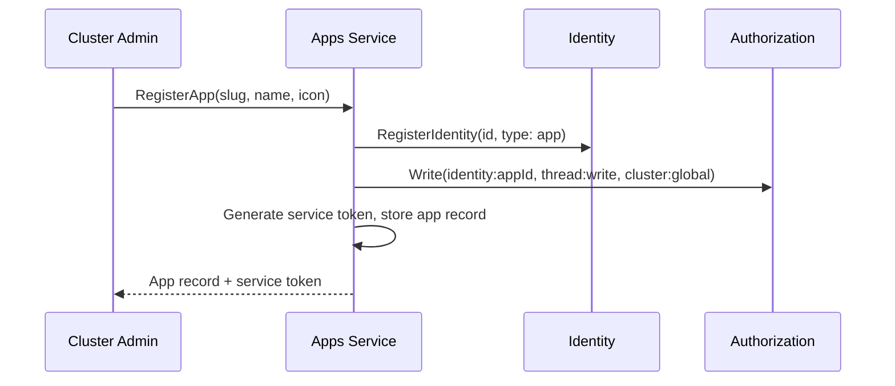

# Apps Service

## Overview

The Apps Service manages app registrations — the configuration entities that define [apps](apps.md), their profiles, and their enrollment state. It handles both control plane operations (registration, enrollment) and data plane operations (profile resolution, slug lookup on the Gateway request path).

## API

| Method | Description |
|--------|-------------|
| **RegisterApp** | Register a new app. Creates the app record, registers an identity (type `app`) in [Identity](identity.md), and generates a service token. The OpenZiti service name is derived from the slug as `app-{slug}`. Requires [cluster admin](authz.md#cluster-permissions) |
| **GetApp** | Get an app by ID |
| **GetAppBySlug** | Get an app by slug. Used by the [Gateway](gateway.md) for [app proxy](gateway.md#app-proxy) routing |
| **ListApps** | List registered apps |
| **DeleteApp** | Delete an app registration. Revokes the app's OpenZiti identity |
| **GetAppProfile** | Get an app's display profile (name, icon, description). Used by [Chat](chat.md) to render app-originated messages |

## App Resource

| Field | Type | Description |
|-------|------|-------------|
| `id` | string (UUID) | Unique app identifier |
| `slug` | string | Unique human-readable identifier (e.g., `reminders`, `slack`). Used in CLI commands and Gateway routing |
| `name` | string | Display name (e.g., "Reminders", "Slack") |
| `description` | string | Human-readable description |
| `icon` | string | Icon URL or identifier for UI display |
| `identity_id` | string (UUID) | App's identity in the [Identity](identity.md) service |
| `service_token_hash` | string | SHA-256 hash of the service token. Used for enrollment |
| `created_at` | timestamp | Creation time |
| `updated_at` | timestamp | Last modification time |

## Registration Flow

1. Cluster admin calls `RegisterApp` (via `agyn` CLI or Terraform).
2. Apps Service registers the app's identity in the [Identity](identity.md) service with `identity_type: app`.
3. Apps Service writes authorization tuples granting the app its permissions.
4. Apps Service generates a long-lived service token, stores the app record, and returns the token.
5. The service token is provided to the app deployment (via IaC for cluster-scoped apps, or manually for external apps).

## Enrollment

When the app starts, it presents the service token to the platform enrollment endpoint. The platform validates the token, creates an OpenZiti identity via [Ziti Management](openziti.md), enrolls it, and returns the enrolled identity (certificate + key) to the app. This follows the same flow as [external runner enrollment](openziti.md#runner-provisioning).

After enrollment, the app can:

- **Bind** its OpenZiti service (`app-{slug}`) — Gateway can now route commands to it.
- **Dial** the Gateway — the app can call platform APIs.

The service token is long-lived and can be reused. If the app restarts, it re-enrolls with the same token and receives a new OpenZiti identity. The previous identity is cleaned up by Ziti Management lease GC.

## Profile Resolution

When [Chat](chat.md) encounters a message with `sender_id` of type `app` (resolved via [Identity](identity.md)), it calls `GetAppProfile` to fetch the display profile (name, icon).

## Data Store

PostgreSQL. Apps Service owns its database.

## Classification

| Aspect | Detail |
|--------|--------|
| **Plane** | Mixed — control (registration) + data (profile/slug resolution) |
| **API** | gRPC (internal) + Gateway (external via ConnectRPC) |
| **State** | PostgreSQL |
