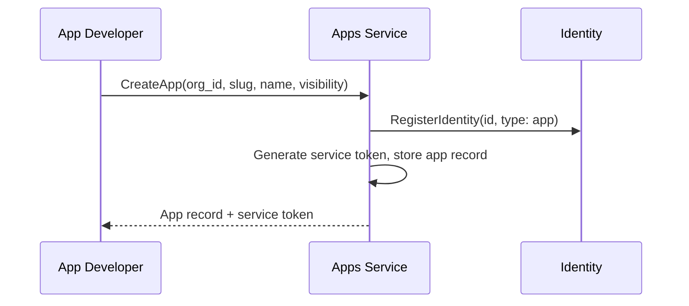
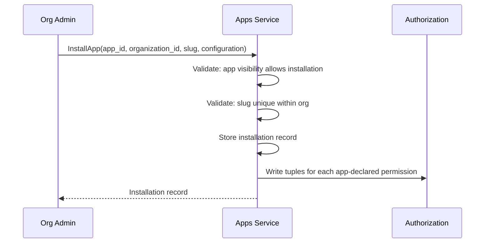
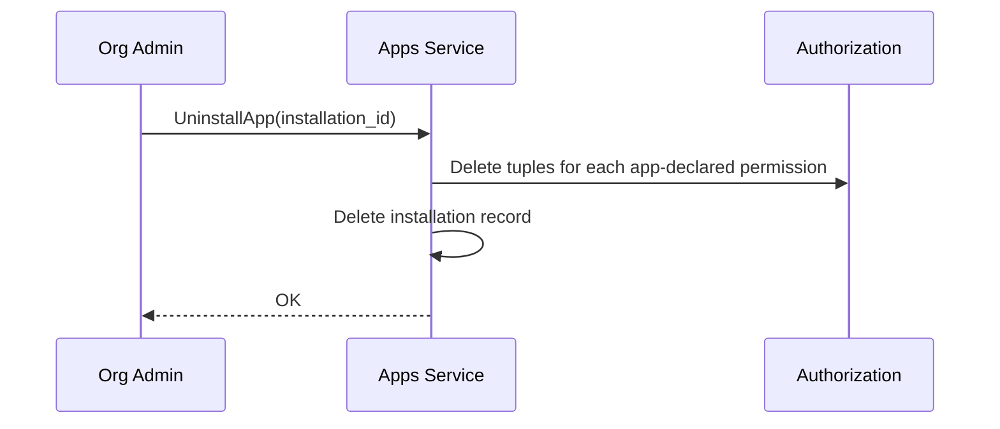

# Apps Service

## Overview

The Apps Service manages apps and installations — the configuration entities that define [apps](apps.md), their profiles, their visibility, and their per-organization installations. It handles both control plane operations (app management, installation) and data plane operations (profile resolution on the Gateway request path).

## API

| Method | Description |
|--------|-------------|
| **CreateApp** | Create a new app. Creates the app record, registers an identity (type `app`) in [Identity](identity.md), and generates a service token. Requires ownership of the organization |
| **GetApp** | Get an app by ID |
| **GetAppBySlug** | Get an app by owning organization ID + slug |
| **ListApps** | List apps. Supports filtering by organization (own apps) and visibility (public apps) |
| **UpdateApp** | Update an app (name, description, icon, visibility) |
| **DeleteApp** | Delete an app. Revokes the app's OpenZiti identity. Fails if active installations exist |
| **GetAppProfile** | Get an app's display profile (name, icon, description). Used by [Chat](chat.md) to render app-originated messages |
| **InstallApp** | Install an app into an organization. Creates the installation record, sets a default nickname (from the app's slug), and writes authorization tuples. Requires org ownership and that the app's visibility allows it |
| **GetInstallation** | Get an installation by ID |
| **GetInstallationByIdentityId** | Get an installation by the app's `identity_id` within an organization. Used by the [Gateway](gateway.md) for [app proxy](gateway.md#app-proxy) routing after nickname resolution |
| **ListInstallations** | List installations. Supports filtering by organization and by app |
| **UpdateInstallation** | Update an installation (nickname, configuration) |
| **UninstallApp** | Delete an installation. Removes authorization tuples |
| **GetInstallationConfiguration** | Get the configuration for an installation. Called by the app to retrieve its configuration for a specific installation |
| **ReportInstallationStatus** | Set the status text for an installation. Called by the app to report its current health or configuration state. Replaces any previously set status |
| **AppendInstallationAuditLogEntry** | Append an audit log entry for an installation. Called by the app to record a notable event. Entries are append-only |
| **ListInstallationAuditLogEntries** | List audit log entries for an installation. Paginated, newest first |

## App Resource

| Field | Type | Description |
|-------|------|-------------|
| `id` | string (UUID) | Unique app identifier |
| `organization_id` | string (UUID) | Owning organization |
| `slug` | string | Unique within the owning organization. Used in the app's public address (`{org-slug}/{app-slug}`). Used as the default nickname when the app is installed into an org |
| `name` | string | Display name (e.g., "Telegram Connector") |
| `description` | string | Human-readable description |
| `icon` | string | Icon URL or identifier for UI display |
| `visibility` | enum | `public`, `internal` |
| `permissions` | list of string | Permissions the app requires (e.g., `["thread:create", "participant:add"]`). See [Apps — Permissions](apps.md#permissions) |
| `identity_id` | string (UUID) | App's identity in the [Identity](identity.md) service |
| `service_token_hash` | string | SHA-256 hash of the service token. Used for enrollment |
| `created_at` | timestamp | Creation time |
| `updated_at` | timestamp | Last modification time |

## Installation Resource

| Field | Type | Description |
|-------|------|-------------|
| `id` | string (UUID) | Unique installation identifier |
| `app_id` | string (UUID) | Reference to the app |
| `organization_id` | string (UUID) | The organization this installation belongs to |
| `configuration` | JSON object | App-specific configuration. Opaque to the platform |
| `status` | string (markdown) | Current status reported by the app. Free text, rendered as markdown in the Console. Optional — absent until the app first calls `ReportInstallationStatus` |
| `created_at` | timestamp | Creation time |
| `updated_at` | timestamp | Last modification time |

## Installation Audit Log Entry Resource

| Field | Type | Description |
|-------|------|-------------|
| `id` | string (UUID) | Entry identifier |
| `installation_id` | string (UUID) | Installation this entry belongs to |
| `message` | string | Log message (free text) |
| `level` | enum | `info`, `warning`, `error` |
| `created_at` | timestamp | Server-assigned time when the entry was received |

## App Flow

1. App developer calls `CreateApp` within their organization.
2. Apps Service registers the app's identity in the [Identity](identity.md) service with `identity_type: app`.
3. Apps Service generates a long-lived service token, stores the app record, and returns the token.
4. The service token is provided to the app deployment.

## Installation Flow

1. Org admin calls `InstallApp` with the app ID, target organization, slug, and configuration.
2. Apps Service validates that the app's visibility allows installation by this organization (`public` — any org; `internal` — owning org only).
3. Apps Service validates slug uniqueness within the target organization.
4. Apps Service stores the installation record.
5. Apps Service writes authorization tuples for each permission the app declared — granting the app's identity those capabilities within the organization.
6. Returns the installation record.

## Uninstall Flow

When an installation is removed, the authorization tuples are deleted. The app loses access to the organization. Existing threads where the app is a participant remain — the app can no longer create new threads or add participants, but its historical messages are preserved.

## Enrollment

When the app starts, it calls `EnrollApp` with its service token. The Apps Service validates the token, creates an OpenZiti identity via [Ziti Management](openziti.md) `CreateAppIdentity` (which deletes any previous identity for this app first), enrolls it, and returns the enrolled identity (certificate + key) to the app. This follows the same flow as [runner enrollment](openziti.md#runner-provisioning).

After enrollment, the app can:

- **Bind** its OpenZiti service — Gateway can now route commands to it.
- **Dial** the Gateway — the app can call platform APIs.

The service token is long-lived and can be reused. If the app restarts, it re-enrolls with the same token and receives a new OpenZiti identity. The previous identity is explicitly deleted by Ziti Management as part of `CreateAppIdentity` before creating the new one.

## Profile Resolution

When [Chat](chat.md) encounters a message with `sender_id` of type `app` (resolved via [Identity](identity.md)), it calls `GetAppProfile` to fetch the display profile (name, icon).

## Authorization

App management authorization is based on ownership of the app's organization. Installation authorization is based on ownership of the installing organization. App visibility controls read access to app records.

| Operation | Check |
|-----------|-------|
| `CreateApp` | `owner` on `organization:<org_id>` (owning org) |
| `GetApp`, `GetAppBySlug` (public app) | Any authenticated identity |
| `GetApp`, `GetAppBySlug` (internal app) | `member` on `organization:<app.org_id>` |
| `ListApps` | Returns public apps (any authenticated) + filtered-by-org apps (`member` on that org) |
| `UpdateApp`, `DeleteApp` | `owner` on `organization:<app.org_id>` |
| `GetAppProfile` | Any authenticated identity |
| `InstallApp` | `owner` on `organization:<install_org_id>` + app visibility allows it |
| `GetInstallation`, `ListInstallations` | `member` on `organization:<install_org_id>` |
| `GetInstallationByIdentityId` | Any authenticated identity (Gateway hot path) |
| `UpdateInstallation`, `UninstallApp` | `owner` on `organization:<install_org_id>` |
| `GetInstallationConfiguration` | App's own identity — `caller.identity_id == installation.app.identity_id` |
| `ReportInstallationStatus` | App's own identity — `caller.identity_id == installation.app.identity_id` |
| `AppendInstallationAuditLogEntry` | App's own identity — `caller.identity_id == installation.app.identity_id` |
| `ListInstallationAuditLogEntries` | `member` on `organization:<install_org_id>` |
| `EnrollApp` | Service token validation — no OpenFGA check |

See [Authorization — Apps Service](authz.md#apps-service) for the full reference.

## Data Store

PostgreSQL. Apps Service owns its database — `apps`, `app_installations`, and `installation_audit_log_entries` tables.

## Classification

| Aspect | Detail |
|--------|--------|
| **Plane** | Mixed — control (definition, installation) + data (profile/slug resolution) |
| **API** | gRPC (internal) + Gateway (external via ConnectRPC) |
| **State** | PostgreSQL |
