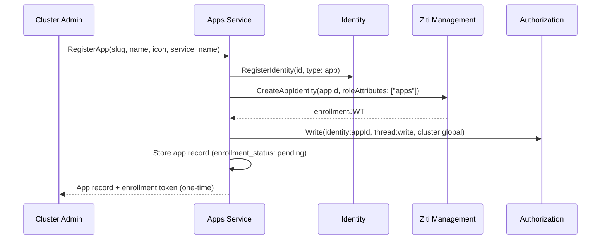

# Apps Service

## Overview

The Apps Service manages app registrations — the configuration entities that define [apps](apps.md), their profiles, and their enrollment state. It handles both control plane operations (registration, enrollment) and data plane operations (profile resolution, slug lookup on the Gateway request path).

## API

| Method | Description |
|--------|-------------|
| **RegisterApp** | Register a new app. Creates the app record, registers an identity (type `app`) in [Identity](identity.md), and generates an enrollment token. Requires [cluster admin](authz.md#cluster-permissions) |
| **GetApp** | Get an app by ID |
| **GetAppBySlug** | Get an app by slug. Used by the [Gateway](gateway.md) for [app proxy](gateway.md#app-proxy) routing |
| **ListApps** | List registered apps |
| **DeleteApp** | Delete an app registration. Revokes the app's OpenZiti identity |
| **GetAppProfile** | Get an app's display profile (name, icon, description). Used by [Chat](chat.md) to render app-originated messages |

## App Resource

| Field | Type | Description |
|-------|------|-------------|
| `id` | string (UUID) | Unique app identifier |
| `slug` | string | Unique human-readable identifier (e.g., `reminders`, `slack`). Used in CLI commands and Gateway routing |
| `name` | string | Display name (e.g., "Reminders", "Slack") |
| `description` | string | Human-readable description |
| `icon` | string | Icon URL or identifier for UI display |
| `identity_id` | string (UUID) | App's identity in the [Identity](identity.md) service |
| `service_name` | string | OpenZiti service name the app binds (e.g., `app-reminders`). Used by the Gateway to dial the app |
| `enrollment_status` | enum | `pending`, `enrolled` |
| `created_at` | timestamp | Creation time |
| `updated_at` | timestamp | Last modification time |

## Registration Flow

1. Cluster admin calls `RegisterApp` (via `agyn` CLI or Terraform).
2. Apps Service registers the app's identity in the [Identity](identity.md) service with `identity_type: app`.
3. Apps Service calls [Ziti Management](openziti.md) to create an OpenZiti identity with `roleAttributes: ["apps"]`, receiving an enrollment JWT.
4. Apps Service writes authorization tuples granting the app its permissions.
5. Apps Service stores the app record with `enrollment_status: pending` and returns the enrollment token.
6. The token is provided to the app deployment (via IaC for cluster-scoped apps, or manually for external apps).

## Enrollment

When the app starts, it uses the enrollment JWT to enroll with the OpenZiti Controller (exchange JWT for x509 certificate). After enrollment, the app can:

- **Bind** its OpenZiti service (`service_name`) — Gateway can now route commands to it.
- **Dial** the Gateway — the app can call platform APIs.

The Apps Service updates `enrollment_status: enrolled` when the app's OpenZiti identity is confirmed enrolled.

## Profile Resolution

When [Chat](chat.md) encounters a message with `sender_id` of type `app` (resolved via [Identity](identity.md)), it calls `GetAppProfile` to fetch the display profile (name, icon).

## Data Store

PostgreSQL. Apps Service owns its database.

## Classification

| Aspect | Detail |
|--------|--------|
| **Plane** | Mixed — control (registration) + data (profile/slug resolution) |
| **API** | gRPC (internal) + Gateway (external via ConnectRPC) |
| **State** | PostgreSQL |
