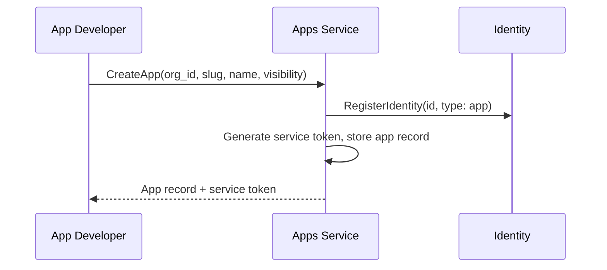
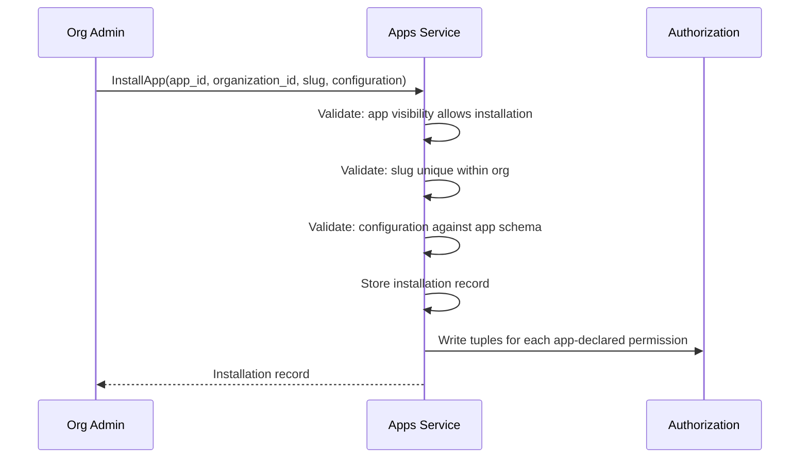
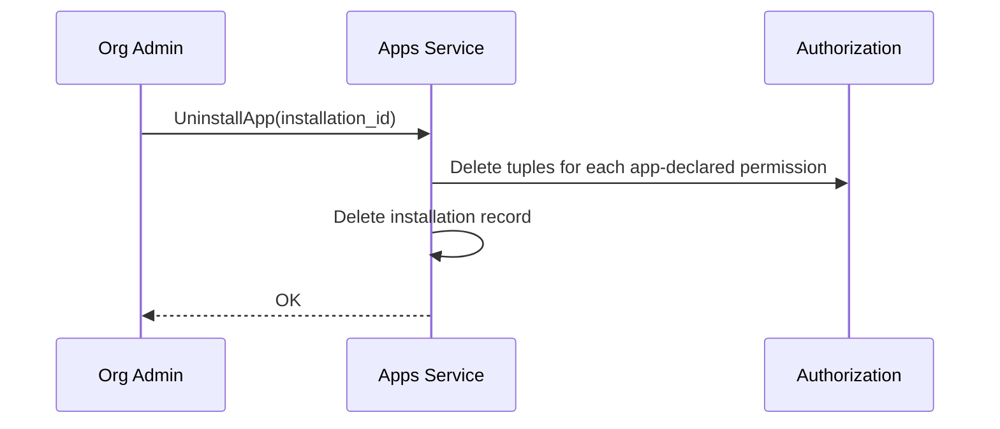

# Apps Service

## Overview

The Apps Service manages apps and installations — the configuration entities that define [apps](apps.md), their profiles, their visibility, and their per-organization installations. It handles both control plane operations (app management, installation) and data plane operations (profile resolution on the Gateway request path).

## API

| Method | Description |
|--------|-------------|
| **CreateApp** | Create a new app. Creates the app record, registers an identity (type `app`) in [Identity](identity.md), and generates a service token. Requires ownership of the organization |
| **GetApp** | Get an app by ID |
| **GetAppBySlug** | Get an app by owning organization ID + slug |
| **ListApps** | List apps. Supports filtering by organization (own apps) and visibility (public apps) |
| **UpdateApp** | Update an app (name, description, icon, visibility). Does not accept a configuration schema — [the app reports that itself](apps.md#reporting) |
| **DeleteApp** | Delete an app. Revokes the app's OpenZiti identity. Fails if active installations exist |
| **GetAppProfile** | Get an app's display profile (name, icon, description). Used by [Chat](chat.md) to render app-originated messages |
| **InstallApp** | Install an app into an organization. [Validates the configuration](apps.md#validation) against the app's schema, creates the installation record, sets a default nickname (from the app's slug), and writes authorization tuples — one per [declared permission](apps.md#permissions) plus the [membership tuple](apps.md#organization-membership) every installation writes. Requires org ownership and that the app's visibility allows it |
| **GetInstallation** | Get an installation by ID. `x-agyn-secret` properties are omitted from `configuration` and named in `secret_keys_set`, as on [every read path but one](apps.md#secret-values) |
| **GetInstallationByIdentityId** | Get an installation by the app's `identity_id` within an organization. Used by the [Gateway](gateway.md) for [app proxy](gateway.md#app-proxy) routing after nickname resolution |
| **ListInstallations** | List installations. Supports filtering by organization and by app |
| **UpdateInstallation** | Update an installation (nickname, configuration). The configuration is validated against the app's current schema. A `x-agyn-secret` property omitted from the submitted object keeps its stored value — the admin read path never returned it, so a round-trip cannot resubmit it |
| **UninstallApp** | Delete an installation. Removes authorization tuples, membership included. Agent roles the app was granted are not removed — they are grants an agent owner made, and outlive an install/uninstall cycle |
| **GetInstallationConfiguration** | Get the configuration for an installation. Called by the app to retrieve its configuration for a specific installation. The only read path that returns `x-agyn-secret` values |
| **ReportConfigurationSchema** | Replace the app's [configuration schema](apps.md#configuration-schema) with the reported document. Called by the app at startup and whenever its schema changes. Declarative — the stored schema is replaced wholesale. A document outside the [honored subset](apps.md#honored-subset), or one that is not [backward compatible](apps.md#compatibility) with the stored schema, is rejected whole and the stored schema is left as it was |
| **ReportInstallationStatus** | Set the status text for an installation. Called by the app to report its current health or configuration state. Replaces any previously set status. An empty or whitespace-only string clears the status (stores NULL) |
| **AppendInstallationAuditLogEntry** | Append an audit log entry for an installation. Called by the app to record a notable event. Entries are append-only. Accepts an optional `idempotency_key` (deduped server-side for 24h) to make client retries safe |
| **ListInstallationAuditLogEntries** | List audit log entries for an installation. Paginated, newest first |

## App Resource

| Field | Type | Description |
|-------|------|-------------|
| `id` | string (UUID) | Unique app identifier |
| `organization_id` | string (UUID) | Owning organization |
| `slug` | string | Unique within the owning organization. Used in the app's public address (`{org-slug}/{app-slug}`). Used as the default nickname when the app is installed into an org |
| `name` | string | Display name (e.g., "Telegram Connector") |
| `description` | string | Human-readable description |
| `icon` | string | Icon URL or identifier for UI display |
| `visibility` | enum | `public`, `internal` |
| `permissions` | list of string | Permissions the app requires (e.g., `["thread:create", "participant:add"]`). See [Apps — Permissions](apps.md#permissions) |
| `configuration_schema` | JSON object | JSON Schema describing the app's [installation configuration](apps.md#configuration-schema). Reported by the app, not set through `CreateApp` or `UpdateApp`. Absent until the app first reports — installations made before that carry an unvalidated, opaque object |
| `schema_reported_at` | timestamp | When the stored schema was last reported. NULL until the first report |
| `identity_id` | string (UUID) | App's identity in the [Identity](identity.md) service |
| `service_token_hash` | string | SHA-256 hash of the service token. Used for enrollment |
| `created_at` | timestamp | Creation time |
| `updated_at` | timestamp | Last modification time |

## Installation Resource

| Field | Type | Description |
|-------|------|-------------|
| `id` | string (UUID) | Unique installation identifier |
| `app_id` | string (UUID) | Reference to the app |
| `organization_id` | string (UUID) | The organization this installation belongs to |
| `configuration` | JSON object | App-specific configuration. Validated against the app's `configuration_schema` on write; never interpreted by the service. `x-agyn-secret` properties are [omitted](apps.md#secret-values) on every read path except `GetInstallationConfiguration` |
| `secret_keys_set` | list of string | Names of the `x-agyn-secret` properties that hold a value. Present on the read paths where those values are omitted; it is what a client shows as **Set** without being able to show the value |
| `status` | string (markdown) | Current status reported by the app. Free text, rendered as markdown in the Console. Optional — absent until the app first calls `ReportInstallationStatus` |
| `created_at` | timestamp | Creation time |
| `updated_at` | timestamp | Last modification time |

## Schema Compatibility

A reported [configuration schema](apps.md#configuration-schema) is checked against the stored one before it replaces it, and is rejected if it would stop accepting a configuration the stored schema accepted. The rules are in [Apps — Compatibility](apps.md#compatibility); what the service does with them is one comparison and one query:

| Check | Source |
|-------|--------|
| Property removal, type change, added `required`, narrowed constraint, changed `x-agyn-ref`, cleared `x-agyn-secret` | The stored schema alone |
| Removal of a `deprecated` property | `CountInstallationsWithConfigurationKey(app_id, key)` across every installation of the app, in every organization |

The second is the only compatibility check that reads installation data, and it is the reason the service can allow removals at all. The count is taken across organizations the reporting app cannot see, so the rejection names the count and not the organizations.

A rejected report is not partially applied. An app whose new version reports one incompatible property keeps its entire previous schema, including the compatible changes in the same document — the report is the unit, as it is for a [runner catalog](runners.md#catalog-reporting).

## Reference Validation

An `x-agyn-ref` property in a [configuration schema](apps.md#agyn-keywords) names a platform entity, so validating one means asking the service that owns it. The Apps Service resolves each reference on `InstallApp` and `UpdateInstallation`:

| Kind | Checked against |
|------|-----------------|
| `agent` | [Agents](agents-service.md) |
| `environment` | [Agents](agents-service.md) |
| `model` | [LLM](llm.md) |

Each check confirms the entity exists **and** belongs to the installing organization — a UUID naming an agent in another organization fails the same way a nonexistent one does, and is reported the same way, because the difference between them is not something the installing admin is entitled to learn.

A service that cannot be reached fails the write rather than storing an unvalidated reference. An installation is written once and read by the app for its whole life; a reference stored without a check is one the app discovers is wrong at runtime, in a place with no form to correct it.

## Installation Audit Log Entry Resource

| Field | Type | Description |
|-------|------|-------------|
| `id` | string (UUID) | Entry identifier |
| `installation_id` | string (UUID) | Installation this entry belongs to |
| `message` | string | Log message (free text) |
| `level` | enum | `info`, `warning`, `error` |
| `idempotency_key` | string | Optional. Client-supplied key for dedup. A `(installation_id, idempotency_key)` tuple seen within the dedup window returns the existing entry instead of creating a new one |
| `created_at` | timestamp | Server-assigned time when the entry was received |

### Retention

Audit log entries are retained per-installation with a **count-based ring buffer**: the most recent 1000 entries per installation are kept; older entries are dropped on insert. Apps needing durable long-term history ship logs to their own sink — the platform's audit log is a diagnostic surface, not a system of record.

### Idempotency

`AppendInstallationAuditLogEntry` accepts an optional `idempotency_key`. When provided, the service deduplicates within a **24-hour window**: if a `(installation_id, idempotency_key)` tuple has already been recorded within that window, the existing entry is returned instead of creating a new one. Omitting the key disables dedup — every call creates a new entry.

## App Flow

```mermaid
sequenceDiagram
    participant Dev as App Developer
    participant AS as Apps Service
    participant I as Identity

    Dev->>AS: CreateApp(org_id, slug, name, visibility)
    AS->>I: RegisterIdentity(id, type: app)
    AS->>AS: Generate service token, store app record
    AS-->>Dev: App record + service token
```

1. App developer calls `CreateApp` within their organization.
2. Apps Service registers the app's identity in the [Identity](identity.md) service with `identity_type: app`.
3. Apps Service generates a long-lived service token, stores the app record, and returns the token.
4. The service token is provided to the app deployment.

## Installation Flow

```mermaid
sequenceDiagram
    participant Admin as Org Admin
    participant AS as Apps Service
    participant Auth as Authorization

    Admin->>AS: InstallApp(app_id, organization_id, slug, configuration)
    AS->>AS: Validate: app visibility allows installation
    AS->>AS: Validate: slug unique within org
    AS->>AS: Validate: configuration against app schema
    AS->>AS: Store installation record
    AS->>Auth: Write tuples for each app-declared permission
    AS-->>Admin: Installation record
```

1. Org admin calls `InstallApp` with the app ID, target organization, slug, and configuration.
2. Apps Service validates that the app's visibility allows installation by this organization (`public` — any org; `internal` — owning org only).
3. Apps Service validates slug uniqueness within the target organization.
4. Apps Service validates the configuration against the app's [configuration schema](apps.md#configuration-schema), resolving each `x-agyn-ref` property against the owning service to confirm the entity exists in the installing organization. Failures are returned per property.
5. Apps Service stores the installation record.
6. Apps Service writes authorization tuples for each permission the app declared — granting the app's identity those capabilities within the organization.
7. Returns the installation record.

## Uninstall Flow

```mermaid
sequenceDiagram
    participant Admin as Org Admin
    participant AS as Apps Service
    participant Auth as Authorization

    Admin->>AS: UninstallApp(installation_id)
    AS->>Auth: Delete tuples for each app-declared permission
    AS->>AS: Delete installation record
    AS-->>Admin: OK
```

When an installation is removed, the authorization tuples are deleted. The app loses access to the organization. Existing threads where the app is a participant remain — the app can no longer create new threads or add participants, but its historical messages are preserved.

## Enrollment

When the app starts, it calls `EnrollApp` with its service token. The Apps Service validates the token, creates an OpenZiti identity via [Ziti Management](openziti.md) `CreateAppIdentity` (which deletes any previous identity for this app first), enrolls it, and returns the enrolled identity (certificate + key) to the app. This follows the same flow as [runner enrollment](openziti.md#runner-provisioning).

After enrollment, the app can:

- **Bind** its OpenZiti service — Gateway can now route commands to it.
- **Dial** the Gateway — the app can call platform APIs.

The service token is long-lived and can be reused. If the app restarts, it re-enrolls with the same token and receives a new OpenZiti identity. The previous identity is explicitly deleted by Ziti Management as part of `CreateAppIdentity` before creating the new one.

## Profile Resolution

When [Chat](chat.md) encounters a message with `sender_id` of type `app` (resolved via [Identity](identity.md)), it calls `GetAppProfile` to fetch the display profile (name, icon).

## Authorization

App management authorization is based on ownership of the app's organization. Installation authorization is based on ownership of the installing organization. App visibility controls read access to app records.

| Operation | Check |
|-----------|-------|
| `CreateApp` | `owner` on `organization:<org_id>` (owning org) |
| `GetApp`, `GetAppBySlug` (public app) | Any authenticated identity |
| `GetApp`, `GetAppBySlug` (internal app) | `member` on `organization:<app.org_id>` |
| `ListApps` | Returns public apps (any authenticated) + filtered-by-org apps (`member` on that org) |
| `UpdateApp`, `DeleteApp` | `owner` on `organization:<app.org_id>` |
| `GetAppProfile` | Any authenticated identity |
| `InstallApp` | `owner` on `organization:<install_org_id>` + app visibility allows it |
| `GetInstallation`, `ListInstallations` | `member` on `organization:<install_org_id>` |
| `GetInstallationByIdentityId` | Any authenticated identity (Gateway hot path) |
| `UpdateInstallation`, `UninstallApp` | `owner` on `organization:<install_org_id>` |
| `GetInstallationConfiguration` | App's own identity — `caller.identity_id == installation.app.identity_id` |
| `ReportInstallationStatus` | App's own identity — `caller.identity_id == installation.app.identity_id` |
| `AppendInstallationAuditLogEntry` | App's own identity — `caller.identity_id == installation.app.identity_id` |
| `ListInstallationAuditLogEntries` | `member` on `organization:<install_org_id>` |
| `EnrollApp` | Service token validation — no OpenFGA check |

See [Authorization — Apps Service](authz.md#apps-service) for the full reference.

## Data Store

PostgreSQL. Apps Service owns its database — `apps`, `app_installations`, and `installation_audit_log_entries` tables.

## Classification

| Aspect | Detail |
|--------|--------|
| **Plane** | Mixed — control (definition, installation) + data (profile/slug resolution) |
| **API** | gRPC (internal) + Gateway (external via ConnectRPC) |
| **State** | PostgreSQL |
