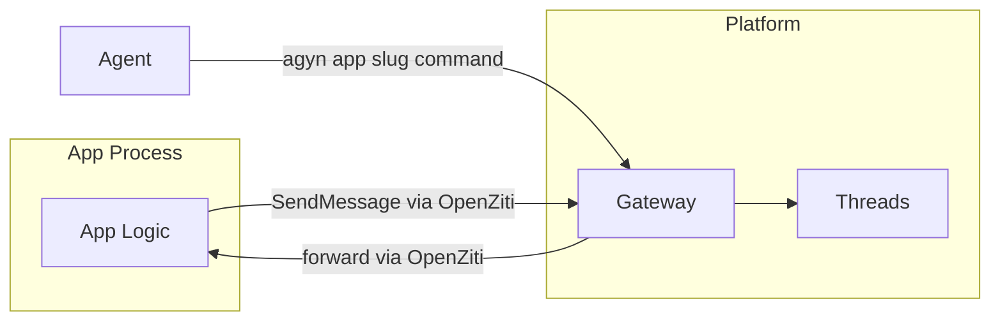

# Apps

## Overview

Apps are services that interact with threads on behalf of external systems or platform capabilities. Each app has its own [identity](identity.md) (type `app`), connects to the platform via [OpenZiti](openziti.md), and accesses platform APIs through the [Gateway](gateway.md).

Apps unify what was previously split between "channels" (bidirectional bridges to external products) and platform-provided capabilities (reminders, event subscriptions). The difference between a Slack integration and a Reminders service is not architectural — both are apps with different capability sets.

## Examples

| App | Description | Thread Interaction |
|-----|-------------|-------------------|
| **[Reminders](apps/reminders.md)** | Agent-initiated delayed messages | Write only |
| **Slack** (future) | Bidirectional bridge to Slack | Read + write (participant) |
| **GitHub** (future) | Agent-initiated event subscriptions | Write only |

## App Contract

Every app, regardless of implementation:

1. **Registers** in the platform via the [Apps Service](apps-service.md) — receives a long-lived service token.
2. **Enrolls** via the platform enrollment endpoint — presents the service token, receives an OpenZiti x509 identity.
3. **Binds** an OpenZiti service — so the Gateway can forward app-specific commands to it.
4. **Dials** the Gateway — to call platform APIs (SendMessage, etc.) using its own app identity.



## Identity

Each app has a unique identity registered in the [Identity](identity.md) service with `identity_type: app`. This identity is used as `sender_id` when the app posts messages to threads.

When [Chat](chat.md) resolves a `sender_id` of type `app`, it fetches the app profile (name, icon) from the [Apps Service](apps-service.md).

## Thread Interaction

Apps interact with threads through the standard [Threads](threads.md) API via the [Gateway](gateway.md). Two modes:

### Write-Only Apps

Apps that only post messages to threads (e.g., Reminders, GitHub). These apps:

- Call `SendMessage` with their app identity as `sender_id`.
- Are **not** thread participants — they do not join threads, do not receive notifications, do not acknowledge messages.
- Threads allows `app` identities to send messages without participant membership. See [Threads — Non-Participant Senders](threads.md#non-participant-senders).

### Participant Apps

Apps that need bidirectional thread interaction (e.g., Slack). These apps:

- Are added as thread participants (the app adds itself when creating threads or is added by another participant).
- Receive `message.created` notifications on their `thread_participant:{appId}` room.
- Pull unacknowledged messages via `GetUnackedMessages`, post responses via `SendMessage`, acknowledge via `AckMessages`.
- Follow the same [Consumer Sync Protocol](notifications.md#consumer-sync-protocol) as agents.

A Slack app creates threads itself and adds itself and relevant agents as participants to newly created threads.

## Identification

Each app has a unique **slug** — a human-readable identifier used in CLI commands and API routing.

| Field | Type | Description |
|-------|------|-------------|
| `slug` | string | Unique identifier (e.g., `reminders`, `slack`, `github`). Used in CLI commands and Gateway routing |

The slug appears in CLI usage: `agyn app <slug> <command>`.

## Connectivity

Apps connect to the platform via [OpenZiti](openziti.md). An app has **bidirectional** OpenZiti access:

- **Bind** — the app binds its OpenZiti service (`app-{slug}`, e.g., `app-reminders`) so the Gateway can forward app-specific commands to it.
- **Dial** — the app dials the Gateway to call platform APIs (SendMessage, etc.).

See [OpenZiti — App Identity Lifecycle](openziti.md#app-identity-lifecycle) for enrollment details.

## Deployment

Apps are independently deployed services. The platform does not manage app workloads — apps are not started by a Runner or reconciled by an orchestrator.

- **Cluster-scoped apps** (e.g., Reminders) are deployed as part of platform infrastructure via IaC (Terraform/bootstrap).
- **Org-scoped apps** (future) are deployed by operators externally.

Each app owns its own storage and dependencies. The platform provides connectivity (OpenZiti) and API access (Gateway) — not compute or storage.

## Permissions

App permissions are managed through [Authorization](authz.md) (OpenFGA relationship tuples), same as all other identities.

For cluster-scoped apps, permissions are granted at the cluster level. A cluster-scoped app with `thread:write` permission can send messages to any thread in the platform. This is acceptable for self-hosted deployments where the platform operator controls which apps are installed.

Cluster-scoped app registration requires [cluster admin](authz.md#cluster-permissions) permissions.

See [Open Questions — App Permission Model](../open-questions.md#app-permission-model) for future refinement (org-level, thread-level permissions).

## Agent Interaction

Agents interact with apps through shell tool calls:

```bash
# Agent calls reminders app via agyn CLI
agyn app reminders create-reminder --thread <thread-id> --delay 180 --note "check ci"

# Agent lists active reminders
agyn app reminders list-reminders --thread <thread-id>
```

The agent runs `agyn` via its shell tool (the only built-in tool). `agyn` sends the request to the Gateway, which forwards it to the app via OpenZiti. The app processes the request and returns a response.

## API Routing

The Gateway provides a generic pass-through mechanism for app-specific commands. See [Gateway — App Proxy](gateway.md#app-proxy).

## Classification

Apps are **external workloads** — they connect to the platform as clients, not as internal services. They authenticate via OpenZiti mTLS and access platform services through the Gateway, same as agents.
