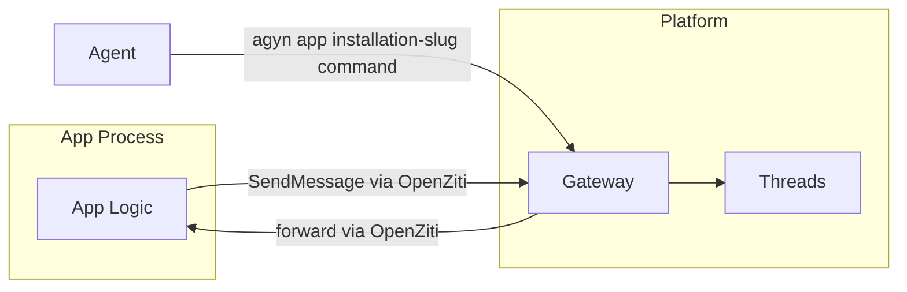
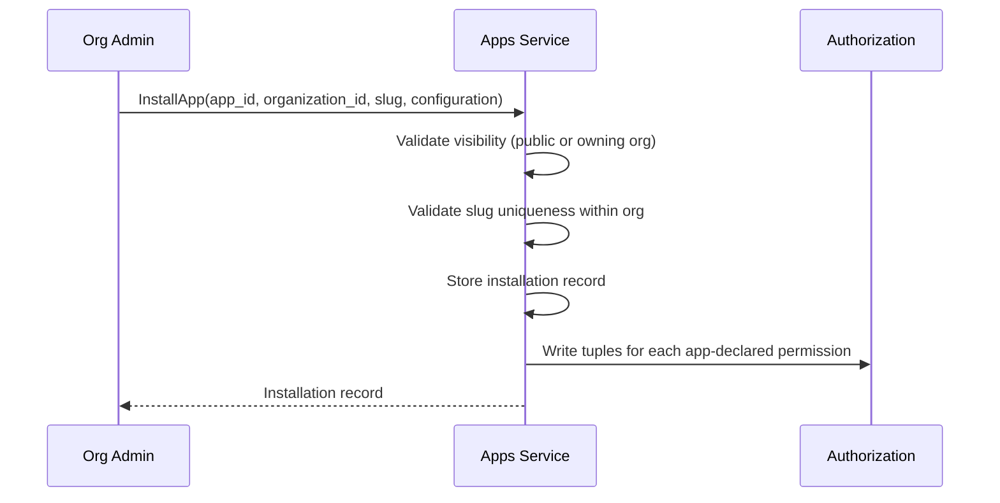

# Apps

## Overview

Apps are services that interact with threads on behalf of external systems or platform capabilities. Each app has its own [identity](identity.md) (type `app`), connects to the platform via [OpenZiti](openziti.md), and accesses platform APIs through the [Gateway](gateway.md). Apps are defined by organizations and made available to other organizations through [installations](#app-installation).

## Examples

| App | Description | Thread Interaction |
|-----|-------------|-------------------|
| **[Reminders](apps/reminders.md)** | Agent-initiated delayed messages | Write only |
| **[Telegram Connector](apps/telegram-connector.md)** | Bidirectional bridge to Telegram | Read + write (participant) |
| **GitHub** (future) | Agent-initiated event subscriptions | Write only |

## App Contract

Every app, regardless of implementation:

1. **Is defined** by an organization via the [Apps Service](apps-service.md) — receives a long-lived service token.
2. **Is installed** into target organizations via [App Installation](#app-installation) — receives org-scoped permissions and configuration.
3. **Enrolls** via the platform enrollment endpoint — presents the service token, receives an OpenZiti x509 identity.
4. **Binds** an OpenZiti service — so the Gateway can forward app-specific commands to it.
5. **Dials** the Gateway — to call platform APIs (SendMessage, etc.) using its own app identity.



## App

An app is a registered service on the platform. It belongs to an [organization](organizations.md) (the developing org) and defines the app's identity, connectivity, and visibility.

### Identity

Each app has a unique identity registered in the [Identity](identity.md) service with `identity_type: app`. This identity is used as `sender_id` when the app posts messages to threads.

When [Chat](chat.md) resolves a `sender_id` of type `app`, it fetches the app profile (name, icon) from the [Apps Service](apps-service.md).

### Identification

Each app has a unique **slug** within its owning organization — a human-readable identifier used in the app's public address and as the default slug during installation.

The app's globally unique address is `{org-slug}/{app-slug}` (e.g., `acme-tools/telegram-connector`).

| Field | Type | Description |
|-------|------|-------------|
| `slug` | string | Unique within the owning organization. Used in the app's public address and as default installation slug |

### Visibility

Apps have a visibility level that controls which organizations can install them:

| Visibility | Description |
|------------|-------------|
| `public` | Any organization can install the app |
| `internal` | Only the owning organization can install the app |

### Permissions

The app declares the permissions it requires to function. These are granted to the app's identity when the app is [installed](#app-installation) into an organization. The org admin sees the required permissions during installation.

| Permission | Description |
|------------|-------------|
| `thread:create` | Create threads in the organization |
| `thread:write` | Send messages to any thread in the organization without being a participant |
| `participant:add` | Add the organization's agents and users as thread participants |

This vocabulary is extensible — new permissions are added as new app capabilities emerge.

### Connectivity

Apps connect to the platform via [OpenZiti](openziti.md). An app has **bidirectional** OpenZiti access:

- **Bind** — the app binds its OpenZiti service so the Gateway can forward requests to it.
- **Dial** — the app dials the Gateway to call platform APIs (SendMessage, etc.).

See [OpenZiti — App Identity Lifecycle](openziti.md#app-identity-lifecycle) for enrollment details.

### Deployment

Apps are independently deployed services. The platform does not manage app workloads — apps are not started by a Runner or reconciled by an orchestrator.

Each app owns its own storage and dependencies. The platform provides connectivity (OpenZiti) and API access (Gateway) — not compute or storage.

## App Installation

An app installation connects an [app](#app) to a target organization. It provides org-scoped configuration and acts as a **permissions bridge** — granting the app access to interact with entities in the installing organization.

Without an installation, an app has no access to an organization's resources.

### Installation Model

| Field | Type | Description |
|-------|------|-------------|
| `id` | string (UUID) | Unique installation identifier |
| `app_id` | string (UUID) | Reference to the [app](#app) |
| `organization_id` | string (UUID) | The organization this installation belongs to |
| `slug` | string | Unique within the installing organization. Used in CLI commands and Gateway routing. Defaults to the app's slug |
| `configuration` | JSON object | App-specific configuration. Opaque to the platform — only the app interprets it |
| `created_at` | timestamp | Creation time |
| `updated_at` | timestamp | Last modification time |

### Slug

The installation slug is unique within the installing organization and is chosen by the org admin at install time. It defaults to the app's slug but can be overridden — this allows multiple installations of the same app within one organization (e.g., `telegram-support`, `telegram-sales`).

The slug is used in CLI commands: `agyn app <installation-slug> <command>`.

### Configuration

Installation configuration is a JSON object, opaque to the platform. The app defines what configuration keys it expects; the platform stores and delivers the values without interpretation.

Example for a Telegram Connector installation:

| Key | Value |
|-----|-------|
| `bot_token` | `123456:ABC-DEF...` |
| `agent_id` | `550e8400-e29b-41d4-a716-446655440000` |

See [Open Questions — Installation Configuration Secrets](../open-questions.md#installation-configuration-secrets) for the planned evolution of secret handling in configuration.

### Permissions Bridge

The installation grants the app's [declared permissions](#permissions) within the installing organization. When an installation is created, [authorization](authz.md) relationship tuples are written for each permission the app declared.

For example, a Telegram Connector declaring `[thread:create, participant:add]` receives tuples granting those two capabilities in the org. A Reminders app declaring `[thread:write]` receives only that.

Access to individual threads is governed by the granted permissions — participant apps access threads through participant membership, write-only apps access threads through the `thread:write` permission.

When an installation is deleted, the authorization tuples are removed — the app loses access to that organization.

### Multiple Installations

The same app can be installed multiple times:

- **Across organizations** — Org A and Org B each install the same Telegram Connector with different configs.
- **Within one organization** — Org A installs the same Telegram Connector twice with different slugs and configs (e.g., two Telegram bots for two teams).

### Installation Delivery

When the Gateway forwards a request to an app (via [app proxy](gateway.md#app-proxy)), it includes the installation ID in the request headers (`x-app-installation-id`). This allows the app to determine which installation the request is for and retrieve the relevant configuration.

### Installation Flow



## Installation Status and Audit Log

Apps can report operational information about their installations back to the platform. This information is visible to org admins in the Console and helps diagnose configuration issues or runtime problems.

### Installation Status

The app calls `ReportInstallationStatus` with a free-text markdown string describing its current state. Each call replaces the previous status — it represents the app's current condition, not a history. Passing an empty or whitespace-only string clears the status. The Console renders the status as markdown in the installation detail view.

Typical uses: confirming the app started successfully, reporting missing or invalid configuration keys, indicating that a required external service is unreachable.

### Audit Log

The app calls `AppendInstallationAuditLogEntry` to record a notable event. Each entry has a message and a severity level (`info`, `warning`, `error`). Entries are append-only — the platform assigns the timestamp server-side. The Console displays entries newest-first in the installation detail view.

Typical uses: logging startup and shutdown, recording configuration validation failures, noting successful connections to external systems, and surfacing errors that affect functionality.

The platform retains the most recent 1000 entries per installation (count-based ring buffer). The audit log is a diagnostic surface, not a durable log — apps needing long-term retention ship to their own sink. To make retries safe, callers may supply an `idempotency_key`; duplicates for the same `(installation_id, idempotency_key)` within 24 hours return the existing entry.

Both write APIs are authorized to the app's own identity — an app can only report status and append entries for installations of itself. Org members (and cluster admins, via existing authz rules) can read the status and audit log via the standard installation read APIs.

## Thread Interaction

Apps interact with threads through the standard [Threads](threads.md) API via the [Gateway](gateway.md). Two modes:

### Write-Only Apps

Apps that only post messages to threads (e.g., Reminders, GitHub). These apps:

- Call `SendMessage` with their app identity as `sender_id`.
- Are **not** thread participants — they do not join threads, do not receive notifications, do not acknowledge messages.
- Threads allows `app` identities to send messages without participant membership. See [Threads — Non-Participant Senders](threads.md#non-participant-senders).

### Participant Apps

Apps that need bidirectional thread interaction (e.g., [Telegram Connector](apps/telegram-connector.md)). These apps:

- Create threads and become participants (the creator is automatically a participant).
- Add other participants (agents, users) to threads they create — authorized by the [installation permissions](#permissions-bridge).
- Receive `message.created` notifications on their `thread_participant:{appId}` room.
- Pull unacknowledged messages via `GetUnackedMessages`, post responses via `SendMessage`, acknowledge via `AckMessages`.
- Follow the same [Consumer Sync Protocol](notifications.md#consumer-sync-protocol) as agents.

A Telegram Connector creates threads when Telegram users message the bot, adds the configured agent as a participant, and forwards messages bidirectionally.

## Permissions

App permissions are managed through [Authorization](authz.md) (OpenFGA relationship tuples), same as all other identities. Each app [declares the permissions it requires](#permissions), and the [installation](#permissions-bridge) grants those permissions within the installing organization.

| App | Declared Permissions | Thread Access |
|-----|---------------------|---------------|
| [Reminders](apps/reminders.md) | `thread:write` | Non-participant — writes to any thread in the org |
| [Telegram Connector](apps/telegram-connector.md) | `thread:create`, `participant:add` | Participant — creates threads and accesses them via membership |

See [Open Questions — App Permission Model](../open-questions.md#app-permission-model) for future refinement of granular permissions.

## Agent Interaction

Agents interact with apps through shell tool calls:

```bash
# Agent calls reminders app via agyn CLI
agyn app reminders create-reminder --thread <thread-id> --delay 180 --note "check ci"

# Agent lists active reminders
agyn app reminders list-reminders --thread <thread-id>
```

The agent runs `agyn` via its shell tool (the only built-in tool). `agyn` sends the request to the Gateway, which resolves the installation slug within the organization and forwards it to the app via OpenZiti. The app processes the request and returns a response.

## API Routing

The Gateway provides a generic pass-through mechanism for app-specific commands. The Gateway resolves the installation slug within the caller's organization context, then forwards to the app via OpenZiti. See [Gateway — App Proxy](gateway.md#app-proxy).

## Classification

Apps are **external workloads** — they connect to the platform as clients, not as internal services. They authenticate via OpenZiti mTLS and access platform services through the Gateway, same as agents.
