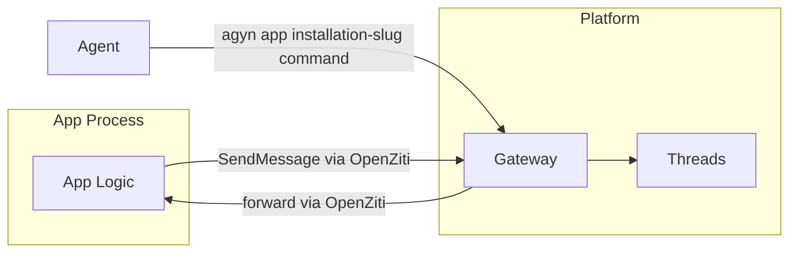
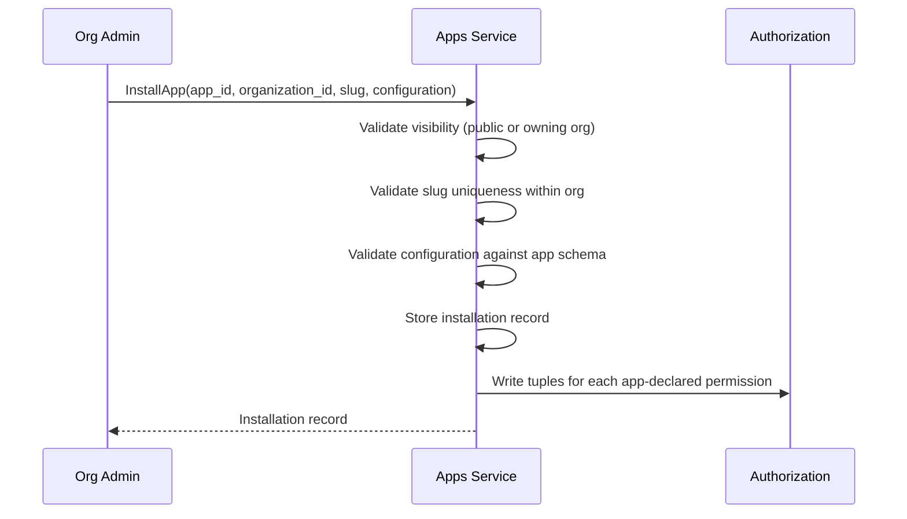

# Apps

## Overview

Apps are services that interact with threads on behalf of external systems or platform capabilities. Each app has its own [identity](identity.md) (type `app`), connects to the platform via [OpenZiti](openziti.md), and accesses platform APIs through the [Gateway](gateway.md). Apps are defined by organizations and made available to other organizations through [installations](#app-installation).

## Examples

| App | Description | Thread Interaction |
|-----|-------------|-------------------|
| **[Reminders](apps/reminders.md)** | Agent-initiated delayed messages | Write only |
| **[Telegram Connector](apps/telegram-connector.md)** | Bidirectional bridge to Telegram | Read + write (participant) |
| **[Slack Connector](apps/slack-connector.md)** | Mention-driven bridge to Slack threads | Read + write (participant) |
| **GitHub** (future) | Agent-initiated event subscriptions | Write only |

## App Contract

Every app, regardless of implementation:

1. **Is defined** by an organization via the [Apps Service](apps-service.md) — receives a long-lived service token.
2. **Is installed** into target organizations via [App Installation](#app-installation) — receives org-scoped permissions and configuration.
3. **Enrolls** via the platform enrollment endpoint — presents the service token, receives an OpenZiti x509 identity.
4. **Reports** its [configuration schema](#configuration-schema) — so the Console can build the form its installations are configured through.
5. **Binds** an OpenZiti service — so the Gateway can forward app-specific commands to it.
6. **Dials** the Gateway — to call platform APIs (SendMessage, etc.) using its own app identity.


```mermaid
graph LR
    subgraph "App Process"
        App[App Logic]
    end

    subgraph Platform
        Gateway
        Threads
    end

    Agent -->|agyn app installation-slug command| Gateway
    Gateway -->|forward via OpenZiti| App
    App -->|SendMessage via OpenZiti| Gateway
    Gateway --> Threads
```

## App

An app is a registered service on the platform. It belongs to an [organization](organizations.md) (the developing org) and defines the app's identity, connectivity, and visibility.

### Identity

Each app has a unique identity registered in the [Identity](identity.md) service with `identity_type: app`. This identity is used as `sender_id` when the app posts messages to threads.

When [Chat](chat.md) resolves a `sender_id` of type `app`, it fetches the app profile (name, icon) from the [Apps Service](apps-service.md).

### Identification

Each app has a unique **slug** within its owning organization — a human-readable identifier used in the app's public address and as the default slug during installation.

The app's globally unique address is `{org-slug}/{app-slug}` (e.g., `acme-tools/telegram-connector`).

| Field | Type | Description |
|-------|------|-------------|
| `slug` | string | Unique within the owning organization. Used in the app's public address and as default installation slug |

### Visibility

Apps have a visibility level that controls which organizations can install them:

| Visibility | Description |
|------------|-------------|
| `public` | Any organization can install the app |
| `internal` | Only the owning organization can install the app |

### Permissions

The app declares the permissions it requires to function. These are granted to the app's identity when the app is [installed](#app-installation) into an organization. The org admin sees the required permissions during installation.

| Permission | Description |
|------------|-------------|
| `thread:create` | Create threads in the organization |
| `thread:write` | Send messages to any thread in the organization without being a participant |
| `participant:add` | Add the organization's agents and users as thread participants |
| `inbox:write` | Write items directly to any [agent instance's inbox](agent-instances.md#inbox) in the organization, without going through a thread |

This vocabulary is extensible — new permissions are added as new app capabilities emerge.

### Configuration Schema

The app states the shape of its [installation configuration](#configuration) as a JSON Schema document, [reported by the running app](#reporting). That document is what makes configuration a form: the [Console](../product/console/console.md#apps) renders the install and update dialogs from the schema, and the Apps Service validates submitted configuration against it. An app with no schema keeps an opaque JSON object nobody but the app can interpret — which is a fallback, not the intent.

The schema belongs to the app, not to the installation. It describes what the app expects from every organization that installs it, so there is one schema per app across the platform.

#### Honored Subset

The platform honors a fixed subset of JSON Schema. The root is `type: object` with a flat `properties` map; a property is a scalar, an enum, or a list of strings:

| Property `type` | Rendered as |
|-----------------|-------------|
| `string` | Text input — password input when [`x-agyn-secret`](#agyn-keywords), picker when [`x-agyn-ref`](#agyn-keywords), select when `enum` is present |
| `integer`, `number` | Numeric input, bounded by `minimum` / `maximum` |
| `boolean` | Toggle |
| `array` with `items: {type: string}` | Repeatable string list |

Honored keywords: `title`, `description`, `default`, `deprecated`, `enum`, `pattern`, `format` (`uri`, `email`, `uuid`), `minLength`, `maxLength`, `minimum`, `maximum`, `minItems`, `maxItems` on properties; `properties` and `required` at the root.

Everything else is **rejected when the schema is reported** — nested objects, `oneOf` / `anyOf` / `allOf` / `not`, `$ref`, `patternProperties`, tuple-form `items`, and any type not in the table. A keyword the form cannot render describes configuration no form can produce, so the schema would validate values the Console has no way to collect. Rejecting at report time puts the error in front of the app author, who can fix it, rather than the installing admin, who cannot.

Undeclared keys are not accepted. The root behaves as `additionalProperties: false` whether or not it says so, because the only writer is a form built from `properties`.

#### Agyn Keywords

Two extension keywords carry what plain JSON Schema cannot express. Both apply to `string` properties only.

| Keyword | Meaning |
|---------|---------|
| `x-agyn-secret: true` | The value is a credential. The Console renders a write-only field, and read APIs [redact it](#secret-values) |
| `x-agyn-ref: <kind>` | The value is the UUID of a platform entity in the **installing** organization. The Console renders a picker; the Apps Service validates that the entity exists and belongs to that organization |

`x-agyn-ref` kinds are `agent`, `environment`, and `model`. The vocabulary is closed — each kind costs the Console a picker and the Apps Service a cross-service existence check, so it grows by platform change rather than by an app naming a kind nobody implements.

A schema declaring `x-agyn-ref: agent` is why installing the [Telegram Connector](apps/telegram-connector.md) means choosing an agent from a list instead of pasting a UUID copied from another browser tab.

#### Example

The [Telegram Connector](apps/telegram-connector.md#configuration) reports:

```json
{
  "type": "object",
  "properties": {
    "bot_token": {
      "type": "string",
      "title": "Bot token",
      "description": "Telegram Bot API token from @BotFather",
      "x-agyn-secret": true
    },
    "agent_id": {
      "type": "string",
      "format": "uuid",
      "title": "Agent",
      "description": "Agent added as participant when a Telegram chat opens a thread",
      "x-agyn-ref": "agent"
    }
  },
  "required": ["bot_token", "agent_id"]
}
```

An app that takes no configuration reports `{"type": "object", "properties": {}}`. That is not the same as reporting nothing: it tells the Console to say the app needs no configuration, where an absent schema makes it offer a JSON editor.

#### Reporting

**The app reports its own schema.** The running app calls `ReportConfigurationSchema` on the [Apps Service](apps-service.md#api) over its OpenZiti identity — at startup, after [enrollment](#connectivity), and again whenever the schema changes. The report is declarative: the service replaces the app's stored schema with the reported document, exactly as [`ReportRunnerCatalog`](runners.md#catalog-reporting) replaces a runner's catalog. There is no per-property API and no merge.

The schema is a property of the deployed binary. The version of the connector that is running is the only thing that knows which keys it reads, so it is the only thing that can state them without drifting. A schema typed into the Console or committed to a Terraform file is a human copy of what the code knows, and the day it falls behind a deploy is the day an org admin fills in a form correctly and the app reports `configuration_invalid` anyway — the failure this whole mechanism exists to remove.

`CreateApp` and `UpdateApp` therefore do not accept a schema. [Permissions](#permissions) are declared there and stay there, because a permission is a grant the installing organization consents to and must not be something a redeployed binary can widen on its own. A schema is a description of a form. The two look alike in the app record and are not alike at all.

A report that violates the [honored subset](#honored-subset) is rejected whole and the previously stored schema stands. An app whose new version reports an unrenderable schema keeps serving installs against its old form rather than losing the form entirely.

##### Before the First Report

An app record exists from `CreateApp`, which is before the app has ever run. Until the first report there is no schema and the Console offers the JSON editor. This is the honest state: an app that has never started also cannot serve an installation, so there is nothing to describe yet.

##### Across a Deploy

Only a *starting* app reports, and a deploy starts replicas of exactly one version. A rolling deploy from v1 to v2 has v2 replicas reporting and v1 replicas — which started long ago — reporting nothing, so the stored schema moves to v2 and stays there. A rollback converges the same way, in the other direction. No version counter is needed to order the reports, and none is stored.

A v1 replica restarting mid-rollout re-reports v1 and the schema flaps until the next v2 replica starts. The window is a form briefly offering the previous version's fields; it corrects itself, and it is not a correctness problem, because the schema gates writes only — [stored configuration is never revalidated](#schema-changes) and is delivered to the app exactly as stored.

##### Stored, Not Fetched

The reported schema is stored on the app record and read from there. The Console never dials the app to render a form. An app that is down still installs — its schema is what the platform holds, not what the app answers — which matters because "the app is unreachable" is one of the states an admin is most likely to be editing configuration to get out of.

#### Compatibility

**A reported schema must accept every configuration the stored schema accepted.** The Apps Service compares the incoming document against the one it holds and rejects the report if the new schema is narrower in any respect. A schema is a contract with configuration that already exists in organizations the app's author has no access to and cannot migrate; the platform enforces the contract instead of discovering it broken one organization at a time.

The first report has nothing to compare against and is accepted as written.

| Change | Verdict |
|--------|---------|
| Adding an optional property | Allowed |
| Marking a property `deprecated` | Allowed |
| Removing a property from `required` | Allowed |
| Widening a constraint — lower `minimum` / `minLength` / `minItems`, higher `maximum` / `maxLength` / `maxItems`, dropping a `pattern` or `format`, adding `enum` values | Allowed |
| Changing `title`, `description`, or `default` | Allowed |
| Marking a property `x-agyn-secret` that was not | Allowed |
| **Removing a property** | Rejected — [deprecate it](#deprecation) |
| **Changing a property's `type`**, or an array's `items.type` | Rejected |
| **Adding a property to `required`** | Rejected |
| **Narrowing a constraint** — the inverse of every widening above, including removing `enum` values | Rejected |
| **Changing or adding `x-agyn-ref`** | Rejected — an agent UUID is not a model UUID, and a plain string is not required to name anything |
| **Clearing `x-agyn-secret` from a property that had it** | Rejected |

Clearing `x-agyn-secret` breaks nothing a validator would notice, which is why it is worth naming: it takes values every installation submitted as credentials and exposes them on the [admin read path](#secret-values). A deploy is not an acceptable way to disclose a token that was collected under a promise it would not be readable.

There is no override and no force flag. An app that needs a genuinely incompatible shape publishes a second app.

##### Deprecation

`deprecated: true` is how a property leaves. It stays in the schema and stays valid: installations carrying it keep passing validation, and the app keeps receiving it. The [Console](../product/console/console.md#configuration-forms) hides a deprecated property that is unset and shows one that is set, marked as deprecated and clearable — an admin has to be able to get rid of a value the app no longer wants.

**A deprecated property may be removed once no installation of the app carries it.** The Apps Service owns every installation of the app, across every organization, so it is the one place that can answer this. A property nobody ever set — a typo, a key that never found a use — is removable on the next report. One that organizations still carry is not, and the report is rejected whole, naming how many installations still hold it: the previous schema stands and the deploy keeps serving the previous form.

##### Changing a Property's Type

The type of a property is fixed for its life. Migration is done by adding a property, not by changing one:

1. Report a new property of the new type, optional, alongside the old one.
2. Read both, preferring the new one. Report a status naming the installations still on the old key.
3. Mark the old property `deprecated` once the new one is the one being written.
4. Remove it once no installation carries it.

This is slower than editing the type in place and it is the only version that is safe, because steps 2 and 3 are where an organization that has not touched its configuration in a year keeps working.

##### Requiring Something New

A property cannot become required after installations exist. What the platform guarantees is what it will *accept*: making a key mandatory retroactively means an admin editing an unrelated field is blocked by one they may not have a value for, on an installation that was valid when it was written.

An app that needs a new key adds it optional and enforces it itself — the form shows it unset, and the app says what is missing through [installation status](#installation-status) and its [audit log](#audit-log), which is where a runtime requirement belongs. The distinction is that `required` describes what the form must collect to be submittable, not what the app needs to run.

### Connectivity

Apps connect to the platform via [OpenZiti](openziti.md). An app has **bidirectional** OpenZiti access:

- **Bind** — the app binds its OpenZiti service so the Gateway can forward requests to it.
- **Dial** — the app dials the Gateway to call platform APIs (SendMessage, etc.).

See [OpenZiti — App Identity Lifecycle](openziti.md#app-identity-lifecycle) for enrollment details.

### Deployment

Apps are independently deployed services. The platform does not manage app workloads — apps are not started by a Runner or reconciled by an orchestrator.

Each app owns its own storage and dependencies. The platform provides connectivity (OpenZiti) and API access (Gateway) — not compute or storage.

## App Installation

An app installation connects an [app](#app) to a target organization. It provides org-scoped configuration and acts as a **permissions bridge** — granting the app access to interact with entities in the installing organization.

Without an installation, an app has no access to an organization's resources.

### Installation Model

| Field | Type | Description |
|-------|------|-------------|
| `id` | string (UUID) | Unique installation identifier |
| `app_id` | string (UUID) | Reference to the [app](#app) |
| `organization_id` | string (UUID) | The organization this installation belongs to |
| `slug` | string | Unique within the installing organization. Used in CLI commands and Gateway routing. Defaults to the app's slug |
| `configuration` | JSON object | App-specific configuration. Validated against the app's [configuration schema](#configuration-schema) on write, interpreted only by the app |
| `created_at` | timestamp | Creation time |
| `updated_at` | timestamp | Last modification time |

### Slug

The installation slug is unique within the installing organization and is chosen by the org admin at install time. It defaults to the app's slug but can be overridden — this allows multiple installations of the same app within one organization (e.g., `telegram-support`, `telegram-sales`).

The slug is used in CLI commands: `agyn app <installation-slug> <command>`.

### Configuration

Installation configuration is a JSON object. The app's [configuration schema](#configuration-schema) defines its keys; the platform validates against that schema on write and delivers the values without interpreting them. Validation is the whole of the platform's interest in the content — no key has meaning to any platform service.

Example for a Telegram Connector installation:

| Key | Value |
|-----|-------|
| `bot_token` | `123456:ABC-DEF...` |
| `agent_id` | `550e8400-e29b-41d4-a716-446655440000` |

#### Validation

`InstallApp` and `UpdateInstallation` validate the submitted object against the app's schema and reject it as a whole if any property fails. Failures are returned **per property** — a property name and a message for each — so the Console attaches each to its input instead of showing one message for the form. `x-agyn-ref` properties are checked against the naming service (an `agent` reference against [Agents](agents-service.md)) for existence and for membership in the installing organization; a UUID that resolves in another organization is rejected exactly as a nonexistent one is.

An app that has reported no schema is not validated. Its configuration is stored as submitted.

#### Defaults

A property's `default` prefills the form. The platform does not inject defaults into the stored object: what the form submitted is what is stored, and a key the installer left out stays out. The app applies its own fallback for an absent key, which it must do anyway for installations that predate the key.

#### Secret Values

A property marked `x-agyn-secret` is returned only to the app. `GetInstallationConfiguration`, which the app calls for its own installations, is the sole read path that returns the value. **Every other method that returns an installation** — `GetInstallation`, `GetInstallationBySlug`, `ListInstallations`, `GetInstallationByIdentityId` — omits the property from `configuration` entirely and reports its name in `secret_keys_set` instead. The rule is on the installation message rather than on a list of methods, so a read path added later redacts without being told to. An admin can replace a bot token and cannot read one back out of the browser.

**The key is omitted, not masked.** A placeholder in the value's position is a value: a client that reads an installation, edits one field, and writes the object back would submit the placeholder as the credential. Omission makes that round-trip correct instead of destructive, because an omitted secret property is exactly what [`UpdateInstallation` treats as "keep what is stored"](apps-service.md#api). It also keeps `configuration` honest about its own types — `bot_token` is a string or it is not there, never a string in one direction and an object in the other. `secret_keys_set` is what a form or a plan reads to say **Set** next to a field it cannot show.

Writing is unchanged: the value is submitted in plain text on install or update. See [Open Questions — Installation Configuration Secrets](../open-questions.md#installation-configuration-secrets) for how these values are held at rest.

#### Schema Changes

An app changes its schema by reporting a new one, and the new one is [required to accept everything the old one accepted](#compatibility). A configuration that was valid when it was written stays valid, so existing installations do not need revalidating and are not revalidated. The next write to an installation is validated against the current schema, which the previous configuration already satisfies.

Two cases fall outside the guarantee, both of them older than the schema:

- **Configuration written before the app's first schema.** Nothing constrained it, so nothing promises it satisfies the first schema reported.
- **An `x-agyn-ref` whose target was deleted.** The reference was checked when it was written; the agent it names can be deleted afterwards, and no schema rule prevents that.

Either leaves an installation whose stored configuration does not satisfy the current schema — a state the Console shows and lets an admin repair; see [Console — Installation detail](../product/console/console.md#installed-apps). The configuration is still delivered to the app unchanged in the meantime, and the app has [status and an audit log](#installation-status-and-audit-log) to say what it makes of it.

### Permissions Bridge

The installation grants the app's [declared permissions](#permissions) within the installing organization. When an installation is created, [authorization](authz.md) relationship tuples are written for each permission the app declared, plus one that makes the app a member of the organization.

For example, a Telegram Connector declaring `[thread:create, participant:add]` receives tuples granting those two capabilities in the org. A Reminders app declaring `[thread:write]` receives only that.

### Organization Membership

An installation also writes `identity:<app_identity_id>, member, organization:<org_id>`. An installed app belongs to the organization it is installed into, and membership is how the platform says so.

The declared permissions are not a substitute. They are named capabilities on threads and inboxes; several relations are computed from `member` and cannot be reached any other way. The one that forced this is [agent availability](agents-service.md#availability): an `internal` agent resolves `can_initiate` through `member from internal_access`, so without membership an app holding `thread:create` and `participant:add` can create a thread and still not add any agent to it. `private` agents are the same story one step further — [`SetAgentRole`](agents-service.md#agent-role-api) only accepts identities that are members of the agent's organization, so an app could not be granted a role either.

Membership is recorded **only** as an authorization tuple. The [Organizations](organizations.md) service's `memberships` table is not written: it models people joining organizations — invitations, acceptance, nickname seeding — and none of that applies to a service installed by an org owner. Consequently an app does not appear in `ListMembers`, and member listings stay human.

What membership adds beyond the declared permissions is the reach any org member has: creating threads, initiating `internal` agents, reading agent and environment metadata, and creating sandboxes and environments. The last two are wider than an app needs. They are accepted rather than carved out, because the alternative is every membership check in every service growing a second branch for apps, and that branching is a larger and more permanent cost than the reach it avoids.

When an installation is deleted, the membership tuple is removed with the permission tuples.

Access to individual threads is governed by the granted permissions — participant apps access threads through participant membership, write-only apps access threads through the `thread:write` permission.

When an installation is deleted, the authorization tuples are removed — the app loses access to that organization.

### Multiple Installations

The same app can be installed multiple times:

- **Across organizations** — Org A and Org B each install the same Telegram Connector with different configs.
- **Within one organization** — Org A installs the same Telegram Connector twice with different slugs and configs (e.g., two Telegram bots for two teams).

### Installation Delivery

When the Gateway forwards a request to an app (via [app proxy](gateway.md#app-proxy)), it includes the installation ID in the request headers (`x-app-installation-id`). This allows the app to determine which installation the request is for and retrieve the relevant configuration.

### Installation Flow


```mermaid
sequenceDiagram
    participant Admin as Org Admin
    participant AS as Apps Service
    participant Auth as Authorization

    Admin->>AS: InstallApp(app_id, organization_id, slug, configuration)
    AS->>AS: Validate visibility (public or owning org)
    AS->>AS: Validate slug uniqueness within org
    AS->>AS: Validate configuration against app schema
    AS->>AS: Store installation record
    AS->>Auth: Write tuples for each app-declared permission
    AS-->>Admin: Installation record
```

## Installation Status and Audit Log

Apps can report operational information about their installations back to the platform. This information is visible to org admins in the Console and helps diagnose configuration issues or runtime problems.

### Installation Status

The app calls `ReportInstallationStatus` with a free-text markdown string describing its current state. Each call replaces the previous status — it represents the app's current condition, not a history. Passing an empty or whitespace-only string clears the status. The Console renders the status as markdown in the installation detail view.

Typical uses: confirming the app started successfully, reporting missing or invalid configuration keys, indicating that a required external service is unreachable.

### Audit Log

The app calls `AppendInstallationAuditLogEntry` to record a notable event. Each entry has a message and a severity level (`info`, `warning`, `error`). Entries are append-only — the platform assigns the timestamp server-side. The Console displays entries newest-first in the installation detail view.

Typical uses: logging startup and shutdown, recording configuration validation failures, noting successful connections to external systems, and surfacing errors that affect functionality.

The platform retains the most recent 1000 entries per installation (count-based ring buffer). The audit log is a diagnostic surface, not a durable log — apps needing long-term retention ship to their own sink. To make retries safe, callers may supply an `idempotency_key`; duplicates for the same `(installation_id, idempotency_key)` within 24 hours return the existing entry.

Both write APIs are authorized to the app's own identity — an app can only report status and append entries for installations of itself. Org members (and cluster admins, via existing authz rules) can read the status and audit log via the standard installation read APIs.

## Thread Interaction

Apps interact with threads through the standard [Threads](threads.md) API via the [Gateway](gateway.md). Two modes:

### Write-Only Apps

Apps that only post messages to threads (e.g., Reminders, GitHub). These apps:

- Call `SendMessage` with their app identity as `sender_id`.
- Are **not** thread participants — they do not join threads, do not receive notifications, do not acknowledge messages.
- Threads allows `app` identities to send messages without participant membership. See [Threads — Non-Participant Senders](threads.md#non-participant-senders).

### Participant Apps

Apps that need bidirectional thread interaction (e.g., [Telegram Connector](apps/telegram-connector.md)). These apps:

- Create threads and become participants (the creator is automatically a participant).
- Add other participants (agents, users) to threads they create — authorized by the [installation permissions](#permissions-bridge).
- Receive `message.created` notifications on their `thread_participant:{appId}` room.
- Pull unacknowledged messages via `GetUnackedMessages`, post responses via `SendMessage`, acknowledge via `AckMessages`.
- Follow the same [Consumer Sync Protocol](notifications.md#consumer-sync-protocol) as agents.

A Telegram Connector creates threads when Telegram users message the bot, adds the configured agent as a participant, and forwards messages bidirectionally.

## Permissions

App permissions are managed through [Authorization](authz.md) (OpenFGA relationship tuples), same as all other identities. Each app [declares the permissions it requires](#permissions), and the [installation](#permissions-bridge) grants those permissions within the installing organization.

| App | Declared Permissions | Thread Access |
|-----|---------------------|---------------|
| [Reminders](apps/reminders.md) | `thread:write` | Non-participant — writes to any thread in the org |
| [Telegram Connector](apps/telegram-connector.md) | `thread:create`, `participant:add` | Participant — creates threads and accesses them via membership |
| [Slack Connector](apps/slack-connector.md) | `thread:create`, `participant:add` | Participant — creates threads and accesses them via membership |

See [Open Questions — App Permission Model](../open-questions.md#app-permission-model) for future refinement of granular permissions.

## Agent Interaction

Agents interact with apps through shell tool calls:

```bash
# Agent calls reminders app via agyn CLI
agyn app reminders create-reminder --thread <thread-id> --delay 180 --note "check ci"

# Agent lists active reminders
agyn app reminders list-reminders --thread <thread-id>
```

The agent runs `agyn` via its shell tool (the only built-in tool). `agyn` sends the request to the Gateway, which resolves the installation slug within the organization and forwards it to the app via OpenZiti. The app processes the request and returns a response.

## API Routing

The Gateway provides a generic pass-through mechanism for app-specific commands. The Gateway resolves the installation slug within the caller's organization context, then forwards to the app via OpenZiti. See [Gateway — App Proxy](gateway.md#app-proxy).

## Classification

Apps are **external workloads** — they connect to the platform as clients, not as internal services. They authenticate via OpenZiti mTLS and access platform services through the Gateway, same as agents.
