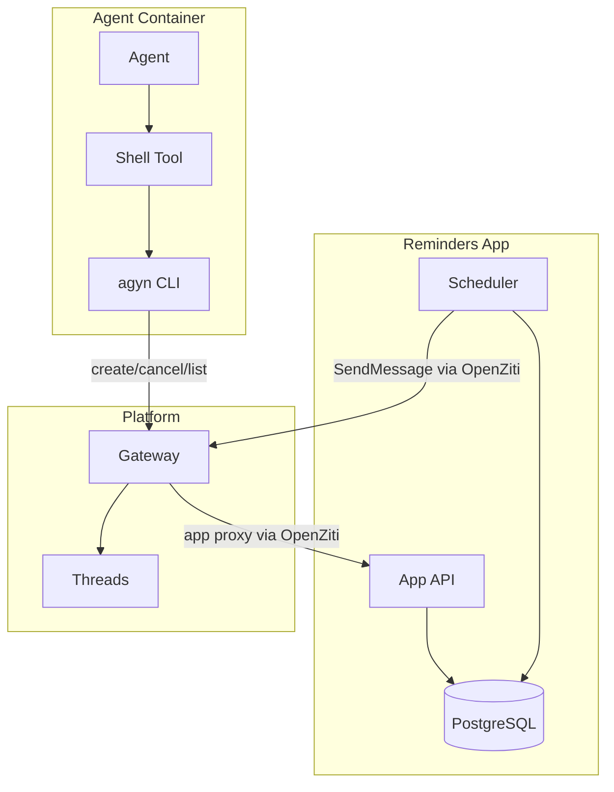
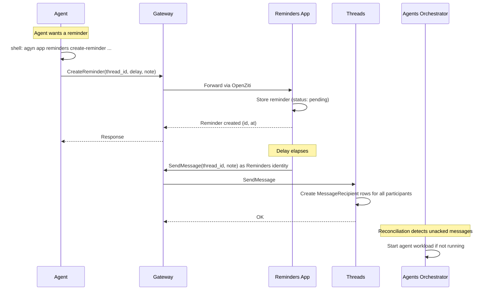

# Reminders

## Overview

Reminders is a platform-provided [app](../) that delivers delayed messages to threads. Agents schedule reminders via the [`agyn` CLI](../); when a reminder fires, the Reminders app posts a message to the thread, waking the agent through the normal [orchestrator reconciliation](../#reconciliation).

Reminders is the first app built on the [Apps](../) architecture. It is deployed as part of platform infrastructure and installed into organizations that need it.

| Aspect | Detail |
|--------|--------|
| **Type** | [App](../) |
| **Identity** | `app` type in [Identity](../) |
| **Thread interaction** | Write-only (non-participant) |
| **Visibility** | `public` — any organization can [install](../apps.md#app-installation) it |
| **Default slug** | `reminders` |
| **Deployment** | IaC (Terraform/bootstrap) |
| **Storage** | Own PostgreSQL database |
| **Connectivity** | [OpenZiti](../) — binds its OpenZiti service, dials Gateway |

## Agent Usage

Agents interact with the Reminders app via shell tool calls to the [`agyn` CLI](../):

```bash
# Schedule a reminder
agyn app reminders create-reminder --thread <thread-id> --delay 180 --note "check ci"

# List active reminders for a thread
agyn app reminders list-reminders --thread <thread-id>

# Cancel a reminder
agyn app reminders cancel-reminder --id <reminder-id>

# Get a specific reminder
agyn app reminders get-reminder --id <reminder-id>
```

## API

The Reminders app exposes its own API, reached via the Gateway's [app proxy](../#app-proxy). The Gateway forwards `agyn app reminders <command>` requests to the Reminders app over OpenZiti.

| Method | Description |
|--------|-------------|
| **CreateReminder** | Schedule a new reminder. Returns the created reminder with `id` and `at` |
| **CancelReminder** | Cancel a pending reminder by ID |
| **ListReminders** | List reminders for a thread. Supports filtering by status |
| **GetReminder** | Get a single reminder by ID |

### CreateReminder

| Field | Type | Required | Description |
|-------|------|----------|-------------|
| `thread_id` | string (UUID) | yes | Target thread for the reminder message |
| `delay_seconds` | integer | yes | Delay before firing (minimum: 0, maximum: 604800 — 7 days) |
| `note` | string | yes | Reminder content — included in the message posted to the thread |

Returns: the created [Reminder](#data-model) with `status: pending`.

### CancelReminder

| Field | Type | Required | Description |
|-------|------|----------|-------------|
| `reminder_id` | string (UUID) | yes | ID of the reminder to cancel |

Cancelling an already-completed or already-cancelled reminder returns an error.

### ListReminders

| Field | Type | Required | Description |
|-------|------|----------|-------------|
| `thread_id` | string (UUID) | yes | Thread to list reminders for |
| `status` | enum | no | Filter: `pending`, `completed`, `cancelled`, `all`. Default: `pending` |

Returns: list of [Reminders](#data-model) matching the filter.

### GetReminder

| Field | Type | Required | Description |
|-------|------|----------|-------------|
| `reminder_id` | string (UUID) | yes | ID of the reminder |

Returns: the [Reminder](#data-model).

## Data Model

| Field | Type | Description |
|-------|------|-------------|
| `id` | string (UUID) | Unique reminder identifier |
| `thread_id` | string (UUID) | Target thread |
| `note` | string | Reminder content |
| `status` | enum | `pending`, `completed`, `cancelled` |
| `at` | timestamp | Scheduled fire time |
| `created_at` | timestamp | Creation time |
| `completed_at` | timestamp (nullable) | When the reminder fired and message was sent |
| `cancelled_at` | timestamp (nullable) | When the reminder was cancelled |

## Behavior

### Scheduling

1. Agent calls `agyn app reminders create-reminder --thread <id> --delay 180 --note "check ci"`.
2. Request reaches the Reminders app via Gateway → OpenZiti.
3. Reminders app creates a reminder record in its database with `status: pending` and `at: now + delay`.
4. Returns the created reminder to the agent.

### Firing

1. When a reminder's scheduled time arrives, the Reminders app fires it.
2. The app calls `SendMessage` via Gateway → [Threads](../) with:
   - `sender_id`: the Reminders app's own identity
   - `thread_id`: the reminder's target thread
   - `body`: the reminder note (e.g., `"Reminder: check ci"`)
3. Threads creates `MessageRecipient` rows for all thread participants (since the sender is not a participant, no participant is excluded).
4. Threads publishes `message.created` notifications to each participant's room.
5. The [Agents Orchestrator](../) detects unacknowledged messages and starts the agent workload if not already running.
6. The reminder record is updated: `status: completed`, `completed_at: now`.

### Cancellation

1. Agent calls `agyn app reminders cancel-reminder --id <id>`.
2. Reminders app updates the record: `status: cancelled`, `cancelled_at: now`.
3. The scheduled fire is suppressed.

### Durability

Reminders are persisted to PostgreSQL. On restart, the Reminders app recovers pending reminders:

1. Query all reminders with `status: pending`.
2. For reminders where `at` is in the future: re-schedule the timer.
3. For reminders where `at` is in the past (missed during downtime): fire immediately.

This is an improvement over the previous implementation, which marked pending reminders as completed on restart without delivering them.

## Limits

| Limit | Value | Description |
|-------|-------|-------------|
| Max delay | 604800 seconds (7 days) | Maximum scheduling horizon |
| Recurrence | Not supported | One-shot only |

## Architecture



## Flow


