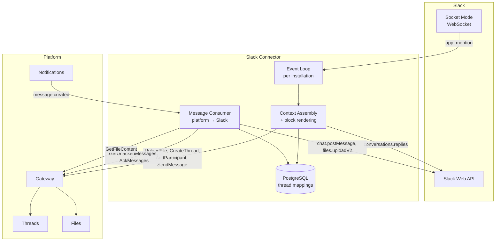

# Slack Connector

## Overview

The Slack Connector is a [platform app](../apps.md) that bridges Slack and the platform. It connects a Slack bot to a configured agent — Slack users mention the bot in a channel or a thread, the connector forwards the mention together with the surrounding Slack conversation to a platform thread, the agent responds, and the connector delivers the response back into the same Slack thread.

Unlike the [Telegram Connector](telegram-connector.md), where one chat maps to one thread and the bot sees every message, the connector is **mention-driven**. It receives only `app_mention` events, and reconstructs the conversation the agent needs by reading Slack's own thread history at mention time. Slack messages that do not mention the bot never reach the platform.

| Aspect | Detail |
|--------|--------|
| **Type** | [App](../apps.md) |
| **Identity** | `app` type in [Identity](../identity.md) |
| **Thread interaction** | Participant — creates threads, joins them, receives and sends messages |
| **Visibility** | `public` — any organization can install it |
| **Default slug** | `slack` |
| **Deployment** | Independently deployed (not managed by the platform) |
| **Storage** | Own PostgreSQL database |
| **Connectivity** | [OpenZiti](../openziti.md) — dials Gateway; Socket Mode to Slack |
| **Declared permissions** | `thread:create`, `participant:add` |

## Mapping Model

One Slack thread maps to one platform thread, which maps to one [agent instance](../agent-instances.md):

```
Slack thread (channel, thread_ts)  →  platform thread  →  agent instance
```

The connector adds the configured agent **class** as a participant. The [class-on-add rewrite](../threads.md#class-on-add-rewrite) mints a fresh instance per thread, and the class's default [`default_thread = origin`](../resource-definitions.md#agent) policy makes the new platform thread that instance's [default thread](../agent-instances.md#default-thread) — so the agent can reply without tracking thread ids.

## Configuration

Each installation provides the following configuration:

| Key | Type | Description |
|-----|------|-------------|
| `bot_token` | string | Slack bot token (`xoxb-…`) |
| `app_token` | string | Slack app-level token (`xapp-…`) used to open the Socket Mode connection |
| `agent_id` | string (UUID) | Agent class to add as participant when creating threads |
| `allowed_channels` | list of string | Optional. Slack channel IDs the connector will respond in. Empty or absent means every channel the bot is mentioned in |

Multiple installations are supported — each with its own token pair and `agent_id`. One Slack app corresponds to one bot user, so serving two agents from one workspace requires two Slack apps and two installations (e.g., `slack-oncall` and `slack-support`).

### Agent Authorization

Mentions are forwarded under the connector's app identity, so the [Agent Availability Check](../threads.md#agent-availability-check) is evaluated against the app, not against the Slack user who typed the mention.

An `internal` agent needs nothing: [installing the app makes it a member](../apps.md#organization-membership) of the organization, and `can_initiate` resolves through membership. A `private` agent needs an agent `owner` to grant the app a role via `SetAgentRole`, which accepts it for the same reason.

`allowed_channels` is the connector-side control over who can reach the agent — any workspace member who can mention the bot in an allowed channel can drive it.

## Connectivity

The connector uses Slack **Socket Mode** — an outbound WebSocket opened with the app-level token. This is the direct analogue of Telegram long polling and the only option compatible with the [app deployment model](../apps.md#connectivity): apps dial out over OpenZiti and have no public HTTPS ingress for Events API webhooks.

One Socket Mode connection runs per installation.

### Required Slack Scopes

| Scope | Purpose |
|-------|---------|
| `connections:write` | Open the Socket Mode connection (app-level token) |
| `app_mentions:read` | Receive `app_mention` events |
| `channels:history` | Read thread history in public channels |
| `groups:history` | Read thread history in private channels |
| `im:history`, `mpim:history` | Read history in DMs and group DMs |
| `channels:read` | Resolve a channel id to its name for the message header |
| `groups:read` | The same for private channels |
| `channels:join` | Join public channels on `not_in_channel` |
| `chat:write` | Post replies |
| `users:read` | Resolve `<@U…>` to display names |
| `files:read` | Download files attached to Slack messages |
| `files:write` | Upload agent-produced files |
| `reactions:write` | Acknowledgment reactions |

`app_mention` is delivered only for channels the bot is a member of. Membership can still lapse afterwards — being removed from a private channel, or losing a history scope — so reads are not assumed to succeed. See [History Availability](#history-availability).

Channel-name resolution degrades rather than fails: without `channels:read` the header carries the raw channel id instead of `#name`, and nothing else changes.

## Thread Mapping

The connector maintains a persistent mapping of `(installation_id, team_id, channel_id, thread_ts) → thread_id`.

`thread_ts` is normalized so every mention resolves to a Slack thread:

| Mention location | `thread_ts` |
|------------------|-------------|
| Reply inside an existing Slack thread | the event's `thread_ts` |
| Top-level channel message | the event's own `ts` — the bot replies in-thread, creating the Slack thread |
| DM with the bot | the event's `thread_ts` if present, otherwise the event's `ts` |

When a mention arrives for a `thread_ts` that has no mapping:

1. Create a new platform thread. The connector's app identity becomes a participant automatically as the creator.
2. Add the configured agent class as a participant.
3. Store the mapping with `last_forwarded_ts` unset.

**Order matters.** The agent must be a participant *before* any message is forwarded — [message delivery](../threads.md#message-delivery) creates inbox items only for participants at `SendMessage` time, and adding a participant does not backfill. Forwarding before the add would leave the agent's inbox empty.

Subsequent mentions in the same Slack thread reuse the same platform thread and the same agent instance.

If `SendMessage` returns a `thread degraded` error, the connector treats the platform thread as permanently unusable: it deletes the mapping and creates a new thread as if none existed. Because `last_forwarded_ts` lives on the mapping, the new thread receives the full Slack thread history from the root — the rotation is self-healing.

## Inbound Flow (Slack → Platform)

### Installation Discovery

On startup the connector calls `ListInstallations` and opens one Socket Mode connection per result. A reconciliation loop runs every 60 seconds, diffing running connections against the current `ListInstallations` result — opening connections for new installations and closing them for uninstalled ones.

### Event Handling

Socket Mode requires the envelope to be acknowledged within 3 seconds, and Slack redelivers unacknowledged envelopes. The connector acknowledges the envelope immediately on receipt and processes the event asynchronously.

Redelivery is handled by a `ProcessedEvent` record keyed on `(installation_id, event_id)`, written when processing completes. An event whose id is already recorded is discarded. Processing is at-least-once: a crash between the forwarded message and the `ProcessedEvent` write results in the mention being forwarded twice.

Events for channels outside a non-empty `allowed_channels` are discarded without creating a mapping.

### Mention Handling

For each accepted `app_mention` event:

1. Resolve or create the [thread mapping](#thread-mapping).
2. Fetch the Slack thread with `conversations.replies(channel, ts=thread_ts)`, following pagination.
3. Partition the result:
   - **root** — `messages[0]`, the message the thread hangs off.
   - **delta** — messages after `last_forwarded_ts`, excluding the triggering mention and excluding messages posted by this installation's own bot user.
4. Add the 👀 reaction to the mention.
5. Send **one** platform message — see [Forwarded Message](#forwarded-message).
6. Set `last_forwarded_ts` to the mention's `ts`.

### Forwarded Message

**One mention is one message.** The context the agent has not seen and the instruction it is being asked to act on travel together, context first, instruction last.

They were two messages once. The split gave nothing the ordering of sections does not, and cost: two sends a few milliseconds apart read as two messages from the connector wherever the thread is displayed, and which of them came first rested on comparing timestamps that can tie. The instruction keeps the property that mattered — being last, so it is the final thing the agent reads — by closing the message rather than by being a message.

The root is included on every mention; replies are a delta.

```markdown
## Slack — #alerts · [open thread](https://acme.slack.com/archives/C0123/p1754748120000100)

### Thread root — @grafana (app), 2026-08-09 14:02 UTC

#### [HighErrorRate — api-gateway](https://grafana.acme.io/d/abc) `danger`

- **Environment:** prod
- **Severity:** page
- **Value:** 8.4% (threshold 2%)

_Grafana · 14:02 UTC_

### Replies since the last turn (3)

**@alice** 14:05 — same as last tuesday?

**@bob** 14:06 — checking the deploy log

**@bob** 14:06 — deploy was 13:58, matches

### Mention

**@alice** 14:07 — @assistant check this event
```

Rules:

- The root is re-sent in full on every mention. It is what the thread is about, and the agent has no way to fetch it back once its own context has compacted.
- The `Replies` section is omitted when the delta is empty.
- The `Thread root` section is omitted when the root *is* the triggering mention — a top-level channel mention creating a new thread has nothing preceding it. The header and the `Mention` section are always present.

### Context Bounds

| Bound | Default | Behavior on exceed |
|-------|---------|--------------------|
| Reply count | 50 | Keep the most recent; prefix the section with `_[142 earlier replies omitted]_` |
| Total rendered replies | 20,000 chars | Drop oldest replies until under the bound; same marker |
| Single rendered block or attachment | 4,000 chars | Truncate with a trailing `_[… truncated]_` |

The root is never dropped, only its individual blocks truncated. Omissions are always marked — the agent has no way to fetch what was dropped, so silent truncation would leave it reasoning confidently over a partial view.

### History Availability

Reading thread history requires both a history scope and channel membership. Mentionability requires neither, so `conversations.replies` can fail on a mention that arrived successfully.

| Rung | Condition | Behavior |
|------|-----------|----------|
| 1 | `conversations.replies` succeeds | Full context in the forwarded message |
| 2 | `not_in_channel`, public channel | Call `conversations.join`, retry once. Audit `channel_joined` |
| 3 | Join fails, private channel, or missing scope | Forward the mention alone, prefixed with the banner below. Post the same notice into the Slack thread so a human can fix it. Audit `history_unavailable` |

Rung 3 banner, opening the `Mention` section:

```markdown
> **Thread history unavailable** — this bot is not a member of #alerts, or the installation lacks
> the history scope. Only the message that mentioned it is shown.
```

Telling the agent its view is partial is the point. An agent given a silently truncated thread answers as if it had the whole thing.

### Message Rendering

An alert's top-level `text` is typically a fallback like `[FIRING:1] HighErrorRate`; the diagnosable content lives in `blocks` or `attachments`. The connector renders both to markdown and uses `text` only when neither is present.

**Block Kit:**

| Block or element | Rendered as |
|------------------|-------------|
| `header` | `#### {text}` |
| `section.text` | Paragraph |
| `section.fields[]` | `- **{label}:** {value}` — a field whose mrkdwn opens with a bold run followed by a newline is split into label and value; otherwise rendered as a plain list item |
| `section.accessory` (image) | `` |
| `context.elements[]` | One italic line, elements joined by ` · ` |
| `actions.elements[]` | `[{text}]({url})` for each button carrying a `url`; buttons without one are omitted |
| `image` | `` |
| `divider` | `---` |
| `rich_text_section` | Paragraph |
| `rich_text_list` | Markdown list |
| `rich_text_preformatted` | Fenced code block |
| `rich_text_quote` | Blockquote |
| Unrecognized type | `_[unsupported block: {type}]_` |

`actions` matters more than its position in the list suggests — for most alerting integrations the runbook and dashboard links exist only as buttons.

Headings produced by rendering are emitted at `####` so they nest under the forwarded message's own `##` and `###` structure rather than competing with it.

**Legacy attachments** are still what Grafana, Alertmanager, PagerDuty and Datadog emit, and an implementation that renders only `blocks` renders those alerts blank:

| Attachment field | Rendered as |
|------------------|-------------|
| `blocks` | Recursed as Block Kit; sibling attachment fields ignored when present |
| `pretext` | Paragraph before the title |
| `title` + `title_link` | `#### [{title}]({title_link})` |
| `text` | Paragraph |
| `fields[]` | `- **{title}:** {value}` |
| `image_url`, `thumb_url` | `` |
| `footer` + `ts` | Trailing italic line |
| `color` | Appended to the title line as `` `good` ``, `` `warning` `` or `` `danger` `` when the value is one of those literals. Hex values are ignored |

**Inline entities** are resolved inside every mrkdwn string. HTML entities (`&amp;`, `&lt;`, `&gt;`) are unescaped first, before any other transformation:

| Raw | Rendered |
|-----|----------|
| `<@U024BE7LH>` | `@alice` — resolved via `users.info`, cached per installation |
| `<#C0123\|alerts>` | `#alerts` |
| `<!subteam^S123\|@oncall>` | `@oncall` |
| `<!here>`, `<!channel>` | `@here`, `@channel` |
| `<https://x\|Runbook>` | `[Runbook](https://x)` |
| `<https://x>` | `https://x` |
| `*bold*`, `_italic_`, `~strike~` | `**bold**`, `*italic*`, `~~strike~~` |

Code spans, fenced blocks and blockquotes pass through unchanged.

**Sender attribution:**

| Source | Rendered name |
|--------|---------------|
| Human | `@{display_name}` |
| Bot with `bot_profile` | `@{bot_profile.name} (app)` |
| Webhook with a per-message `username` | `@{username} (app)` |
| Unresolvable | The raw user or bot id |

Losing bot attribution loses which monitoring system fired the alert, which is signal the agent needs.

### Inbound Media

For each file on a rendered Slack message:

1. Download `url_private` with `Authorization: Bearer {bot_token}` — Slack file URLs are not publicly fetchable.
2. Upload to the platform Files service via the Gateway (`UploadFile`).
3. Reference the file inline in the rendered transcript as `agyn://file/<id>` and include the returned UUID in the `files` field of the platform message carrying that transcript.

The reference form is what [files-mcp](../files-mcp.md) reads, so a graph screenshot pasted into an incident thread is available to the agent as content, not just as a link.

## Outbound Flow (Platform → Slack)

The connector follows the standard [Consumer Sync Protocol](../notifications.md#consumer-sync-protocol):

1. Subscribe to `message.created` notifications on the `thread_participant:{appId}` room.
2. On notification (or periodic poll), call `GetUnackedMessages`.
3. For each unacknowledged message:
   - Skip messages sent by the connector's own app identity (echo prevention).
   - Look up `(channel_id, thread_ts)` from the mapping by `thread_id` and deliver.
4. Call `AckMessages` after successful delivery.

### Outbound Delivery

Every post carries the mapping's `thread_ts`, so replies land in the Slack thread the mention came from.

**Body preprocessing:** the message `body` is converted from markdown to Slack mrkdwn — the inverse of the [inbound table](#message-rendering) — and scanned for inline markdown images (``):

- `agyn://file/<id>` — downloaded from the platform Files service and uploaded with `files.uploadV2` into the thread.
- `http(s)://` URL — left in the text. Slack unfurls it; there is no post-by-URL image method for messages.

**Delivery order:**

1. If the converted body is non-empty, post it with `chat.postMessage`. Bodies over 3,500 characters are split on paragraph boundaries into consecutive posts.
2. Upload each image extracted from the body with `files.uploadV2`.
3. For each file in `files`: download via `GetFileContent` and upload with `files.uploadV2`.

### Acknowledgment Reactions

Agent turns take longer than a Slack user expects a bot to take, so the connector signals progress with reactions on the mention message:

| Reaction | When |
|----------|------|
| 👀 `eyes` | The mention was accepted and forwarded |
| ✅ `white_check_mark` | The first outbound message for that mention was delivered; 👀 is removed |
| ❌ `x` | The mention could not be forwarded |

Reactions are cosmetic — failures on `reactions.add` / `reactions.remove` are logged and otherwise ignored.

## Delivery Failures

### Slack Rate Limits

Slack returns `429 Too Many Requests` with a `Retry-After` header. The connector sleeps for the indicated duration and retries the same call. Without a `Retry-After`, exponential backoff is used (starting at 1 s, capped at 32 s). `chat.postMessage` is additionally limited to roughly one message per second per channel.

### Channel Errors

| Slack error | Handling |
|-------------|----------|
| `not_in_channel` on post | Attempt `conversations.join` for public channels and retry once; otherwise ack the platform message and audit `outbound_delivery_failed` |
| `channel_not_found`, `is_archived` | Mark the mapping dead, ack, audit. No further delivery is attempted for that mapping |
| `invalid_auth`, `account_inactive` | Report `Misconfigured` status, close the Socket Mode connection, audit `token_rejected` |

### Other Failures

Transient failures (5xx, network errors) are retried up to 3 times with exponential backoff. If all retries fail, the message is acknowledged and the error logged — one failed delivery does not block the outbound queue.

## Installation Status and Audit Log

The connector uses the [Installation Status and Audit Log](../apps.md#installation-status-and-audit-log) APIs, scoped per installation — one Socket Mode connection, one status, one audit log stream.

### Status

`ReportInstallationStatus` is called on meaningful state changes (startup, token validation outcome, connection transitions, uninstall) and on a 60-second periodic tick.

| State | Meaning |
|-------|---------|
| **Healthy** | Socket Mode connected, recent events received or connection idle-but-live, recent outbound sends succeeded |
| **Degraded** | Connection dropping and reconnecting, sustained rate limiting, outbound delivery failing, or one or more mapped channels unreadable |
| **Misconfigured** | `bot_token` or `app_token` rejected by Slack, or a required configuration key missing — requires operator action |
| **Stopped** | No connection running (installation being removed or connector shutting down) |

Metrics reported:

| Metric | Description |
|--------|-------------|
| `socket_connected_at` | When the current Socket Mode connection was established |
| `last_event_at` | Timestamp of the last event received |
| `active_threads` | Count of live mappings for the installation |
| `unreadable_channels` | Channels where history reads are failing (rung 3) |
| `mentions_1h` | Mentions forwarded Slack → Platform in the last hour |
| `outbound_messages_1h` | Messages forwarded Platform → Slack in the last hour |
| `last_outbound_at` | Timestamp of the last successful outbound send |
| `last_error` | Most recent Slack or Gateway error (code + short message + timestamp), if any in the last hour |

Example (healthy):

```markdown
**Healthy** — connected since 2026-08-09T09:00:12Z

- Last event: 2026-08-09T09:04:09Z
- Active threads: 34
- Mentions (1h): 12
- Outbound (1h): 18 messages
- Last outbound: 2026-08-09T09:04:07Z
```

Example (degraded):

```markdown
**Degraded** — thread history unreadable in 2 channels

- Not a member of `#incidents`, `#platform-alerts`
- Mentions in those channels are forwarded without thread context
- Invite the bot to those channels to restore full context
```

### Audit Log

`AppendInstallationAuditLogEntry` is called for notable per-installation events. Per-message events are excluded to keep the 1000-entry ring buffer useful. Each entry passes an `idempotency_key` so retries after transient Gateway errors do not duplicate entries.

| Event | Level | When |
|-------|-------|------|
| `socket_connected` | `info` | Socket Mode connection established — on startup or after a reconnect |
| `socket_disconnected` | `warning` | Connection lost; recorded once per outage, not per reconnect attempt |
| `configuration_invalid` | `error` | `bot_token`, `app_token` or `agent_id` missing, malformed, or rejected on first validation |
| `token_rejected` | `error` | Slack returns `invalid_auth` or `account_inactive` — recorded once per transition into the rejected state |
| `slack_unreachable` | `warning` | API calls failing with network or 5xx errors for more than 60 seconds — once per outage |
| `slack_recovered` | `info` | First success after a `slack_unreachable` or `token_rejected` entry |
| `channel_joined` | `info` | The bot auto-joined a public channel after `not_in_channel` |
| `history_unavailable` | `warning` | A mention was forwarded without thread context (rung 3). Includes the channel id and the Slack error |
| `mention_rejected` | `info` | A mention arrived from a channel outside `allowed_channels` |
| `thread_degraded_rotated` | `warning` | `SendMessage` returned `thread degraded`; the mapping was rotated. Includes the old and new `thread_id` and the Slack channel and `thread_ts` |
| `outbound_delivery_failed` | `error` | An outbound message was acked after exhausting retries. Includes `thread_id`, the Slack error code, and the message id |

## Data Model

### ThreadMapping

| Field | Type | Description |
|-------|------|-------------|
| `id` | string (UUID) | Unique mapping identifier |
| `installation_id` | string (UUID) | Platform installation this mapping belongs to |
| `team_id` | string | Slack workspace identifier |
| `channel_id` | string | Slack channel identifier |
| `thread_ts` | string | Slack thread timestamp — the normalized thread key |
| `thread_id` | string (UUID) | Corresponding platform thread |
| `last_forwarded_ts` | string (nullable) | `ts` of the most recently forwarded mention. NULL until the first successful forward |
| `root_rendered` | text (nullable) | Cached rendered root message, so the root survives a later loss of history access |
| `root_cached_at` | timestamp (nullable) | When the root was rendered |
| `dead_at` | timestamp (nullable) | Set when the Slack channel is gone or archived; outbound delivery is skipped |
| `created_at` | timestamp | When the mapping was created |

Indexes: `UNIQUE(installation_id, team_id, channel_id, thread_ts)` for inbound routing; `(thread_id)` for outbound routing.

### ProcessedEvent

Deduplicates Slack event redelivery.

| Field | Type | Description |
|-------|------|-------------|
| `installation_id` | string (UUID) | Platform installation |
| `event_id` | string | Slack `event_id` |
| `processed_at` | timestamp | When processing completed |

Index: `UNIQUE(installation_id, event_id)`. Rows older than 24 hours are pruned.

### UserCache

Backs `<@U…>` resolution without a `users.info` call per mention.

| Field | Type | Description |
|-------|------|-------------|
| `installation_id` | string (UUID) | Platform installation |
| `slack_user_id` | string | Slack user or bot id |
| `display_name` | string | Resolved name used in attribution |
| `is_bot` | boolean | Renders the `(app)` suffix |
| `cached_at` | timestamp | Refreshed on a rolling TTL |

## Dependencies

| Dependency | Usage |
|------------|-------|
| **Slack Socket Mode** | Event delivery (`app_mention`) over an outbound WebSocket |
| **Slack Web API** | `conversations.replies`, `conversations.join`, `chat.postMessage`, `files.uploadV2`, `users.info`, `reactions.add`, `reactions.remove` |
| **Slack file download** | `url_private` with a bearer token |
| **Gateway → Threads** | `CreateThread`, `AddParticipant`, `SendMessage`, `GetUnackedMessages`, `AckMessages` |
| **Gateway → Files** | `UploadFile` (inbound media), `GetFileContent` (outbound media) |
| **Gateway → Apps** | `ListInstallations`, `ReportInstallationStatus`, `AppendInstallationAuditLogEntry` |
| **Gateway → Notifications** | Subscribe to `thread_participant:{appId}` for real-time message events |

## Architecture



## Flow

```mermaid
sequenceDiagram
    participant SL as Slack
    participant SC as Slack Connector
    participant GW as Gateway
    participant Th as Threads
    participant A as Agent Instance

    Note over SL,SC: A monitoring app posted an alert; @alice mentions the bot in the thread
    SL-->>SC: app_mention (channel, thread_ts)
    SC->>SL: ack envelope
    SC->>SL: conversations.replies(channel, thread_ts)
    SL-->>SC: root (alert blocks) + replies

    Note over SC,Th: First mention — create thread, then add the agent, then forward
    SC->>GW: CreateThread
    GW->>Th: CreateThread
    SC->>GW: AddParticipant(agent class)
    GW->>Th: AddParticipant → fresh instance
    SC->>SL: reactions.add(eyes)
    SC->>GW: SendMessage(context: root + replies)
    SC->>GW: SendMessage(the mention)
    GW->>Th: SendMessage ×2
    Th->>A: inbox items

    Note over A: One turn over both items
    A->>GW: SendMessage(body, files)
    GW->>Th: SendMessage

    Th->>SC: message.created notification
    SC->>GW: GetUnackedMessages
    GW-->>SC: [message]
    SC->>SL: chat.postMessage(channel, thread_ts, text)
    SC->>SL: reactions.remove(eyes) / reactions.add(white_check_mark)
    SC->>GW: AckMessages
```

## Constraints

- **Mention-driven only.** The connector subscribes to `app_mention` and does not subscribe to `message.*`. Messages that do not mention the bot never reach the platform. This is deliberate: mirroring a channel would create an [inbox item](../agent-instances.md#inbox) — and therefore an agent workload — for every human message in the thread.
- The agent's context is exactly what the connector forwards. There is no app-proxy command surface for the agent to read channels, search, or re-fetch a thread on its own, so anything dropped by [context bounds](#context-bounds) is unrecoverable within that turn and is marked as omitted.
- Message shortcuts, slash commands, and the Slack Assistant (`assistant.threads`) surface are not in the initial version.
- Edited and deleted Slack messages are not propagated as they happen. An edit made before the next mention is picked up automatically, because the forwarded message is rebuilt from `conversations.replies` on every mention.
- Slack user identities are not mapped to platform identities. Every Slack participant appears under the connector's app identity, with attribution carried in the message body.
- OAuth distribution (a Slack app listed in the App Directory and installed per workspace) is not supported. Each installation carries its own token pair for a single workspace.
- One `agent_id` per installation, and one bot user per Slack app — routing to a second agent requires a second Slack app and a second installation.
- Slack's per-file upload limit applies to media in both directions.
- Recurrence and scheduling are not in scope — those are handled by the [Reminders](reminders.md) app.
