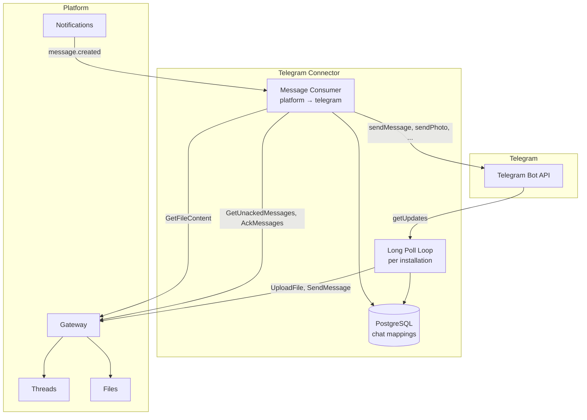
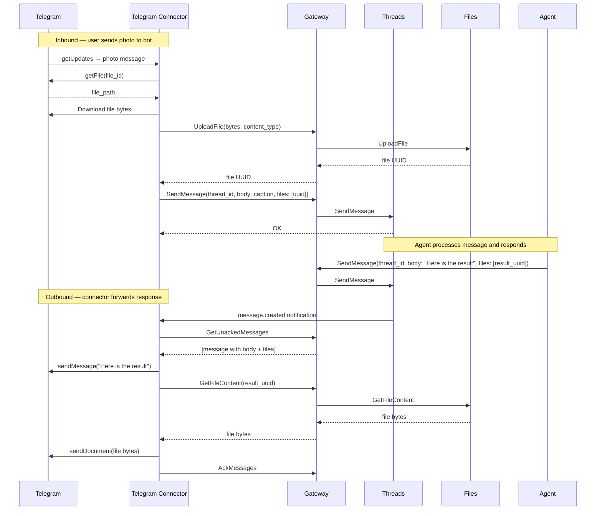

# Telegram Connector

## Overview

The Telegram Connector is a [platform app](../apps.md) that bridges Telegram and the platform. It connects a Telegram bot to a configured agent — Telegram users message the bot, the connector forwards messages to a platform thread, the agent responds, and the connector delivers the response back to Telegram. Media (photos, documents, audio, video, voice) is forwarded in both directions.

| Aspect | Detail |
|--------|--------|
| **Type** | [App](../apps.md) |
| **Identity** | `app` type in [Identity](../identity.md) |
| **Thread interaction** | Participant — creates threads, joins them, receives and sends messages |
| **Visibility** | `public` — any organization can install it |
| **Default slug** | `telegram` |
| **Deployment** | Independently deployed (not managed by the platform) |
| **Storage** | Own PostgreSQL database |
| **Connectivity** | [OpenZiti](../openziti.md) — dials Gateway |
| **Declared permissions** | `thread:create`, `participant:add` |

## Configuration

Each installation provides the following configuration:

| Key | Type | Description |
|-----|------|-------------|
| `bot_token` | string | Telegram Bot API token (from @BotFather) |
| `agent_id` | string (UUID) | Agent to add as participant when creating threads |

Multiple installations are supported — each with its own `bot_token` and `agent_id`. This allows one organization to run multiple bots (e.g., `telegram-support` and `telegram-sales`) from a single connector deployment.

## Thread Mapping

The connector maintains a persistent mapping of `(installation_id, telegram_chat_id) → thread_id`.

When a message arrives from a Telegram chat that has no mapping:
1. Create a new platform thread. The connector's app identity becomes a participant automatically as the creator.
2. Add the configured agent as a participant.
3. Store the mapping.

Subsequent messages from the same Telegram chat reuse the same thread. Thread lifecycle is indefinite — threads are never archived by the connector.

If `SendMessage` returns a `thread degraded` error, the connector treats the existing thread as permanently unusable: it deletes the `(installation_id, telegram_chat_id)` mapping and creates a new thread as if no mapping existed. The user's next message (the one that triggered the error) is then forwarded to the new thread. From the Telegram user's perspective, the conversation continues without interruption.

## Inbound Flow (Telegram → Platform)

The connector polls Telegram using long polling (`getUpdates`). One polling loop runs per installation.

### Installation Discovery

On startup the connector calls `ListInstallations` to enumerate all installations and starts one polling loop per result. A reconciliation loop runs every 60 seconds — it diffs the running loops against the current `ListInstallations` result, starts loops for new installations, and stops loops for uninstalled ones. No notification-driven hot-reload is needed; a 60-second lag for a newly installed bot is acceptable.

### Update Offset Persistence

The connector persists the last processed `update_id` per installation. Each `getUpdates` call passes `offset = last_update_id + 1`, which also instructs Telegram to discard all earlier updates. The offset is written to the database after each batch is successfully processed. On restart, the connector resumes from the stored offset, preventing duplicate inbound messages.

For each incoming Telegram update:

1. Look up or create the thread mapping for the chat.
2. Determine the message type and process accordingly (see [Media Handling](#media-handling)).
3. Call `SendMessage` on the platform Threads service via the Gateway.

### Message Types

| Telegram type | Platform message |
|---------------|-----------------|
| Text | `body: text`, no files |
| Photo + optional caption | `body: caption` (or empty), `files: [uploaded_id]` — largest available photo size |
| Document + optional caption | `body: caption` (or empty), `files: [uploaded_id]` |
| Audio + optional caption | `body: caption` (or empty), `files: [uploaded_id]` |
| Voice + optional caption | `body: caption` (or empty), `files: [uploaded_id]` |
| Video + optional caption | `body: caption` (or empty), `files: [uploaded_id]` |
| Sticker, contact, location, poll, and other types | `body: "[sticker]"` (or appropriate label), no files |

### Inbound Media Upload

For messages with a supported media type:

1. Call Telegram `getFile` to resolve the file path.
2. Download the file from `https://api.telegram.org/file/bot<token>/<file_path>`.
3. Upload to the platform Files service via the Gateway (`UploadFile`).
4. Include the returned file UUID in the `files` field of `SendMessage`.

## Outbound Flow (Platform → Telegram)

The connector follows the standard [Consumer Sync Protocol](../notifications.md#consumer-sync-protocol):

1. Subscribe to `message.created` notifications on the `thread_participant:{appId}` room.
2. On notification (or periodic poll), call `GetUnackedMessages`.
3. For each unacknowledged message:
   - Skip messages sent by the connector's own app identity (echo prevention).
   - Forward to the corresponding Telegram chat (see [Outbound Delivery](#outbound-delivery)).
4. Call `AckMessages` after successful delivery.

The `thread_id` on each message is used to look up the `telegram_chat_id` from the mapping table.

### Outbound Delivery

Text and files are delivered as separate Telegram messages.

**Body preprocessing:** before sending, the message `body` is scanned for inline markdown images (``). Each match is extracted, removed from the body text, and queued as an additional photo to send. Two URL forms are handled:

- `agyn://file/<id>` — downloaded from the platform Files service and sent via `sendPhoto` (or `sendDocument` if the content type is not an image).
- `http(s)://` URL — passed directly to `sendPhoto` by URL (no download needed — Telegram fetches it).

**Delivery order:**

1. If the cleaned `body` is non-empty: send via `sendMessage`.
2. For each inline image extracted from the body: send via `sendPhoto` (or `sendDocument`).
3. For each file in `files`:
   - Download from the platform Files service via the Gateway (`GetFileContent`).
   - Detect the Telegram send method from the file's `content_type`:

| Content type | Telegram method |
|--------------|-----------------|
| `image/*` | `sendPhoto` |
| `audio/*` | `sendAudio` |
| `video/*` | `sendVideo` |
| `*` (voice, check filename) | `sendVoice` (if OGG/Opus) |
| Everything else | `sendDocument` |

## Delivery Failures

### Telegram Rate Limits

Telegram enforces a limit of 1 message per second per chat. When the API returns `429 Too Many Requests`, the response includes a `Retry-After` field indicating how many seconds to wait. The connector sleeps for that duration and retries the same send. If no `Retry-After` is present, exponential backoff is used (starting at 1 s, capped at 32 s).

### Bot Blocked by User

When a user blocks the bot, Telegram returns `403 Forbidden: bot was blocked by the user` on any outbound send attempt. The connector acknowledges the platform message immediately — retrying will never succeed and blocking the ack queue would stall delivery for all other chats. The chat mapping is marked as blocked. Outbound delivery to that chat is skipped until a new inbound message arrives from the user (which means they unblocked the bot), at which point the blocked state is cleared.

### Other Failures

Transient send failures (5xx, network errors) are retried up to 3 times with exponential backoff. If all retries fail, the message is acknowledged and the error is logged — a single failed delivery does not block the outbound queue.

## Installation Status and Audit Log

The connector uses the [Installation Status and Audit Log](../apps.md#installation-status-and-audit-log) APIs to surface operational state for each installation. Both are scoped per installation — one polling loop, one status, one audit log stream.

### Status

The connector calls `ReportInstallationStatus` whenever per-installation state changes meaningfully (startup, token validation outcome, connectivity transitions, uninstall) and on a 60-second periodic tick so metrics stay current. The status is a single markdown document with a headline state and a bullet list of metrics.

Headline states:

| State | Meaning |
|-------|---------|
| **Healthy** | Polling is active, recent `getUpdates` succeeded, recent outbound sends succeeded |
| **Degraded** | Polling or outbound delivery is failing but the connector is still retrying (e.g., Telegram 5xx, network errors, sustained rate limiting) |
| **Misconfigured** | `bot_token` rejected by Telegram (`401 Unauthorized`) or required configuration key missing — requires operator action |
| **Stopped** | Polling loop not running (installation being removed or connector shutting down) |

Metrics reported (all scoped to the installation):

| Metric | Description |
|--------|-------------|
| `last_update_at` | Timestamp of the last successful `getUpdates` response |
| `last_update_id` | Last Telegram `update_id` processed |
| `active_chats` | Count of non-blocked rows in `ChatMapping` for the installation |
| `blocked_chats` | Count of rows with `blocked_at IS NOT NULL` |
| `inbound_messages_1h` | Messages forwarded Telegram → Platform in the last hour |
| `outbound_messages_1h` | Messages forwarded Platform → Telegram in the last hour |
| `last_outbound_at` | Timestamp of the last successful outbound send |
| `last_error` | Most recent Telegram or Gateway error (code + short message + timestamp), if any in the last hour |

Example (healthy):

```markdown
**Healthy** — polling since 2026-04-23T09:00:12Z

- Last update: 2026-04-23T09:04:09Z (update_id 184522)
- Active chats: 47 (2 blocked)
- Inbound (1h): 120 messages
- Outbound (1h): 98 messages
- Last outbound: 2026-04-23T09:04:07Z
```

Example (misconfigured):

```markdown
**Misconfigured** — bot token rejected by Telegram

- Telegram returned `401 Unauthorized` at 2026-04-23T09:02:41Z
- Polling paused until a new `bot_token` is provided
```

### Audit Log

The connector calls `AppendInstallationAuditLogEntry` for notable per-installation events. Entries are bounded to state transitions and notable errors — per-message events are excluded to keep the 1000-entry ring buffer useful for diagnosis. Each entry passes an `idempotency_key` (typically `<event>:<installation_id>:<epoch-bucket>`) so retries after transient Gateway errors don't duplicate entries.

| Event | Level | When |
|-------|-------|------|
| `polling_started` | `info` | Polling loop starts — on connector startup or when reconciliation picks up a new installation |
| `polling_stopped` | `info` | Polling loop stops — on uninstall or connector shutdown |
| `configuration_invalid` | `error` | `bot_token` or `agent_id` missing, malformed, or rejected on first validation |
| `bot_token_rejected` | `error` | Telegram returns `401 Unauthorized` on `getUpdates` or a send — recorded once per transition into the rejected state |
| `telegram_unreachable` | `warning` | `getUpdates` has been failing with network or 5xx errors for more than 60 seconds — recorded once per outage |
| `telegram_recovered` | `info` | First successful `getUpdates` after a `telegram_unreachable` or `bot_token_rejected` entry |
| `thread_degraded_rotated` | `warning` | `SendMessage` returned `thread degraded`; the mapping was rotated to a new thread. Includes the old and new `thread_id` and the `telegram_chat_id` |
| `outbound_delivery_failed` | `error` | An outbound message was acked after exhausting retries. Includes `thread_id`, Telegram error code, and message ID |
| `bot_blocked_by_user` | `info` | First `403 Forbidden: bot was blocked by the user` for a chat — the mapping is marked blocked. Not re-emitted on subsequent sends to the same chat |
| `bot_unblocked_by_user` | `info` | A new inbound message arrives from a previously blocked chat and delivery resumes |

## Data Model

### ChatMapping

| Field | Type | Description |
|-------|------|-------------|
| `id` | string (UUID) | Unique mapping identifier |
| `installation_id` | string (UUID) | Platform installation this mapping belongs to |
| `telegram_chat_id` | integer | Telegram chat identifier |
| `thread_id` | string (UUID) | Corresponding platform thread |
| `telegram_user_id` | integer | Telegram user ID of the chat initiator (DMs only) |
| `blocked_at` | timestamp | Set when the bot receives a "blocked by user" error; cleared on next inbound message |
| `created_at` | timestamp | When the mapping was created |

Index: `UNIQUE(installation_id, telegram_chat_id)` — used for all message routing lookups.

### InstallationState

Tracks per-installation polling state.

| Field | Type | Description |
|-------|------|-------------|
| `installation_id` | string (UUID) | Platform installation |
| `last_update_id` | integer | Last Telegram `update_id` successfully processed; used as `offset` on next `getUpdates` call |
| `updated_at` | timestamp | When the offset was last written |

## Dependencies

| Dependency | Usage |
|------------|-------|
| **Telegram Bot API** | Long polling (`getUpdates`), file download, message delivery (`sendMessage`, `sendPhoto`, etc.) |
| **Gateway → Threads** | `CreateThread`, `AddParticipant`, `SendMessage`, `GetUnackedMessages`, `AckMessages` |
| **Gateway → Files** | `UploadFile` (inbound media), `GetFileContent` (outbound media) |
| **Gateway → Notifications** | Subscribe to `thread_participant:{appId}` room for real-time message events |

## Architecture



## Flow



## Constraints

- The only body transformation applied to outbound messages is inline markdown image extraction (`` → `sendPhoto`). All other text formatting is sent as-is — agents should be instructed via their system prompt to produce plain text if Telegram markdown rendering is not desired.
- Group chats are not supported in the initial version — only direct messages to the bot.
- Recurrence and scheduling are not in scope — those are handled by the [Reminders](reminders.md) app.
- Telegram file size limits apply: 50 MB for most file types uploaded via bots.
- The connector does not support multiple agents per installation — one `agent_id` per installation.
