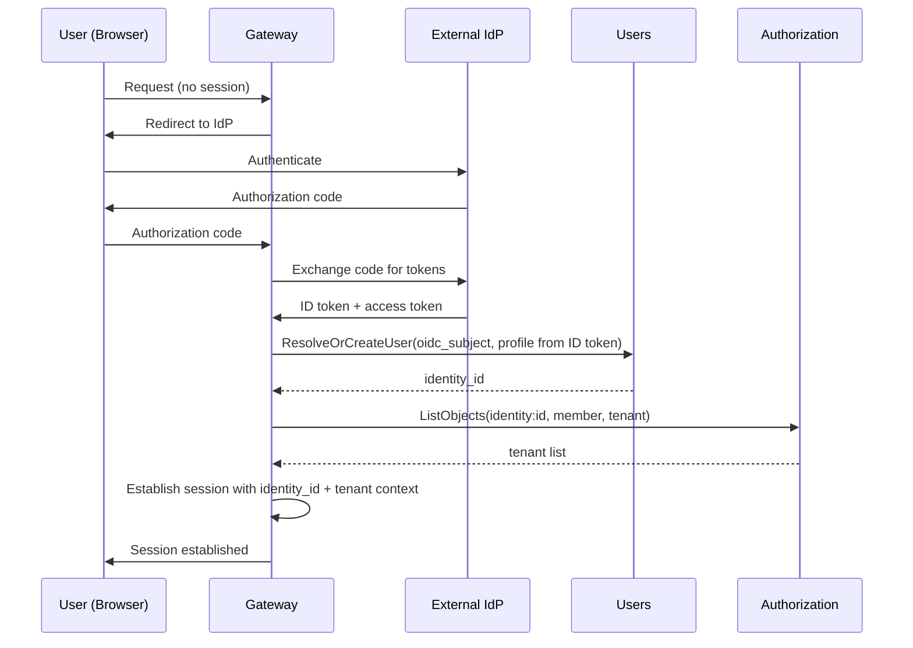
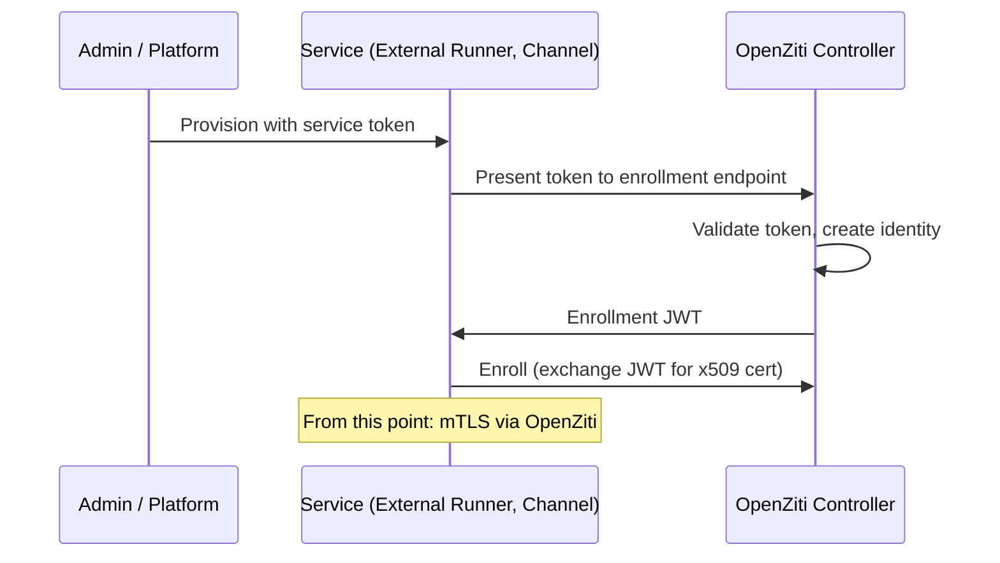
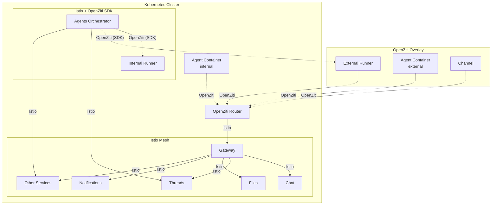

# Authentication

## Overview

The platform authenticates four types of identities. Each identity type has its own authentication mechanism, but all resolve to the same internal identity representation: an identity ID, identity type, and tenant ID.

## Identity Types

| Type | Description | Authentication Method |
|------|-------------|----------------------|
| **User** | Human operator using web/mobile app | OIDC |
| **Agent** | Agent container calling platform APIs | OpenZiti (network identity) |
| **Channel** | Channel service connecting to external apps | OpenZiti (network identity) |
| **Runner** | Runner executing workloads | OpenZiti (network identity) |

All identity types are equal in the [authorization model](authz.md) — they are represented as `identity:<identity_id>` in OpenFGA. What an identity can do is determined by its relationships (tenant access, resource access), not by its type. See [Authorization](authz.md).

Each identity type has its own provisioning path and profile shape, managed by different services. See [Identity](identity.md) for the central identity registry and [Users](users.md) for user identity details.

## Internal Identity

After authentication, every request carries a resolved identity in its context:

| Field | Type | Description |
|-------|------|-------------|
| `identity_id` | string (UUID) | Unique identity identifier |
| `identity_type` | enum | `user`, `agent`, `channel`, `runner` |
| `tenant_id` | string (UUID) | Tenant this identity belongs to (for this request) |

All downstream services receive tenant and identity context via gRPC metadata. Services use `tenant_id` for data scoping and `identity_id` for attribution (e.g., message sender).

The `identity_type` indicates the authentication mechanism and profile source, not authorization scope. Services should not make authorization decisions based on identity type — they use the [Authorization](authz.md) service for permission checks.

## User Authentication (OIDC)

Users authenticate via a system-wide OIDC-compliant identity provider. The platform does not manage user credentials directly. The [Users](users.md) service manages user identity records and profiles.

### Flow



On first login, the Users service creates a new user record (provisions `identity_id`, stores OIDC subject mapping, registers the identity in the [Identity](identity.md) service, populates initial profile from ID token claims). On subsequent logins, it returns the existing `identity_id`.

After resolving the user identity, the Gateway queries the [Authorization](authz.md) service for the tenants the user can access. The active tenant is selected per session.

### Configuration

The OIDC provider is configured system-wide (not per-tenant):

| Field | Type | Description |
|-------|------|-------------|
| `issuer` | string | OIDC issuer URL (used for discovery) |
| `client_id` | string | OAuth2 client ID |
| `client_secret` | string | OAuth2 client secret |

## Network Identity (OpenZiti)

Agents, Channels, Runners, and the Agents Orchestrator authenticate via **OpenZiti** network-level identity. Each receives a unique x509 certificate from the OpenZiti Controller. All API communication uses mTLS over the OpenZiti overlay — the identity is in the certificate, not in application-level tokens.

### Enrollment

Non-user identities bootstrap onto the OpenZiti network through one of two paths, depending on whether the identity is provisioned as part of platform infrastructure or registered dynamically by an operator:

**Infrastructure-provisioned identities** (Orchestrator, Gateway, Ziti Management, internal Runners) are created by Terraform at deployment time. Terraform creates the OpenZiti identity on the Controller, enrolls it, and stores the resulting certificate and key material as a Kubernetes Secret. The service pod mounts the secret and loads the identity on startup. No manual admin action is required — these identities are part of the platform's bootstrap.

**Operator-provisioned identities** (external Runners, Channels) use a service token flow. An admin creates the resource in the platform, receives a one-time service token, and configures the external service with it. The service presents the token to the platform's enrollment endpoint, which creates an OpenZiti identity, returns an enrollment JWT, and the service enrolls with the Controller.



The service token flow is for external services only. Internal platform components receive their identities from infrastructure provisioning — no tokens, no manual enrollment.

### Agent Identity Lifecycle

Agent containers are short-lived. Their OpenZiti identities are created and destroyed with the container.

1. The Agents Orchestrator creates an OpenZiti identity via the Ziti Management service before requesting the container.
2. The Orchestrator passes the enrollment JWT to Runner as part of `StartWorkload` configuration.
3. Runner starts the container with the JWT. The agent enrolls on startup, receiving an x509 certificate.
4. All API calls from the agent use mTLS. The Gateway extracts identity from the connection.
5. When the Orchestrator stops the workload, it deletes the OpenZiti identity via Ziti Management. The certificate becomes invalid.

The Runner is not involved in identity management — it treats the enrollment JWT as opaque configuration. See [OpenZiti Integration](openziti.md) for the full lifecycle diagram and implementation details.

### OpenZiti Identities

| Identity | Lifecycle | Provisioning |  Calls via OpenZiti |
|----------|-----------|-------------|---------------------|
| Agents Orchestrator | Persistent (enrolled once) | Infrastructure (Terraform) | Runner |
| Internal Runner | Persistent (enrolled once) | Infrastructure (Terraform) | — (binds service, receives work) |
| External Runner | Persistent (enrolled via service token) | Operator (service token) | — (binds service, receives work) |
| Agent container | Ephemeral (per container) | Orchestrator via Ziti Management | Gateway |
| Channel | Persistent (enrolled via service token) | Operator (service token) | Gateway |
| Gateway | Persistent (enrolled once) | Infrastructure (Terraform) | — (binds service, receives connections) |
| Ziti Management | Persistent (enrolled once) | Infrastructure (Terraform) | OpenZiti Controller (via Istio, not overlay) |

## Two Network Layers

The platform uses two network layers.



### SDK Embedding

Services that participate in both the Istio mesh and the OpenZiti overlay use the **OpenZiti Go SDK** embedded in the application process — not an OpenZiti sidecar or tunneler. This avoids conflicts between the Istio sidecar proxy and an OpenZiti sidecar competing for outbound traffic routing.

| Service | OpenZiti SDK Usage | Istio |
|---------|-------------------|-------|
| **Agents Orchestrator** | Dials runners via `zitiContext.Dial("runner")` | All other outbound calls (Threads, Teams, Secrets, etc.) |
| **Internal Runner** | Binds `runner` service via `zitiContext.Listen("runner")` | Not used for inbound Runner API traffic |
| **Gateway** | Binds `gateway` service via `zitiContext.ListenWithOptions("gateway", ...)` | All outbound calls to internal services |

The OpenZiti Go SDK implements Go's standard `net.Listener` and `net.Conn` interfaces. A gRPC server can accept connections from an OpenZiti listener the same way it accepts connections from a TCP listener. Similarly, a gRPC client can dial through an OpenZiti context the same way it dials a TCP address. See [`openziti/sdk-golang`](https://github.com/openziti/sdk-golang).

### Istio — Internal Service Mesh

Istio provides mTLS between all pods within the Kubernetes cluster. Identity is based on Kubernetes ServiceAccounts. AuthorizationPolicies control which service can call which.

| Concern | Mechanism |
|---------|-----------|
| Pod-to-pod mTLS | Automatic via sidecar/ambient mode |
| Identity model | SPIFFE certificates from ServiceAccounts |
| Policy enforcement | `PeerAuthentication` (strict mTLS), `AuthorizationPolicy` (service-level access) |
| Scope | Within the cluster only |

### OpenZiti — Cross-Boundary Overlay

OpenZiti provides identity and connectivity for actors that are outside the cluster or need application-level identity (not just pod identity).

| Concern | Mechanism |
|---------|-----------|
| mTLS | Per-identity x509 certificates from OpenZiti Controller |
| Identity model | Platform-managed identities (agent ID, runner ID, channel ID) |
| Policy enforcement | OpenZiti service policies (which identity can dial which service) |
| Scope | Cross-boundary (external runners, agents) and internal (agents in cluster, orchestrator-to-runner) |

### Why Both

**Istio** secures internal service-to-service communication. It knows nothing about external actors or application-level identity (which specific agent, which tenant).

**OpenZiti** provides application-level identity and connectivity for actors that cross the cluster boundary (external runners, agents, channels) and for connections that must use a uniform protocol regardless of location (orchestrator-to-runner).

They operate on different connections:

| Connection | Layer | Notes |
|------------|-------|-------|
| Agent → Gateway | OpenZiti | Agents always connect via overlay, regardless of location |
| Channel → Gateway | OpenZiti | Channels always connect via overlay |
| Orchestrator → Runner | OpenZiti (SDK) | Uniform protocol for internal and external runners |
| Orchestrator → Threads, Teams, etc. | Istio | Standard internal service calls |
| Gateway → internal services | Istio | Standard internal service calls |
| Internal service → internal service | Istio | Standard internal service calls |

## Authentication Boundary

**External traffic**: Authenticated at the **Gateway**. Users via OIDC (identity resolved through [Users](users.md) service). Agents, Channels, Runners via OpenZiti mTLS (identity extracted from client certificate via [Ziti Management](openziti.md)).

**Internal traffic**: Authenticated by **Istio** mTLS (service identity from ServiceAccount). End-user/agent identity is propagated in gRPC metadata after Gateway authentication.

Authentication establishes *who* the caller is. Fine-grained access control (*what* the caller can do with *which* resources) is handled by the [Authorization](authz.md) service.

## Participants and Identities

The Threads service identifies participants by opaque UUIDs. When a user sends a message via Chat, the `sender_id` is the user's `identity_id`. When an agent sends a message, the `sender_id` is the agent's `identity_id`. Threads does not distinguish between identity types — it operates on IDs only. See [Threads](threads.md).

The Chat service resolves identity types via the [Identity](identity.md) service, then fetches profiles from the appropriate service — [Users](users.md) for users, [Teams](teams.md) for agents.

## CLI Authentication

All platform CLI tools ([`agyn`](agyn-cli.md), [`agynd`](agynd-cli.md), [`agn`](agn-cli.md)) use the same authentication convention with two methods and a fixed priority order:

| Priority | Method | Mechanism | When Used |
|----------|--------|-----------|-----------|
| 1 | **Network identity** | [OpenZiti](#network-identity-openziti) mTLS | Automatic when the environment provides an enrolled OpenZiti identity (e.g., inside agent containers) |
| 2 | **Auth token** | Token stored in `~/.agyn/credentials`, sent to the [Gateway](gateway.md) as a bearer token | Developer machines, CI, or any environment without OpenZiti |

### Resolution Order

1. If an OpenZiti identity is available in the environment, use it. All API calls go over the OpenZiti overlay with mTLS — no token needed.
2. Otherwise, read the auth token from `~/.agyn/credentials` and attach it to Gateway requests.

### Token Storage

Tokens are stored in the user's home directory:

```
~/.agyn/credentials
```

The file contains the auth token used to authenticate against the Gateway. It is created by a login flow (e.g., `agyn auth login`) and read by all CLI tools.
