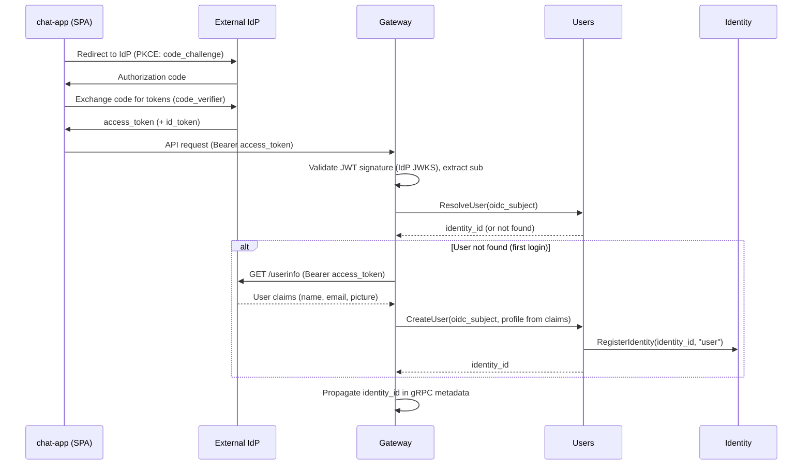
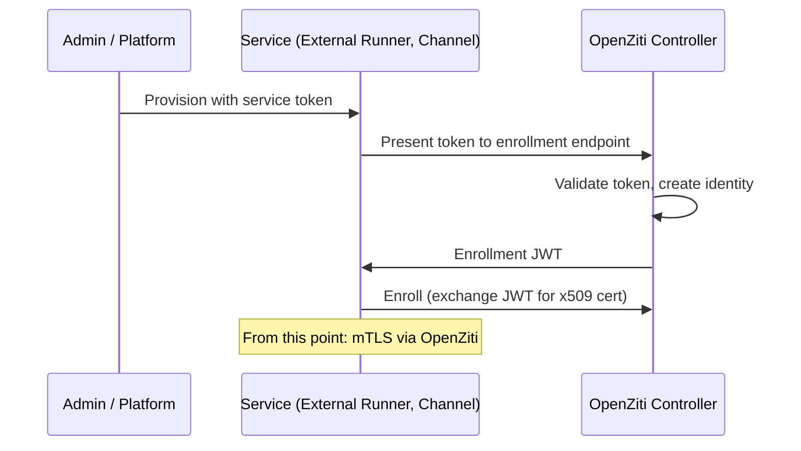
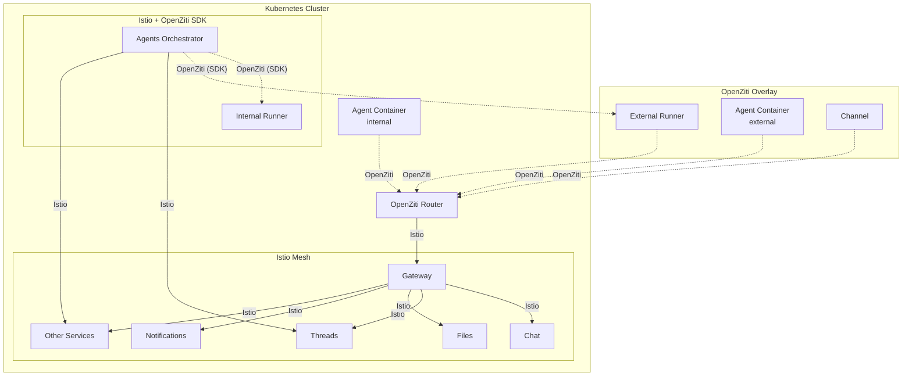

# Authentication

## Overview

The platform authenticates five types of identities. Each identity type has its own authentication mechanism, but all resolve to the same internal representation: an `identity_id` and `identity_type`.

## Identity Types

| Type | Description | Authentication Method |
|------|-------------|----------------------|
| **User** | Human operator using web/mobile app | OIDC or [API token](api-tokens.md) |
| **Agent** | Agent container calling platform APIs | OpenZiti (network identity) |
| **Channel** | Channel service connecting to external apps | OpenZiti (network identity) |
| **Runner** | Runner executing workloads | OpenZiti (network identity) |
| **App** | [App](apps.md) interacting with threads | OpenZiti (network identity) |

All identity types are represented uniformly as `identity:<identity_id>` in the [authorization model](authz.md). See [Identity](identity.md) for the central identity registry and [Users](users.md) for user-specific details.

## Internal Identity

After authentication, every request carries a resolved identity in its context:

| Field | Type | Description |
|-------|------|-------------|
| `identity_id` | string (UUID) | Unique identity identifier |
| `identity_type` | enum | `user`, `agent`, `channel`, `runner`, `app` |

Downstream services receive identity context via gRPC metadata. Services use `identity_id` for attribution (e.g., message sender). Organization context is passed as a request parameter where needed — see [Organizations — Request Flow](organizations.md#request-flow).

The `identity_type` indicates the authentication mechanism and profile source (e.g., OIDC users have profiles in [Users](users.md), agents in [Agents](agents-service.md)). Authorization is determined by [relationships](authz.md), not by type.

## User Authentication (OIDC)

Users authenticate via a system-wide OIDC-compliant identity provider. The web app (chat-app) is a single-page application (SPA) that implements the OIDC Authorization Code flow with PKCE. The [Users](users.md) service manages user identity records and profiles.

### Flow



The SPA performs the full OIDC flow in the browser. The Gateway receives the resulting `access_token` as a Bearer token on each API request.

**On every request:** The Gateway validates the `access_token` JWT signature against the IdP's JWKS endpoint and extracts the `sub` claim. It then calls `Users.ResolveUser(sub)` to map the OIDC subject to a platform `identity_id`.

**On first login (user not found):** The Gateway calls the IdP's standard [UserInfo endpoint](https://openid.net/specs/openid-connect-core-1_0.html#UserInfo) with the `access_token` to retrieve profile claims (name, email, picture). It then calls `Users.CreateUser(sub, profile)` to provision a new user record. The Users service registers the identity in the [Identity](identity.md) service. The UserInfo endpoint is called **once per user lifetime** — only during provisioning.

Organization context is not validated at the Gateway level. Services that need organization context accept `organization_id` as a request parameter, and the [authorization model](authz.md) enforces access. See [Organizations — Request Flow](organizations.md#request-flow).

### Configuration

The OIDC provider is configured system-wide. Because the SPA is a public client using PKCE, there is no client secret.

| Field | Type | Description |
|-------|------|-------------|
| `issuer` | string | OIDC issuer URL. Used for [OIDC Discovery](https://openid.net/specs/openid-connect-discovery-1_0.html) (`{issuer}/.well-known/openid-configuration`) to resolve the `jwks_uri` for token signature verification |
| `client_id` | string | OAuth2 client ID |

## Network Identity (OpenZiti)

Agents, Channels, Runners, and the Agents Orchestrator authenticate via **OpenZiti** network-level identity. Each receives a unique x509 certificate from the OpenZiti Controller. All API communication uses mTLS over the OpenZiti overlay.

### Enrollment

Non-user identities bootstrap onto the OpenZiti network through one of three paths:

**Self-enrolled service identities** (Orchestrator, Gateway, internal Runners) request their identity from the [Ziti Management](openziti.md) service at pod startup. Ziti Management creates the identity on the OpenZiti Controller, enrolls it, and returns the enrolled identity (certificate + key). The pod writes the identity to ephemeral disk and extends a lease on a timer. If the pod restarts, it requests a new identity — the old one is garbage-collected by Ziti Management when its lease expires. See [OpenZiti Integration — Service Identity Self-Enrollment](openziti.md#service-identity-self-enrollment).

**Operator-provisioned identities** (external Runners, Channels) use a service token flow. An admin creates the resource in the platform, receives a one-time service token, and configures the external service with it. The service presents the token to the platform's enrollment endpoint, which creates an OpenZiti identity, returns an enrollment JWT, and the service enrolls with the Controller.



**Agent identities** are ephemeral — created by the Orchestrator via Ziti Management before each container starts, and deleted when the container stops. See [Agent Identity Lifecycle](#agent-identity-lifecycle) below.

The service token flow is for external services only. Internal platform components use self-enrollment — no tokens, no manual steps.

### Agent Identity Lifecycle

Agent containers are short-lived. Their OpenZiti identities are created and destroyed with the container.

1. The Agents Orchestrator creates an OpenZiti identity via the Ziti Management service before requesting the container.
2. The Orchestrator passes the enrollment JWT to Runner as part of `StartWorkload` configuration.
3. Runner starts the container with the JWT. The agent enrolls on startup, receiving an x509 certificate.
4. All API calls from the agent use mTLS. The Gateway extracts identity from the connection.
5. When the Orchestrator stops the workload, it deletes the OpenZiti identity via Ziti Management. The certificate becomes invalid.

The Runner treats the enrollment JWT as opaque configuration. See [OpenZiti Integration](openziti.md) for the full lifecycle diagram.

### OpenZiti Identities

| Identity | Lifecycle | Provisioning |  Calls via OpenZiti |
|----------|-----------|-------------|---------------------|
| Agents Orchestrator | Ephemeral (per pod) | Self-enrollment via Ziti Management | Runner |
| Internal Runner | Ephemeral (per pod) | Self-enrollment via Ziti Management | — (binds service, receives work) |
| External Runner | Persistent (enrolled via service token) | Operator (service token) | — (binds service, receives work) |
| Agent container | Ephemeral (per container) | Orchestrator via Ziti Management | Gateway |
| Channel | Persistent (enrolled via service token) | Operator (service token) | Gateway |
| Gateway | Ephemeral (per pod) | Self-enrollment via Ziti Management | — (binds service, receives connections) |
| Ziti Management | N/A — no OpenZiti network identity | Controller API credential (Terraform) | OpenZiti Controller (via Istio, not overlay) |

## Two Network Layers

The platform uses two network layers.



### SDK Embedding

Services that participate in both the Istio mesh and the OpenZiti overlay use the **OpenZiti Go SDK** embedded in the application process — not an OpenZiti sidecar or tunneler. This avoids conflicts between the Istio sidecar proxy and an OpenZiti sidecar competing for outbound traffic routing.

| Service | OpenZiti SDK Usage | Istio |
|---------|-------------------|-------|
| **Agents Orchestrator** | Dials runners via `zitiContext.Dial("runner")` | All other outbound calls (Threads, Agents, Secrets, etc.) |
| **Internal Runner** | Binds `runner` service via `zitiContext.Listen("runner")` | Not used for inbound Runner API traffic |
| **Gateway** | Binds `gateway` service via `zitiContext.ListenWithOptions("gateway", ...)` | All outbound calls to internal services |

The OpenZiti Go SDK implements Go's standard `net.Listener` and `net.Conn` interfaces. A gRPC server can accept connections from an OpenZiti listener the same way it accepts connections from a TCP listener. Similarly, a gRPC client can dial through an OpenZiti context the same way it dials a TCP address. See [`openziti/sdk-golang`](https://github.com/openziti/sdk-golang).

### Istio — Internal Service Mesh

Istio provides mTLS between all pods within the Kubernetes cluster. Identity is based on Kubernetes ServiceAccounts.

| Concern | Mechanism |
|---------|-----------|
| Pod-to-pod mTLS | Automatic via sidecar/ambient mode |
| Identity model | SPIFFE certificates from ServiceAccounts |
| Policy enforcement | `PeerAuthentication` (strict mTLS), `AuthorizationPolicy` (service-level access) |
| Scope | Within the cluster only |

### OpenZiti — Cross-Boundary Overlay

OpenZiti provides identity and connectivity for actors outside the cluster or needing application-level identity.

| Concern | Mechanism |
|---------|-----------|
| mTLS | Per-identity x509 certificates from OpenZiti Controller |
| Identity model | Platform-managed identities (agent ID, runner ID, channel ID) |
| Policy enforcement | OpenZiti service policies (which identity can dial which service) |
| Scope | Cross-boundary (external runners, agents) and internal (agents in cluster, orchestrator-to-runner) |

### Why Both

**Istio** secures internal service-to-service communication. It knows nothing about application-level identity (which specific agent, which organization).

**OpenZiti** provides application-level identity and connectivity for actors that cross the cluster boundary (external runners, agents, channels) and for connections that must use a uniform protocol regardless of location (orchestrator-to-runner).

They operate on different connections:

| Connection | Layer | Notes |
|------------|-------|-------|
| Agent → Gateway | OpenZiti | Agents always connect via overlay, regardless of location |
| Channel → Gateway | OpenZiti | Channels always connect via overlay |
| Orchestrator → Runner | OpenZiti (SDK) | Uniform protocol for internal and external runners |
| Orchestrator → Threads, Agents, etc. | Istio | Standard internal service calls |
| Gateway → internal services | Istio | Standard internal service calls |
| Internal service → internal service | Istio | Standard internal service calls |

## Authentication Boundary

**External traffic**: Authenticated at the **Gateway**. Users via OIDC access token validation (JWT signature verified against IdP JWKS, identity resolved through [Users](users.md)) or via [API token](api-tokens.md) (opaque token, identity resolved through [Users](users.md)). Agents, Channels, Runners via OpenZiti mTLS (identity extracted via [Ziti Management](openziti.md)). Organization membership is not validated at the Gateway — it is enforced by the [authorization model](authz.md) at the service level.

**Internal traffic**: Authenticated by **Istio** mTLS (service identity from ServiceAccount). End-user/agent identity propagated in gRPC metadata after Gateway authentication.

## Participants and Identities

[Threads](threads.md) identifies participants by opaque `identity_id` UUIDs — it operates on IDs only. [Chat](chat.md) resolves identity types via the [Identity](identity.md) service, then fetches profiles from [Users](users.md) (for users) or [Agents](agents-service.md) (for agents).

## CLI Authentication

All platform CLI tools ([`agyn`](agyn-cli.md), [`agynd`](agynd-cli.md), [`agn`](agn-cli.md)) use the same authentication convention with two methods and a fixed priority order. The auth token stored in `~/.agyn/credentials` is any token the Gateway accepts — an OIDC access token from a login flow or a long-lived [API token](api-tokens.md) created via `agyn auth create-token`.

| Priority | Method | Mechanism | When Used |
|----------|--------|-----------|-----------|
| 1 | **Network identity** | [OpenZiti](#network-identity-openziti) mTLS | Automatic when the environment provides an enrolled OpenZiti identity (e.g., inside agent containers) |
| 2 | **Auth token** | Token stored in `~/.agyn/credentials`, sent to the [Gateway](gateway.md) as a bearer token | Developer machines, CI, or any environment without OpenZiti |

### Resolution Order

1. If an OpenZiti identity is available in the environment, use it. All API calls go over the OpenZiti overlay with mTLS.
2. Otherwise, read the auth token from `~/.agyn/credentials` and attach it to Gateway requests.

### Token Storage

Tokens are stored in the user's home directory:

```
~/.agyn/credentials
```

The file contains the auth token used to authenticate against the Gateway. It is created by a login flow (e.g., `agyn auth login`) and read by all CLI tools.
