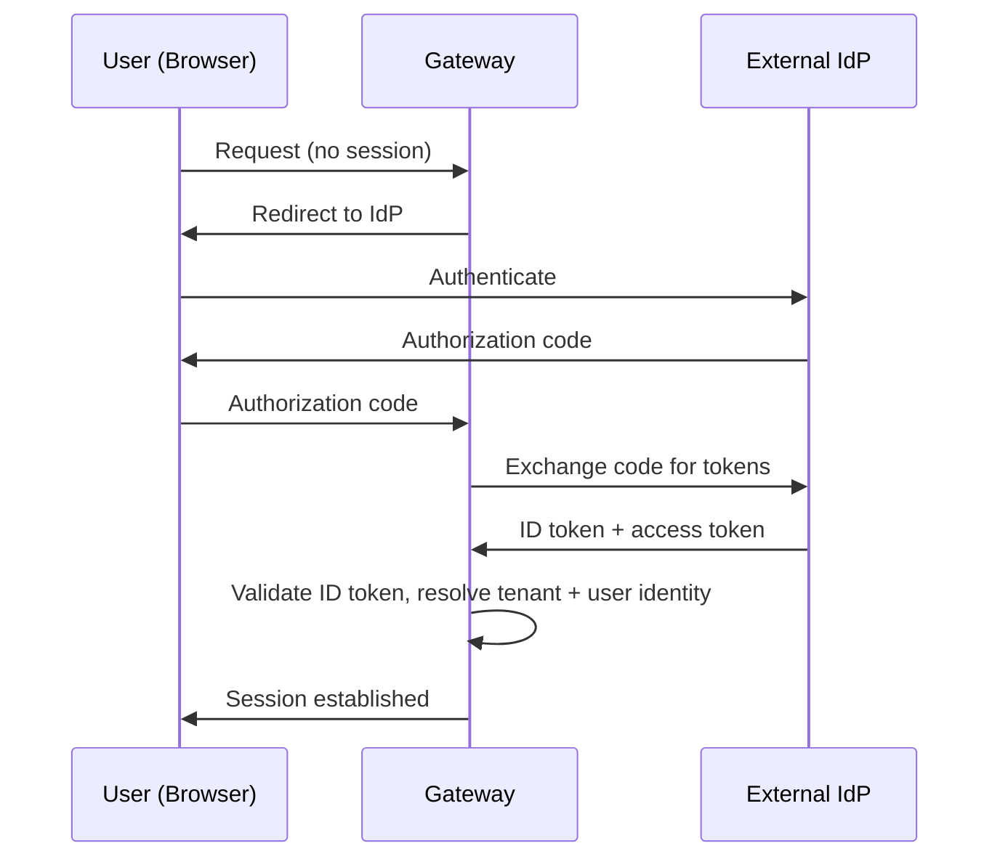
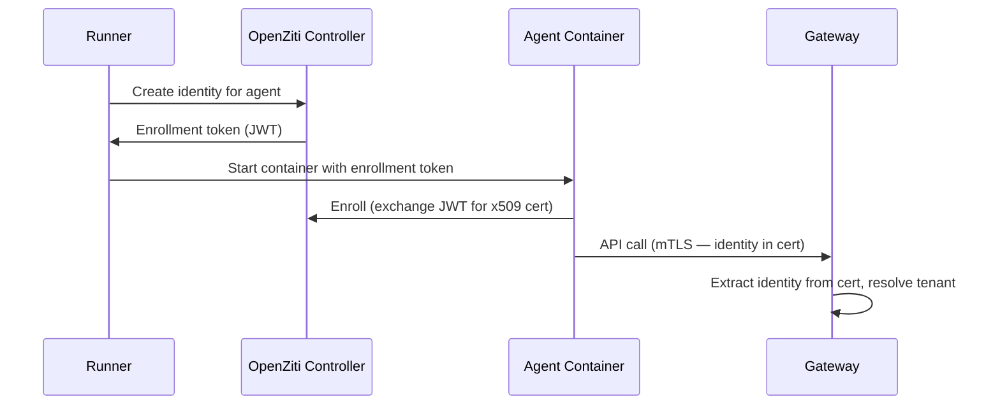

# Authentication

## Overview

The platform authenticates four types of identities. Each identity type has its own authentication mechanism, but all resolve to the same internal identity representation: an identity ID, identity type, and tenant ID.

## Identity Types

| Type | Description | Authentication Method |
|------|-------------|----------------------|
| **User** | Human operator using web/mobile app | OIDC (external IdP) |
| **Agent** | Agent container calling platform APIs | Network identity (OpenZiti) |
| **Channel** | Channel service connecting to external apps | Service token |
| **Runner** | Runner executing workloads | Service token |

## Internal Identity

After authentication, every request carries a resolved identity in its context:

| Field | Type | Description |
|-------|------|-------------|
| `identity_id` | string (UUID) | Unique identity identifier |
| `identity_type` | enum | `user`, `agent`, `channel`, `runner` |
| `tenant_id` | string (UUID) | Tenant this identity belongs to |

All downstream services receive tenant and identity context. Services use `tenant_id` for data scoping and `identity_id` for attribution (e.g., message sender).

## User Authentication (OIDC)

Users authenticate via OIDC-compliant identity providers. The platform does not manage user credentials directly.

### Flow

### Configuration

Each tenant configures its own OIDC provider connection:

| Field | Type | Description |
|-------|------|-------------|
| `issuer` | string | OIDC issuer URL (used for discovery) |
| `client_id` | string | OAuth2 client ID |
| `client_secret` | string | OAuth2 client secret |
| `allowed_domains` | list of string | Optional email domain restriction |

Multiple tenants can use the same IdP (e.g., shared Google Workspace) — tenant resolution uses the configured `client_id` and issuer mapping.

## Agent Authentication (Network Identity)

Agent containers authenticate via network-level identity. The target architecture uses **OpenZiti** to assign each agent container a unique cryptographic identity at startup.

### Target Architecture

1. Runner requests an OpenZiti identity for the agent container before starting it.
2. OpenZiti Controller issues a one-time enrollment token.
3. Agent container enrolls on startup, receiving an x509 certificate.
4. All API calls from the agent use mTLS. The Gateway extracts identity from the client certificate.
5. No application-level tokens are stored in or accessible to the agent container.

The agent's OpenZiti identity is scoped to specific services (e.g., Gateway, Threads, Files) via OpenZiti service policies. The agent cannot reach services it is not authorized for.

### Cleanup

When Runner stops a workload, it deletes the corresponding OpenZiti identity from the controller. The certificate becomes invalid.

## Channel and Runner Authentication (Service Tokens)

Channels and Runners authenticate using long-lived service tokens.

### Target Architecture

In the target architecture, Channels and Runners first obtain OpenZiti identities, then use network-level mTLS for all API communication — identical to agent authentication but with persistent (not per-container) identities.

### Current Architecture

Until OpenZiti is deployed, Channels and Runners authenticate using static bearer tokens issued per service instance and stored as Kubernetes secrets.

| Field | Type | Description |
|-------|------|-------------|
| `token` | string | Opaque bearer token |
| `identity_type` | enum | `channel` or `runner` |
| `tenant_id` | string (UUID) | Associated tenant |

The Gateway validates the token and resolves identity and tenant context.

## Authentication Boundary

Authentication is enforced at the **Gateway** for external traffic. Internal service-to-service communication within the cluster is unauthenticated in the current architecture.

### Target Architecture

Internal service-to-service communication will use **mTLS** enforced by Istio service mesh. This authenticates the calling service (not the end-user identity). End-user identity is propagated via request metadata (headers/gRPC metadata) after Gateway authentication.

## Participants and Identities

The Threads service identifies participants by opaque UUIDs. When a user sends a message via Chat, the `sender_id` is the user's `identity_id`. When an agent sends a message, the `sender_id` is the agent's `identity_id`. Threads does not distinguish between identity types — it operates on IDs only. See [Threads](threads.md).

The Chat service resolves user identities to display names and associates messages with users based on the authenticated `identity_id` from request context.
