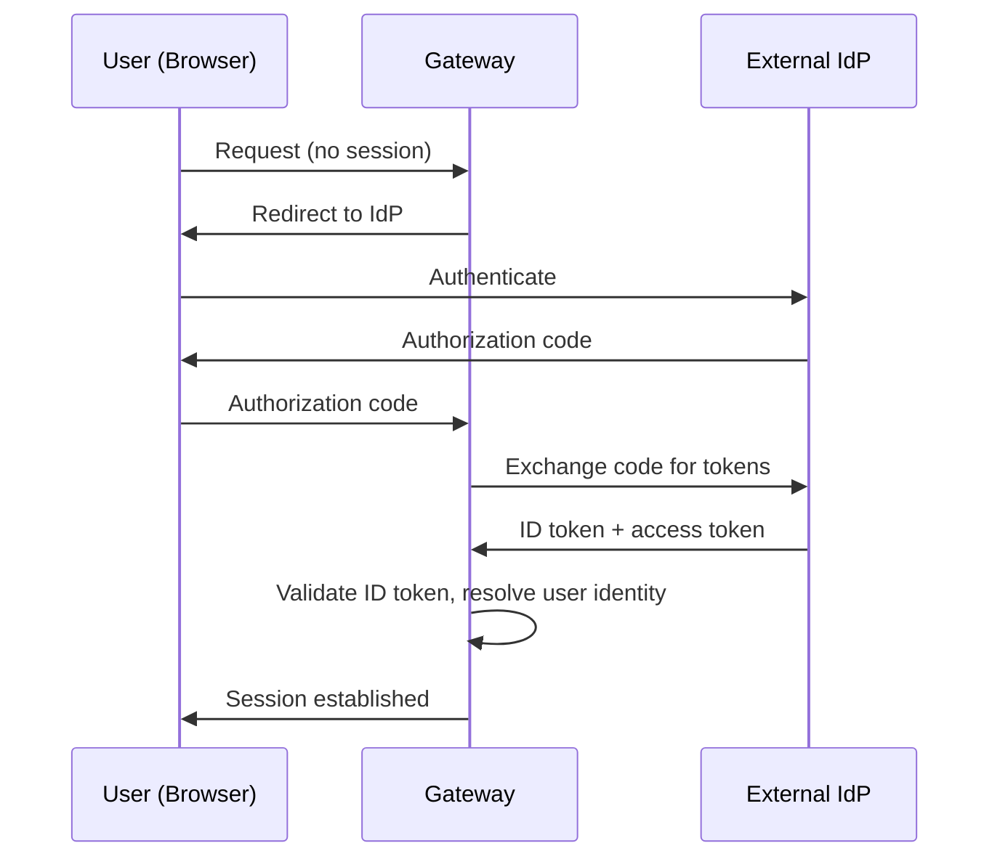
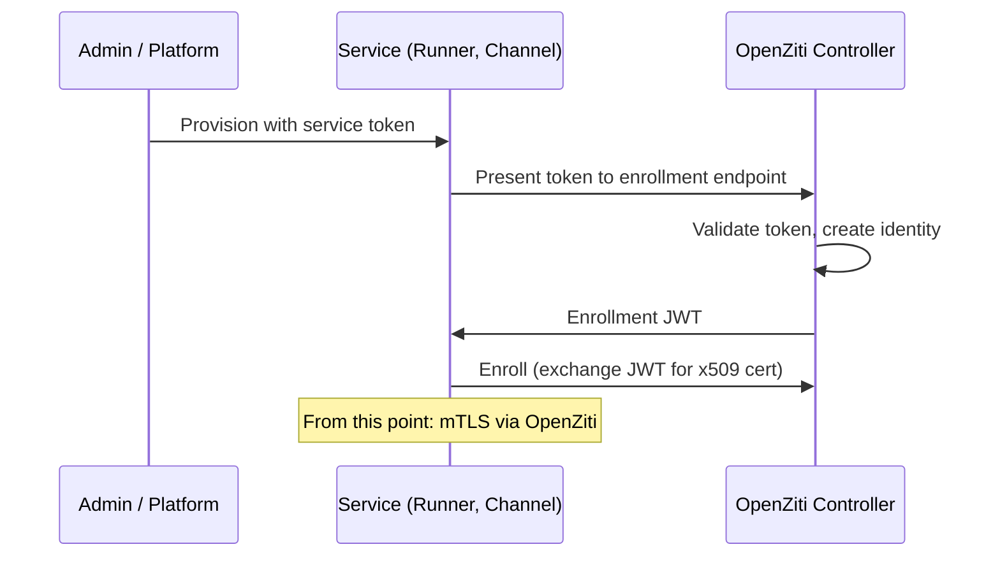
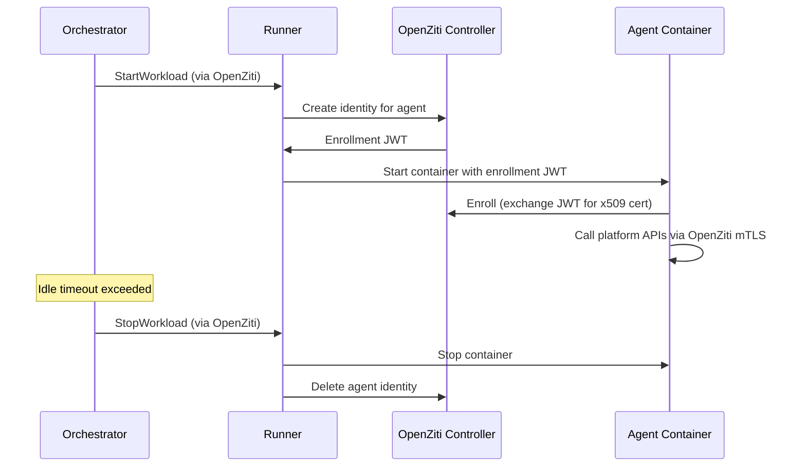
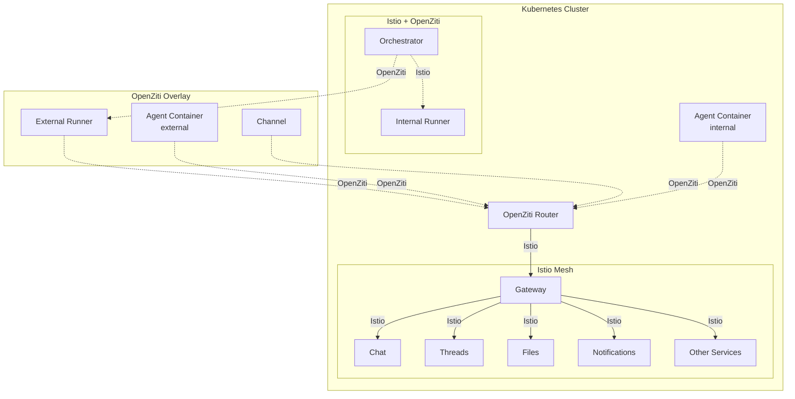

# Authentication

## Overview

The platform authenticates four types of identities. Each identity type has its own authentication mechanism, but all resolve to the same internal identity representation: an identity ID, identity type, and tenant ID.

## Identity Types

| Type | Description | Authentication Method |
|------|-------------|----------------------|
| **User** | Human operator using web/mobile app | OIDC |
| **Agent** | Agent container calling platform APIs | OpenZiti (network identity) |
| **Channel** | Channel service connecting to external apps | OpenZiti (network identity) |
| **Runner** | Runner executing workloads | OpenZiti (network identity) |

## Internal Identity

After authentication, every request carries a resolved identity in its context:

| Field | Type | Description |
|-------|------|-------------|
| `identity_id` | string (UUID) | Unique identity identifier |
| `identity_type` | enum | `user`, `agent`, `channel`, `runner` |
| `tenant_id` | string (UUID) | Tenant this identity belongs to |

All downstream services receive tenant and identity context via gRPC metadata. Services use `tenant_id` for data scoping and `identity_id` for attribution (e.g., message sender).

## User Authentication (OIDC)

Users authenticate via a system-wide OIDC-compliant identity provider. The platform does not manage user credentials directly. After authenticating, users can create tenants or be granted access to existing tenants. See [Multi-Tenancy](tenancy.md).

### Flow

### Configuration

The OIDC provider is configured system-wide (not per-tenant):

| Field | Type | Description |
|-------|------|-------------|
| `issuer` | string | OIDC issuer URL (used for discovery) |
| `client_id` | string | OAuth2 client ID |
| `client_secret` | string | OAuth2 client secret |

## Network Identity (OpenZiti)

Agents, MCP servers, Channels, and Runners authenticate via **OpenZiti** network-level identity. Each receives a unique x509 certificate from the OpenZiti Controller. All API communication uses mTLS over the OpenZiti overlay — the identity is in the certificate, not in application-level tokens.

### Enrollment

Non-user identities bootstrap onto the OpenZiti network using a **service token**. The token is a one-time bootstrap credential — it is not used for ongoing API authentication.

1. Admin creates a Runner or Channel in the platform. The system generates a service token.
2. The operator configures the Runner/Channel with the token.
3. On first start, the service presents the token to the platform's enrollment endpoint.
4. The platform validates the token, creates an OpenZiti identity, and returns an enrollment JWT.
5. The service enrolls with the OpenZiti Controller, exchanging the JWT for an x509 certificate.
6. All subsequent communication uses mTLS. The service token is no longer needed.

### Agent Identity Lifecycle

Agent containers are short-lived. Their OpenZiti identities are created and destroyed with the container.

1. Runner requests an OpenZiti identity for the agent before starting the container.
2. Agent container enrolls on startup, receiving an x509 certificate.
3. All API calls from the agent use mTLS. The Gateway extracts identity from the client certificate.
4. When Runner stops the workload, it deletes the OpenZiti identity. The certificate becomes invalid.

### OpenZiti Identities

| Identity | Lifecycle | Calls via OpenZiti |
|----------|-----------|--------------------|
| Orchestrator | Persistent (enrolled once) | Runner |
| Runner | Persistent (enrolled via service token) | OpenZiti Controller (identity management) |
| Agent container | Ephemeral (per container) | Gateway |
| Channel | Persistent (enrolled via service token) | Gateway |

## Two Network Layers

The platform uses two network layers.

### Istio — Internal Service Mesh

Istio provides mTLS between all pods within the Kubernetes cluster. Identity is based on Kubernetes ServiceAccounts. AuthorizationPolicies control which service can call which.

| Concern | Mechanism |
|---------|-----------|
| Pod-to-pod mTLS | Automatic via sidecar/ambient mode |
| Identity model | SPIFFE certificates from ServiceAccounts |
| Policy enforcement | `PeerAuthentication` (strict mTLS), `AuthorizationPolicy` (service-level access) |
| Scope | Within the cluster only |

### OpenZiti — Cross-Boundary Overlay

OpenZiti provides identity and connectivity for actors that are outside the cluster or need application-level identity (not just pod identity).

| Concern | Mechanism |
|---------|-----------|
| mTLS | Per-identity x509 certificates from OpenZiti Controller |
| Identity model | Platform-managed identities (agent ID, runner ID, channel ID) |
| Policy enforcement | OpenZiti service policies (which identity can dial which service) |
| Scope | Cross-boundary (external runners, agents) and internal (agents in cluster) |

### Why Both

**Istio** secures internal service-to-service communication. It knows nothing about external actors or application-level identity (which specific agent, which tenant).

**OpenZiti** provides application-level identity for external actors. It creates the overlay network that lets external runners and agents reach internal services. It also provides a uniform identity model for agents regardless of whether they run inside or outside the cluster.

They operate on different connections:

| Connection | Layer |
|------------|-------|
| Agent → Gateway | OpenZiti |
| Channel → Gateway | OpenZiti |
| Orchestrator → external Runner | OpenZiti |
| Orchestrator → internal Runner | Istio |
| Orchestrator → Threads | Istio |
| Gateway → internal services | Istio |
| Internal service → internal service | Istio |

## Authentication Boundary

**External traffic**: Authenticated at the **Gateway**. Users via OIDC. Agents, Channels, Runners via OpenZiti mTLS (identity extracted from client certificate).

**Internal traffic**: Authenticated by **Istio** mTLS (service identity from ServiceAccount). End-user/agent identity is propagated in gRPC metadata after Gateway authentication.

Authentication establishes *who* the caller is. Fine-grained access control (*what* the caller can do with *which* resources) is handled by the [Authorization](authz.md) service.

## Participants and Identities

The Threads service identifies participants by opaque UUIDs. When a user sends a message via Chat, the `sender_id` is the user's `identity_id`. When an agent sends a message, the `sender_id` is the agent's `identity_id`. Threads does not distinguish between identity types — it operates on IDs only. See [Threads](threads.md).

The Chat service resolves user identities to display names and associates messages with users based on the authenticated `identity_id` from request context.
