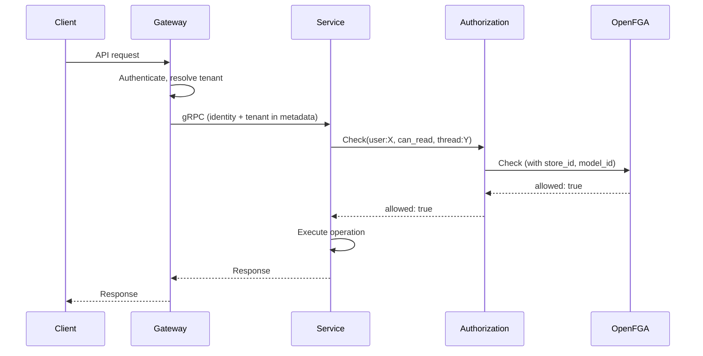

# Authorization

## Overview

The platform uses [OpenFGA](https://openfga.dev) for fine-grained authorization. OpenFGA is a CNCF relationship-based access control (ReBAC) engine inspired by [Google Zanzibar](https://research.google/pubs/pub48190/). It evaluates access by traversing a graph of relationships between identities and resources.

A dedicated **Authorization** service sits in front of OpenFGA. All services call the Authorization service — no service communicates with OpenFGA directly.

## Authorization Service

The Authorization service is a thin gRPC proxy to OpenFGA. It centralizes the OpenFGA connection configuration (`store_id`, `model_id`, API endpoint), adds observability (metrics, tracing, structured logging), and provides a stable internal interface.

Services construct relationship tuples using their domain knowledge and send them through the Authorization service. The service does not interpret or transform tuples — it forwards them to OpenFGA with injected configuration.

### Interface

The Authorization service mirrors the OpenFGA runtime API:

| Method | Description |
|--------|-------------|
| **Check** | Can identity X perform relation Y on resource Z? Returns `allowed: bool` |
| **BatchCheck** | Multiple checks in a single call. Each check has a `correlation_id` for matching responses |
| **Write** | Write and/or delete relationship tuples atomically (up to 100 tuples per call) |
| **Read** | Read tuples matching a filter (user, relation, object — each optional). Paginated |
| **ListObjects** | What objects of type T does identity X have relation Y with? Returns list of object IDs |
| **ListUsers** | What identities have relation Y with object Z? Returns list of identity IDs |

Callers do not provide `store_id` or `authorization_model_id` — the Authorization service injects these from its own configuration.

### Classification

The Authorization service is a **data plane** service — it handles permission checks on the live request path.

## Authorization Model

The authorization model defines types, relations, and how permissions are computed. Written in OpenFGA's DSL and deployed via Terraform (see [Model Deployment](#model-deployment)).

### Identity Types

All platform identities map to OpenFGA users:

| Platform Identity | OpenFGA User Format | Description |
|-------------------|---------------------|-------------|
| User | `user:<identity_id>` | Human operator |
| Agent | `agent:<identity_id>` | Agent container |
| Channel | `channel:<identity_id>` | Channel service |
| Runner | `runner:<identity_id>` | Runner service |

### Tenant Roles (Users)

Users have roles within a tenant. The role determines access to tenant-level operations.

| Role | Capabilities |
|------|-------------|
| **owner** | Full access. Manage tenant settings, membership, all resources. Delete tenant |
| **admin** | Manage resources (agents, models, workspaces, MCP servers). View tracing. Chat |
| **member** | Chat. View tracing. View resources (read-only) |

Modeled as direct relations on the `tenant` type:

```
type tenant
  relations
    define owner: [user]
    define admin: [user]
    define member: [user] or admin or owner
```

`member` is implied by `admin` and `owner` — no need to assign both.

### Non-User Identities

Agents, channels, and runners do not have configurable roles. Their `identity_type` determines their operational scope. OpenZiti service policies restrict which services they can reach (first layer). The Authorization service enforces resource-level access (second layer).

For example, an agent can only access threads it participates in, files attached to those threads, and its own agent state. These constraints are expressed as relationships in OpenFGA, not as static role assignments.

### Resource Types and Relations

```
type thread
  relations
    define tenant: [tenant]
    define participant: [user, agent, channel]
    define can_read: participant
    define can_write: participant

type file
  relations
    define tenant: [tenant]
    define owner: [user, agent, channel]
    define parent_thread: [thread]
    define can_upload: owner
    define can_download: owner or can_read from parent_thread

type agent_config
  relations
    define tenant: [tenant]
    define can_manage: admin from tenant or owner from tenant
    define can_view: member from tenant

type agent_state
  relations
    define agent: [agent]
    define can_read: agent
    define can_write: agent
```

The `file` type demonstrates contextual access: a file is downloadable by its owner, or by any participant of a thread the file is attached to. When a file is sent in a message, the service writes a `parent_thread` relationship linking the file to the thread. OpenFGA resolves the transitive access — no cross-service call needed.

This model is illustrative. The exact types and relations are defined in the authorization model repository and evolve as the platform grows.

## How Services Use Authorization

### Permission Checks

Before performing an operation, a service calls `Check` on the Authorization service:

```
Check(user:<identity_id>, can_read, thread:<thread_id>) → allowed: bool
```

If denied, the service returns a permission error. The identity and tenant are available in gRPC metadata (see [Authentication](authn.md)).

### Relationship Writes

When state changes, the owning service writes relationship tuples:

| Event | Service | Tuple Written |
|-------|---------|---------------|
| User uploads a file | Files | `file:<id>#owner@user:<identity_id>` |
| File sent in a message | Chat / Threads consumer | `file:<id>#parent_thread@thread:<thread_id>` |
| Participant added to thread | Chat / Threads | `thread:<id>#participant@user:<identity_id>` |
| User granted tenant role | Teams | `tenant:<id>#admin@user:<identity_id>` |
| Agent workload started | Runner | `agent_state:<agent_id>#agent@agent:<identity_id>` |

Writes use the `Write` method, which supports atomic multi-tuple writes (adds and deletes in a single call).

### Flow



## Model Deployment

The authorization model is managed as infrastructure-as-code in a dedicated repository (`agynio/openfga-model`):

| Content | Description |
|---------|-------------|
| Authorization model DSL | Type definitions, relations, computed permissions |
| Terraform module | Creates the OpenFGA store, writes the model version |
| Model tests | `fga model test` — validates expected check results against sample tuples |

The repository is versioned via git tags. The platform's infrastructure repo (`agynio/bootstrap_v2`) references a specific version:

```hcl
module "openfga_authz" {
  source  = "github.com/agynio/openfga-model?ref=v1.2.0"
  api_url = var.openfga_api_url
}
```

The [OpenFGA Terraform provider](https://registry.terraform.io/providers/openfga/openfga/latest) manages store and model lifecycle:

- `openfga_store` — creates the store, persists `store_id` in Terraform state.
- `openfga_authorization_model_document` — produces a stable JSON representation from the DSL. Output changes only on semantic changes (not formatting).
- `openfga_authorization_model` — writes a new model version. OpenFGA supports model versioning natively — each write creates a new version, old tuples continue to work.

Terraform outputs (`store_id`, `model_id`) feed into the Authorization service's configuration (environment variables via K8s config).

### Model Update Flow

1. Change the authorization model DSL in `agynio/openfga-model`.
2. Run `fga model test` to validate.
3. Merge, tag a new version.
4. Update the module version in `agynio/bootstrap_v2`.
5. `terraform apply` writes the new model version to OpenFGA.
6. Authorization service picks up the new `model_id` on next deploy (or uses latest if not pinned).

## OpenFGA Deployment

OpenFGA runs as a service within the Kubernetes cluster. It uses PostgreSQL as its data store (same infrastructure, separate database or schema).

| Aspect | Details |
|--------|---------|
| Storage | PostgreSQL |
| Protocol | gRPC |
| Deployment | Kubernetes (Helm chart) |
| Local development | Part of the bootstrap cluster |
