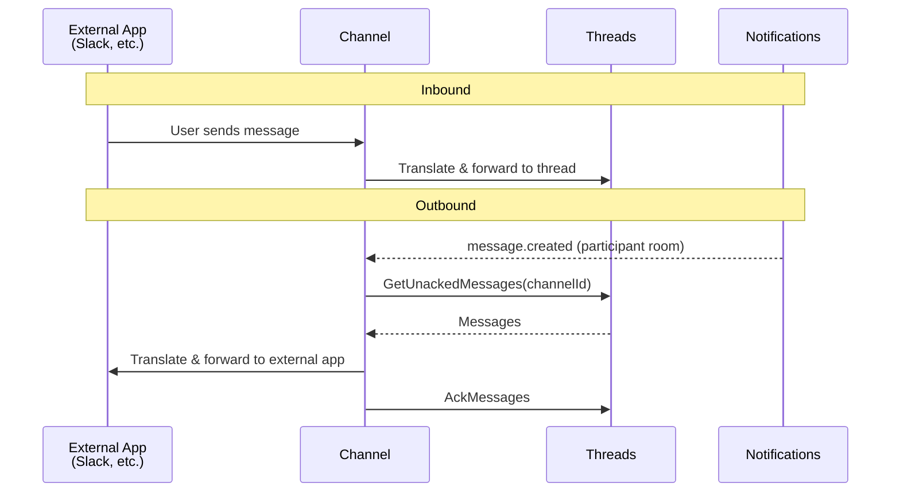

# Channels

## Overview

Channels are the bidirectional interface connecting 3rd-party products with the Threads service. Each channel translates between an external messaging protocol and the internal thread model.

Channels create and manage their own threads based on the logic of the specific integration (e.g., one thread per Slack channel, one thread per Slack thread).

## Responsibilities

A channel has two concerns:

1. **Configuration** (control plane) — desired state of the channel connection: credentials, target identifiers, routing rules.
2. **Connection** (data plane) — live connection to the 3rd-party API, bidirectional message translation.

## Message Flow

### Inbound

1. External event arrives (e.g., Slack message).
2. Channel translates the event into a thread message.
3. Channel sends the message to Threads.

### Outbound

1. Channel receives a `message.created` notification on its `thread_participant:{channelId}` room.
2. Channel pulls unacknowledged messages via `GetUnackedMessages(channelId)` — returns messages from all threads the channel participates in.
3. Channel translates and sends the messages to the 3rd-party API.
4. Channel acknowledges the messages via `AckMessages`.

## Channel Interface

Every channel implementation (Slack, etc.) must implement the same channel interface. The platform's own web and mobile apps are **not** channels — they are served by the [Chat](chat.md) service.

## Channel Configuration

Managed by the control plane:

| Field | Description | Example (Slack) |
|-------|-------------|-----------------|
| Type | Channel type identifier | `slack` |
| Credentials | Authentication for the 3rd-party API | Bot token (`xoxb-...`), App token (`xapp-...`) |
| Target | External resource identifier | Slack channel ID |
| Routing | Rules for mapping external conversations to threads | Thread-per-channel, thread-per-Slack-thread |

The control plane reconciles channel connections: if credentials rotate or configuration changes, the channel service reconnects.
