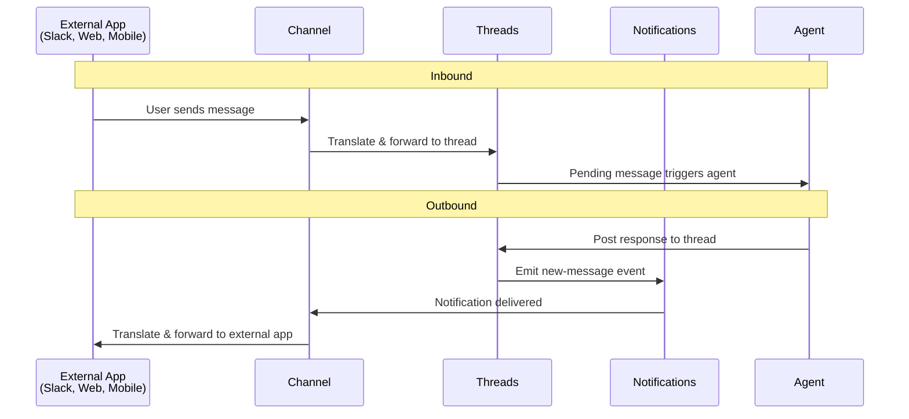

# Channels

## Overview

Channels are the bidirectional interface connecting 3rd-party products and Agyn's own apps with the Threads service. Each channel translates between an external messaging protocol and the internal thread model.

## Responsibilities

A channel has two concerns:

1. **Configuration** (control plane) — desired state of the channel connection: credentials, target identifiers, routing rules.
2. **Connection** (data plane) — live connection to the 3rd-party API, bidirectional message translation.

## Message Flow

### Inbound

1. External event arrives (e.g., Slack message).
2. Channel translates the event into a thread message.
3. Channel sends the message to Threads.
4. Pending message triggers the Agents orchestrator.

### Outbound

1. Agent posts a response to the thread.
2. Notifications service emits a new-message event.
3. Channel receives the notification (subscribed to relevant rooms).
4. Channel translates and sends the message to the 3rd-party API.

## Channel Interface

Every channel implementation (Slack, web app, mobile app, etc.) must implement the same channel interface. Agyn's own web and mobile apps are also channel implementations.

## Channel Configuration

Managed by the control plane:

| Field | Description | Example (Slack) |
|-------|-------------|-----------------|
| Type | Channel type identifier | `slack` |
| Credentials | Authentication for the 3rd-party API | Bot token (`xoxb-...`), App token (`xapp-...`) |
| Target | External resource identifier | Slack channel ID |
| Routing | Rules for mapping external conversations to threads | Thread-per-channel, thread-per-Slack-thread |

The control plane reconciles channel connections: if credentials rotate or configuration changes, the channel service reconnects.
