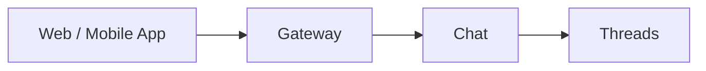

# Chat

## Overview

The Chat service implements the built-in web and mobile app chat experience on top of [Threads](threads.md). It manages thread creation, participant management, and unread counts for the platform's own UI.

Threads is a generic messaging service. Chat adds the application-level logic specific to the platform's own clients.

## Responsibilities

| Responsibility | Description |
|---------------|-------------|
| **Thread lifecycle** | Create threads, add participants, archive threads for the built-in app |
| **Unread counts** | Track and serve per-user unread message counts based on Threads acknowledgment state |
| **Message delivery** | Receive messages from the UI via Gateway, forward to Threads |

## Relationship to Threads

Chat is a consumer of the Threads API. It does not duplicate messaging logic — it calls Threads for all message storage and retrieval.

## Classification

The Chat service is a **data plane** service.
