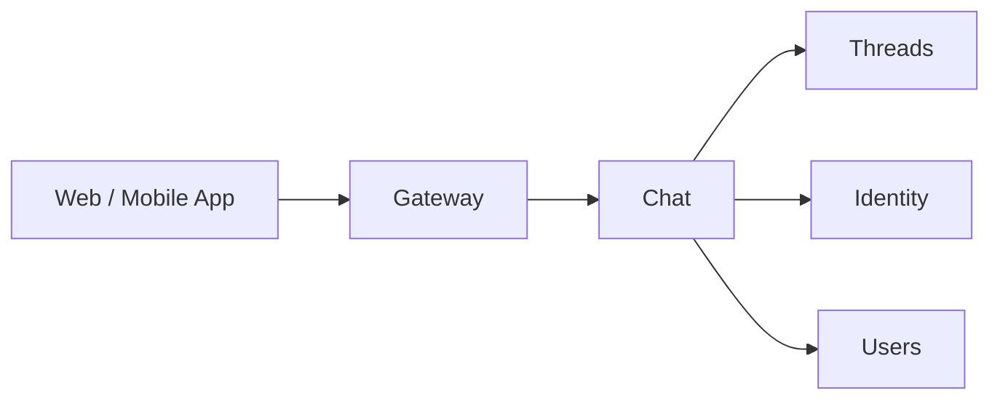

# Chat

## Overview

The Chat service implements the built-in web and mobile app chat experience on top of [Threads](threads.md). It manages thread creation, participant management, and unread counts for the platform's own UI.

Threads is a generic messaging service. Chat adds the application-level logic specific to the platform's own clients.

## Interface

| Method | Description |
|--------|-------------|
| **CreateChat** | Create a new chat thread between users (and optionally agents) |
| **GetChats** | List chats for a user with pagination |
| **GetMessages** | List messages in a chat with pagination and unread count |
| **SendMessage** | Send a message in a chat |
| **MarkAsRead** | Mark messages as read for a user (calls Threads `AckMessages`) |

## Relationship to Threads

Chat is a consumer of the Threads API. It does not duplicate messaging logic — it calls Threads for all message storage and retrieval. Unread counts are derived from `GetUnackedMessages`.

## Identity

Chat identifies participants by the authenticated `identity_id` from request context (see [Authentication](authn.md)). The `identity_id` is used as the participant ID in Threads.

To display participant information, Chat resolves identity types via the [Identity](identity.md) service, then fetches profiles from the appropriate service — [Users](users.md) for users, [Agents](agents-service.md) for agents.

## Authorization

Chat delegates authorization to [Threads](threads.md) for all messaging operations. The checks are identical — Chat passes `organization_id` and `thread_id` from the request context to the underlying Threads calls, which perform the OpenFGA checks.

| Operation | Check |
|-----------|-------|
| `CreateChat` | `can_create_thread` on `organization:<org_id>` |
| `GetChats` | No OpenFGA check — returns chats where caller is a participant (DB filter) |
| `GetMessages` | `can_read` on `thread:<id>` |
| `SendMessage` | `can_write` on `thread:<id>` |
| `MarkAsRead` | Self only — caller must be a thread participant |

See [Authorization — Chat Service](authz.md#chat-service) for the full reference.

## Message Rendering

Chat message bodies are rendered client-side by the SPA. The rendering pipeline is composed of open-source libraries — Chat does not host or proxy any rendering.

### Markdown Pipeline

| Stage | Library | Purpose |
|-------|---------|---------|
| Core renderer | `react-markdown` | Parse markdown and produce the React tree |
| Remark plugin | `remark-gfm` | GitHub-flavored markdown (tables, task lists, strikethrough, autolinks) |
| Remark plugin | `remark-breaks` | Treat soft line breaks as ` ` so single newlines are preserved |
| Rehype plugin | `rehype-raw` | Allow inline HTML from the message body to enter the HAST tree |
| Rehype plugin | `rehype-sanitize` | Strip unsafe tags and attributes. Uses a custom schema built on `hast-util-sanitize` |

The sanitize schema is the trust boundary for rendered messages. It whitelists the tags and attributes used by inline media, charts, diagrams, and standard formatting — everything else is removed.

### Charts and Diagrams

Two fenced code-block languages are recognized as visualizations and rendered via dedicated components that replace the default code-block renderer:

| Language | Renderer | Output |
|----------|----------|--------|
| `vega-lite` | `react-vega` (Vega-Lite) | Interactive SVG chart |
| `mermaid` | `mermaid` | SVG diagram |

Both libraries are loaded lazily — they are code-split and fetched only when a chart or diagram first enters the viewport. The rendered SVG is passed through the same sanitize schema as the rest of the markdown output before insertion.

Safety constraints enforced client-side:

- Vega-Lite is configured to reject external `url` data sources. Only inline `values` data renders.
- Mermaid is initialized with `securityLevel: "strict"` so click handlers and raw HTML nodes in diagrams are stripped.
- Neither renderer evaluates script content from the source; failures surface as an inline error banner and the original code block is shown verbatim.

See the product spec: [Charts and Diagrams](../product/chat/charts-and-diagrams.md).

### Inline Media

Image, video, and audio elements produced by the markdown pipeline are routed through the [Media Proxy](media-proxy.md) with a Service Worker injecting the caller's JWT. See [Inline Media](../product/chat/inline-media.md) for the full behavior.

## Degraded Threads

When `SendMessage` fails with a `thread degraded` error, the UI displays an inline banner in the chat view explaining that the thread is unavailable due to an infrastructure failure and that no new messages can be sent. Read access to message history remains available.

## Classification

The Chat service is a **data plane** service.
