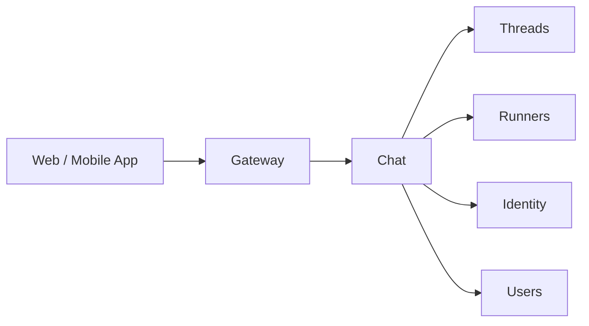

# Chat

## Overview

The Chat service implements the built-in web and mobile app chat experience on top of [Threads](threads.md). It manages thread creation, participant management, and unread counts for the platform's own UI.

Threads is a generic messaging service. Chat adds the application-level logic specific to the platform's own clients.

## Interface

| Method | Description |
|--------|-------------|
| **CreateChat** | Create a new chat thread between users (and optionally agents) |
| **GetChats** | List chats for a user with pagination. Each chat carries an [`activity_status`](#activity-status), an [`unread_count`](#unread-counts), and the chat's [`active_workload_ids`](#active-workload-ids) for the caller |
| **GetMessages** | List messages in a chat with pagination. Response includes the chat's [`unread_count`](#unread-counts) for the caller |
| **SendMessage** | Send a message in a chat |
| **MarkAsRead** | Mark all messages up to the latest in a chat as read for the caller (calls Threads `AckMessages`). See [Marking Messages as Read](#marking-messages-as-read) for trigger semantics |

## Relationship to Threads

Chat is a consumer of the Threads API. It does not duplicate messaging logic — it calls Threads for all message storage and retrieval. Unread counts are derived from `GetUnackedMessageCounts`. Activity status is derived from workload state in [Runners](runners.md).

## Unread Counts

`GetChats` returns each chat with an `unread_count` field — the number of messages in the chat's thread that the caller has not acknowledged.

Chat resolves unread counts in one call per request: `Threads.GetUnackedMessageCounts(participant_id=caller_identity_id)` returns a `map<thread_id, count>` covering every thread the caller participates in. Chat assigns each chat's `unread_count` from this map. The dedicated counts RPC avoids paginating message bodies just to count them — important when a caller has many unread messages.

`GetMessages` continues to expose `unread_count` for the open chat. The value matches the corresponding entry in `GetUnackedMessageCounts`.

Real-time updates: `message.created` events on `thread_participant:{caller_identity_id}` (published by Threads on `SendMessage`) increment the count for the matching chat. The corresponding `MarkAsRead` calls reset it. The chat-app maintains the badge from these events without polling.

## Marking Messages as Read

`MarkAsRead(thread_id)` acknowledges every unacked message the caller has in the thread up to and including the latest. It is a thin wrapper over `Threads.AckMessages(participant_id=caller, message_ids=<all unacked in thread>)` and is idempotent — when there is nothing to ack, it is a no-op.

The chat-app calls `MarkAsRead` on these triggers:

| Trigger | Behavior |
|---------|----------|
| User opens a conversation | One `MarkAsRead` call for the conversation's thread, fired immediately after the conversation view mounts |
| `message.created` arrives on `thread_participant:{caller_identity_id}` for the currently-open conversation | Another `MarkAsRead` call for the same thread, so messages received while the conversation is open are acknowledged on arrival |
| User leaves the conversation view | No further calls — incoming messages on other threads accumulate normally and bump their unread counts |

`SendMessage` does not auto-ack the sender's own messages — Threads excludes the sender from the recipient list when creating `MessageRecipient` rows, so the sender has nothing to ack on their own outgoing message.

## Activity Status

`GetChats` returns each chat with an `activity_status` field that summarizes whether the chat's agent participants are currently processing the conversation. The field is derived from workload state alone — Chat does not query unacked messages on the agent's behalf (the `GetUnackedMessages` self-only check would block that path).

For each non-passive agent participant on the chat's thread, Chat inspects the most recent workload (ordered by `created_at DESC`) from `Runners.ListWorkloadsByThread(thread_id, agent_id)`:

| Most recent workload | Contribution |
|----------------------|--------------|
| `status=running` | `running` |
| `status=starting` | `pending` |
| `status=stopping` | `pending` (the orchestrator is in the middle of stopping; treated as still active) |
| `status=failed` and the thread is not `degraded` | `pending` (orchestrator will retry per [Start Decision](agents-orchestrator.md#start-decision)) |
| `status=stopped` | `finished` |
| No workload exists for the `(thread, agent)` pair | `finished` |

The chat's `activity_status` is the strongest contribution across its non-passive agent participants — `running` > `pending` > `finished`.

`activity_status` is `null` when:

- The chat has no non-passive agent participant — purely user-to-user conversations have no agent activity to report.
- The thread is `degraded` — see [Degraded Threads](#degraded-threads). The degraded banner replaces the indicator in the UI.

Implementation: Chat issues `Runners.ListWorkloadsByThread` calls in parallel for each `(thread_id, agent_id)` pair on the page and joins the results in memory.

`GetMessages` does not return `activity_status`. The chat-app reads it from the `GetChats` entry that backs the open conversation.

### Active Workload IDs

Each `GetChats` entry also carries `active_workload_ids: list<string>` — the IDs of every workload on the chat's thread whose status is currently `starting`, `running`, or `stopping`. The chat-app uses these IDs to subscribe to the corresponding `workload:{id}` rooms in [Notifications](notifications.md) so it receives `workload.updated` events for the workloads that drive the indicator.

Workload IDs are a side product of the same `Runners.ListWorkloadsByThread` calls that derive `activity_status` — Chat collects them in the same pass with no additional round trips. The list is empty for chats with no non-passive agent participants and for chats whose most recent workload is `stopped`/`failed`/absent. New workloads spun up later (e.g., after the user sends a message) appear in `active_workload_ids` only on the next `GetChats` refresh; until then, the chat-app picks them up indirectly via the `message.created` refresh trigger described in [Real-time updates](#real-time-updates).

> **Prerequisite — workload room subscription auth.** [Authorization — Notifications Service](authz.md#notifications-service) currently requires `can_view_workloads` (owner-only) on `workload:{id}` rooms, but [Notifications — Room Naming](notifications.md#room-naming-convention) describes the same rooms as accessible to org `member`s. The chat-app subscription described here depends on the latter. The two specs disagree today and the disagreement must be resolved (in favor of `member`) before chat-app subscriptions can succeed for non-owner participants. See the change file for tracking.

### Sending a message and the immediate transition

When a user sends a message to a thread whose most recent workload is `stopped` or absent, the chat's `activity_status` is `finished` until the [Agents Orchestrator](agents-orchestrator.md) creates a new workload (`status=starting`) — typically within seconds, since the orchestrator wakes on the `message.created` notification. To avoid a flicker, the chat-app may render `pending` optimistically on the user's outgoing send until the next `GetChats` refresh confirms the server-derived status.

### Real-time updates

The chat-app refreshes a chat's `activity_status` on these triggers:

| Trigger | Source |
|---------|--------|
| `workload.updated` event for a workload on a visible chat's thread | [Runners](runners.md) publishes on `workload:{id}` (see [Notifications — Room Naming](notifications.md#room-naming-convention)) |
| `message.created` event on `thread_participant:{caller_identity_id}` for a thread with agent participants | [Threads](threads.md#notification-publishing) publishes on `SendMessage` |

On any such event, the chat-app re-fetches the affected chat (or the affected page) from `GetChats` and replaces its row in the list. Reconnection retriggers a full refetch.

## Partial Failure Handling

`GetChats` fans out to several backends — Threads (chats and unread counts), Runners (workloads), Identity, and Users/Agents (participant profiles). Failures in those calls are handled per dependency rather than failing the whole page:

| Dependency | On failure | Effect on the response |
|------------|-----------|------------------------|
| `Threads` (chat list, `GetUnackedMessageCounts`) | Propagate as a `GetChats` error | Hard dependency — without thread data there are no chats to return |
| `Runners.ListWorkloadsByThread` (per `(thread, agent)` pair) | Treat that pair as `finished`, drop its workload IDs, log the failure with `thread_id`, `agent_id`, and the underlying error | Affected chats may briefly show `finished` instead of the true status; the next `GetChats` refresh recovers |
| `Identity` / `Users` / `Agents` (participant profile resolution) | Return the chat without the unresolved participant's display fields, log the failure with the unresolved `identity_id` | Chat row still renders; the affected participant shows a fallback label until the next refresh |

The partial-failure mode is `GetChats`-only — operations that act on a single chat (`GetMessages`, `SendMessage`, `MarkAsRead`) propagate dependency errors normally, since they have no other rows to degrade independently.

## Identity

Chat identifies participants by the authenticated `identity_id` from request context (see [Authentication](authn.md)). The `identity_id` is used as the participant ID in Threads.

To display participant information, Chat resolves identity types via the [Identity](identity.md) service, then fetches profiles from the appropriate service — [Users](users.md) for users, [Agents](agents-service.md) for agents.

## Authorization

Chat delegates authorization to [Threads](threads.md) for all messaging operations. The checks are identical — Chat passes `organization_id` and `thread_id` from the request context to the underlying Threads calls, which perform the OpenFGA checks.

| Operation | Check |
|-----------|-------|
| `CreateChat` | `can_create_thread` on `organization:<org_id>` |
| `GetChats` | No OpenFGA check — returns chats where caller is a participant (DB filter) |
| `GetMessages` | `can_read` on `thread:<id>` |
| `SendMessage` | `can_write` on `thread:<id>` |
| `MarkAsRead` | Self only — caller must be a thread participant |

See [Authorization — Chat Service](authz.md#chat-service) for the full reference.

## Message Rendering

Chat message bodies are rendered client-side by the SPA. The rendering pipeline is composed of open-source libraries — Chat does not host or proxy any rendering.

### Markdown Pipeline

| Stage | Library | Purpose |
|-------|---------|---------|
| Core renderer | `react-markdown` | Parse markdown and produce the React tree |
| Remark plugin | `remark-gfm` | GitHub-flavored markdown (tables, task lists, strikethrough, autolinks) |
| Remark plugin | `remark-breaks` | Treat soft line breaks as ` ` so single newlines are preserved |
| Rehype plugin | `rehype-raw` | Allow inline HTML from the message body to enter the HAST tree |
| Rehype plugin | `rehype-sanitize` | Strip unsafe tags and attributes. Uses a custom schema built on `hast-util-sanitize` |

The sanitize schema is the trust boundary for rendered messages. It whitelists the tags and attributes used by inline media, charts, diagrams, and standard formatting — everything else is removed.

### Charts and Diagrams

Two fenced code-block languages are recognized as visualizations and rendered via dedicated components that replace the default code-block renderer:

| Language | Renderer | Output |
|----------|----------|--------|
| `vega-lite` | `react-vega` (Vega-Lite) | Interactive SVG chart |
| `mermaid` | `mermaid` | SVG diagram |

Both libraries are loaded lazily — they are code-split and fetched only when a chart or diagram first enters the viewport. The rendered SVG is passed through the same sanitize schema as the rest of the markdown output before insertion.

Safety constraints enforced client-side:

- Vega-Lite is configured to reject external `url` data sources. Only inline `values` data renders.
- Mermaid is initialized with `securityLevel: "strict"` so click handlers and raw HTML nodes in diagrams are stripped.
- Neither renderer evaluates script content from the source; failures surface as an inline error banner and the original code block is shown verbatim.

See the product spec: [Charts and Diagrams](../product/chat/charts-and-diagrams.md).

### Inline Media

Image, video, and audio elements produced by the markdown pipeline are routed through the [Media Proxy](media-proxy.md) with a Service Worker injecting the caller's JWT. See [Inline Media](../product/chat/inline-media.md) for the full behavior.

## Degraded Threads

When `SendMessage` fails with a `thread degraded` error, the UI displays an inline banner in the chat view explaining that the thread is unavailable due to an infrastructure failure and that no new messages can be sent. Read access to message history remains available.

## Classification

The Chat service is a **data plane** service.
