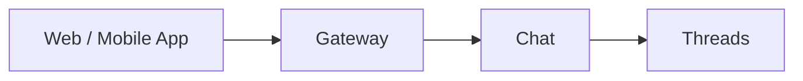

# Chat

## Overview

The Chat service implements the built-in web and mobile app chat experience on top of [Threads](threads.md). It manages thread creation, participant management, and unread counts for the platform's own UI.

Threads is a generic messaging service. Chat adds the application-level logic specific to the platform's own clients.

## Interface

| Method | Description |
|--------|-------------|
| **CreateChat** | Create a new chat thread between users (and optionally agents) |
| **GetChats** | List chats for a user with pagination |
| **GetMessages** | List messages in a chat with pagination and unread count |
| **SendMessage** | Send a message in a chat |
| **MarkAsRead** | Mark messages as read for a user (calls Threads `AckMessages`) |

## Relationship to Threads

Chat is a consumer of the Threads API. It does not duplicate messaging logic — it calls Threads for all message storage and retrieval. Unread counts are derived from `GetUnackedMessages`.

## Identity

Chat identifies users by the authenticated `identity_id` from request context (see [Authentication](authn.md)). The `identity_id` is used as the participant ID in Threads and for resolving display names.

## Classification

The Chat service is a **data plane** service.
