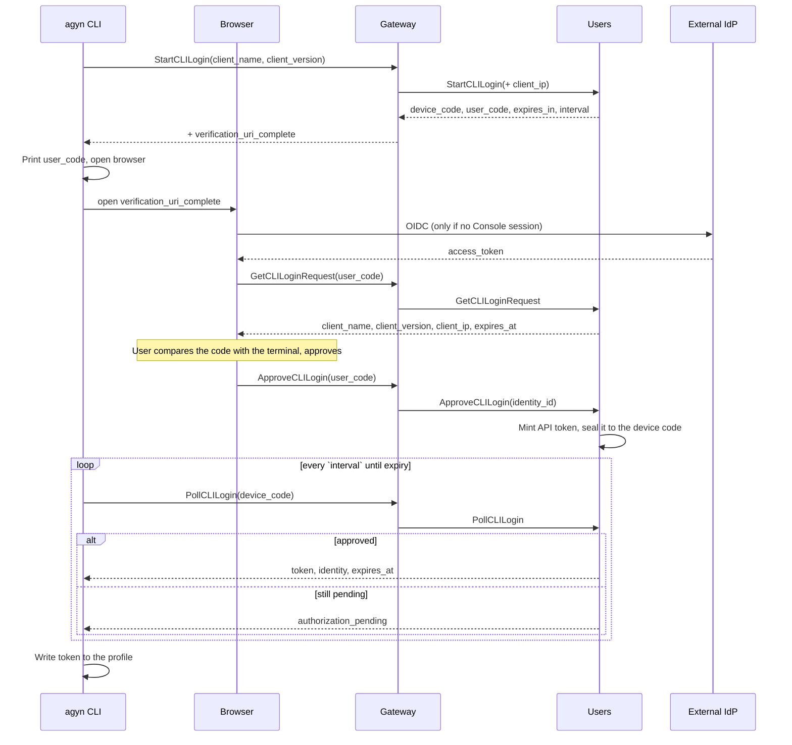

# CLI Login

## Overview

`agyn auth` signs a user in from a terminal without them ever handling a token by hand. The CLI asks the platform to open a login request, opens the returned verification URL in a browser, the user confirms in a session they are already signed into, and the CLI receives an [API token](api-tokens.md) and writes it to the active [profile](agyn-cli.md#profiles).

The flow is a platform-brokered [device authorization grant](https://datatracker.ietf.org/doc/html/rfc8628): the CLI polls while the browser approves, and the two halves are tied together by a short user code the human can compare on both screens.

The user-facing behavior is specified in [Product — CLI Login](../product/cli-login/cli-login.md).

## Why the Platform Brokers It

The obvious alternatives put the CLI in a direct relationship with the identity provider, and neither survives the platform's deployment model — the IdP is [operator-supplied](authn.md#configuration), so the platform cannot require anything of it beyond what the Console already needs.

| Alternative | Why not |
|-------------|---------|
| Loopback redirect + PKCE against the IdP (the `gcloud` / `gh` shape) | Needs a second OIDC client registered with `http://127.0.0.1:*` redirect URIs at every deployment's IdP. Every self-hosted install becomes an IdP configuration task before the CLI works |
| [RFC 8628](https://datatracker.ietf.org/doc/html/rfc8628) device grant against the IdP | Same registration problem, and the grant type is optional — a deployment whose IdP omits it has no CLI login at all |
| Either of the above | Produces an IdP access token: short-lived, so every CLI grows refresh-token storage and rotation. The credential is also invisible to the platform, so a user cannot see or revoke what their laptop holds |

Brokering the flow at the platform keeps all three problems out of the deployment:

- **The IdP still authenticates the human**, inside the browser Console session. The platform never sees credentials and needs no new IdP client.
- **A deployment needs nothing new.** If the Console can sign a user in, CLI login works.
- **The credential is an ordinary `agyn_` API token.** The Gateway already resolves it, the Console already lists and revokes it, and every CLI already knows how to send it — see [CLI Authentication](authn.md#cli-authentication).

## Login Request Model

The [Users](users.md) service owns login requests, in a `cli_login_requests` table alongside `user_api_tokens`.

| Field | Type | Description |
|-------|------|-------------|
| `id` | string (UUID) | Request identifier |
| `device_code_hash` | string | SHA-256 of the polling secret held by the CLI. Lookup key for polling |
| `user_code` | string | Short human-readable code (see [User Code](#user-code)). Lookup key for approval. Unique among non-terminal requests |
| `client_name` | string | Machine name reported by the CLI (its hostname), shown on the approval screen |
| `client_version` | string | CLI version, shown on the approval screen |
| `client_ip` | string | Source address of the `StartCLILogin` call, shown on the approval screen |
| `status` | enum | `pending`, `approved`, `denied`, `claimed`, `expired` |
| `identity_id` | string (UUID), nullable | The approving user. Set on approval |
| `token_id` | string (UUID), nullable | The API token minted on approval |
| `token_ciphertext` | bytes, nullable | The token plaintext, sealed to the device code (see [Token Delivery](#token-delivery)). Cleared on claim |
| `created_at` | timestamp | |
| `expires_at` | timestamp | `created_at` + the request TTL (default 10 minutes) |
| `approved_at` | timestamp, nullable | |
| `last_polled_at` | timestamp, nullable | Backs `slow_down` enforcement |

A request is terminal once it is `claimed`, `denied`, or `expired`. Terminal rows are retained briefly so a late poll gets a specific error rather than "unknown code", then deleted by the same sweep that expires stale rows.

## Interface

| Method | Auth | Description |
|--------|------|-------------|
| **StartCLILogin** | None | Create a request. Accepts `client_name`, `client_version`. Returns `device_code`, `user_code`, `verification_uri`, `verification_uri_complete`, `expires_in`, `interval` |
| **PollCLILogin** | None | Exchange `device_code` for the token once approved. Returns the token or a pending/terminal status |
| **GetCLILoginRequest** | User | Return request metadata for the approval screen: `client_name`, `client_version`, `client_ip`, `created_at`, `expires_at`. Looked up by `user_code` |
| **ApproveCLILogin** | User | Mint the token, bind it to the calling user, mark the request approved. Looked up by `user_code` |
| **DenyCLILogin** | User | Mark the request denied. Looked up by `user_code` |

All five are exposed through the Gateway on `UsersGateway`. `StartCLILogin` and `PollCLILogin` are the platform's only **unauthenticated** Gateway methods — they exist precisely to obtain a credential — and carry their own [rate limits](#abuse-controls). Every other method on the surface keeps the Gateway's normal rule that requests are authenticated.

`verification_uri` and `verification_uri_complete` are filled in by the Gateway from its own configuration — the Users service returns the codes, the Gateway attaches the URLs. This is what keeps the CLI out of the business of deriving a browser URL, so the flow works on deployments that do not follow the `console.<domain>` convention — a local VM on `https://console.agyn.dev:2496`, for example.

## Flow

A user who has never signed in reaches the same place: the browser leg runs the ordinary OIDC flow, and the Console's first authenticated call provisions the user record exactly as it does on a first web sign-in (see [Authentication — User Authentication](authn.md#user-authentication-oidc)). `agyn auth` is therefore a valid first contact with the platform, not something that requires a prior visit to the Console.

## User Code

The user code is what defends the flow against its one structural weakness — an attacker who starts a login on their own machine and gets a victim to approve it. The defense is that the code is displayed in **both** places and the approval screen asks the user to confirm they match; a code that arrived by any other route than the user's own terminal fails that check.

| Property | Value |
|----------|-------|
| Alphabet | 22 symbols, ambiguity-free — no `0`, `O`, `1`, `I`, `L`, `U` |
| Length | 8 characters, rendered in two groups (`WDJB-MJHT`) |
| Entropy | ~35 bits, well above the ≥20 bits RFC 8628 asks for under rate limiting |
| Lifetime | 10 minutes, single use |
| Comparison | Case-insensitive; separators and ambiguous characters normalized before lookup, so a user typing `l` for `1` still lands on their request |

Because the common path opens the code embedded in the URL (`verification_uri_complete`), typing it is a fallback, not the default — but the approval screen shows it regardless, since displaying it is what makes the comparison possible.

## Token Delivery

Approval happens in the browser; the token has to reach the terminal. The token is minted at approval time and **sealed to the device code**, so the row that carries it between the two legs never holds a usable credential:

1. `ApproveCLILogin` mints an API token through the ordinary [`CreateAPIToken`](api-tokens.md#interface) path. Its hash is stored in `user_api_tokens` as usual.
2. The plaintext is encrypted under a key derived from the device code (HKDF over the device code, salted with the request `id`) and stored as `token_ciphertext`.
3. `PollCLILogin` presents the device code, which yields the key, which decrypts the token. The ciphertext is cleared and the request marked `claimed` in the same transaction, so a replayed poll returns `already_claimed`.

This keeps the invariant that [API tokens](api-tokens.md#token-format) hold: no usable token value exists at rest anywhere in the platform. Only the holder of the device code — the CLI process that started the request — can read it, and only once.

### Issued Token

| Property | Value |
|----------|-------|
| `name` | `CLI on <client_name>` — e.g. `CLI on vitalii-mbp`. Distinguishes the laptop's credential from hand-made ones in the Console list |
| `origin` | `cli_login` (see [API Tokens — Token Model](api-tokens.md#token-model)) |
| `expires_at` | `approved_at` + the deployment's CLI token lifetime, default 90 days |
| Permissions | The approving user's, in full — a CLI token is an API token and carries no independent scope |

A default expiry is set because this token lives on a laptop rather than in a secret manager, and re-running `agyn auth` costs one browser click. The CLI warns when the stored token is within seven days of expiring.

## Poll Semantics

`PollCLILogin` mirrors RFC 8628's error vocabulary so the CLI's behavior is the well-understood one:

| Result | CLI behavior |
|--------|--------------|
| `authorization_pending` | Wait `interval` seconds and poll again |
| `slow_down` | Add 5 seconds to `interval`, then continue. Returned when polls arrive faster than the interval |
| `access_denied` | Stop. The user pressed Deny |
| `expired_token` | Stop. The request outlived its TTL; tell the user to run `agyn auth` again |
| `already_claimed` | Stop. The token was already delivered — a duplicate or replayed poll |
| Success | Token, `expires_at`, and the identity's `@nickname` and display name, so the CLI can confirm who it signed in as |

The default `interval` is 5 seconds. Polling stops at `expires_in` without a further server round trip.

## Abuse Controls

| Control | Behavior |
|---------|----------|
| **Start rate limit** | `StartCLILogin` is limited per source address. Exhausting it returns `resource_exhausted`, not a request |
| **Poll rate limit** | Enforced through `last_polled_at`: polls faster than `interval` get `slow_down`; sustained violation terminates the request |
| **Approval lookup limit** | Failed `user_code` lookups are counted per session and per address. This is what keeps the ~35-bit code out of reach of guessing |
| **Single approval** | A request leaves `pending` exactly once. Approve and Deny are both terminal |
| **Short TTL** | 10 minutes. A code that leaks after the fact is worthless |
| **Audit** | Approval and denial are recorded with the approving identity, `client_name`, and `client_ip`. The minted token is visible in the Console's API tokens list immediately, and revoking it there cuts the CLI off at the next request |

The residual risk — a user approving a request they did not start — is addressed by the approval screen showing `client_name`, `client_version`, `client_ip`, and the code to compare, together with an explicit instruction to deny anything unfamiliar. See [Product — CLI Login](../product/cli-login/cli-login.md#approval-screen).

## Configuration

Per-deployment, alongside the [OIDC settings](authn.md#configuration). The Gateway holds `verification_uri` because it is the component that knows the deployment's browser surface; the Users service holds the rest, because it enforces them.

| Field | Type | Description |
|-------|------|-------------|
| `cli_login.verification_uri` | string | The approval page URL — the Console's `/cli-login` route for this deployment. Attached to the `StartCLILogin` response |
| `cli_login.request_ttl` | duration | Login request lifetime. Default `10m` |
| `cli_login.poll_interval` | duration | Interval returned to the CLI. Default `5s` |
| `cli_login.token_ttl` | duration | Lifetime of the minted API token. Default `2160h` (90 days) |
| `cli_login.enabled` | bool | Default true. A deployment that wants API tokens created only through the Console can turn the flow off; `StartCLILogin` then returns `unimplemented` and the CLI falls back to telling the user to paste a token |

## Data Store

PostgreSQL. `cli_login_requests` in the [Users](users.md) service database, system-wide — a login request is not scoped to an organization, since organization context is resolved after sign-in.

## Classification

**Control plane** — login requests are a low-volume provisioning path. The token they produce is resolved on the [data plane](api-tokens.md#classification) like any other API token.
