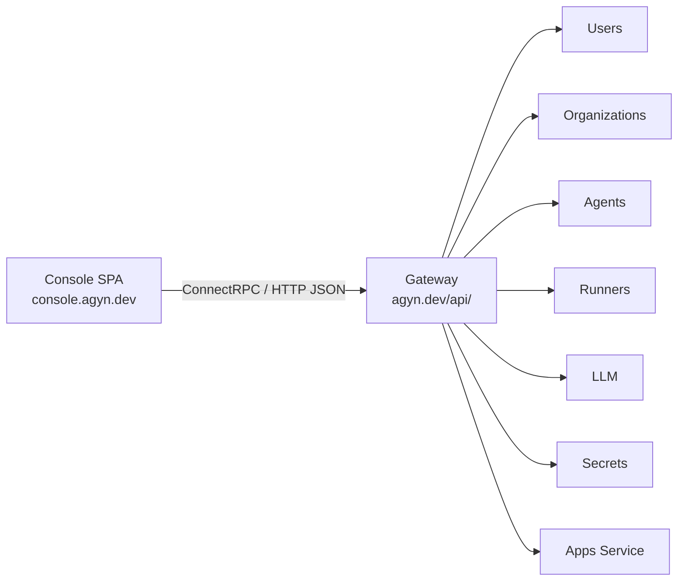
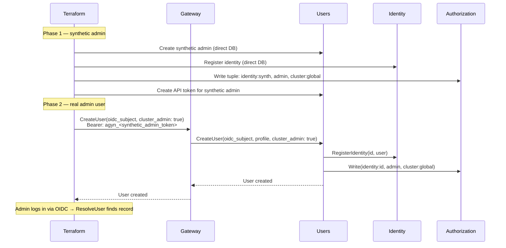

# Console

## Overview

The Console is a single-page application (SPA) for platform administration, hosted at `console.agyn.dev`. See the [product spec](../product/console/console.md) for the full feature description.

The Console communicates with platform services through the [Gateway](gateway.md) API. The SPA performs OIDC Authorization Code + PKCE in the browser and attaches the `access_token` as a Bearer token on all Gateway requests. See [Authentication — User Authentication](authn.md#user-authentication-oidc).

## Architecture

The Console is a static SPA served by its own Kubernetes deployment with no backend.

## Role Resolution

On load, the Console determines the user's role to decide which sections to display:

1. **Organization listing** — `Organizations.ListOrganizations()` returns organizations the user can access, including the user's role in each. The Console displays organization sections only for organizations where the user is an owner.
2. **Cluster admin** — how the Console resolves cluster admin status is an [open question](../open-questions.md#console-cluster-admin-resolution).

The Console displays:
- Cluster sections → only if cluster admin.
- Organization sections → only for organizations where the user is an owner.
- No Console access → if the user is not a cluster admin and not an owner of any organization, the Console shows an empty state (no organizations to manage).

## Ingress

| Path | Host | Target | Description |
|------|------|--------|-------------|
| Subdomain | `console.agyn.dev` | `console:8080` | SPA static assets |
| Path-based API | `console.agyn.dev/api/*` | `gateway-gateway:8080` | Gateway API route (prefix `/api/` stripped). Same-origin with the SPA, no CORS required |

## Gateway API Surface

| Gateway Service | Methods | Authorization | Console Section |
|----------------|---------|---------------|-----------------|
| `AgentsGateway` | All CRUD for agents and sub-resources | Org owner or cluster admin | Agents, MCPs, Skills, Hooks, ENVs, Init Scripts, Volume Attachments |
| `UsersGateway` | `CreateUser`, `GetUser`, `ListUsers`, `UpdateUser`, `DeleteUser`, `CreateAPIToken`, `ListAPITokens`, `RevokeAPIToken` | Cluster admin (user CRUD), self (API tokens) | Users |
| `OrganizationsGateway` | `CreateOrganization`, `GetOrganization`, `ListOrganizations`, `UpdateOrganization`, `DeleteOrganization` | `CreateOrganization`: any authenticated user. Others: org owner or cluster admin | Organizations |
| `RunnersGateway` | `RegisterRunner`, `GetRunner`, `ListRunners`, `UpdateRunner`, `DeleteRunner`, `ListWorkloads`, `GetWorkload`, `GetComputeUsage` | Cluster-scoped: cluster admin. Org-scoped: org owner | Runners, Monitoring |
| `LLMGateway` | `CreateProvider`, `GetProvider`, `ListProviders`, `UpdateProvider`, `DeleteProvider`, `CreateModel`, `GetModel`, `ListModels`, `UpdateModel`, `DeleteModel` | Org owner or cluster admin | LLM Providers, Models |
| `SecretsGateway` | `CreateSecretProvider`, `GetSecretProvider`, `ListSecretProviders`, `UpdateSecretProvider`, `DeleteSecretProvider`, `CreateSecret`, `GetSecret`, `ListSecrets`, `UpdateSecret`, `DeleteSecret` | Org owner or cluster admin | Secret Providers, Secrets |
| `AppsGateway` | `RegisterApp`, `DeleteApp` | Cluster admin | Cluster Apps |
| `TokenCountingGateway` | `GetUsageSummary` | Org owner or cluster admin | Monitoring |

## Users Service

The [Users](users.md) service has two interfaces for user creation:

| Method | Description | Caller | Authorization |
|--------|-------------|--------|---------------|
| `ProvisionUser` | Create user record from OIDC subject and profile. Register identity. No role assignments | Gateway (during OIDC auto-provisioning) | None (internal, Istio-only) |
| `CreateUser` | Create user with OIDC subject, profile fields, and role assignments. Register identity, write OpenFGA tuples | Gateway (admin request) | Cluster admin |

See [Users — Admin User Management](users.md#admin-user-management) for the full `CreateUser` spec.

### Bootstrap Flow

## Monitoring Data Sources

| Data | Source Service | Method |
|------|---------------|--------|
| Active workloads | [Runners](runners.md) | `ListWorkloads` — filterable by organization, runner, agent, status. Paginated |
| Workload containers | [Runners](runners.md) | `GetWorkload` — container names, images, states |
| Persistent volumes | [Agents](agents-service.md) | `ListVolumes` |
| Token consumption | [Token Counting](token-counting.md) | `GetUsageSummary(organization_id, time_range)` — aggregated by model and agent |
| Compute hours | [Runners](runners.md) | `GetComputeUsage(organization_id, time_range)` — aggregated by agent |

## Deployment

| Aspect | Detail |
|--------|--------|
| **Repository** | `agynio/console` |
| **Language** | TypeScript (React SPA) |
| **Build** | Static assets (HTML, JS, CSS) |
| **Serving** | Nginx or static file server in a container |
| **Kubernetes** | Deployment + Service |
| **CI/CD** | See [CI/CD](operations/ci-cd.md) |
| **Configuration** | Runtime environment variables: OIDC issuer, client ID, Gateway base URL |
