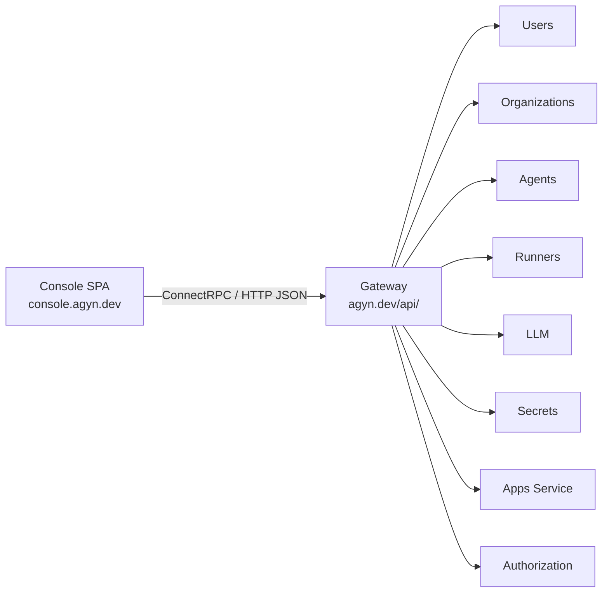
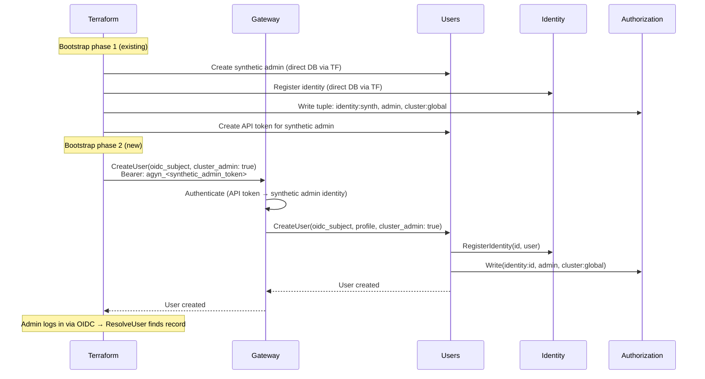

# Console

## Overview

The Console is a single-page application (SPA) for platform administration, hosted at `console.agyn.dev`. See the [product spec](../product/console/console.md) for the full feature description.

The Console communicates with platform services through the [Gateway](gateway.md) API. The SPA performs OIDC Authorization Code + PKCE in the browser and attaches the `access_token` as a Bearer token on all Gateway requests.

## Architecture

The Console is a static SPA served by its own Kubernetes deployment. It has no backend — all data flows through the Gateway.

## Authentication

Same OIDC flow as [Chat](chat.md) — see [Authentication — User Authentication](authn.md#user-authentication-oidc).

1. User opens `console.agyn.dev`.
2. SPA redirects to the OIDC provider (Authorization Code + PKCE).
3. User authenticates, SPA receives `access_token`.
4. All API calls go to `console.agyn.dev/api/` (path-based Gateway route, same pattern as Chat).

## Role Resolution

On load, the Console determines the user's role to decide which sections to display:

1. **Organization listing** — `Organizations.ListOrganizations()` returns organizations the user can access, including the user's role in each. The Console displays organization sections only for organizations where the user is an owner.
2. **Cluster admin** — how the Console resolves cluster admin status is an [open question](../open-questions.md#console-cluster-admin-resolution).

The Console displays:
- Cluster sections → only if cluster admin.
- Organization sections → only for organizations where the user is an owner.
- No Console access → if the user is not a cluster admin and not an owner of any organization, the Console shows an empty state (no organizations to manage).

## Ingress

The Console has its own Istio VirtualService route, following the same pattern as Chat:

| Path | Host | Target | Description |
|------|------|--------|-------------|
| Subdomain | `console.agyn.dev` | `console:8080` | Serves the SPA static assets |
| Path-based API | `console.agyn.dev/api/*` | `gateway-gateway:8080` | Gateway API route (prefix `/api/` stripped) |

The path-based API route allows the Console to call the Gateway from the same origin, avoiding CORS — same pattern as the Chat app's route on `agyn.dev`.

## Gateway API Surface

The Console consumes existing Gateway services and requires new ones. All new methods follow existing [API contract](api-contracts.md) conventions.

### Existing Gateway Services (already exposed)

| Gateway Service | Methods Used | Console Section |
|----------------|-------------|-----------------|
| `AgentsGateway` | All CRUD for agents and sub-resources | Agents, MCPs, Skills, Hooks, ENVs, Init Scripts, Volume Attachments |
| `RunnersGateway` | `ListWorkloadsByThread`, `GetWorkload` | Monitoring (active workloads) |
| `UsersGateway` | `CreateAPIToken`, `ListAPITokens`, `RevokeAPIToken` | User detail (API tokens) |
| `TracingGateway` | Query methods | Not used — Tracing is a separate app |

### New Gateway Services

| Gateway Service | Methods | Authorization | Console Section |
|----------------|---------|---------------|-----------------|
| `UsersGateway` (extended) | `CreateUser`, `GetUser`, `ListUsers`, `UpdateUser`, `DeleteUser` | Cluster admin | Users |
| `OrganizationsGateway` (new) | `CreateOrganization`, `GetOrganization`, `ListOrganizations`, `UpdateOrganization`, `DeleteOrganization` | `CreateOrganization`: any authenticated user. Others: org owner or cluster admin | Organizations |
| `RunnersGateway` (extended) | `RegisterRunner`, `GetRunner`, `ListRunners`, `UpdateRunner`, `DeleteRunner` | Cluster-scoped: cluster admin. Org-scoped: org owner | Runners |
| `LLMGateway` (new) | `CreateProvider`, `GetProvider`, `ListProviders`, `UpdateProvider`, `DeleteProvider`, `CreateModel`, `GetModel`, `ListModels`, `UpdateModel`, `DeleteModel` | Org owner or cluster admin | LLM Providers, Models |
| `SecretsGateway` (extended) | `CreateSecretProvider`, `GetSecretProvider`, `ListSecretProviders`, `UpdateSecretProvider`, `DeleteSecretProvider`, `CreateSecret`, `GetSecret`, `ListSecrets`, `UpdateSecret`, `DeleteSecret` | Org owner or cluster admin | Secret Providers, Secrets |
| `AppsGateway` (extended) | `RegisterApp`, `DeleteApp` | Cluster admin | Cluster Apps |

## Users Service Changes

The [Users](users.md) service adds admin-facing CRUD methods alongside the existing internal provisioning method.

### Internal Method (unchanged)

| Method | Description | Caller | Authorization |
|--------|-------------|--------|---------------|
| `ProvisionUser` | Create user record from OIDC subject and profile. Register identity. No role assignments | Gateway (during OIDC auto-provisioning) | None (internal, Istio-only) |

### New External Methods

| Method | Description | Authorization |
|--------|-------------|---------------|
| `CreateUser` | Create a user with OIDC subject, profile fields, and role assignments (cluster admin flag, organization memberships). Creates user record, registers identity, writes OpenFGA tuples for all assigned roles | Cluster admin |
| `GetUser` | Get user by ID. Returns profile and role assignments | Cluster admin |
| `ListUsers` | List all platform users with their profiles and role assignments. Supports pagination and filtering | Cluster admin |
| `UpdateUser` | Update user profile fields and role assignments. Writes/deletes OpenFGA tuples as needed | Cluster admin |
| `DeleteUser` | Delete user record, identity registration, and all OpenFGA tuples | Cluster admin |

### CreateUser

**Request:**

| Field | Type | Required | Description |
|-------|------|----------|-------------|
| `oidc_subject` | string | Yes | OIDC subject claim. Must be unique |
| `name` | string | No | Display name |
| `nickname` | string | No | Short name or handle |
| `photo_url` | string | No | Profile photo URL |
| `cluster_admin` | bool | No | Grant `cluster:global admin` |
| `organization_roles` | repeated OrganizationRole | No | Organization memberships to assign |

**OrganizationRole:**

| Field | Type | Description |
|-------|------|-------------|
| `organization_id` | string (UUID) | Target organization |
| `role` | enum | `owner`, `member` |

**Behavior:**

1. Create user record with `oidc_subject` and profile fields.
2. Register identity in [Identity](identity.md) service (`identity_type: user`).
3. If `cluster_admin` is true, write OpenFGA tuple: `identity:<id>, admin, cluster:global`.
4. For each `organization_role`, write OpenFGA tuple: `identity:<id>, <role>, organization:<orgId>`.
5. Return the created user with `identity_id`.

When the user later logs in via OIDC, `ResolveUser` finds the existing record — `ProvisionUser` is not called.

### Bootstrap Flow

With these changes, the self-hosted bootstrap becomes:

The synthetic admin is a service account that exists solely for bootstrap API calls. The real admin user is a normal OIDC-backed user with `cluster:global admin`.

## Monitoring Data Sources

The Console's monitoring section aggregates data from existing services. No new services are introduced for monitoring — the Console queries existing APIs.

| Data | Source Service | Method | Notes |
|------|---------------|--------|-------|
| Active workloads | [Runners](runners.md) | `ListWorkloads` (new), `GetWorkload` | New `ListWorkloads` method — list all workloads, filterable by organization. Existing methods are per-thread only |
| Workload containers | [Runners](runners.md) | `GetWorkload` | Container names, images, states — already in workload model |
| Persistent volumes | [Agents](agents-service.md) | `ListVolumes` | Existing method. Volume status (bound/pending) comes from the runner or is derived from workload state |
| Token consumption | [Token Counting](token-counting.md) | New aggregation query | Requires new methods: `GetUsageSummary(organization_id, time_range)`. Aggregates token counts by model and agent |
| Compute hours | [Runners](runners.md) | New aggregation query | Requires new method: `GetComputeUsage(organization_id, time_range)`. Aggregates workload durations |

### New Methods for Monitoring

| Service | Method | Description |
|---------|--------|-------------|
| `Runners` | `ListWorkloads` | List workloads with filtering by organization, runner, agent, status. Paginated |
| `Token Counting` | `GetUsageSummary` | Aggregated token consumption for an organization over a time range. Breakdown by model and agent |
| `Runners` | `GetComputeUsage` | Aggregated compute time for an organization over a time range. Breakdown by agent |

These methods are exposed through the Gateway as extensions to existing Gateway services.

## Deployment

| Aspect | Detail |
|--------|--------|
| **Repository** | `agynio/console` |
| **Language** | TypeScript (React SPA) |
| **Build** | Static assets (HTML, JS, CSS) |
| **Serving** | Nginx or static file server in a container |
| **Kubernetes** | Deployment + Service, same namespace as other platform services |
| **CI/CD** | Same pattern as other services — see [CI/CD](operations/ci-cd.md) |
| **Configuration** | Runtime environment variables injected at build or serve time: OIDC issuer, client ID, Gateway base URL |

## Classification

The Console is a **client application** — it runs in the browser and has no server-side component. It is not classified as control plane or data plane. It consumes the Gateway API like any other external client.
