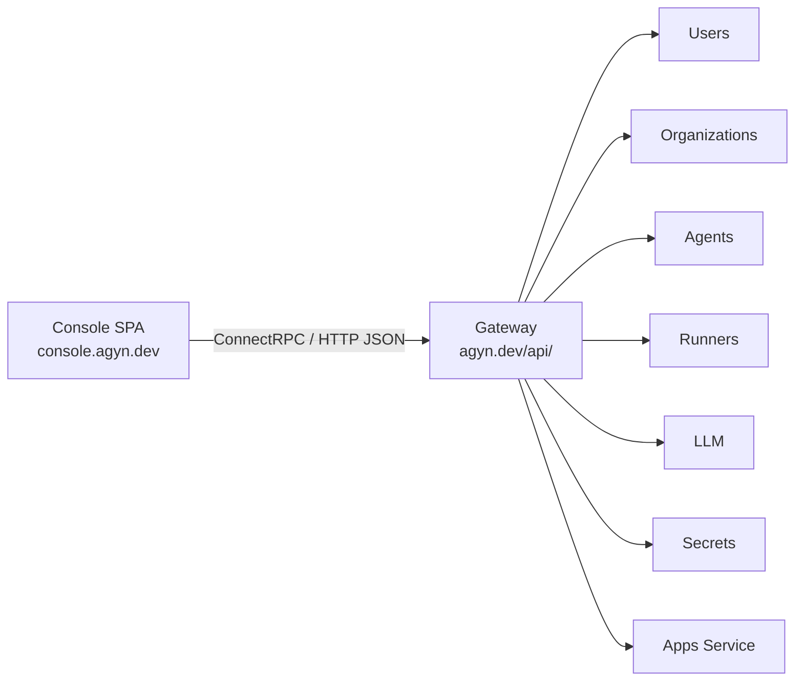

# Console

## Overview

The Console is a single-page application (SPA) for platform administration, hosted at `console.agyn.dev`. See the [product spec](../product/console/console.md) for the full feature description.

The Console communicates with platform services through the [Gateway](gateway.md) API. The SPA performs OIDC Authorization Code + PKCE in the browser and attaches the `access_token` as a Bearer token on all Gateway requests. See [Authentication — User Authentication](authn.md#user-authentication-oidc).

## Architecture

The Console is a static SPA served by its own Kubernetes deployment with no backend.

## Role Resolution

On load, the Console determines the user's role to decide which sections to display:

1. **Organization listing** — `Organizations.ListMyMemberships(status: active)` returns the user's active memberships across all organizations, including role. The Console displays organization sections only for organizations where the user is an owner.
2. **Cluster admin** — `Users.GetMe()` returns the current user's profile and `cluster_role`. The Console displays cluster sections if `cluster_role` is `admin`.

The Console displays:
- Cluster sections → only if cluster admin.
- Organization sections → only for organizations where the user is an owner.
- No Console access → if the user is not a cluster admin and not an owner of any organization, the Console shows an empty state (no organizations to manage).

## Ingress

| Path | Host | Target | Description |
|------|------|--------|-------------|
| Subdomain | `console.agyn.dev` | `console:8080` | SPA static assets |
| Path-based API | `console.agyn.dev/api/*` | `gateway-gateway:8080` | Gateway API route (prefix `/api/` stripped). Same-origin with the SPA, no CORS required |

## Gateway API Surface

| Gateway Service | Methods | Authorization | Console Section |
|----------------|---------|---------------|-----------------|
| `AgentsGateway` | All CRUD for agents and sub-resources | Org owner or cluster admin | Agents, MCPs, Skills, Hooks, ENVs, Init Scripts, Volume Attachments |
| `UsersGateway` | `GetMe`, `CreateUser`, `GetUser`, `ListUsers`, `UpdateUser`, `DeleteUser`, `CreateAPIToken`, `ListAPITokens`, `RevokeAPIToken` | `GetMe`: any authenticated user. Cluster admin (user CRUD), self (API tokens) | Users |
| `OrganizationsGateway` | `CreateOrganization`, `GetOrganization`, `ListOrganizations`, `UpdateOrganization`, `DeleteOrganization`, `CreateMembership`, `AcceptMembership`, `DeclineMembership`, `RemoveMembership`, `UpdateMembershipRole`, `ListMembers`, `ListMyMemberships` | `CreateOrganization`: any authenticated user. Org CRUD: org owner or cluster admin. Membership: see [Organizations — Membership Authorization](organizations.md#membership-authorization) | Organizations, Members |
| `RunnersGateway` | `RegisterRunner`, `GetRunner`, `ListRunners`, `UpdateRunner`, `DeleteRunner`, `ListWorkloads` | Cluster-scoped: cluster admin. Org-scoped: org owner | Runners, Monitoring (active workloads) |
| `LLMGateway` | `CreateProvider`, `GetProvider`, `ListProviders`, `UpdateProvider`, `DeleteProvider`, `CreateModel`, `GetModel`, `ListModels`, `UpdateModel`, `DeleteModel` | Org owner or cluster admin | LLM Providers, Models |
| `SecretsGateway` | `CreateSecretProvider`, `GetSecretProvider`, `ListSecretProviders`, `UpdateSecretProvider`, `DeleteSecretProvider`, `CreateSecret`, `GetSecret`, `ListSecrets`, `UpdateSecret`, `DeleteSecret` | Org owner or cluster admin | Secret Providers, Secrets |
| `AppsGateway` | `RegisterApp`, `DeleteApp` | Cluster admin | Cluster Apps |

## Deployment

| Aspect | Detail |
|--------|--------|
| **Repository** | `agynio/console-app` |
| **Language** | TypeScript (React SPA) |
| **Build** | Static assets (HTML, JS, CSS) |
| **Serving** | Nginx or static file server in a container |
| **Kubernetes** | Deployment + Service |
| **CI/CD** | See [CI/CD](operations/ci-cd.md) |
| **Configuration** | Runtime environment variables: OIDC issuer, client ID, Gateway base URL |
