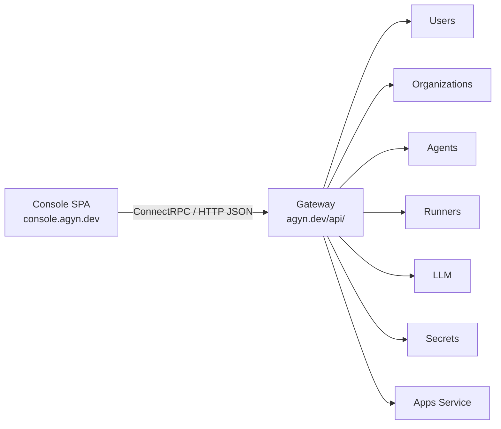

# Console

## Overview

The Console is a single-page application (SPA) for platform administration, hosted at `console.agyn.dev`. See the [product spec](../product/console/console.md) for the full feature description.

The Console communicates with platform services through the [Gateway](gateway.md) API. The SPA performs OIDC Authorization Code + PKCE in the browser and attaches the `access_token` as a Bearer token on all Gateway requests. See [Authentication — User Authentication](authn.md#user-authentication-oidc).

## Architecture

```mermaid
graph LR
    Console[Console SPA<br/>console.agyn.dev]
    Gateway[Gateway<br/>agyn.dev/api/]
    Users[Users]
    Orgs[Organizations]
    Agents[Agents]
    Runners[Runners]
    LLMService[LLM]
    Secrets[Secrets]
    Apps[Apps Service]

    Console -->|ConnectRPC / HTTP JSON| Gateway
    Gateway --> Users
    Gateway --> Orgs
    Gateway --> Agents
    Gateway --> Runners
    Gateway --> LLMService
    Gateway --> Secrets
    Gateway --> Apps
```

The Console is a static SPA served by its own Kubernetes deployment with no backend.

## Role Resolution

On load, the Console determines the user's role to decide which sections to display:

1. **Cluster admin** — `Users.GetMe()` returns the current user's profile and `cluster_role`. The Console displays cluster sections if `cluster_role` is `admin`.
2. **Organization listing** — depends on role:
   - **Non-admin user** — `Organizations.ListMyMemberships(status: active)` returns the user's active memberships. The Console displays organization sections only for organizations where the user is an owner.
   - **Cluster admin** — `Organizations.ListOrganizations()` returns every organization on the platform. The Console displays organization sections for each; the cluster admin's `admin from cluster` relation grants `can_view_threads`, `can_view_workloads`, `can_view_volumes`, and all org-level read permissions automatically.

The Console displays:
- Cluster sections → only if cluster admin.
- Organization sections → orgs where the user is an owner, plus every organization for cluster admins.
- No Console access → if the user is not a cluster admin and not an owner of any organization, the Console shows an empty state (no organizations to manage).

## Ingress

| Path | Host | Target | Description |
|------|------|--------|-------------|
| Subdomain | `console.agyn.dev` | `console:8080` | SPA static assets |
| Path-based API | `console.agyn.dev/api/*` | `gateway-gateway:8080` | Gateway API route (prefix `/api/` stripped). Same-origin with the SPA, no CORS required |

## Gateway API Surface

| Gateway Service | Methods | Authorization | Console Section |
|----------------|---------|---------------|-----------------|
| `AgentsGateway` | All CRUD for agents, environments, and their sub-resources | Per-resource role (`can_read_config` / `can_edit_config` on the agent or environment), or org owner or cluster admin | Agents, Environments, Volumes, MCPs, Skills, ENVs, Init Scripts |
| `AgentsGateway` | `ListInstances`, `GetInstance`, `PauseInstance`, `ResumeInstance` | Org owner or cluster admin | Instances (Operations) |
| `ThreadsGateway` | `ListOrganizationThreads`, `GetMessages` | `can_view_threads` on the organization (org owner or cluster admin) | Threads |
| `UsersGateway` | `GetMe`, `CreateUser`, `GetUser`, `GetUserByOIDCSubject`, `ListUsers`, `UpdateUser`, `DeleteUser`, `CreateAPIToken`, `ListAPITokens`, `RevokeAPIToken` | `GetMe`: any authenticated user. Cluster admin (user CRUD), self (API tokens) | Users |
| `OrganizationsGateway` | `CreateOrganization`, `GetOrganization`, `ListOrganizations`, `UpdateOrganization`, `DeleteOrganization`, `CreateMembership`, `AcceptMembership`, `DeclineMembership`, `RemoveMembership`, `UpdateMembershipRole`, `ListMembers`, `ListMyMemberships` | `CreateOrganization`: any authenticated user. `UpdateOrganization` / `DeleteOrganization`: `can_manage_organization` (org owner or cluster admin). Membership: see [Organizations — Membership Authorization](organizations.md#membership-authorization) | Organizations, Settings, Members |
| `RunnersGateway` | `RegisterRunner`, `GetRunner`, `ListRunners`, `UpdateRunner`, `DeleteRunner`, `ListWorkloads`, `ListWorkloadsByAgentInstance`, `GetWorkload`, `StreamWorkloadLogs`, `ListVolumes`, `ListVolumesByAgentInstance`, `GetVolume` | Runner CRUD: cluster admin (cluster-scoped) or org owner (org-scoped). Workload/volume read and logs: `can_view_workloads` / `can_view_volumes` on the organization (org owner or cluster admin). Instance-scoped workload and storage APIs follow [Authorization](authz.md#runners-service); Thread Detail resolves a thread's agent-instance participants and queries per instance | Runners, Workloads (workload list, detail, and container logs), Provisioned Storage, Threads, Instances |
| `LLMGateway` | `CreateProvider`, `GetProvider`, `ListProviders`, `UpdateProvider`, `DeleteProvider`, `CreateModel`, `GetModel`, `ListModels`, `UpdateModel`, `DeleteModel` | Org owner or cluster admin | LLM Providers, Models |
| `SecretsGateway` | `CreateSecretProvider`, `GetSecretProvider`, `ListSecretProviders`, `UpdateSecretProvider`, `DeleteSecretProvider`, `CreateSecret`, `GetSecret`, `ListSecrets`, `UpdateSecret`, `DeleteSecret` | Org owner or cluster admin | Secret Providers, Secrets |
| `ImagesGateway` | `CreateImage`, `GetImage`, `ListImages`, `UpdateImage`, `DeleteImage`, `ListVersions`, `RefreshImage` | Write: org owner or cluster admin. Read: org member, or any authenticated identity for `public` images | Images, and the version pickers in Environments and MCPs |
| `AppsGateway` | `CreateApp`, `GetApp`, `GetAppBySlug`, `ListApps`, `UpdateApp`, `DeleteApp`, `InstallApp`, `GetInstallation`, `GetInstallationBySlug`, `ListInstallations`, `UpdateInstallation`, `UninstallApp` | Org owner or cluster admin | Apps (Published Apps, Installed Apps) |
| `UsersGateway` | `CreateDevice`, `ListDevices`, `DeleteDevice` | Any authenticated user (own devices) | Devices (User Menu) |
| `UsersGateway` | `GetCLILoginRequest`, `ApproveCLILogin`, `DenyCLILogin` | Any authenticated user (approves for themselves) | CLI Login approval (`/cli-login`) |

## CLI Login Approval

`/cli-login` is the browser half of [CLI Login](cli-login.md) — the page a CLI sends the user to in order to approve a sign-in. It is a standalone route: no sidebar, no context switcher, and no organization selection, because approving a sign-in is not scoped to an organization.

The route takes the confirmation code as a query parameter (`?code=WDJB-MJHT`) and falls back to a code entry field when opened without one. It requires a signed-in session like every other Console route, so an unauthenticated visit runs the ordinary OIDC flow first and returns to the page — which is also how a first-ever sign-in provisions the user. On approval, the token is issued to the polling CLI and never shown in the browser.

See [Product — CLI Login](../product/cli-login/cli-login.md#approval-screen) for what the page displays and why.

## Deployment

| Aspect | Detail |
|--------|--------|
| **Repository** | `agynio/console-app` |
| **Language** | TypeScript (React SPA) |
| **Build** | Static assets (HTML, JS, CSS) |
| **Serving** | Nginx or static file server in a container |
| **Kubernetes** | Deployment + Service |
| **CI/CD** | See [CI/CD](operations/ci-cd.md) |
| **Configuration** | Runtime environment variables: OIDC issuer, client ID, Gateway base URL |
