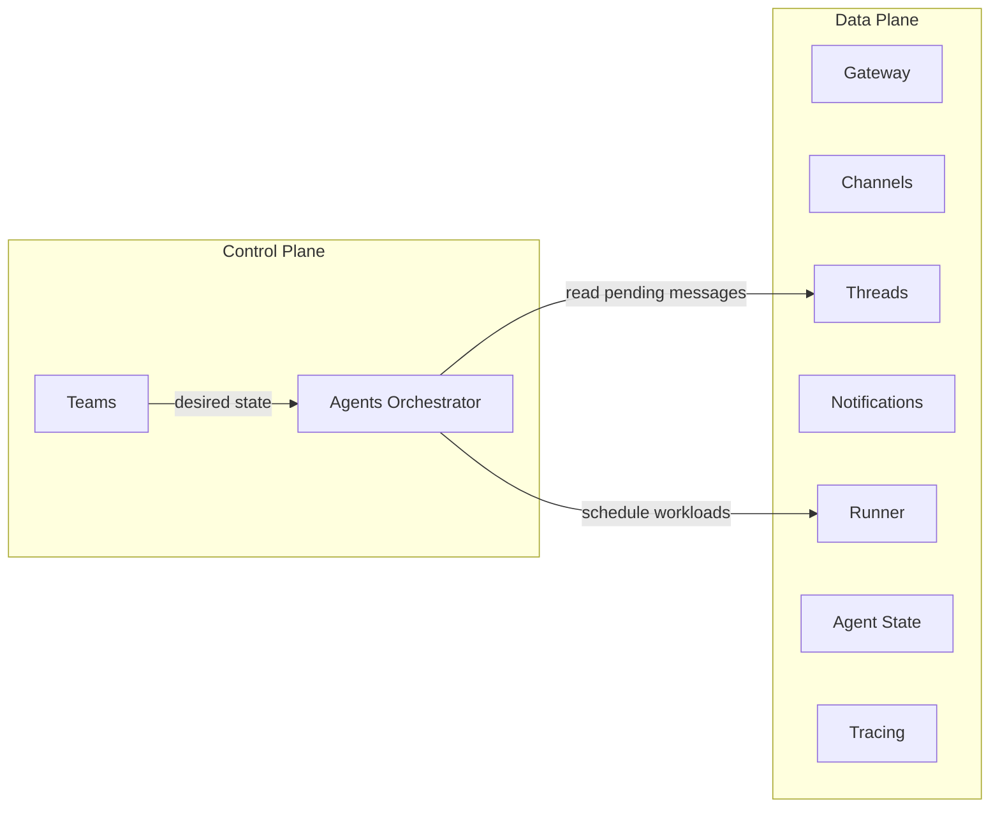
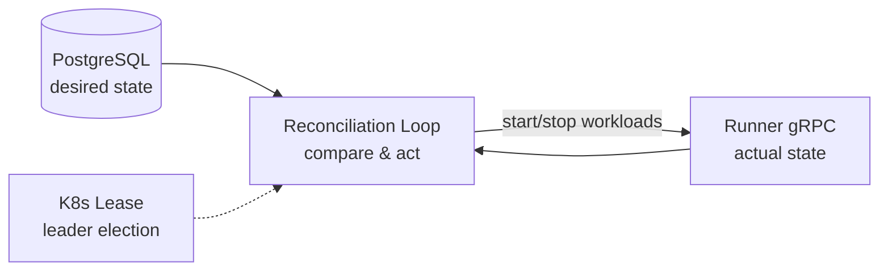

# Control Plane & Data Plane

## Definitions

**Control plane** manages the desired state of the system. It is stateless and responsible for reconciliation of dynamic resources (agents, channels, workspaces, etc.). It answers: *"what should be running?"*

**Data plane** handles the actual work: carrying messages, executing agent workloads, streaming events. It answers: *"how does the work get done?"*

## Classification Criteria

| Criterion | Control Plane | Data Plane |
|-----------|--------------|------------|
| **State ownership** | Manages desired-state declarations; no runtime data | Processes live data (messages, streams, agent context) |
| **Statelessness** | Stateless — restartable without losing runtime progress | May be stateful — holds connections, sessions, in-flight work |
| **Reconciliation** | Runs reconciliation loops (actual → desired) | Does not reconcile — executes what it is told |
| **Scaling model** | Scales with number of resource definitions | Scales with traffic / workload volume |
| **Failure impact** | Temporary loss delays new changes; existing workloads continue | Temporary loss disrupts active work |

## Service Classification

| Service | Plane | Rationale |
|---------|-------|-----------|
| **Teams** | Control | Manages desired state of team resources (agent definitions, MCP server configs, workspace configs) |
| **Agents orchestrator** | Control | Decides which agent workloads should exist; reconciles agent lifecycle |
| **Channels** (configuration) | Control | Defines channel desired state (credentials, target IDs, routing rules) |
| **Channels** (connection) | Data | Maintains live connections to 3rd-party APIs, translates messages |
| **Threads** | Data | Carries conversation messages between participants |
| **Notifications** | Data | Holds persistent connections, fans out real-time events |
| **Gateway** | Data | Routes external API requests to internal services |
| **Agent State** | Data | Stores and retrieves agent conversation context |
| **Tracing** | Data | Ingests and serves tracing data |
| **Runner** | Data | Executes workloads (containers/pods), provides exec and log streaming |

## Reconciliation

The control plane implements reconciliation loops that continuously converge actual state toward desired state.

**Approach:** Custom polling loops with PostgreSQL as the source of truth. No CRDs.

**Pattern:**

- Each control plane service runs a polling loop on a timer.
- Reads desired state from PostgreSQL, compares with actual state via Runner gRPC, takes corrective action.
- Leader election via Kubernetes Lease — deploy with 2+ replicas, only the leader runs the loop.
- Optional: subscribe to Notifications events for faster reactivity; the polling loop serves as consistency fallback.

**Resources to reconcile:**
- **Agents** — Ensure agent workloads exist for threads with pending messages; remove idle agents.
- **Channels** — Ensure channel connections match their configuration (reconnect on credential rotation).
- **Workspaces** — Ensure workspace containers match desired image/config; enforce TTL.
